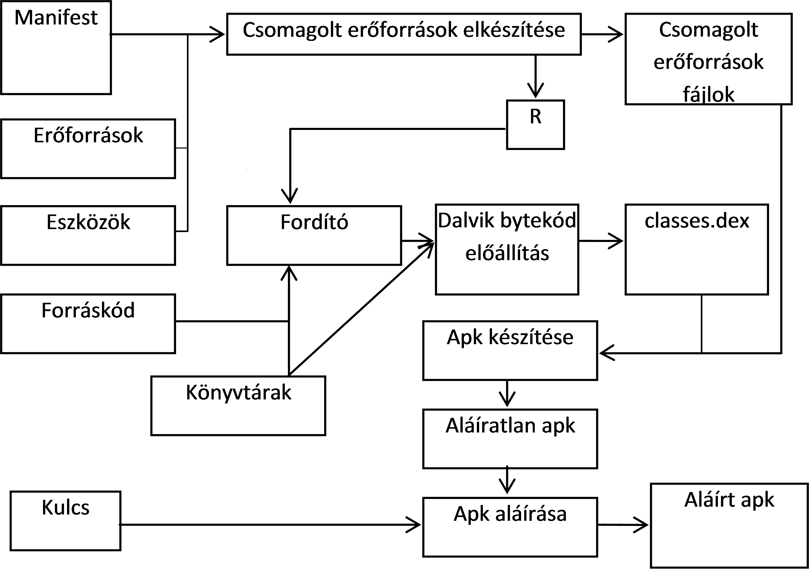
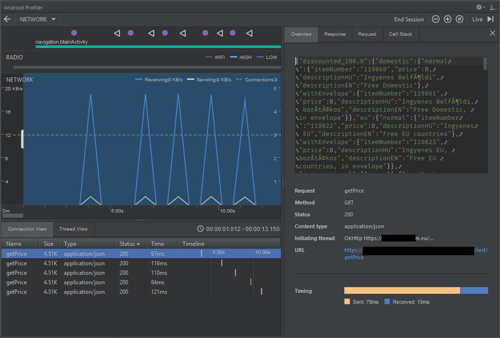

# Labor 0 - Hello World

A mérés célja, hogy bemutassa az Android fejlesztőkörnyezetet, az
alkalmazáskészítés, illetve a tesztelés és fordítás folyamatát, az
alkalmazás felügyeletét, valamint az emulátor és a fejlesztőkörnyezet
funkcióit. Továbbá, hogy ismertesse egy Hello World alkalmazás
elkészítésének módját. A mérés során a laborvezető részletesen bemutatja
az eszközöket.

A mérés az alábbi témákat érinti:

*   Az Android platform alapfogalmainak ismerete
*   Android Studio fejlesztőkörnyezet alapok
*   Android Emulátor tulajdonságai
*   Android projekt létrehozása és futtatása emulátoron
*   Manifest állomány felépítése
*   Android Profiler

### Fordítás menete Android platformon

A projekt létrehozása után a forráskód az _src_ könyvtárban, míg a
felhasználói felület leírására szolgáló XML állományok a _res_
könyvtárban találhatók. Az erőforrás állományokat egy _R.java_ állomány
köti össze a forráskóddal, így könnyedén elérhetjük Java oldalról az
XML-ben definiált felületi elemeket. Az Android projekt fordításának
eredménye egy APK állomány, melyet közvetlenül telepíthetünk mobil
eszközre.

1.  A fejlesztő elkészíti a Kotlin forráskódot, valamint az XML alapú
    felhasználói felület leírást a szükséges erőforrás állományokkal.

2.  A fejlesztőkörnyezet az erőforrás állományokból folyamatosan
    naprakészen tartja az _R.java_ erőforrás fájlt a fejlesztéshez és a
    fordításhoz. **FONTOS: az _R.java_ állomány generált, kézzel SOHA ne
    módosítsuk!** (Az Android Studio egyébként nem is hagyja.)

3.  A fejlesztő a Manifest állományban beállítja az alkalmazás
    hozzáférési jogosultságait (pl. Internet elérés, szenzorok
    használata, stb.), illetve ha futás idejű jogosultságok szükségesek,
    ezt kezeli, de erről a [11. laboron](../labor11/labor11.md) hallunk
    majd bővebben.

4.  A fordító a forráskódból, az erőforrásokból és a külső könyvtárakból
    előállítja a
    Dalvik/[**ART**](https://hu.wikipedia.org/wiki/Android_Runtime)
    virtuális gép gépi kódját.

5.  A gépi kódból és az erőforrásokból előáll a nem aláírt APK állomány.

6.  Végül a rendszer végrehajtja az aláírást és előáll a készülékekre
    telepíthető, aláírt APK.

Az Android Studio Gradle-t használ, ami lehetőséget biztosít köztes
állapot produkálására, erről részletesebben a Gradle részben lesz szó
(későbbi labor anyaga).

**Megjegyzések:**

*   A teljes folyamat a fejlesztői gépen megy végbe, a készülékekre már
    csak bináris állomány jut el.

*   A külső könyvtárak általában JAR állományként, vagy egy másik
    projekt hozzáadásával illeszthetők az aktuális projekthez.

*   Az APK állomány leginkább a Java világban ismert JAR állományokhoz
    hasonlítható.

*   A Manifest állományban meg kell adni a támogatni kívánt Android
    verziót, mely felfele kompatibilis az újabb verziókkal, ennél
    régebbi verzióra azonban az alkalmazás már nem telepíthető.

*   Az Android folyamatosan frissülő verziói nagy gondot jelentenek a
    fejlesztőknek.

*   Az Android alkalmazásokat tipikusan a Google Play Store-ban szokták
    publikálni, így az APK formátumban való terjesztés nem annyira
    elterjedt.

*   A teljes folyamat a szoftverfejlesztők számítógépein megy végbe, az
    ügyfélhez a bájtkódot tartalmazó kész alkalmazás jut el.

Fordítás menete Android platformon

### SDK és könyvtárai

A [d.android.com/sdk](https://developer.android.com/studio) oldalról
letölthető az IDE és az SDK. Ennek fontosabb mappáit, eszközeit
tekintsék át a laborvezető segítségével!

SDK szerkezet

*   **docs:** Dokumentáció
*   **extras:** Különböző extra szoftverek helye. Maven repository,
    support libes anyagok, analytics sdk, google
    [android usb driver](https://developer.android.com/studio/run/win-usb.html)
    (amennyiben SDK managerrel ezt is letöltöttük) stb.
*   **platform-tools:** Fastboot és ADB binárisok helye (legtöbbet
    használt eszközök)
*   **platforms, samples, sources, system-images:** Minden API levelhez
    külön almappában a platform anyagok, források, példaprojektek, OS
    image-ek
*   **tools:** Fordítást és tesztelést segítő eszközök, SDK manager,
    DDMS, 9Patch drawer, emulátor binárisok stb.

### AVD és SDK manager

Az SDK kezelésére az SDK managert használjuk, ezzel lehet letölteni és
frissen tartani az eszközeinket. Indítása a fejlesztői környezeten
keresztül lehetséges.

SDK manager indító ikon:

SDK manager felülete:

*Megjegyzés: Korábban létezett egy standalone SDK manager de ennek
használata mára deprecated lett. Ha online forrásokban ilyet látunk ne
lepődjünk meg.*

Indítsuk el, és vizsgáljuk meg a laborvezetővel, rendelkezésre áll-e
minden, ami az első alkalmazásunkhoz kelleni fog.

### AVD

Az AVD az Android Virtual Device rövidítése. Ahogy arról már előadáson
is szó esett, nem csak valódi eszközön futtathatjuk a kódunkat, hanem
emulátoron is. (Mi is a különbség szimulátor és emulátor között?) Az AVD
indítása a fejlesztői környezeten keresztül lehetséges (illetve
parancssorból is, de ennek a használatára csak speciális esetekben van
szükség).

AVD ikon:

Az AVD bal oldali tabfülén a létező virtuális eszközök listáját
találjuk, jobb oldalon pedig az ún. eszköz definíciókét. Itt néhány
előre elkészített sablon áll rendelkezésre, magunk is készíthetünk
ilyet, ha tipikusan adott eszközre szeretnénk fejleszteni (pl. galaxy
s4). Készítsünk új emulátort (értelemszerűen csak olyan API szintű
eszközt készíthetünk, amilyenek rendelkezésre állnak az SDK manageren
keresztül)!

1.  A bal oldali ablakon, kattintsunk a bal alsó sarokban található
    “Create…” gombra!
2.  Töltsük ki a mezőket!
    1.  Válasszunk az előre definiált készülék sablonokból.
    2.  Döntsük el, hogy milyen Android verziójú emulátort kívánunk
        használni. CPU/ABI alapvetően x86 alapú legyen, mivel ezekhez
        kapunk
        [hardveres gyorsítást](https://developer.android.com/studio/run/emulator-acceleration)
        is. (Ha ez nem áll rendelkezésre, használjunk ARM alapú
        képfájlt). Itt válasszunk a rendelkezésre állók közül egyet majd
        "Next".
    3.  Név legyen mondjuk “Labor_2″
    4.  Indulási orientáció beállítása.
    5.  Készülék keretének megjelenítési lehetősége.

    **"Show Advanced Options"**

    1.  Kamera(ák): WebcamX, hardveres kamera, ami a számítógépre van
        csatlakoztatva; Emulated, egy szoftveres megoldás, most legalább
        az egyik kamera legyen ilyen.
    2.  "Boot Options": Nemrég jelent meg az Android emulátor
        állapotáról való pillanatkép elmentésének lehetősége. Ez azt
        takarja, hogy a virtuális operációs rendszer csak
        felfüggesztésre kerül az emulátor bezáráskor (például a
        megnyitott alkalmazás is megmarad, a teljes állapotával), és
        "Quick boot" esetben a teljes OS indítása helyett másodperceken
        belül elindul az emulált rendszer. "Cold Boot" esetben minden
        alkalommal leállítja és újra indítja a virtális eszköz teljes
        operációs rendszerét.
    3.  Memória mérete. A laborban lévő számítógépeken, mivel kevés a
        rendszermemóriánk nem érdemes 768 MB-nál többet adni, mert
        könnyen futhatunk problémákba. Ha az emulátor lefagy, vagy az
        egész OS megáll működés közben, akkor állítsuk alacsonyabbra az
        értéket (saját laptop esetén 8 GB vagy több rendszermemória
        esetén nyugodtan állíthatjuk az emulátor memóriáját 1024/2048
        MB-ra). VM heap, az alkalmazások virtuális gépének szól,
        maradhat az alapérték. Tudni kell, hogy készülékek esetében
        gyártónként változik.
    4.  Belső flash memória és SD kártya mérete.

3.  Ha mindent rendben talál az ablak, akkor OK!

Indítsuk el az új emulátort!

Az Android Virtual Device Manager-ben megjelent az imént létrehozott
eszközünk. Itt lehetőség van a korábban megadott paraméterek
szerkesztésére, a "készülékről" a felhasználói adatok törlésére (Wipe
Data - Teljes visszaállítás), az emulátor példány duplikálására vagy
törlésére, illetve a Play gombbal indíthatjuk az emulátort.

Az elindított emulátoron próbálják ki az “API Demos” és “Dev Tools”
alkalmazásokat!

Megjegyzés: A gyári emulátoron kívül több alternatíva is létezik, a
Genymotion ezek közül az egyik legjobb, viszont a Google féle emulátor a
legelterjedtebb, amennyiben ezzel nem jelentkeznek problémáink,
maradjunk ennél.

Megjegyzés 2: Tesztelés céljából nagyon jól használható az emulátor
amely a képen látható plusz funkciókat is adja. Lehetőség van többek
között egyedi hely beállítására, bejövő hívás szimulálására, stb. A
panelt az emulátor jobb oldalán található vezérlő gombok közül a "..."
gombbal lehet megnyitni:

## Fejlesztői környezet

Android fejlesztésre a labor során a JetBrains IntelliJ alapjain nyugvó
Android Studio-t fogjuk használni. A Studio-val ismerkedők számára
kivételesen hasznos funkció a “Tip of the day”, érdemes egyből
kipróbálni, megnézni az adott funkciót. Induláskor a legutóbbi projekt
nyílik meg, ha nincs ilyen, vagy minden projektünket bezártuk, a nyitó
képernyő. (A legutóbbi projekt újranyitását a _Settings -> Appeareance &
Behavior -> System Settings -> Reopen last project on startup_ opcióval
kikapcsolhatjuk.)

## Hello World

A laborvezető segítségével készítsenek egy egyszerű Hello World
alkalmazást, a varázsló nézeten az "Include Kotlin support" legyen
bepipálva!

### Android Studio

Ez a rész azoknak szól, akik korábban már használták az Eclipse nevű
IDE-t, és szeretnék megismerni a különbségeket az Android Studio-hoz
képest.

*   **Import régi projektekből:** Android Studioban lehetséges a projekt
    importálása régebbi verziójú projektekből és a régi Eclipse
    projektekből is.
*   **Projektstruktúra:** A Studio Gradle-lel fordít, és más felépítést
    használ. Projekten belül:
    *   .idea: IDE fájlok
    *   app: forrás
        *   build: fordított állományok
        *   libs: libraryk
        *   src: forráskód, azon belül is külön projekt a tesztnek, és
            azon belül pedig “_res_” könyvtár, illetve “_java_“. Java-n
            belül már a csomagok vannak.
    *   gradle: gradle fájlok

*   **Hasznos funkciók:**
    *   IntelliSense, fejlett refaktorálás támogatás
    *   Ha egy sorban színre, vagy képi erőforrásra hivatkozunk, a sor
        elejére kitesz egy miniatűr változatot.
    *   Ha közvetve hivatkozott erőforrást (akár getResources.get…,
        akár R…..) adunk meg, összecsukja a hivatkozást és a tényleges
        értéket mutatja. Ha rávisszük az egeret felfedi, ha kattintunk
        kibontja a hivatkozást.
    *   Névtelen belső osztályokkal is hasonlót tud, javítva a kód
        olvashatóságát.
    *   Kódkiegészítésnél szabad a kereső, a szótöredéket keresi, nem
        pedig a szóval kezdődő lehetőségeket (lásd képen)
    *   Változónév ajánlás: amikor változónévre van szükségünk, nyomjunk
        CTRL+SPACE-t. Ha adottak a körülmények, a Studio egész jó
        neveket tud felajánlani.
    *   Szigorú lint. A Studio megengedi a warningot. Ezért szigorúbb a
        lint, több mindenre figyelmeztet (olyan apróságra is, hogy egy
        View egyik oldalán van padding, a másikon nincs)
    *   Layout szerkesztés. A grafikus layout építés lehetséges.
    *   CTRL-t lenyomva navigálhatunk a kódban (pl. osztályra,
        metódushívásra kattintva). Ezt a navigációt (és az egyszerű
        másik osztályba kattintást is) rögzíti, és a history előre-hátra
        gombokkal lehet lépkedni benne. Ha van az
        egerünkön/billentyűzetünkön ilyen gomb, és netes böngészés
        közben aktívan használjuk, ezt a funkciót nagyon hasznosnak
        fogjuk találni.

Szín ikonja a sor elején; kiemelve jobb oldalon, hogy melyik nézeten
vagyunk; szabadszavas kiegészítés; a “Hello world” igazából
_“@string/very_very_very_long_hello_world”_.

### Billentyűkombinációk

*   **CTRL + ALT + L:** Kódformázás
*   **CTRL + SPACE:** Kódkiegészítés
*   **SHIFT + F6:** Átnevezés (Mindenhol)
*   **F2:** A következő error-ra ugrik. Ha nincs error, akkor warningra.
*   **CTRL + Z** illetve **CTRL + SHIFT + Z:** Visszavonás és Mégis
*   **CTRL + P:** Paraméterek mutatása
*   **ALT + INSERT:** Metódus generálása
*   **CTRL + O:** Metódus felüldefiniálása
*   **CTRL + F9:** Fordítás
*   **SHIFT + F10:** Fordítás és futtatás
*   **SHIFT SHIFT:** Keresés mindenhol
*   **CTRL + N:** Keresés osztályokban
*   **CTRL + SHIFT + N:** Keresés fájlokban
*   **CTRL + SHIFT + A:** Keresés a beállításokban, kiadható
    parancsokban.

### Eszközök, szerkesztők

A *View* menü *Tool Windows* menüpontjában lehetőség van különböző
ablakok ki- és bekapcsolására. Laborvezető segítségével tekintsék át az
alábbi eszközöket!

*   Project
*   Structure
*   Debug
*   TODO
*   Terminal
*   Event Log
*   Gradle

Lehetőség van felosztani a szerkesztőablakot, ehhez kattinsunk egy
megnyitott fájl tabfülére jobb gombbal, "Split Vertically/Horizontally"!

### Hasznos beállítások

A laborvezető segítségével állítsák be a következő hasznos funkciókat:

*   kis- nagybetű érzékenység kikapcsolása a kódkiegészítőben
    (settingsben keresés: sensitive)
*   "laptop mód" ki- és bekapcsolása (_File -> Power Save Mode_)
*   sorszámozás bekapcsolása (kód melletti részen bal oldalt: jobb
    egérgomb, _Show Line Numbers_)
*   beírás közbeni autoimport bekapcsolása (settingsben keresés:
    _import_, utána _Editor -> Auto import_)

### Generálható elemek

A Studio sok sablont tartalmaz, röviden tekintsék át a lehetőségeket:

*   Projektfában, projektre jobb gombbal kattintva -> new -> module
*   Projektfában, modulon belül, "java"-ra kattintva jobb gombbal -> new
*   Forráskódban ALT+INSERT billentyűkombinációra

## Android Profiler

A készülék erőforráshasználata
[monitorozható](https://developer.android.com/studio/profile/android-profiler)
ezen a felületen, amelyet az említett "View -> Tool Windows"-ból
érhetünk el.

Például részletes információt kaphatunk a hálózati forgalomról:

## Feladatok:

1.  Az új alkalmazást futtassák emulátoron (akinek saját készüléke van,
    az is próbálja ki)!
2.  Helyezzenek breakpointot a kódba, és debug módban indítsák az
    alkalmazást! (Érdemes megyfigyelni, hogy most másik Gradle Task fut
    a képernyő alján.)
3.  Indítsanak hívást és küldjenek SMS-t az emulátoron! Mit
    tapasztalnak?
4.  Tekintse át az Android Profiler nézet funkcióit a laborvezető
    segítségével!
5.  Változtassa a készülék pozícióját az emulátor megfelelő paneljének
    segítségével!
6.  Vizsgálja meg az elindított HelloWorld projekt nyitott szálait,
    memóriafoglalását!
7.  Vizsgálja meg a Logcat panel tartalmát!
8.  Keresse ki a létrehozott HelloWorld projekt mappáját és a build
    könyvtáron belül vizsgálja meg az .apk állomány tartalmát! Hol
    található a lefordított kód?
