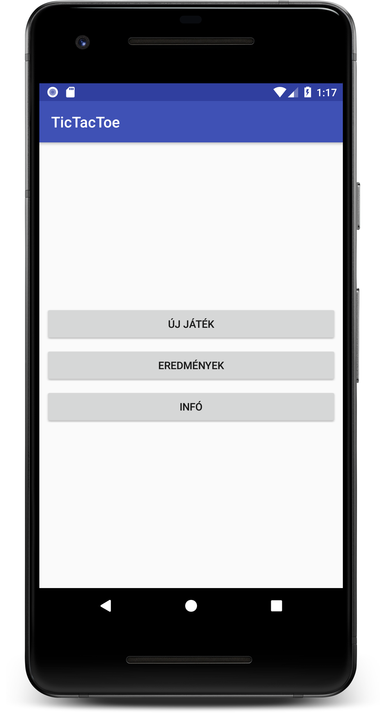
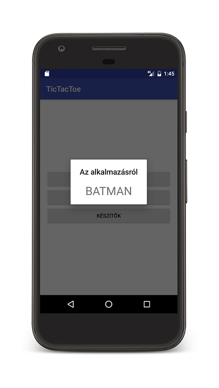
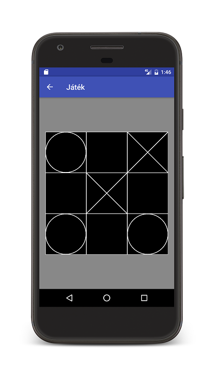

# Labor 1 - Egyszerű felhasználói felület több Activity segítségével (TicTacToe)

## Bevezetés

A labor célja a több Activity-ből álló Android alkalmazás készítésének bemutatása, valamint az egyszerű rajzolás bemutatása egy TicTacToe játék segítéségével.

A labor során a következő funkciókat fogjuk megvalósítani:

* Menü Activity
* Játéktér Activity
* TicTacToe nézet
* Játék logika elkezdése

A laborhoz kapcsolódó önálló feladat:
* Játék logika megvalósítása: győzelem ellenőrzése

A megvalósítandó játék felhasználói felületét az alábbi képernyőképek szemléltetik:





## Projekt létrehozása

Első lépésként indítsuk el az Android Studio-t, majd:

1. Hozzunk létre egy **TicTacToe** nevű projektet.
2. A kezdő package legyen például **hu.bme.aut.amorg.examples.tictactoe**
3. A projekt létrehozásakor válasszuk a kezdeti Empty Activity-vel rendelkező konfigurációt.
4. A kezdeti *Activity* neve legyen *MainMenuActivity*.

Sikeres projekt létrehozás után a laborvezető vezetésével vizsgálja meg a forrás felépítését.

## Activity-k létrehozása
A megvalósítandó alkalmazás működési elve a következő:

1. Alkalmazás indításakor a *MainMenuActivity* jelenik meg.
2. A *MainMenuActivity*-ről lehet új játékot indítani a “Start game” menüpont hatására, ez gyakorlatilag átnavigál a *GameActivity*-re.
3. A *MainMenuActivity*-ről meg lehet tekinteni a “Highscore”-t, ami jelenleg csak egy *Toast*-ot dob fel egy üzenettel (ezt a funkciót opcionálisan később meg lehet valósítani, ha a perzisztencia témakört már vettük előadáson).
4. A *MainMenuActivity*-ről meg lehet nézni az alkalmazás készítőiről szóló információkat az “About” menüt választva. Ez a funkció gyakorlatilag átnavigál az *AboutActivity*-re, ami viszont *Manifest* beállítás miatt csak dialógus formában fog megjelenni.


## Szöveges erőforrások
Navigáljunk a `res/values/strings.xml`-re, ahol a projekt szöveges erőforrásai találhatóak. Használjuk a következő szöveges erőforrásokat:

```xml
<resources>
    <string name="app_name">TicTacToe</string>
    <string name="btn_start">Új játék</string>
    <string name="btn_highscore">Eredmények</string>
    <string name="btn_about">Infó</string>
    <string name="toast_highscore">Eredmények</string>
    <string name="txt_about">Made by Hallgató</string>
</resources>
```

## Szükséges további Activity-k létrehozása
A fentiek alapján látható tehát, hogy a meglevő MainMenuActivity mellett még két másik Activity-t, a *GameActivity*-t és az *AboutActivity*-t kell létrehoznunk. Activity létrehozásakor tipikusan az alábbi forrás állományok változnak:

* Létrejön az Activity-hez tartozó Java file.
* Létrejön az Activity-hez tartozó layout XML.
* Az *AndroidManifest.xml*-be bekerül az Activity az `<application>` tag-en belül.
* Az Activity-hez tartozó menü XML létrejön (erre nem mindig van szükség).

Az Activity létrehozást azonban megkönnyíti az Andriod Studio és a fenti lépéseket nem kell egyesével elvégeznie a fejlesztőnek.

1. Az Android Studioban a forrásra állva válasszuk a “jobbegér->New->Activity->Empty Activity” menüt és hozzuk létre a két Activity-t (*AboutActivity, GameActivity*). Activity létrehozásakor megadható, hogy melyik legyen a “szülő” Activity, amihez a vissza gomb visszanavigálja a felhasználót. Mindkét esetben legyen ez a *MainMenuActivity*.
2. Létrehozás után a *res/values/strings.xml*-ben állítsuk be a két új Activity címét amelyet a létrehozáskor a Studio automatikusan kigenerált nekünk mint erőforrás (Például: *Az alkalmazásról*, illetve *Játék*).
3. Nyissuk meg a két új Activity kódját, vizsgáljuk meg azokat és a fölösleges *FloatingActionButton*-t illetve annak *listener*-ét távolítsuk el. Ha ez kész, akkor az *Activity*-hez rendelt layout-ból is töröljük a widgetet (Tipp: az adott *Activity* *onCreate()* metódusában a *setContentView()*-ban az adott layout-ra CTRL + kattintással könnyen megnyithatjuk az XML leírót).
4. Az *AboutActivity*-ből távolítsuk el a *Toolbar* kezeléséért felelős sorokat, mivel erre később nem lesz szükségünk.
5. Állítsuk be a manifest-ben, hogy az *AboutActivity* dialógus formában jelenjen meg:

```xml
<activity
    android:name=".AboutActivity"
    android:label="@string/title_activity_about"
    android:parentActivityName=".MainMenuActivity"
    android:theme="@style/Theme.AppCompat.Light.Dialog">
    <meta-data
        android:name="android.support.PARENT_ACTIVITY"
        android:value="hu.bme.aut.amorg.examples.tictactoe.MainMenuActivity" />
</activity>
```

> ### __Létrehozás után ellenőrizzük a laborvezető segítségével a létrejött kódokat!__

## MainMenuActivity felület:

A *MainMenuActivity* a fenti ábra alapján három menüpontot tartalmaz középre igazodva. Ez a három menüpont gyakorlatilag három gomb egymás alatt egy *LinearLayout*-ban, mely kitölti a szülőt (*match_parent*) és benne az elemek középre vannak rendezve:

```xml
<?xml version="1.0" encoding="utf-8"?>
<LinearLayout xmlns:android="http://schemas.android.com/apk/res/android"
    xmlns:tools="http://schemas.android.com/tools"
    android:id="@+id/activity_main"
    android:layout_width="match_parent"
    android:layout_height="match_parent"
    android:gravity="center"
    android:orientation="vertical"
    tools:context="hu.bme.aut.amorg.examples.tictactoe.MainMenuActivity">

    <Button
        android:id="@+id/btnStart"
        android:layout_width="match_parent"
        android:layout_height="wrap_content"
        android:text="@string/btn_start" />

    <Button
        android:id="@+id/btnHighscore"
        android:layout_width="match_parent"
        android:layout_height="wrap_content"
        android:text="@string/btn_highscore" />

    <Button
        android:id="@+id/btnAbout"
        android:layout_width="match_parent"
        android:layout_height="wrap_content"
        android:text="@string/btn_about" />
</LinearLayout>
```

A Studio egyből jelezni fogja nekünk, hogy a két *dimens* erőforrás amit használni szeretnénk, nem létezik. Hozzuk létre őket a *dimens.xml*-ben, értékük legyen 16dp. (Tipp: ha az erőforrás nevén áll a kurzor az XML-ben és ALT + ENTER -t nyomunk akkor a Studio felajánjla a resource automatikus elkészítését az értékének megadásával.)

## Highscore gomb eseménykezelő

A Highscore menüpontra kattintva ahogy említettük egy *Toast* üzenet jelenjen meg. Ehhez meg kell keresni a Highscore menüpont gombját és be kell állítani az alábbi eseménykezelőt neki a *MainMenuActivity onCreate()* függvényén belül:

```java
Button btnHighscore = (Button) findViewById(R.id.btnHighscore);
btnHighscore.setOnClickListener(new View.OnClickListener() {
  @Override
  public void onClick(View view) {
    Toast.makeText(MainMenuActivity.this,getString(R.string.toast_highscore),Toast.LENGTH_LONG).show();
  }
});
```

## AboutActivity felület

Ahogy korábban említettük az About menü elindítja az új *AboutActivity*-t, ezért elsőként készítsük el az *AboutActivity* felületét, melyet az *activity_about.xml* ír le:
```xml
<?xml version="1.0" encoding="utf-8"?>
<RelativeLayout xmlns:android="http://schemas.android.com/apk/res/android"
    android:id="@+id/content_about"
    android:layout_width="match_parent"
    android:layout_height="match_parent">

    <TextView
        android:text="@string/txt_about"
        android:layout_width="wrap_content"
        android:layout_height="wrap_content"
        android:textSize="30sp"
        android:layout_centerInParent="true"/>

</RelativeLayout>
```

## Játék logika

A TicTacToe, 3x3-as táblajáték logikáját egy külön osztályban valósítjuk meg *Singleton* (amennyiben nem ismeri ezt a Design pattern-t, érdemes utána olvasni, illetve rákérdezni a laborvezetőnél) formájában, így könnyen hozzáférhetünk.

Készítsünk a forráson belül egy *model* package-t, majd abba egy *TicTacToeModel* osztályt (model package-en *jobb gomb->new->Java class*). Az osztály egy 3*3-as mátrixban tárolja a játéktér mezőinek tartalmát és különféle publikus függvényeket biztosít a játéktér lekérdezéséhez és módosításához. A modell a *getInstance()* statikus függvénnyel elérhető el.

```java
public class TicTacToeModel {

  private static TicTacToeModel instance = null;

  private TicTacToeModel () {
  }

  public static TicTacToeModel getInstance() {
    if (instance == null) {
      instance = new TicTacToeModel();
    }
    return instance;
  }

  public static final short EMPTY = 0;
  public static final short CIRCLE = 1;
  public static final short CROSS = 2;

  private short[][] model = {
    { EMPTY, EMPTY, EMPTY },
    { EMPTY, EMPTY, EMPTY },
    { EMPTY, EMPTY, EMPTY }
  };
  private short nextPlayer = CIRCLE;

  public void resetModel() {
    for (int i = 0; i < 3; i++) {
      for (int j = 0; j < 3; j++) {
        model[i][j] = EMPTY;
      }
    }
    nextPlayer = CIRCLE;
  }

  public short getFieldContent(int x, int y) {
    return model[x][y];
  }

  public short setFieldContent(int x, int y, short content) {
    changeNextPlayer();
    return model[x][y] = content;
  }

  public short getNextPlayer() {
    return nextPlayer;
  }

  public void changeNextPlayer() {
    nextPlayer = (nextPlayer == CIRCLE) ? CROSS : CIRCLE;
  }
}
```


> ### __A laborvezetővel vegyék át az osztály működését.__

## Navigáció megvalósítása Activity-k közt

A következő lépésként valósítsuk meg a navigációt (váltást) az *Activity*-k között. A *Start game* menüpont hatására a *GameActivity*-re, az *About* menüpont hatására pedig az *AboutActivity*-re kell átváltanunk. Activity-k közti váltást *Intent* segítségével tudunk megtenni - beszéljék meg a laborvezetővel az *Intent*-ek alapjait. Ezt a témát előadáson később mélyebben fogjuk még érinteni.

Valósítsuk meg ezen két gomb eseménykezelőjét szintén a *MainMenuActivity onCreate()* függvényében:

```java
Button btnStart = (Button) findViewById(R.id.btnStart);
btnStart.setOnClickListener(new View.OnClickListener() {
  @Override
  public void onClick(View view) {
    TicTacToeModel.getInstance().resetModel(); // modell törlése új játék indításakor
    Intent i = new Intent(MainMenuActivity.this, GameActivity.class);
    startActivity(i);
  }
});

Button btnAbout = (Button) findViewById(R.id.btnAbout);
btnAbout.setOnClickListener(new View.OnClickListener() {
  @Override
  public void onClick(View view) {
    Intent i = new Intent(MainMenuActivity.this, AboutActivity.class);
    startActivity(i);
  }
});
```

## Játéktér kirajzolása
A következő lépés a játéktér kirajzolása és annak hozzárendelése a *GameActivity*-hez.

Első lépésként hozzunk létre egy *view* package-t a meglévő package hierarchia alá, majd abban egy *TicTacToeView* osztály, mely a *View*-ból származik le az alábbi vázzal:

```java
public class TicTacToeView extends View {

  Paint paintBg;
  Paint paintLine;

  public TicTacToeView(Context context, AttributeSet attrs) {
    super(context, attrs);

    paintBg = new Paint();
    paintBg.setColor(Color.BLACK);
    paintBg.setStyle(Paint.Style.FILL);

    paintLine = new Paint();
    paintLine.setColor(Color.WHITE);
    paintLine.setStyle(Paint.Style.STROKE);
    paintLine.setStrokeWidth(5);
  }

  @Override
  protected void onDraw(Canvas canvas) {
    super.onDraw(canvas);

    canvas.drawRect(0, 0, getWidth(), getHeight(), paintBg);

    drawGameArea(canvas);

    drawPlayers(canvas);
  }

  private void drawGameArea(Canvas canvas) {
    // TODO
  }

  private void drawPlayers(Canvas canvas) {
    // TODO
  }

  @Override
  protected void onMeasure(int widthMeasureSpec, int heightMeasureSpec) {
    int w = MeasureSpec.getSize(widthMeasureSpec);
    int h = MeasureSpec.getSize(heightMeasureSpec);
    int d = w == 0 ? h : h == 0 ? w : w < h ? w : h;
    setMeasuredDimension(d, d);
  }

  @Override
  public boolean onTouchEvent(MotionEvent event) {

    if (event.getAction() == MotionEvent.ACTION_DOWN) {
      // TODO
    }

    return super.onTouchEvent(event);
  }
}
```
> ### __Vizsgálja meg a kódrészt a laborvezető segítségével.__
Látható, hogy az osztály egy nézet rajzolásáért felelős. A konstruktorban létrehozunk két *Paint* objektumot, melyek a háttér, illetve a pályaelemek rajzolásához lesznek használva. Fontos, hogy ezeket a konstruktorban hozzuk létre és ne például az *onDraw()*-ban, hiszen az *onDraw()* gyakran meghívódik és sokszor hozná létre feleslegesen az objektumokat, lassítva ezzel a működést és megnehezítve a *garbage collector* dolgát.

Az osztály egyik leglényegesebb függvénye, az *onDraw(Canvas canvas)*, mely a kapott *canvas* objektumra rajzolja ki a nézet tartalmát. A jelenlegi implementáció feketére festi a területet és meghívja a játéktér kirajzolásért (négyzetrács) és a játékosok (X és O) kirajzolásáért felelős – egyelőre még üres – függvényeket.

Az *onMeasure()* függvény felüldefiniálásával biztosítható, hogy a nézet mindig négyzetes formában jelenjen meg (ugyanakkora legyen a szélessége, mint a magassága).

Végül az *onTouchEvent()* függvényben tudjuk kezelni az érintés eseményeket. Jelenleg az *ACTION_DOWN* eseményt vizsgáljuk, de más érintés események is elkaphatóak itt.

Ahhoz, hogy a *GameActivity* ezt a játékteret megjelenítse, módosítsuk a hozzá tartozó layout fájlt (*res/layout/content_game.xml*). A felület egy szürkés hátterű *RelativeLayout* közepén jelenítse meg a *TicTacToeView* nézetünket:

```xml
<?xml version="1.0" encoding="utf-8"?>
<RelativeLayout xmlns:android="http://schemas.android.com/apk/res/android"
    android:id="@+id/content_game"
    android:layout_width="match_parent"
    android:layout_height="match_parent"
    android:background="#888888"
    android:gravity="center_vertical">

    <hu.bme.aut.amorg.examples.tictactoe.view.TicTacToeView
        android:id="@+id/ticView"
        android:layout_width="match_parent"
        android:layout_height="wrap_content" />

</RelativeLayout>
```

Következő lépésként valósítsuk meg a játéktér kirajzolását a *drawGameArea()* függvényben, azaz rajzoljuk meg a vízszintes és függőleges vonalakat:

```java
private void drawGameArea(Canvas canvas) {
  // border
  canvas.drawRect(0, 0, getWidth(), getHeight(), paintLine);
  
  // two horizontal lines
  canvas.drawLine(0, getHeight() / 3, getWidth(), getHeight() / 3,
    paintLine);
  canvas.drawLine(0, 2 * getHeight() / 3, getWidth(),
    2 * getHeight() / 3, paintLine);

  // two vertical lines
  canvas.drawLine(getWidth() / 3, 0, getWidth() / 3, getHeight(),
    paintLine);
  canvas.drawLine(2 * getWidth() / 3, 0, 2 * getWidth() / 3, getHeight(),
    paintLine);
}
```

Ezt követően valósítsuk meg a modell alapján a játéktérbe az X-ek és O-k kirajzolását az *drawPlayers(…)* függvényben. A megvalósítás során végigmegyünk a játéktér mátrixon és a benne található értékek szerint O-t vagy X-et rajzolunk az adott mezőbe:
```java
private void drawPlayers(Canvas canvas) {
  for (int i = 0; i < 3; i++) {
    for (int j = 0; j < 3; j++) {
      if (TicTacToeModel.getInstance().getFieldContent(i,j) == TicTacToeModel.CIRCLE) {

        // draw a circle at the center of the field

        // X coordinate: left side of the square + half width of the square
        float centerX = i * getWidth() / 3 + getWidth() / 6;
        float centerY = j * getHeight() / 3 + getHeight() / 6;
        int radius = getHeight() / 6 - 2;

        canvas.drawCircle(centerX, centerY, radius, paintLine);

      } else if (TicTacToeModel.getInstance().getFieldContent(i,j) == TicTacToeModel.CROSS) {
        canvas.drawLine(i * getWidth() / 3, j * getHeight() / 3,
          (i + 1) * getWidth() / 3,
          (j + 1) * getHeight() / 3, paintLine);

        canvas.drawLine((i + 1) * getWidth() / 3, j * getHeight() / 3,
          i * getWidth() / 3, (j + 1) * getHeight() / 3, paintLine);
      }
    }
  }
}
```

Végül valósítsuk meg az érintés eseményre való reagálást úgy, hogy a megfelelő mezőbe – ha az üres – elhelyezzük az aktuális játékost, melyet a modell *nextPlayer* változója reprezentál.
> **A modell frissítése után az újrarajzolást az *invalidate()* függvény meghívásával tudjuk elérni.**
```java
@Override
public boolean onTouchEvent(MotionEvent event) {
    if (event.getAction() == MotionEvent.ACTION_DOWN) {
        int tX = ((int) event.getX()) / (getWidth() / 3);
        int tY = ((int) event.getY()) / (getHeight() / 3);
        if (tX < 3 && tY < 3 && TicTacToeModel.getInstance().getFieldContent(tX, tY) == TicTacToeModel.EMPTY) {
            TicTacToeModel.getInstance().setFieldContent(tX, tY, TicTacToeModel.getInstance().getNextPlayer());
            invalidate();
        }
    }
    return super.onTouchEvent(event);
}
```

## Alkalmazás ikon lecserélése
Az alkalmazás ikonját jelenleg a *res/drawable[-ldpi/mdpi/hdpi/xhdpi/...]* mappákban található *ic_launcher.png* jelképezi. A laborvezető segítségével keressen egy új ikont és cserélje le. Nem muszáj az ikont minden felbontásban elkészíteni, egyszerűen elhelyezhet egy méretet a drawable mappában is (melyet létre kell hozni), ekkor természetesen különböző felbontású eszközökön torzulhat az ikon képe.

## Játéklogika ellenőrzése - önálló feladat
Valósítson meg egy függvényt, mely minden lépés után leellenőrzi, hogy nem győzött-e valamelyik játékos, vagy nincs-e döntetlen. Amennyiben vége a játéknak, egy *Toast* üzenettel jelezze ezt a felhasználónak és lépjen vissza a főmenübe. A laborvezető segítségével vizsgálja meg, hogy a *View* osztályból hogyan érhető el az őt tartalmazó "host" Activity, aminek így például egy *endGame()* függvénye meghívható, ami megvalósítja a fent leírt játék befejezést.

```java
GameActivity gameActivity = (GameActivity) view.getContext();
gameActivity.endGame();
```

Jó munkát kívánunk!
