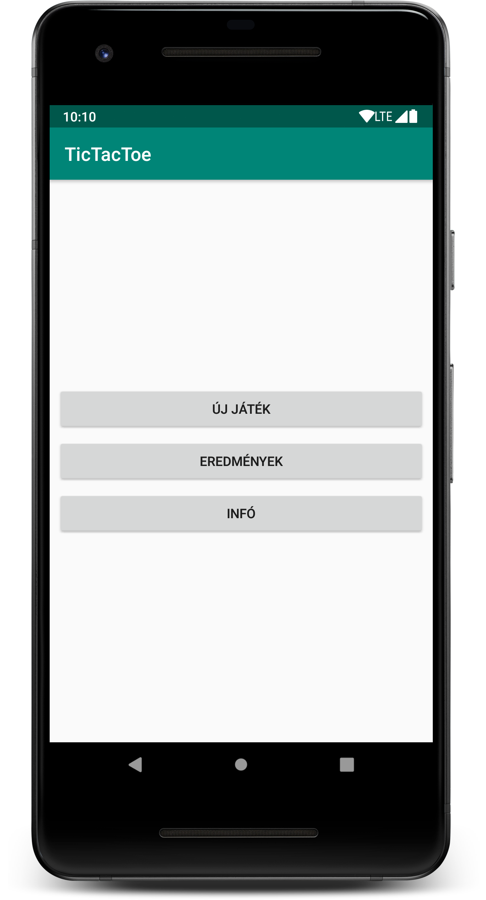
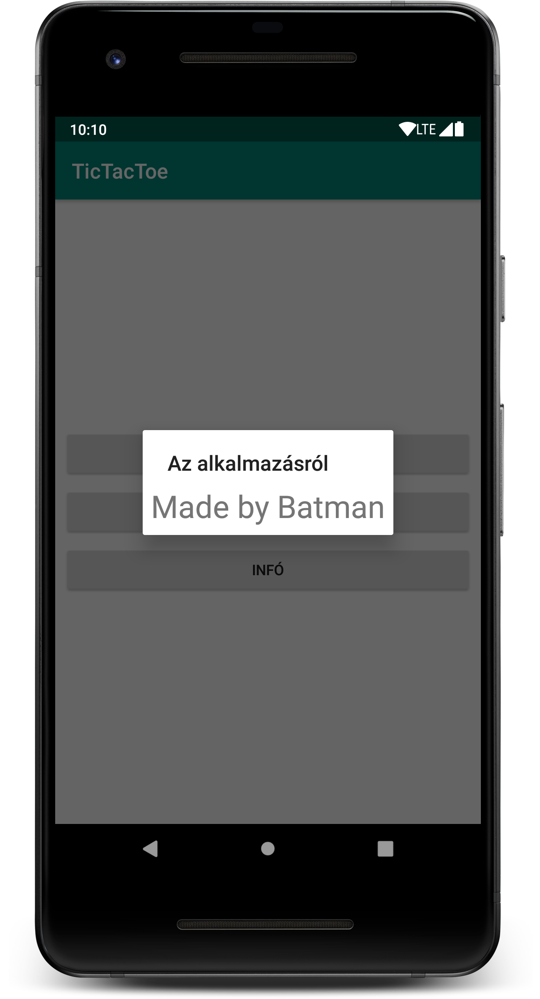
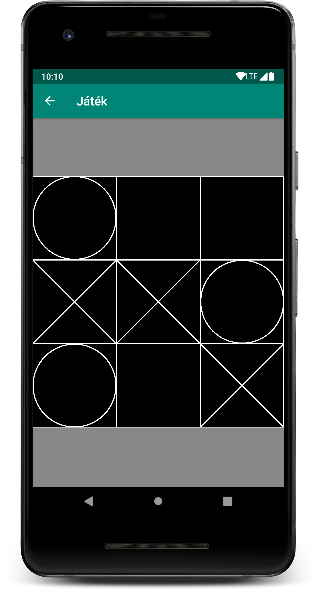

# Labor 1 - Egyszerű felhasználói felület több Activity segítségével (TicTacToe)

## Bevezetés

A labor célja egy több Activity-ből álló Android alkalmazás elkészítése, valamint az egyszerű rajzolás bemutatása egy TicTacToe játék segítségével.

A labor során a következő funkciókat fogjuk megvalósítani:

* Menü Activity
* Játéktér Activity
* TicTacToe nézet
* Játék logika elkezdése

A laborhoz kapcsolódó önálló feladat:
* Játék logika megvalósítása: győzelem ellenőrzése

A megvalósítandó játék felhasználói felületét az alábbi képernyőképek szemléltetik:

  

## Projekt létrehozása

Első lépésként indítsuk el az Android Studio-t, majd:

1. Hozzunk létre egy *TicTacToe* nevű projektet.
2. A kezdő package legyen `hu.bme.aut.android.tictactoe`.
3. Pipáljuk be az *Include Kotlin Support* lehetőséget.
4. A projekt létrehozásakor válasszuk a kezdeti *Empty Activity*-vel rendelkező konfigurációt.
5. A kezdeti Activity neve legyen `MainMenuActivity`.

Sikeres projekt létrehozás után a laborvezető vezetésével vizsgálja meg a forrás felépítését.

## Activity-k létrehozása

A megvalósítandó alkalmazás működési elve a következő:

1. Alkalmazás indításakor a `MainMenuActivity` jelenik meg.
2. A `MainMenuActivity`-ről lehet új játékot indítani a  *Start game* menüpont hatására, ez átnavigál a `GameActivity`-re.
3. A `MainMenuActivity`-ről meg lehet tekinteni a  *Highscore*-t, ami jelenleg csak egy `Toast`-ot dob fel egy üzenettel (ezt a funkciót opcionálisan később meg lehet valósítani, ha a perzisztencia témakört már vettük előadáson).
4. A `MainMenuActivity`-ről meg lehet nézni az alkalmazás készítőiről szóló információkat az *About* menüt választva. Ez a funkció átnavigál az `AboutActivity`-re, ami viszont Manifest beállítás miatt csak dialógus formában fog megjelenni.


## Szöveges erőforrások

Navigáljunk a `res/values/strings.xml`-re, ahol a projekt szöveges erőforrásai találhatóak. Használjuk a következő szöveges erőforrásokat:

```xml
<resources>
    <string name="app_name">TicTacToe</string>
    <string name="btn_start">Új játék</string>
    <string name="btn_highscore">Eredmények</string>
    <string name="btn_about">Infó</string>
    <string name="toast_highscore">Eredmények</string>
    <string name="txt_about">Made by Hallgató</string>
</resources>
```

## Szükséges további Activity-k létrehozása

A fentiek alapján látható tehát, hogy a meglevő `MainMenuActivity` mellett még két másik `Activity`-t, a `GameActivity`-t és az `AboutActivity`-t kell létrehoznunk. Activity létrehozásakor tipikusan az alábbi forrás állományok változnak:

* Létrejön az `Activity`-hez tartozó Kotlin fájl.
* Létrejön az `Activity`-hez tartozó layout XML.
* Az `AndroidManifest.xml`-be bekerül az `Activity` az `<application>` tag-en belül.
* Az `Activity`-hez tartozó menü XML létrejön (*Basic Activity* létrehozása esetén).

Az `Activity` létrehozást azonban megkönnyíti az Android Studio és a fenti lépéseket nem kell egyesével elvégeznie a fejlesztőnek.

1. A meglévő `Activity`-t tartalmazó package-re jobb egérgombbal kattintva válasszuk a *New -> Activity -> Basic Activity* opciót és hozzuk létre a másik két `Activity`-t (`AboutActivity`, `GameActivity`), *Source Language*-nek válasszuk a Kotlint. `Activity` létrehozásakor megadható, hogy melyik legyen a *szülő* `Activity`, amihez a vissza gomb visszanavigálja a felhasználót. Mindkét esetben legyen ez a `MainMenuActivity`. (Jelen pillanatban a Studio hibája miatt (3.1.3) a Hierarchical Parent választó nem mutat egyetlen értéket sem, viszont a ...-ra kattintva név szerint kikereshetjük a `MainMenuActivity`-t, vagy package névvel együtt begépelhetjük.)
2. Létrehozás után a `res/values/strings.xml`-ben állítsuk be a két új `Activity` címét amelyet a létrehozáskor a Studio automatikusan legenerált nekünk mint erőforrás (Például: *Az alkalmazásról*, illetve *Játék*).
3. Nyissuk meg a két új Activity kódját, vizsgáljuk meg azokat és a fölösleges `FloatingActionButton`-t illetve annak listener-ét távolítsuk el. Ha ez kész, akkor az `Activity`-hez rendelt layout-ból is töröljük a widgetet (Tipp: az adott `Activity` `onCreate()` metódusában a `setContentView()`-ban az adott layout-ra CTRL + kattintással (vagy a Ctrl + B megnyomásával) könnyen megnyithatjuk az XML leírót).
4. Az `AboutActivity`-ből távolítsuk el a `Toolbar` kezeléséért felelős sorokat, mivel erre később nem lesz szükségünk. A hozzá tartozó layout fájlból is  távolítsuk el a `Toolbar`-t.
5. Állítsuk be a Manifest-ben, hogy az `AboutActivity` dialógus formában jelenjen meg (A kódkiegészítés segít beírni a megfelelő témát a lehetőségek közül, kezdjük el a kezdő betűket beírni):

```xml
<activity
    android:name=".AboutActivity"
    android:label="@string/title_activity_about"
    android:parentActivityName=".MainMenuActivity"
    android:theme="@style/Theme.AppCompat.Light.Dialog">
    <meta-data
        android:name="android.support.PARENT_ACTIVITY"
        android:value="hu.bme.aut.android.tictactoe.MainMenuActivity" />
</activity>
```

> ### __Létrehozás után ellenőrizzük a laborvezető segítségével a létrejött kódokat!__

## MainMenuActivity felület:

A `MainMenuActivity` a fenti ábra alapján három menüpontot tartalmaz középre igazodva. Mivel a Studio már alapértelmezetten `ConstraintLayout`-ot generál, így most ezt fogjuk használni a megvalósításra. Az anyagban ennek működése csak később következik, így alább megtalálható a kész XML leíró, viszont akinek van kedve, a gif alapján kipróbálhatja a használatát:

[](images/constraint_layout_1.gif)

*Tipp: Shift + Kattintással lehet több elemet kijelölni*

```xml
<?xml version="1.0" encoding="utf-8"?>
<android.support.constraint.ConstraintLayout xmlns:android="http://schemas.android.com/apk/res/android"
	xmlns:app="http://schemas.android.com/apk/res-auto"
	xmlns:tools="http://schemas.android.com/tools"
	android:layout_width="match_parent"
	android:layout_height="match_parent"
	tools:context=".MainMenuActivity">

	<Button
		android:id="@+id/btnStart"
		android:layout_width="0dp"
		android:layout_height="wrap_content"
		android:layout_marginEnd="8dp"
		android:layout_marginStart="8dp"
		android:layout_marginTop="8dp"
		android:text="@string/btn_start"
		app:layout_constraintBottom_toTopOf="@+id/btnHighScore"
		app:layout_constraintEnd_toEndOf="parent"
		app:layout_constraintHorizontal_bias="0.5"
		app:layout_constraintStart_toStartOf="parent"
		app:layout_constraintTop_toTopOf="parent"
		app:layout_constraintVertical_chainStyle="packed" />

	<Button
		android:id="@+id/btnHighScore"
		android:layout_width="0dp"
		android:layout_height="wrap_content"
		android:layout_marginEnd="8dp"
		android:layout_marginStart="8dp"
		android:layout_marginTop="8dp"
		android:text="@string/btn_highscore"
		app:layout_constraintBottom_toTopOf="@+id/btnAbout"
		app:layout_constraintEnd_toEndOf="parent"
		app:layout_constraintHorizontal_bias="0.5"
		app:layout_constraintStart_toStartOf="parent"
		app:layout_constraintTop_toBottomOf="@+id/btnStart" />

	<Button
		android:id="@+id/btnAbout"
		android:layout_width="0dp"
		android:layout_height="wrap_content"
		android:layout_marginBottom="8dp"
		android:layout_marginEnd="8dp"
		android:layout_marginStart="8dp"
		android:layout_marginTop="8dp"
		android:text="@string/btn_about"
		app:layout_constraintBottom_toBottomOf="parent"
		app:layout_constraintEnd_toEndOf="parent"
		app:layout_constraintHorizontal_bias="0.5"
		app:layout_constraintStart_toStartOf="parent"
		app:layout_constraintTop_toBottomOf="@+id/btnHighScore" />
		
</android.support.constraint.ConstraintLayout>
```

## Highscore gomb eseménykezelő

A *Highscore* menüpontra kattintva ahogy említettük egy `Toast` üzenet jelenjen meg. Ehhez meg kell keresni a Highscore menüpont gombját és be kell állítani az alábbi eseménykezelőt neki a `MainMenuActivity` `onCreate()` függvényén belül:

```kotlin
val btnHighScore = findViewById<Button>(R.id.btnHighScore)
btnHighScore.setOnClickListener {
    Toast.makeText(this, getString(R.string.toast_highscore), Toast.LENGTH_LONG).show()
}
```

## AboutActivity felület

Ahogy korábban említettük az *About* menü elindítja az új `AboutActivity`-t, ezért elsőként készítsük el az `AboutActivity` felületét, melyet a `content_about.xml` ír le. Mint korábban, itt is lehet `ConstraintLayout`-ot készíteni a segítséggel, vagy alább megtalálható az XML:

[](images/constraint_layout_2.gif)

```xml
<?xml version="1.0" encoding="utf-8"?>
<android.support.constraint.ConstraintLayout xmlns:android="http://schemas.android.com/apk/res/android"
	xmlns:app="http://schemas.android.com/apk/res-auto"
	xmlns:tools="http://schemas.android.com/tools"
	android:layout_width="match_parent"
	android:layout_height="match_parent"
	app:layout_behavior="@string/appbar_scrolling_view_behavior"
	tools:context=".AboutActivity"
	tools:showIn="@layout/activity_about">

	<TextView
		android:id="@+id/textView3"
		android:layout_width="wrap_content"
		android:layout_height="wrap_content"
		android:layout_marginBottom="8dp"
		android:layout_marginEnd="8dp"
		android:layout_marginStart="8dp"
		android:layout_marginTop="8dp"
		android:text="@string/txt_about"
		android:textSize="30sp"
		app:layout_constraintBottom_toBottomOf="parent"
		app:layout_constraintEnd_toEndOf="parent"
		app:layout_constraintStart_toStartOf="parent"
		app:layout_constraintTop_toTopOf="parent" />
		
</android.support.constraint.ConstraintLayout>
```

## Játék logika

A TicTacToe, 3x3-as táblajáték logikáját egy külön osztályban valósítjuk meg [*Singleton*](https://en.wikipedia.org/wiki/Singleton_pattern) (amennyiben nem ismeri ezt a tervezési mintát, érdemes utána olvasni, illetve rákérdezni a laborvezetőnél) formájában, így könnyen hozzáférhetünk.

Készítsünk a forráson belül egy `model` package-t, majd abba egy `TicTacToeModel` osztályt (a package-en jobb egérgomb, majd *New -> Kotlin File/Class*). Az osztály egy 3x3-as mátrixban tárolja a játéktér mezőinek tartalmát és különféle publikus függvényeket biztosít a játéktér lekérdezéséhez és módosításához.

```kotlin
object TicTacToeModel {

    const val EMPTY: Byte = 0
    const val CIRCLE: Byte = 1
    const val CROSS: Byte = 2

    var nextPlayer: Byte = CIRCLE

    private var model: Array<ByteArray> = arrayOf(
            byteArrayOf(EMPTY, EMPTY, EMPTY),
            byteArrayOf(EMPTY, EMPTY, EMPTY),
            byteArrayOf(EMPTY, EMPTY, EMPTY))

    fun resetModel() {
        for (i in 0 until 3) {
            for (j in 0 until 3) {
                model[i][j] = EMPTY
            }
        }
    }

    fun getFieldContent(x: Int, y: Int): Byte = model[x][y]

    fun changeNextPlayer() {
        nextPlayer = if (nextPlayer == CIRCLE) CROSS else CIRCLE
    }

    fun setFieldContent(x: Int, y: Int, content: Byte): Byte {
        changeNextPlayer()
        model[x][y] = content
        return content
    }

}
```


> ### __A laborvezetővel vegyék át az osztály működését.__

## Navigáció megvalósítása Activity-k közt

A következő lépésként valósítsuk meg a navigációt (váltást) az `Activity`-k között. A *Start game* menüpont hatására a `GameActivity`-re, az *About* menüpont hatására pedig az `AboutActivity`-re kell átváltanunk. `Activity`-k közti váltást `Intent` segítségével tudunk megtenni - beszéljék meg a laborvezetővel az `Intent`-ek alapjait. Ezt a témát előadáson később mélyebben fogjuk még érinteni.

Valósítsuk meg ezen két gomb eseménykezelőjét szintén a `MainMenuActivity onCreate()` függvényében:

```kotlin
val btnStart = findViewById<Button>(R.id.btnStart)
btnStart.setOnClickListener {
    TicTacToeModel.resetModel()
    startActivity(Intent(this, GameActivity::class.java))
}

val btnAbout = findViewById<Button>(R.id.btnAbout)
btnAbout.setOnClickListener {
    startActivity(Intent(this, AboutActivity::class.java))
}
```

A `GameActivity`-re való navigáció előtt az előbb létrehozott `TicTacToeModel`-t alapállapotba állítjuk, hogy új játék kezdődjön.

## Játéktér kirajzolása

A következő lépés a játéktér kirajzolása és annak hozzárendelése a `GameActivity`-hez.

Első lépésként hozzunk létre egy `view` package-t a meglévő package hierarchia alá, majd abban egy `TicTacToeView` osztályt, mely a `View` ősosztályból származik le az alábbi vázzal:

```kotlin
class TicTacToeView : View {

    private val paintBg = Paint()
    private val paintLine = Paint()

    constructor(context: Context?) : super(context)
    constructor(context: Context?, attrs: AttributeSet?) : super(context, attrs)

    init {
        paintBg.color = Color.BLACK
        paintBg.style = Paint.Style.FILL

        paintLine.color = Color.WHITE
        paintLine.style = Paint.Style.STROKE
        paintLine.strokeWidth = 5F
    }

    override fun onDraw(canvas: Canvas?) {
        if (canvas == null) {
            return
        }

        canvas.drawRect(0F, 0F, width.toFloat(), height.toFloat(), paintBg)

        drawGameArea(canvas)
        drawPlayers(canvas)
    }

    fun drawGameArea(canvas: Canvas) {
        //TODO
    }

    fun drawPlayers(canvas: Canvas) {
        //TODO
    }

    override fun onMeasure(widthMeasureSpec: Int, heightMeasureSpec: Int) {
        val w = MeasureSpec.getSize(widthMeasureSpec)
        val h = MeasureSpec.getSize(heightMeasureSpec)
        val d = when {
            w == 0 -> h
            h == 0 -> w
            else -> min(w,h)
        }
        setMeasuredDimension(d, d)
    }

    override fun onTouchEvent(event: MotionEvent?): Boolean {
       return when (event?.action) {
		   MotionEvent.ACTION_DOWN -> {
			   //TODO
			   true
		   }
		   else -> super.onTouchEvent(event)
	   }
    }
}
```

> ### __Vizsgálja meg a kódrészt a laborvezető segítségével.__

Látható, hogy az osztály egy nézet rajzolásáért felelős. Létrehozunk két `Paint` objektumot, melyek a háttér, illetve a pályaelemek rajzolásához lesznek használva. A konstruktorok mint látjuk gyakorlatilag csak egy `super()` hívást valósítanak meg, mivel az `init` block végzi ebben a megvalósításban a különböző elemek inicializálását. Fontos, hogy objektumokat ne az `onDraw()`-ban hozzuk létre, hiszen az `onDraw()` gyakran meghívódik és sokszor hozná létre feleslegesen őket, lassítva ezzel a működést és megnehezítve a *garbage collector* dolgát.

Az osztály egyik leglényegesebb függvénye, az `override fun onDraw(canvas: Canvas?)`, mely a kapott `canvas` objektumra rajzolja ki a nézet tartalmát. A jelenlegi implementáció feketére festi a területet és meghívja a játéktér kirajzolásért (négyzetrács) és a játékosok (X és O) kirajzolásáért felelős – egyelőre még üres – függvényeket.

Az `override fun onMeasure(widthMeasureSpec: Int, heightMeasureSpec: Int)` függvény felüldefiniálásával biztosítható, hogy a nézet mindig négyzetes formában jelenjen meg (ugyanakkora legyen a szélessége, mint a magassága).

Végül az `override fun onTouchEvent(event: MotionEvent?)` függvényben tudjuk kezelni az érintés eseményeket. Jelenleg az `ACTION_DOWN` eseményt vizsgáljuk, de más érintés események is elkaphatóak itt.

Ahhoz, hogy a `GameActivity` ezt a játékteret megjelenítse, módosítsuk a hozzá tartozó layout fájlt (`res/layout/content_game.xml`). A felület egy szürkés hátterű `ConstraintLayout` közepén jelenítse meg a `TicTacToeView` nézetünket:

```xml
<?xml version="1.0" encoding="utf-8"?>
<android.support.constraint.ConstraintLayout xmlns:android="http://schemas.android.com/apk/res/android"
	xmlns:app="http://schemas.android.com/apk/res-auto"
	xmlns:tools="http://schemas.android.com/tools"
	android:layout_width="match_parent"
	android:layout_height="match_parent"
	app:layout_behavior="@string/appbar_scrolling_view_behavior"
	tools:context=".GameActivity"
	android:background="#888888"
	tools:showIn="@layout/activity_game">

	<hu.bme.aut.android.tictactoe.view.TicTacToeView
		android:id="@+id/ticTacToeView"
		android:layout_width="wrap_content"
		android:layout_height="wrap_content"
		android:layout_marginBottom="8dp"
		android:layout_marginEnd="8dp"
		android:layout_marginStart="8dp"
		android:layout_marginTop="8dp"
		app:layout_constraintBottom_toBottomOf="parent"
		app:layout_constraintEnd_toEndOf="parent"
		app:layout_constraintStart_toStartOf="parent"
		app:layout_constraintTop_toTopOf="parent"
		app:layout_constraintVertical_bias="0.495" />
</android.support.constraint.ConstraintLayout>
```

Következő lépésként valósítsuk meg a játéktér kirajzolását a `fun drawGameArea(canvas: Canvas)` függvényben, azaz rajzoljuk meg a vízszintes és függőleges vonalakat:

```kotlin
private fun drawGameArea(canvas: Canvas) {
	val widthFloat: Float = width.toFloat()
	val heightFloat: Float = height.toFloat()

	// border
	canvas.drawRect(0F, 0F, widthFloat, heightFloat, paintLine)

	// two horizontal lines
	canvas.drawLine(0F, heightFloat / 3, widthFloat, widthFloat / 3, paintLine)
	canvas.drawLine(0F, 2 * heightFloat / 3, widthFloat, 2 * heightFloat / 3, paintLine)

	// two vertical lines
	canvas.drawLine(widthFloat / 3, 0F, widthFloat / 3, heightFloat, paintLine)
	canvas.drawLine(2 * widthFloat / 3, 0F, 2 * widthFloat / 3, heightFloat, paintLine)
}
```

Ezt követően valósítsuk meg a modell alapján a játéktérbe az X-ek és O-k kirajzolását az `fun drawPlayers(canvas: Canvas)` függvényben. A megvalósítás során végigmegyünk a játéktér mátrixon és a benne található értékek szerint O-t vagy X-et rajzolunk az adott mezőbe:

```kotlin
private fun drawPlayers(canvas: Canvas) {
        // draw a circle at the center of the field
        // X coordinate: left side of the square + half width of the square
        for (i in 0 until 3) {
            for (j in 0 until 3) {
                if (TicTacToeModel.getFieldContent(i, j) == TicTacToeModel.CIRCLE) {
                    val centerX = i * width / 3 + width / 6
                    val centerY = j * height / 3 + height / 6
                    val radius = height / 6 - 2
                    canvas.drawCircle(centerX.toFloat(), centerY.toFloat(), radius.toFloat(), paintLine)
                } else if (TicTacToeModel.getFieldContent(i, j) == TicTacToeModel.CROSS) {
                    canvas.drawLine((i * width / 3).toFloat(), (j * height / 3).toFloat(), ((i + 1) * width / 3).toFloat(), 						((j + 1) * height / 3).toFloat(), paintLine)
                    canvas.drawLine(((i + 1) * width / 3).toFloat(), (j * height / 3).toFloat(), (i * width / 3).toFloat(), 						((j + 1) * height / 3).toFloat(), paintLine)
                }
            }
        }
}
```

Végül valósítsuk meg az érintés eseményre való reagálást úgy, hogy a megfelelő mezőbe – ha az üres – elhelyezzük az aktuális játékost, melyet a modell `nextPlayer` változója reprezentál. 

> *A modell frissítése után az újrarajzolást az `invalidate()` függvény meghívásával tudjuk elérni.*

```kotlin
override fun onTouchEvent(event: MotionEvent?): Boolean {
	return when (event?.action) {
		MotionEvent.ACTION_DOWN -> {
			val tX: Int = (event.x / (width / 3)).toInt()
			val tY: Int = (event.y / (height / 3)).toInt()
			if (tX < 3 && tY < 3 && TicTacToeModel.getFieldContent(tX, tY) == TicTacToeModel.EMPTY) {
				TicTacToeModel.setFieldContent(tX, tY, TicTacToeModel.nextPlayer)
				invalidate()
			}
			true
		}
		else -> super.onTouchEvent(event)
	}
}
```

## Alkalmazás ikon lecserélése

Az alkalmazás ikonját jelenleg a `res/drawable[-ldpi/mdpi/hdpi/xhdpi/...]` mappákban található `ic_launcher.png` jelképezi. A laborvezető segítségével keressen egy új ikont és cserélje le. Nem muszáj az ikont minden felbontásban elkészíteni, egyszerűen elhelyezhet egy méretet a `drawable` mappában is (melyet létre kell hozni), ekkor természetesen különböző felbontású eszközökön torzulhat az ikon képe.

## Játéklogika ellenőrzése - önálló feladat

Valósítson meg egy függvényt, mely minden lépés után leellenőrzi, hogy nem győzött-e valamelyik játékos, vagy nincs-e döntetlen. Amennyiben vége a játéknak, egy `Toast` üzenettel jelezze ezt a felhasználónak és lépjen vissza a főmenübe. A laborvezető segítségével vizsgálja meg, hogy a `View` osztályból hogyan érhető el az őt tartalmazó "host" `Activity`, aminek így például egy `endGame()` függvénye meghívható, ami megvalósítja a fent leírt játék befejezést.

Jó munkát kívánunk!
