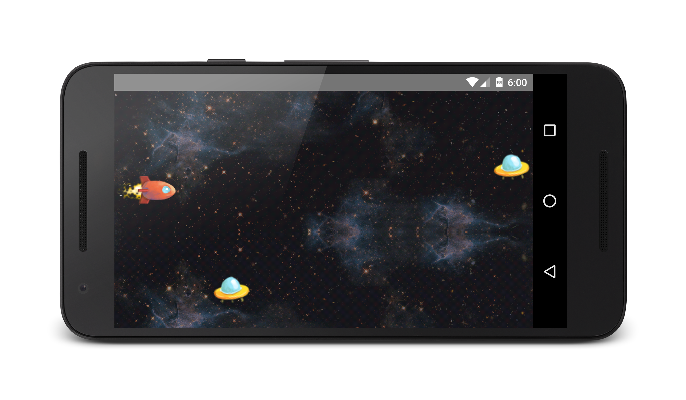
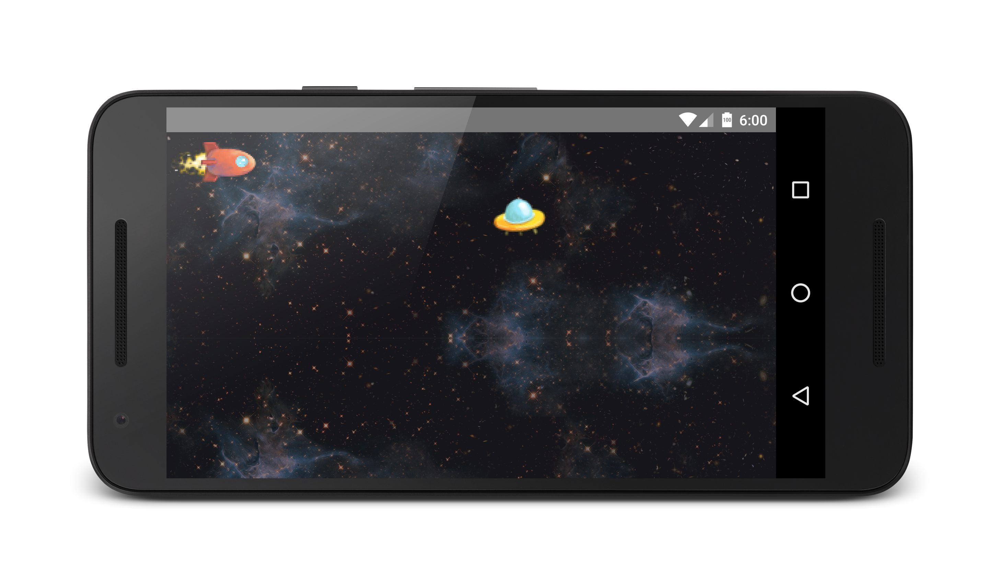

# Labor 10 - Játékfejlesztés

## Bevezető

A labor során ízelítőt szeretnénk adni az Android platformon történő játékfejlesztési lehetőségekből. Egy 2D-s játékot fogunk elkészíteni, amiben a felhasználó az eszköz _gyroscope_ szenzorát felhasználva tudja az őt reprezentáló űrhajót irányítani, hogy elkerülje az ellenséges űrhajókat.
 
Tekintve a platform adottságait, az egyébként elérhető és sikeres megoldásokat, valamint a labor időkorlátait, a labor során nem térünk ki a 3D játékfejlesztésre. Természetesen a platformon egyébként erre is van lehetőség.

## Érintett témakörök

*   Rajzolás SurfaceView-ra
*   Sensorok kezelése
*   Sprite-ok és animáció.
*   FPS szabályozás

## Kiinduló projekt

Elsőnek töltsük le a labor során használt kiinduló projektet, majd nyissuk meg Android Studio-val. 

[Kiinduló projekt](./assets/SpaceShipGame_skeleton.zip) 

A források közül a test könyvtárat, illetve annak a tartalmát kitörölhetjük.

Fordítsuk le a projektet, majd a Laborvezető segítségével vizsgáljuk meg a projekt felépítését.


### Általános

A projektben található egyetlen, indító _activity_ a **GameActivity**. Ez egy elfordított (_landscape_) nézet, _ActionBar_ nélkül (lásd styles.xml), valamint a **GameView** nézetet tartalmazza (lásd **activity_game.xml** ). A **GameView** a kirajzolt játéktér megjelenítésért felelős nézet, de magát a kirajzolást nem ő fogja végezni, csak megjeleníteni a már kirajzolt képet.

### Model

A _model_ csomagban található az előre elkészített játékmodell. Minden a játékban megjeleníthető entitás a **Renderable** interface megvalósítója. A kirajzolást végző szál majd mindent, mint **Renderable**-t fog kezelni (ezt később készítjük majd el). Minden entitásnak lehetőség van megadni, hogy mekkora a rajzfelület **size(x,y)**, hogy ebből a saját méreteit kiszámolhassa. Lehetőség van minden egyes kirajzolás után az objektum állapotát léptetni (**step()**), valamint minden objektumnak ki kell tudnia rajzolni magát egy _Canvas_ objektumra (**render(Canvas canvas)**).

### Háttér

A legegyszerűbb játékelem a háttér (**Background**). A háttérnek állapota nincs és egy teljes képernyőt kitöltő méretű képet rajzol ki. Ha a képi erőforrás kisebb mint a kirajzolt kép, akkor azt mind vízszintesen, mind függőlegesen tükrözi. A képek kirajzolása a _BitmapDrawable_ segítségével történik, amit a _BitmapFactory.decodeResource_-al hozunk létre.

### Űrhajó

A játékban kétfelé űrhajó is található, a játékos (**Player**) és az ellenség (**Enemy**). Mindkét entitás az abstract **Ship**-ből származik. Minden **Shiphez** tartozik egy kép, amit kirajzol magáról, valamint egy számlálóban lépteti, hogy hányadik kirajzolásról van szó, valamint a képernyőn lévő x,y pozícióját (**posX,posY**) is tárolja. Ezen túl még van egy **elevation** értéke, amivel mozgatni fogjuk az űrhajót. A **Player** és az **Enemy** osztályok a megfelelő bitmapet töltik be, valamint tartalmazzák, hogy az adott képen, amit betöltenek, hol helyezkedik el az űrhajó alapállapota. A **Player** objektum az **elevation** értékétől függően függőlegesen mozog, az **Enemy** objektum pedig egy véletlen szerű magasságon mozog egy adott sebességgel jobbról balra.

## A Renderer elkészítése

Készítsük el az objektumok kirajzolását végző **Renderer** osztályt a _rendering_ csomagban. Ez az osztály tárolja a kirajzolni kívánt objektumokat, és azokat megfelelő sorrendben a képernyőre is rajzolja, illetve lépteti a megfelelő objektumokat. A léptetés hatására véletlenszerűen egy új **Enemy** objektumot ad hozzá a játéktérhez. A _setElevation_ hatására pedig a **Player** magasságát állítja be. 


```java
public class Renderer {
    private Context context;

    private int width;
    private int height;

    private Random random;

    private List<Renderable> entitiesToDraw;

    private Background background;
    private Player player;

    public Renderer(Context context) {
        this.context = context;
        init(0, 0);
    }

    public void init(int width, int height) {
        this.width = width;
        this.height = height;
        entitiesToDraw = new ArrayList<>();
        background = new Background(context);
        background.size(width, height);
        player = new Player(context);
        player.size(width, height);

        Enemy enemy = new Enemy(context);
        enemy.size(width, height);
        entitiesToDraw.add(enemy);
        entitiesToDraw.add(player);
        random = new Random();
    }

    public void step() {
        if (random.nextFloat() > (0.993)) {
            Enemy enemy = new Enemy(context);
            enemy.size(width, height);
            entitiesToDraw.add(enemy);
        }

        for (Renderable object : entitiesToDraw) {
            object.step();
        }
    }

    public void draw(Canvas canvas) {
        background.render(canvas);
        for (Renderable object : entitiesToDraw) {
            object.render(canvas);
        }
    }

    public void setElevation(float elevation) {
        player.setElevation(elevation);
    }
}
```

### A kirajzoló szál

Készítsük el a kirajzolás ütemezéséért felelős szálat, a *rendering* csomagban **RenderLoop** néven.. Ezen a szálon fognak kirajzolásra kerülni a **Renderer** objektumai. Ez tartalmaz egy referenciát a **GameView**-ra, hogy abban megjelenítse a kirajzolt képet, valamint az előbb létrehozott **Renderer**-t használja fel. Maga is egy szálból származik, és a _run()_ függvényében egy végtelen ciklusban rajzolja ki újra és újra a játékelemeket. A rajzolás kezdetén először lépteti a játéktér állapotát, majd a **SurfaceView** **SurfaceHolder** objektuma segítségével kirajzolja magát. Fontos, hogy a kirajzolás előtt és után le kell zárni a **SurfaceHolder**-hez tartozó **Canvas**-t. 


```java
public class RenderLoop extends Thread {
  private GameView view;
  private final Renderer renderer;

  private boolean running = false;

  public RenderLoop(Context context,GameView view) {
    this.view = view;
    this.renderer=new Renderer(context);
  }

  public void init(int width,int height){
    renderer.init(width,height);
  }

  public void setRunning(boolean run) {
    running = run;
  }

  @Override
  public void run() {
    while (running) {
      draw();
    }
  }

  private void draw() {
    renderer.step();
    Canvas c = null;
    try {
      c = view.getHolder().lockCanvas();
      synchronized (view.getHolder()) {
        renderer.draw(c);
      }
   } finally {
      if (c != null) {
        view.getHolder().unlockCanvasAndPost(c);
      }
    }
 }

  public void setElevation(float elevation) {
    renderer.setElevation(elevation);
  }
}
```


Egészítsük ki a **GameView**-t úgy hogy a renderelő szálat használja. Adjunk hozzá egy tagváltozót.

`private RenderLoop renderLoop;`

Majd az init függvényben ezt hozzuk létre: 

`renderLoop = new RenderLoop(context,this);`

Módosítsuk a **GameView** _init()_ függvényét, hogy a kontextust paraméterül átadhassuk, majd a 3 konstruktorban adjuk is át a kontextusokat.

`init(context);` 
 
Ezután a **SurfaceHolder** callback eseményeit valósítjuk meg. 
  
```java
private void init(final Context context) {
	SurfaceHolder holder = getHolder();
	holder.addCallback(new SurfaceHolder.Callback() {
		@Override
		public void surfaceCreated(SurfaceHolder holder) {
			renderLoop = new RenderLoop(context,GameView.this);
			renderLoop.setRunning(true);
			renderLoop.start();
		}

		@Override
		public void surfaceDestroyed(SurfaceHolder holder) {
			boolean retry = true;
			renderLoop.setRunning(false);
			while (retry) {
				try {
					renderLoop.join();

					retry = false;
				} catch (InterruptedException e) {
					e.printStackTrace();
				}
			}
		}

		@Override
		public void surfaceChanged(SurfaceHolder holder, int format,int width, int height) {
			renderLoop.init(width,height);
		}
	});
}
```
  
  
Majd a játékos űrhajójának helyzetét állító hívást vezessük ki a **GameView**-ra. 

```java
public void setElevation(float elevation){
  if(renderLoop!=null) renderLoop.setElevation(elevation);
}
```

**Próbáljuk ki az alkalmazást**




## Irányítás

Mozgassuk a felhasználó űrhajóját a gyorsulásmérő és magnetométer segítségével. Az alábbi osztályt készítsük el a _sensor_ csomagba. Majd a **GameActivity** _onResume()_ és _onPause()_ függvényében indítjuk el, majd állítjuk le. 

```java
public class GyroscopeHelper implements SensorEventListener {
	private final SensorManager sensorManager;
	private GameView gameView;
	private Sensor accelerometer;
	private Sensor magnetometer;

	private float[] lastAccelerometerValue = new float[3];
	private float[] lastMagnetometerValue = new float[3];

	private boolean lastAccelerometerSet = false;
	private boolean lastMagnetometerSet = false;

	private float[] rotation = new float[9];
	private float[] orientation = new float[3];

	public GyroscopeHelper(Context context, GameView gameView) {
		this.gameView = gameView;
		sensorManager = (SensorManager) context.getSystemService(Context.SENSOR_SERVICE);
		accelerometer = sensorManager.getDefaultSensor(Sensor.TYPE_ACCELEROMETER);
		magnetometer = sensorManager.getDefaultSensor(Sensor.TYPE_MAGNETIC_FIELD);
	}

	public void start() {
		sensorManager.registerListener(this, accelerometer, SensorManager.SENSOR_DELAY_FASTEST);
		sensorManager.registerListener(this, magnetometer, SensorManager.SENSOR_DELAY_FASTEST);
	}

	public void stop() {
		sensorManager.unregisterListener(this);
	}

	@Override
	public void onSensorChanged(SensorEvent event) {
		if (event.sensor.equals(accelerometer)) {
			System.arraycopy(event.values, 0, lastAccelerometerValue, 0, event.values.length);
			lastAccelerometerSet = true;
		} else if (event.sensor.equals(magnetometer)) {
			System.arraycopy(event.values, 0, lastMagnetometerValue, 0, event.values.length);
			lastMagnetometerSet = true;
		}
		if (lastAccelerometerSet && lastMagnetometerSet) {
			SensorManager.getRotationMatrix(rotation, null, lastAccelerometerValue, lastMagnetometerValue);
			SensorManager.getOrientation(rotation, orientation);

			float roll = orientation[2] * 1.0f;

			float position = roll - (-1.0f);
			if (gameView != null) {
				gameView.setElevation(position);
			}
		}
	}

	@Override
	public void onAccuracyChanged(Sensor sensor, int accuracy) {
	}
}
```


Majd ezt használjuk a **GameActivity**-ben. 

```java
public class GameActivity extends AppCompatActivity {
  private GyroscopeHelper gyroscopeHelper;
  private GameView gameView;

  @Override
  protected void onCreate(Bundle savedInstanceState) {
    super.onCreate(savedInstanceState);
    setContentView(R.layout.activity_game);
    gameView = (GameView) findViewById(R.id.gameView);
    gyroscopeHelper = new GyroscopeHelper(this,gameView);
  }

  @Override
  protected void onResume() {
    super.onResume();
    gyroscopeHelper.start();
  }

  @Override
  protected void onPause() {
    gyroscopeHelper.stop();
    super.onPause();
  }
}
```

**Próbáljuk ki az alkalmazást.**




### Animáció

A **Ship** osztály valamint a **Player** és **Enemy** már fel vannak készítve arra hogy különböző állapotok között animáljanak. A megfelelő képi erőforrások is biztosítottak, már csak a képeket kell elcsúsztatni a megfelelő állapotba, a Ship osztály render függvényében: 

```java
@Override
public void render(Canvas canvas) {
  setSpriteSizes();

  int statePos = state/5;
  //4 states, 64*29 each image

  int x = 0;
  int y = spriteHeight * statePos;

  Rect src = new Rect(x, y, x + spriteWidth, y + spriteHeight);
  Rect dst = new Rect(posX, posY, posX + spriteWidth * 4, posY + spriteHeight * 4);

  if(canvas!=null) {
      canvas.drawBitmap(image, src, dst, null);
  }
}
```

**Próbáljuk ki az alkalmazást!** 


## FPS korlát elhelyezése

Azért hogy a kirajzolás sebességét egy fix értékre állítsuk két kirajzolás között aludnia kell a kirajzoló szálnak, amennyiben a kirajzolás nem tartott annyi ideig mint a kívánt FPS érték időköze. 

A **RenderLoop** osztályt egészítsük ki a következőkkel:

```java
public static final long FPS = 30;
private static final long timeBetweenFrames = 1000 / FPS;

private void sleepThread(long time) {
  try {
    sleep(time);
  } catch (InterruptedException e) {
  }
}

private long getTime() {
  return System.currentTimeMillis();
}
```

Valamint a run fügyvényt egészítsük ki:

```java
@Override
public void run() {
  while (running) {
    long renderStart = getTime();
    draw();
    
    long renderEnd = getTime();
    long sleepTime = timeBetweenFrames - (renderEnd - renderStart);
    if (sleepTime > 0) {
      sleepThread(sleepTime);
    } else {
      sleepThread(5);
    }
  }
}
```
 
A renderelés kezdete és vége előtt eltelt időt nézzük és ha ez kisebb mint amennyi az adott FPS számhoz szükséges, úgy a megfelelő ideig altatjuk a szálat. Amennyiben tovább tartott a renderelés, akkor is adunk valamennyi alvás időt a CPU-nak.

**Próbáljuk ki az alkalmazást!** 


## Önálló feladatok

### Feladat 1 - Ütközés detektálás

Detektálja, ha a felhasználó űrhajója ütközik egy ellenséges űrhajóval, ekkor jelenítsen meg egy **Toast** üzenetet, majd állítsa le a játékot!

### Feladat 2 - Játékos képernyőn maradása

Biztosítsa, hogy a játékos űrhajóját ne lehessen kimozgatni a játéktérből!	
### Feladat 3 - Képernyő ébrenmaradás

Biztosítsa, hogy a jaték alatt ne aludjon el a képernyő, akkor sem ha huzamosabb időn át nem érünk hozzá!

Segítség: [Keeping the Device Awake](https://developer.android.com/training/scheduling/wakelock.html)

### Feladat 4 - Okosabb memória kezelés
Jelenleg minden ellenséges űrhajó képe külön be van töltve a memóriába. 

Valósítsa meg hogy ezek csak egy példányban legyenek betöltve (pl. statikus objektum), illetve a képernyőről eltűnő ellenséges űrhajókat szabadítsa fel, azok ne foglaljanak helyet a memóriában.

A képernyőről eltűnő űrhajókat a poziciójuk alapján (aktuális pocizió kisebb-e mint a bal szél=0 - a hajó mérete) vegye ki a listából (pl. iterátorral). Ha nincs már rájuk referencia, a GC felszabadítja.

