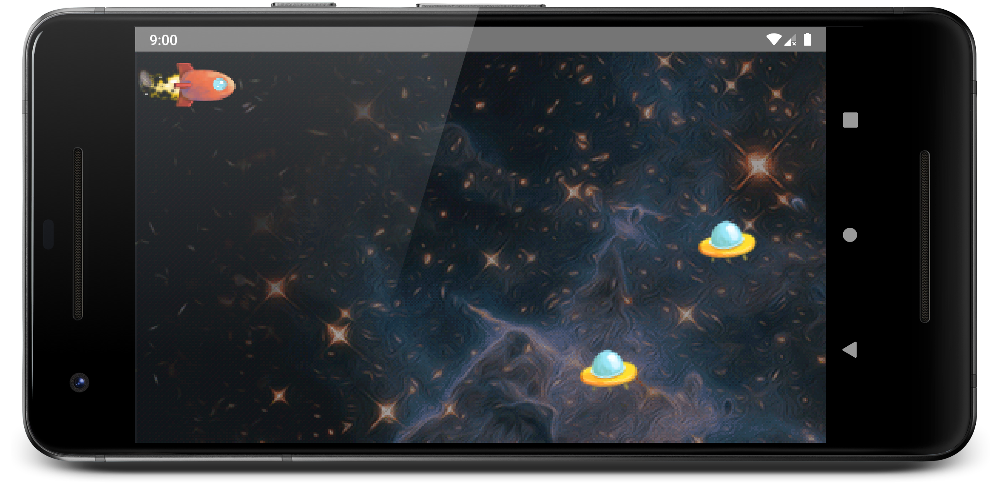
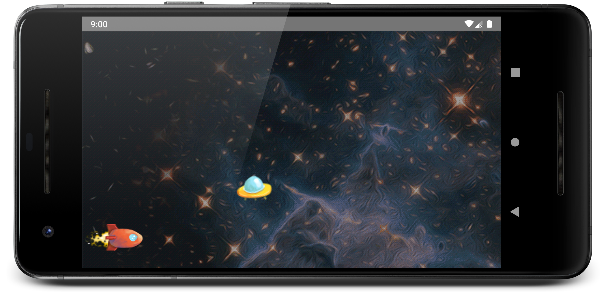
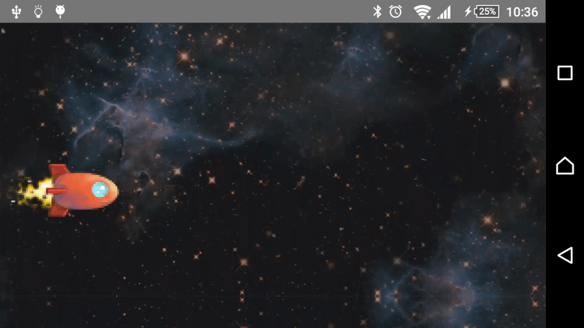

# Labor 10 - Játékfejlesztés

## Bevezető

A labor során ízelítőt szeretnénk adni az Android platformon történő játékfejlesztési lehetőségekből. Egy 2D-s játékot fogunk elkészíteni, amiben a felhasználó az eszköz _gyroscope_ szenzorát felhasználva tudja az őt reprezentáló űrhajót irányítani, hogy elkerülje az ellenséges űrhajókat.

Tekintve a platform adottságait, az egyébként elérhető és sikeres megoldásokat, valamint a labor időkorlátait, a labor során nem térünk ki a 3D játékfejlesztésre. Természetesen a platformon erre is van lehetőség.

## Érintett témakörök

*   Rajzolás `SurfaceView`-ra
*   Szenzorok kezelése
*   *Sprite*-ok és animáció
*   FPS szabályozás

## Kiinduló projekt

Töltsük le a labor során használt [kiinduló projektet](./assets/SpaceShipGame.zip), majd nyissuk meg Android Studio-val.

Fordítsuk le a projektet, majd a laborvezető segítségével vizsgáljuk meg a projekt felépítését.

### Általános

A projektben található egyetlen, indító `Activity` a `GameActivity`. Ez egy fektetett (*landscape*) `Activity` `Toolbar` nélkül (lásd `styles.xml`), ami a `GameView` nézetet jeleníti meg (lásd `activity_game.xml`). A `GameView` a játéktér megjelenítésért felelős nézet, de magát a kirajzolást nem ő fogja végezni, csak megjeleníti a memóriában kirajzolt képet.

### Model

A `model` package-ben található az előre elkészített játékmodell. Minden a játékban megjeleníthető entitás megvalósítja a `Renderable` interface-t. Ezzel jelezzük, hogy az entitásoknak meg tudjuk adni, hogy mekkora a rajzfelület (`setSize`), hogy ebből a saját méreteit kiszámolhassa. Lehetőség van minden egyes kirajzolás után az objektum állapotát megváltoztatni (`step`), valamint minden objektumnak ki kell tudnia rajzolni magát egy `Canvas` objektumra (`render`). A kirajzolást végző szál - amit később készítünk majd el - minden entitást `Renderable`-ként fog kezelni.

### Háttér

A legegyszerűbb játékelem a háttér (`Background`). A háttérnek nincs állapota és egy teljes képernyőt kitöltő méretű képet rajzol ki. Ha a képi erőforrás kisebb mint a kirajzolt kép, akkor azt mind vízszintesen, mind függőlegesen tükrözi. A képek kirajzolása a `BitmapDrawable` osztály segítségével történik, amit a `BitmapFactory.decodeResource` függvény hívással hozunk létre.

### Űrhajó

A játékban kétfelé űrhajó is megjelenik majd, a játékos (`Player`) és az ellenség (`Enemy`). Mindkét entitás a `Ship` absztrakt  osztályból származik. Minden `Ship`-hez tartozik egy kép, amit kirajzol magáról, ezen kívül egy számlálóban lépteti, hogy hányadik kirajzolásról van szó, valamint tárolja a képernyőn lévő pozícióját (`posX`, `posY`). A `Player` és az `Enemy` osztályok a hozzájuk tartozó bitmapet töltik be és eltárolják, hogy a bitmapen belül hol helyezkedik el az űrhajó alapállapotát ábrázoló kép részlet. A `Player` objektum az `elevation` property-jének értékétől függően függőlegesen mozog, az `Enemy` objektum pedig egy véletlenszerű magasságon mozog egy adott sebességgel jobbról balra.

> Az űrhajók kinézetét típusonként egy-egy, több állapotot ábrázoló bitmapként tároljuk. Tudjuk, hogy mekkora az űrhajók egy állapotát mutató részlet és azt is, hogy mekkora a teljes kép. Offsetekkel (ablakozással) el tudjuk érni, hogy a képnek csak egy adott szelete rajzolódjon ki. Kirajzolásonként más és más szeletet kirajzoltatva animációt hozhatunk létre. Ezt a módszert a játékfejlesztésben [spritesheet animation](https://gamedevelopment.tutsplus.com/tutorials/an-introduction-to-spritesheet-animation--gamedev-13099)nek hívják. Az Animáció szakaszban nézzük meg részletesen, hogy hogy lehet ezt megvalósítani.

## A Renderer elkészítése

Készítsük el az objektumok kirajzolását végző `Renderer` osztályt a `rendering` package-ben. Ez az osztály tárolja a kirajzolni kívánt objektumokat, és azokat megfelelő sorrendben a képernyőre is rajzolja, illetve lépteti őket. A léptetés közben néha véletlenszerűen egy új `Enemy` objektumot is hozzáad a játéktérhez. A `setPlayerElevation` függvénnyel a `Player` helyzetét állíthatjuk. 

```kotlin
class Renderer(
        private val context: Context,
        private val width: Int,
        private val height: Int
) {
    private val random = Random()
    private val entitiesToDraw = mutableListOf<Renderable>()

    private val background = Background(context)
    private val player = Player(context)

    init {
        background.setSize(width, height)
        player.setSize(width, height)

        val enemy = Enemy(context)
        enemy.setSize(width, height)

        entitiesToDraw.add(enemy)
        entitiesToDraw.add(player)
    }

    fun step() {
        if (random.nextFloat() > 0.993) {
            val enemy = Enemy(context)
            enemy.setSize(width, height)
            entitiesToDraw.add(enemy)
        }

        entitiesToDraw.forEach(Renderable::step)
    }

    fun draw(canvas: Canvas) {
        background.render(canvas)
        entitiesToDraw.forEach { it.render(canvas) }
    }

    fun setPlayerElevation(elevation: Float) {
        player.elevation = elevation
    }
}
```

> A `Random` importálásakor figyeljünk rá, hogy a `java.util` package-ből importáljuk. Ez is egy példa arra, hogy Kotlin kódban elérhető és használható az összes Java implementáció.

### A kirajzoló szál

Készítsük el a kirajzolás ütemezéséért felelős szálat a `rendering` csomagban `RenderLoop` néven. Ezen a szálon fognak kirajzolódni a `Renderer` objektumai. A `RenderLoop` tartalmaz egy referenciát a `GameView`-ra a kirajzolt képkocka megjelenítéséhez, valamint az előbb létrehozott `Renderer`-t használja fel a kirajzoláshoz. Az osztály a `Thread`-ből származik, és a `run` függvényében egy végtelen ciklusban rajzolja ki újra és újra a játékelemeket. A rajzolás kezdetén először lépteti a játéktér állapotát, majd a `SurfaceView` `SurfaceHolder` objektuma segítségével kirajzolja magát. Fontos, hogy a kirajzolás időtartama alatt zárolni kell a `SurfaceHolder`-hez tartozó `Canvas`-t.

```kotlin
class RenderLoop(
        context: Context,
        private val view: GameView,
        width: Int,
        height: Int
) : Thread() {
    private val renderer = Renderer(context, width, height)

    var running = false

    override fun run() {
        while (running) {
            draw()
        }
    }

    private fun draw() {
        renderer.step()

        var canvas: Canvas? = null

        try {
            canvas = view.holder.lockCanvas()
            synchronized(view.holder) {
                renderer.draw(canvas)
            }
        } finally {
            if (canvas != null) {
                view.holder.unlockCanvasAndPost(canvas)
            }
        }
    }

    fun setPlayerElevation(elevation: Float) {
        renderer.setPlayerElevation(elevation)
    }
}
```

Egészítsük ki a `GameView`-t a `RenderLoop` használatával. Adjunk hozzá egy propertyt:

```kotlin
private var renderLoop: RenderLoop? = null
```

Ezután valósítsuk meg a `SurfaceHolder`-hez beállított eseménykezelő függvényeit, ahol lekezeljük, ha megváltozik vagy megsemmisül a `SurfaceView`. 

```kotlin
init {
    holder.addCallback(object : SurfaceHolder.Callback {
        override fun surfaceCreated(holder: SurfaceHolder) {
            // empty
        }

        override fun surfaceDestroyed(holder: SurfaceHolder) {
            var retry = true
            renderLoop?.running = false
            while (retry) {
                try {
                    renderLoop?.join()
                    retry = false
                } catch (e: InterruptedException) {
                    e.printStackTrace()
                }
            }
        }

        override fun surfaceChanged(holder: SurfaceHolder, format: Int, width: Int, height: Int) {
            val loop = RenderLoop(context, this@GameView, width, height)
            loop.running = true
            loop.start()

            renderLoop = loop
        }
    })
}
```

Majd a játékos űrhajójának helyzetét állító hívást vezessük ki a `GameView`-ra: 

```kotlin
fun setPlayerElevation(elevation: Float) {
    renderLoop?.setPlayerElevation(elevation)
}
```

Próbáljuk ki az alkalmazást!



## Irányítás

Mozgassuk a felhasználó űrhajóját a gyorsulásmérő és magnetométer segítségével. Készítsük el az alábbi osztályt egy új, `sensor` nevű package-ben:  

```kotlin
class GyroscopeHelper(context: Context, private val gameView: GameView) : SensorEventListener {
    private val sensorManager = context.getSystemService(Context.SENSOR_SERVICE) as SensorManager
    private val accelerometer = sensorManager.getDefaultSensor(Sensor.TYPE_ACCELEROMETER)
    private val magnetometer = sensorManager.getDefaultSensor(Sensor.TYPE_MAGNETIC_FIELD)

    private val lastAccelerometerValue = FloatArray(3)
    private val lastMagnetometerValue = FloatArray(3)

    private var lastAccelerometerSet = false
    private var lastMagnetometerSet = false

    private val rotation = FloatArray(9)
    private val orientation = FloatArray(3)

    fun start() {
        sensorManager.registerListener(this, accelerometer, SensorManager.SENSOR_DELAY_FASTEST)
        sensorManager.registerListener(this, magnetometer, SensorManager.SENSOR_DELAY_FASTEST)
    }

    fun stop() {
        sensorManager.unregisterListener(this)
    }

    override fun onSensorChanged(event: SensorEvent) {
        when (event.sensor) {
            accelerometer -> {
                System.arraycopy(event.values, 0, lastAccelerometerValue, 0, event.values.size)
                lastAccelerometerSet = true
            }
            magnetometer -> {
                System.arraycopy(event.values, 0, lastMagnetometerValue, 0, event.values.size)
                lastMagnetometerSet = true
            }
        }
        if (lastAccelerometerSet && lastMagnetometerSet) {
            SensorManager.getRotationMatrix(rotation, null, lastAccelerometerValue, lastMagnetometerValue)
            SensorManager.getOrientation(rotation, orientation)

            val roll = orientation[2] * 1.0f

            val position = roll - -1.0f
            gameView.setPlayerElevation(position)
        }
    }

    override fun onAccuracyChanged(sensor: Sensor, accuracy: Int) {}
}
```

Láthatjuk, hogy a különböző szenzorok egyszerű float értékeket tartalmazó tömbökben szolgáltatnak adatokat. Ezek megfelelő értelmezéséhez a [hivatalos dokumentációban](https://developer.android.com/guide/topics/sensors/sensors_position) találunk segítséget. 

Használjuk az elkészült `GyroscopeHelper` az osztályt a `GameActivity`-ben! 

```kotlin
class GameActivity : AppCompatActivity() {
    private lateinit var gyroscopeHelper: GyroscopeHelper

    override fun onCreate(savedInstanceState: Bundle?) {
        super.onCreate(savedInstanceState)
        setContentView(R.layout.activity_game)
        gyroscopeHelper = GyroscopeHelper(this, gameView)
    }

    override fun onResume() {
        super.onResume()
        gyroscopeHelper.start()
    }

    override fun onPause() {
        gyroscopeHelper.stop()
        super.onPause()
    }
}
```

> A komponensek összekötésére azt a megoldást választottuk, hogy átadjuk a `GameView` példányt a szenzorokat kezelő osztályunknak, és ez közvetlenül továbbítja a mért értékeket. Ezt az egyszerűség kedvéért tettük, egyébként szebb megoldás lenne a szenzor eseményeket az `GameActivity`-be továbbítani (például egy listener interfész segítésével), hogy a szenzor kezelés ne függjön a játékot rajzoló osztálytól.

Figyeljük meg, ahogy az `onResume` és `onPause` életciklus függvényekben elindítjuk és leállítjuk a szenzorok figyelését.

Próbáljuk ki az alkalmazást!



### Animáció

Az animációk során *spritesheet*-eket használunk, azaz az animáció egyes állapotai mind megtalálhatóak ugyanazon a képen. *Sprite*-ok esetén az animáció abból áll, hogy a forrásképen egy maszkot tologatunk attól függően, hogy milyen állapotban van az animáció. Így megspóroljuk a folyamatos kép betöltést, és a GC-t sem terheljük túl.

A `Ship` osztály, valamint a `Player` és `Enemy` már fel vannak készítve arra, hogy különböző állapotok között animáljanak. A megfelelő képi erőforrások is biztosítottak, már csak a képek ablakozását kell elcsúsztatni az adott állapotba a `Ship` osztály `render` függvényében: 

```kotlin
override fun render(canvas: Canvas) {
    setSpriteSizes()

    val statePos = state % 4
    // 4 states, each image is 64*29

    val x = 0
    val y = spriteHeight * statePos

    val src = Rect(x, y, x + spriteWidth, y + spriteHeight)
    val dst = Rect(posX, posY, posX + spriteWidth * 4, posY + spriteHeight * 4)

    canvas.drawBitmap(image, src, dst, null)
}
```

Próbáljuk ki az alkalmazást!



## FPS korlát beállítása

A kirajzolás sebességének fix értékre állításához két kirajzolás között aludnia kell a kirajzoló szálnak, ha a kirajzolás nem tartott annyi ideig, mint a kívánt FPS érték által meghatározott időablak. 

> 30 FPS (frame per second) esetén az egy kép kirajzolására fordítható maximum idő 1000 ms / 30 fps  = 33.33 ms/frame

Egészítsük ki a `RenderLoop` osztályt a következőkkel:

```kotlin
companion object {
    private const val FPS: Long = 30
    private const val TIME_BETWEEN_FRAMES = 1000 / FPS
}

private fun sleepThread(time: Long) {
    try {
        sleep(time)
    } catch (e: InterruptedException) {
        // ignored
    }
}

private fun getTime() = System.currentTimeMillis()
```

Valamint egészítsük ki a `run` függvényt:

```kotlin
override fun run() {
    while (running) {
        val renderStart = getTime()
        draw()
        val renderEnd = getTime()

        val sleepTime = TIME_BETWEEN_FRAMES - (renderEnd - renderStart)
        if (sleepTime > 0) {
            sleepThread(sleepTime)
        } else {
            sleepThread(5)
        }
    }
}
```

Vizsgáljuk a renderelés kezdete és vége között eltelt időt, és ha ez kevesebb, mint amennyi az adott FPS számhoz szükséges, úgy a megfelelő ideig altatjuk a szálat. Amennyiben tovább tartott a renderelés, akkor is adunk 5 ms alvás időt a CPU-nak.

Próbáljuk ki az alkalmazást! 


## Önálló feladatok

### Feladat 1 - Ütközés detektálás

Detektálja, ha a játékos űrhajója ütközik egy ellenséges űrhajóval! Ekkor jelenítsen meg egy `Toast` üzenetet, majd állítsa le a játékot!

### Feladat 2 - Játékos képernyőn maradása

Biztosítsa, hogy a játékos űrhajóját ne lehessen kimozgatni a játéktérből!

### Feladat 3 - Képernyő ébrenmaradás

Biztosítsa, hogy a játék alatt ne aludjon el a képernyő, akkor sem, ha huzamosabb időn át nem érünk hozzá!

Segítség: [Keeping the Device Awake](https://developer.android.com/training/scheduling/wakelock.html)

### Feladat 4 - Okosabb memória kezelés

Jelenleg minden ellenséges űrhajó képe külön be van töltve a memóriába. 

Valósítsa meg, hogy ezek csak egy példányban legyenek betöltve (pl. "statikus", *companion object*-ben tárolt bitmap), illetve a képernyőről eltűnő ellenséges űrhajókat szabadítsa fel, hogy azok ne foglaljanak helyet a memóriában.

A képernyőről eltűnő űrhajókat a poziciójuk alapján (aktuális pozíció kisebb-e mint a `(bal szél) - (a hajó mérete)`) vegye ki a listából (pl. [`removeAll`](https://kotlinlang.org/api/latest/jvm/stdlib/kotlin.collections/remove-all.html) segítségével). Ha nincs már rájuk referencia, a GC felszabadítja őket.
