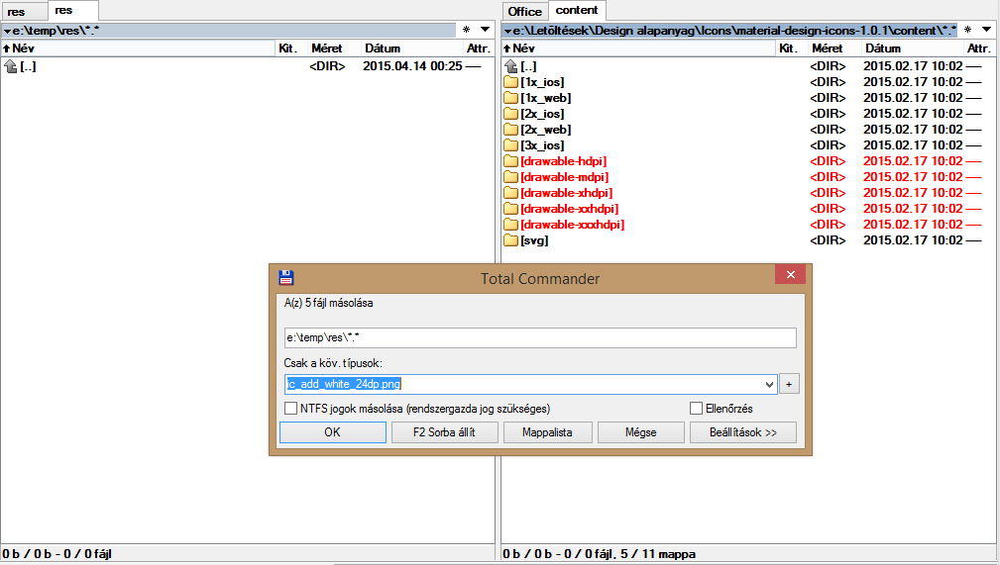
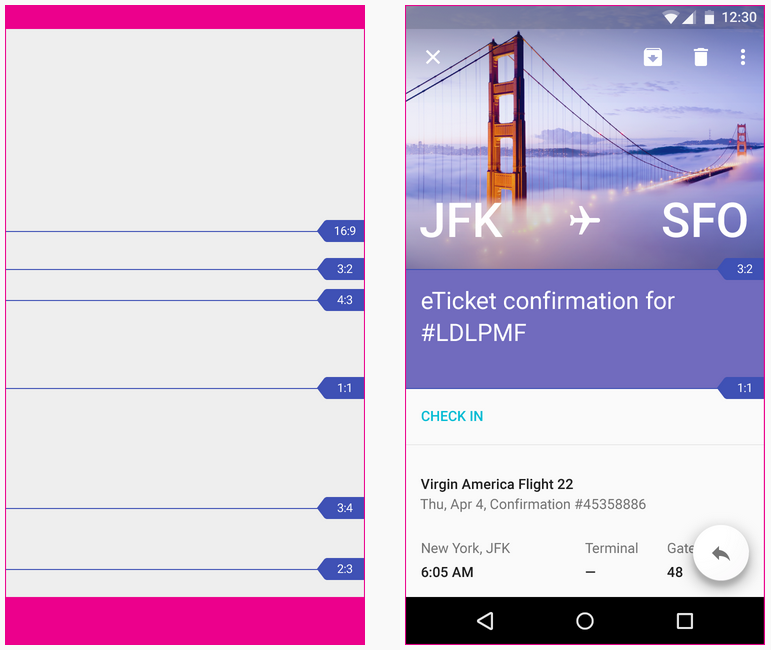

# Labor 10 - UX alapok

## Bevezetés

Ma már igen sok alkalmazás található a Play áruházban, köszönhető ez többek között a terjesztés egyszerűségének és az alacsony belépési korlátnak. Azonban ezeknek az alkalmazásoknak igen magas hányada végzi alacsony értékeléssel és magas elégedetlenséggel. A legtöbb projekt fejlesztője késznek érzi az alkalmazást, azonban csak magára gondol és nem a felhasználóra. Ezen a laboron bemutatunk néhány egyszerű fogalmat és technikát, ami segít abban, hogy minőségibb alkalmazások szülessenek. Ehhez egy alapvetően prototípus kaliberű alkalmazást fogunk material szemlélettel javítani.

Tartsuk szem előtt, hogy ez csak néhány egyszerű ötlet, és ahogy a lollipopos megjelenésű elemektől még nem lesz material egy alkalmazás megjelenése, úgy mi sem leszünk mindenható dizájnerek a labor után. Ez a témakör koránt sem olyan egyértelmű, mint a mérnöki tanulmányok jó része, az itt alkalmazott lépések nem feltétlenül univerzálisak.

##Material és UX alapok

Először is, akinek szándékában áll végigolvasni a teljes útmutatót később, az itt megteheti:
[http://www.google.com/design/spec/material-design/introduction.html](http://www.google.com/design/spec/material-design/introduction.html)

* A material dizájnban lényeges minden elem megjelenése. Például a Floating Action Button vetett árnyéka nem véletlen. Funkciója kiemelkedik, ezért megjelenítéskor is azt próbáljuk hangsúlyozni, hogy feljebb van. Az elemeknek van Z tengely szerinti **magasságuk**, a rendszer ebből számolja az általuk vetett árnyékot.
* Az animációknak jelentésük kell legyen. Csak úgy nem animálunk dolgokat, mert az jól néz ki. Ha egy listaelemre vagy kártyára tapint a felhasználó, akkor azt az elemet átanimálhatjuk az új képernyővé, úgy, hogy a kártya (vagy listaelem) olyan elemei, amik a következő képernyőn is szerepelnek elfoglalják új helyüket a második képernyőn. Az Android platformon már régóta elérhetőek egyszerű áttűnések, lapozások a képernyőátmenetek közt. Erre azért van szükség, mert a felhasználót (meg)zavarja a hirtelen váltás. A való életben sem villanással kerül az égre a madár, hanem lezajlik egy átmenet (a felszállás), ami átvezet a két állapot között. Emlékezzünk vissza: találkoztunk már olyan alkalmazással, ahol a képernyőváltás során oldalirányban úsztak ki-be a képernyők? Előre és visszafelé navigálásnál melyik irányba haladtak a képernyők?
* Bár laboron a beépített komponensek során nem futunk ebbe a problémába, de jegyezzük meg: minden felhasználói interakcióra legyen visszajelzés! Gondoljunk bele mit teszünk, ha egy gombot megnyomva nem történik semmi (fel se villan a gomb nyomott állapota), mit feltételezünk? Jusson eszünkbe egyéni nézetek használatakor! A material szemlélet ezt bővíti azzal, hogy a kiváltott változás egy egyre nagyobb sugarú kör íve mentén történik, aminek középpontja az a hely, ahol a felhasználó kiváltotta a változást:
[material animáció](http://material-design.storage.googleapis.com/publish/material_v_3/material_ext_publish/0B3T7oTWa3HiFdWhpd296VUhLTFk/animation_responsiveinteraction_radialreaction.webm?_=1)

* Minimális gépelés. Nehéz nagyobb fájdalmat okozni a felhsználónak annál, hogy mobilon kelljen gépelnie, nem véletlenül létezik annyi különböző gesztúra. Ha egyszerű bevitelről van szó (számok, intervallumok, dátumok) egyszerűsítsük csúszkával, vizuális naptári választóval.
* A materialos színekhez jó segítség az alábbi oldal: [http://www.materialpalette.com/](http://www.materialpalette.com/). Innen le is tudjuk tölteni xml formában a kapott színeket. Annyit érdemes tudni, hogy az “accent” színt csak a leghangsúlyosabb elemek kaphatják meg. Tipikusan ilyen a Floating Action Button, ami a képernyő legfontosabb funkcióját kell jelentse, ha van ilyen. Ugyanúgy másodlagos színt kapnak a Switch és a Slider nézetek is.
* Ikonokat tervezni külön szakma, de mivel a legtöbb fejlesztő nem foglalkozik ilyesmivel másodállásban, ezért a Google nem csak néhány ikont készített el előre, hanem rengeteget. Innen letölthetők: [http://www.google.com/design/spec/resources/sticker-sheets-icons.html#sticker-sheets-icons-system-icons](http://www.google.com/design/spec/resources/sticker-sheets-icons.html#sticker-sheets-icons-system-icons). Valószínűleg megtaláljuk a nekünk kellőt. Alapszabály, hogy ne használjunk olyan ikont (bármennyire is jó lenne), ami már másik ismert funkciót jelöl. Hasonlóan kinéző komponenstől a felhasználó azt várja, hogy hasonlóan fog működni. A Floating Action Button funkciójának alapvetően egy pozitív cselekedetnek kell lennie (jó példa az új elem létrehozása, rossz példa a szín módosítása vagy a kuka törlése), így válasszunk ennek megfelelő ikont. A fentebb linkelt zipben rengeteg fájl van (több, mint 72.000). A laborhoz mellékeljük a szükséges ikonokat, de az otthoni használathoz a javasolt mód az alábbi:
 * Nyissuk meg a kitömörített mappa gyökerében az index.html-t
 * Válasszunk egy ikont (például az add ikon)
 * Menjünk a szekciójának mappájába (esetünkben ez a “content”)
 * Válasszuk ki a nekünk kellő variánst. Szerepel fehérben, feketében, szürkében és mindhárom színhez 4 féle méretben (nekünk az “*ic_add_white_24dp.png*” kell)
 * Menjünk egy könyvtárral feljebb és Total Commanderrel másoljuk az összes minősített mappát a célhelyre, de úgy, hogy megadjuk milyen illeszkedő fájlokat másoljon csak. Oda írjuk be a kiválasztott formátum fájlnevét.

Total Commander használata a material ikon csomaggal

* Tartsunk megfelelő távolságokat az elemek között, különösen ügyelve az interaktív elemekre. Lesz olyan, akinek nálunk nagyobb az ujjbegye, gondoljunk rá is! A tartalom ne kezdődjön a képernyő 0. pixelénél! Az ajánlásokban elég részletesen taglalják a számokat: az új guideline szerint minden elem egy 8dp-s rácsban helyezkedik el. Ez alól kivételek a szövegek (amiknek alapvonala igazodik 4dp-hez) és a toolbar ikonjai (szintén 4 dp). Tehát alapvetően mindennek a mérete vagy a távolsága n x 8dp. A kijelző szélétől tartandó margó például 16dp, az érinthető területek minimum mérete 48 x 48dp, a köztük tartandó távolság pedig minimum 8dp, de inkább több.
* A képi elemek legyen inkább személyesek. Ne használjunk pár élettelen mosolyú modell arcát mutató sotck fotókat, a képnek egyen köze a tartalomhoz. A személyes (felhasználó készítette) képek még jobbak. A képek töltsék ki a teret, amennyire csak lehet! Ez azt jelenti, hogy szélességben a teljes kijelzőt fedje, magasságban pedig lehetőleg valamilyen jellegzetes arány vonalát kövesse. Van néhány ajánlás, ezekre az arányokra – mármint arra hogy bizonyos képarányú elemek magassága hol helyezkedik el.

Néhány arány magasságvonala az útmutatóból.

* Ne használjuk a kártyanézeteket (tipikusan Google asszisztens) olyan elemekre, amik megjelenése azonos! Ezesetben egy listáról beszélünk, aminek használatát megnehezíti, hogy a kártyák közt van kihagyott terület és árnyékot is vetnek.

## Hasznos fejlesztői eszközök

Amikor a felhasználói felületet igazítjuk, nem mindig egyértelmű, hogy miért azt látjuk renderelve, amit. A Beállítások/Fejlesztői eszközök menüpontban találjuk az alábbiakat:

* **Show layout bounds**: Megmutatja mettől-meddig tartanak a nézetek, kiderülhet melyik eltartás (margin, padding) melyik nézethez tartozik.
* **Windows animation scale**, **Transition animation scale** és **Animator duration scale**: Segítségükkel lelassíthatóak, részletesebben megtekinthetőek az egyébként gyors animációk.
* **Debug GPU overdraw**: Megmutatja melyek azok a területek, amelyeknek tartalma többször is meg lett adva. Minél többször van szín rendelve egy pixelhez, annál sötétebb szín jelzi.
* **Profile GPU rendering**: Megmutatja mennyi ideig tartott lerenderelni az adott képkockákat. A képernyőn megjelenő vízszintes vonal jelzi a 16ms határát.  Ha egy oszlop e fölé ér, azt jelenti, hogy az a képkocka nem készült el időben a 60 fps-hez, ezért megakadt a felület.

Próbálják ki ezeket a funkciókat!

