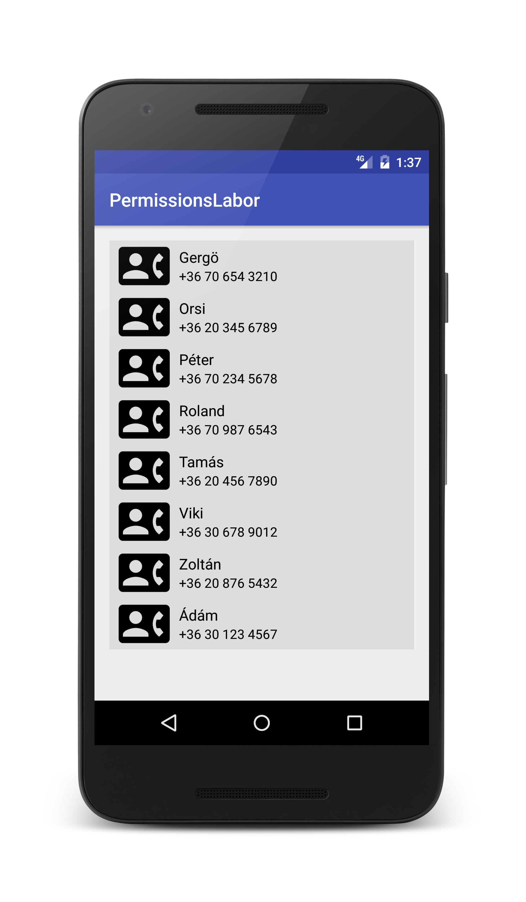

# Labor 11 - Futásidejű engedélyek

## Bevezető

Android 6.0 (API level 23) verziótól kezdve a felhasználó futásidőben adhatja meg az alkalmazás engedélyeit, és nem az alkalmazás telepítésekor vagy frissítésekor. Dönthet úgy, hogy bizonyos engedélyeket nem ad meg egy alkalmazásnak, így nagyobb fokú irányítás kerül a kezébe. Az alkalmazásengedélyeket később bármikor módosíthatja az alkalmazásbeállítások képernyőn.

Az engedélyek két kategóriába vannak sorolva: normal/dangerous.
A **normal** kategóriába tartozó engedélyek nem jelentenek közvetlen kockázatot a felhasználó érzékeny adataira, ezeket az engedélyeket a rendszer automatikusan megadja.

A **veszélyes** kategóriába tartozó engedélyek lehetőséget adhatnak az alkalmazásnak, hogy a felhasználó érzékeny adataihoz hozzáférjen. Ebben az esetben a felhasználónak kell megadni az engedélyt az alkalmazás számára.

https://developer.android.com/guide/topics/security/permissions.html#normal-dangerous

Minden esetben meg kell adni a normal és a dangerous engedélyeket a manifest fájlban, de ennek hatása eltér a rendszer verziójától és a target sdk szinttől függően:

Ha az eszköz Android 5.1 vagy alacsonyabb verziót futtat, **VAGY** az alkalmazás target SDK szintje 22 vagy kisebb, akkor a rendszer telepítéskor kéri el az összes engedélyt, és ha a felhasználó nem fogadja el, akkor a telepítés leáll.

Ha az eszköz Android 6.0 verzióval rendelkezik **ÉS** az alkalmazás target SDK szintje 23 vagy nagyobb, akkor az alkalmazás a futása során fogja elkérni a dangerous kategóriába tartozó engedélyeket, a normal engedélyeket pedig a rendszer automatikusan megadja. A felhasználó bármely engedélyt megadhat, vagy letilthat, emiatt az alkalmazás limitált funkcionalitással futhat tovább, melyet megfelelően kell kezelni.

## Jogosultság ellenőrzése
Amennyiben az alkalmazás funkciójának egy veszélyes engedélyre van szüksége, akkor minden esetben ellenőrízni kell még a funkció indítása előtt, hogy rendelkezik-e az engedéllyel, hiszen az engedélyeket a felhasználó bármikor módosíthatja.
**ContextCompat.checkSelfPermission()**

## Jogosultság elkérése
Az Android rendszer számos metódust biztosít egy jogosultság elkérésére. Ezeket meghívva egy nem testreszabható dialógust dob fel a rendszer.
**ActivityCompat.requestPermissions()**

## Jogosultság magyarázata
Egyes esetekben szükséges lehet a felhasználót tájékoztatni, hogy miért kér az alkalmazás veszélyes engedélyeket.
**ActivityCompat.shouldShowRequestPermissionRationale()**

## Kezdő lépések

A labor során egy egyszerű telefonkönyv alkalmazást kell elkészíteni. Az alkalmazás listázni tudja a telefonon tárolt névjegyeket, majd egy adott elemre kattintva hívást lehet kezdeményezni.

Hozzunk létre egy új Android Studio Projektet **PermissionsLabor** néven. A Company Domain mező tartalmát töröljük ki és hagyjuk is üresen.

A packagename legyen **hu.bme.aut.amorg.examples.permissionslabor** A támogatott céleszközök a **Telefon és Tablet**, valamint a minimum SDK szint az **API15: Android 4.0.3**

A kezdő projekthez adjuk hozzá egy **Empty Activity**-t, melynek neve legyen **ContactsActivity**.

Vegyük fel a RecyclerView komponens függőségét, illetve állítsuk a targetSDK-t 23 vagy nagyobbra a **build.graddle(module:app)** fájlban, majd nyomjuk meg a **Sync Now** gombot. Amennyiben nincs 23, vagy magasabb SDK telepítve a gépre, akkor frissítsük az SDK Manager segítségével a szükséges komponenseket.


```java
dependencies {
...
implementation 'com.android.support:recyclerview-v7:26.1.0'
...
}
```

## Felhasználói felület

Első lépésként készítsük el az alkalmazás felhasználói felületét XML erőforrásból. A felület egyetlen RecyclerView komponensből fog állni, mely az eszközön tárolt névjegyeket fogja megjeleníteni. Hozzuk létre a hiányzó dimen erőforrásokat is **16dp** értékkel.

```xml
<?xml version="1.0" encoding="utf-8"?>
<RelativeLayout xmlns:android="http://schemas.android.com/apk/res/android"
    xmlns:tools="http://schemas.android.com/tools"
    android:id="@+id/activity_contacts"
    android:layout_width="match_parent"
    android:layout_height="match_parent"
    android:paddingBottom="@dimen/activity_vertical_margin"
    android:paddingLeft="@dimen/activity_horizontal_margin"
    android:paddingRight="@dimen/activity_horizontal_margin"
    android:paddingTop="@dimen/activity_vertical_margin"
    tools:context="hu.bme.aut.amorg.examples.permissionslabor.ContactsActivity">

    <android.support.v7.widget.RecyclerView
        android:id="@+id/contactsRV"
        android:layout_width="match_parent"
        android:layout_height="match_parent" />
</RelativeLayout>
```

A ContactsActivity-ben szerezzünk referenciát a RecyclerView-ra, és emeljük ki mezőbe.

```java
private RecyclerView contactsRV;
```

onCreate() metódusba:
```java
contactsRV = findViewById(R.id.contactsRV);
```

## Model

Készítsük el a Contact osztályt, mely az eszközön található névjegyeket fogja reprezentálni. Az egyszerűség kedvéért most csak a név és telefonszám adatokat tároljuk el benne.

```java
public class Contact {
    private String contactName;
    private String contactNumber;

    public String getContactName() {
        return contactName;
    }

    public void setContactName(String contactName) {
        this.contactName = contactName;
    }

    public String getContactNumber() {
        return contactNumber;
    }

    public void setContactNumber(String contactNumber) {
        this.contactNumber = contactNumber;
    }
}
```

## Adapter

Készítsük el a listát feltöltő adaptert **ContactsAdapter** néven, **adapter** nevű csomagba.

```java
public class ContactsAdapter extends RecyclerView.Adapter<ContactsAdapter.ContactViewHolder> {
    
    private List<Contact> contactList;
    private Context mContext;

    public ContactsAdapter(List<Contact> contactList, Context mContext) {
        this.contactList = contactList;
        this.mContext = mContext;
    }

    @Override
    public ContactViewHolder onCreateViewHolder(ViewGroup parent, int viewType) {
        View view = LayoutInflater.from(mContext).inflate(R.layout.contact_item, null);
        ContactViewHolder contactViewHolder = new ContactViewHolder(view);
        return contactViewHolder;
    }

    @Override
    public void onBindViewHolder(final ContactViewHolder holder, int position) {
        Contact contact = contactList.get(position);
        holder.tvContactName.setText(contact.getContactName());
        holder.tvPhoneNumber.setText(contact.getContactNumber());
    }


    @Override
    public int getItemCount() {
        return contactList.size();
    }

    public static class ContactViewHolder extends RecyclerView.ViewHolder {
        View container;
        ImageView ivContactImage;
        TextView tvContactName;
        TextView tvPhoneNumber;

        public ContactViewHolder(View itemView) {
            super(itemView);
            container = itemView.findViewById(R.id.container);
            ivContactImage = itemView.findViewById(R.id.ivContactImage);
            tvContactName = itemView.findViewById(R.id.tvContactName);
            tvPhoneNumber = itemView.findViewById(R.id.tvPhoneNumber);
        }
    }
}
```

Az adapter az **onCreateViewHolder()** metódusában hivatkozik a listaelem felületleírójára, hozzuk létre a hiányzó **contact_item** xml erőforrást:

```xml
<?xml version="1.0" encoding="utf-8"?>
<RelativeLayout xmlns:android="http://schemas.android.com/apk/res/android"
    android:id="@+id/container"
    android:layout_width="match_parent"
    android:layout_height="wrap_content"
    android:orientation="horizontal"
    android:background="#dddddd">

    <LinearLayout
        android:layout_width="match_parent"
        android:layout_height="wrap_content">

        <ImageView
            android:id="@+id/ivContactImage"
            android:layout_width="55dp"
            android:layout_height="55dp"
            android:layout_marginLeft="10dp"
            android:layout_marginStart="10dp"
            android:src="@drawable/contact_mail"/>

        <LinearLayout
            android:layout_width="match_parent"
            android:layout_height="match_parent"
            android:orientation="vertical"
            android:gravity="center_vertical">

            <TextView
                android:id="@+id/tvContactName"
                android:layout_width="match_parent"
                android:layout_height="wrap_content"
                android:layout_marginLeft="10dp"
                android:layout_marginStart="10dp"
                android:textSize="16sp"
                android:textColor="@android:color/primary_text_light"
                android:text="@string/name"/>

            <TextView
                android:id="@+id/tvPhoneNumber"
                android:layout_width="match_parent"
                android:layout_height="wrap_content"
                android:layout_marginLeft="10dp"
                android:layout_marginStart="10dp"
                android:textSize="14sp"
                android:textColor="@android:color/primary_text_light"
                android:text="@string/phone"/>
        </LinearLayout>
    </LinearLayout>
</RelativeLayout>
```

Adjuk hozzá a két hiányzó szöveges erőforrást, és másoljuk be a drawables mappába a hiányzó képet!

strings.xml-be:

```xml
<string name="name">Name</string>
<string name="phone">Phone</string>
```

A hiányzó ikont töltsük le a [https://materialdesignicons.com/](https://materialdesignicons.com/) -ról, keressük a **contact-mail** icon-t, és ezt drawable XML-ként töltsük le a res/drawable mappába.

A névjegyek megjelenítéséhez az utolsó lépés az adapter pélányosítása, és beállítása a recyclerview komponenshez. Szükség van az eszközön tárolt névjegyek megszerzésére, ehhez adjuk hozzá a **ContactsActivity**-be az alábbi metódust:

```java
private List<Contact> getAllContacts() {
    List<Contact> contactList = new ArrayList();
    ContentResolver contentResolver = getContentResolver();
    Cursor cursor = contentResolver.query(ContactsContract.Contacts.CONTENT_URI, null, null, null, ContactsContract.CommonDataKinds.Phone.DISPLAY_NAME + " ASC");
    if (cursor.getCount() > 0) {
        while (cursor.moveToNext()) {
            int hasPhoneNumber = Integer.parseInt(cursor.getString(cursor.getColumnIndex(ContactsContract.Contacts.HAS_PHONE_NUMBER)));
            if (hasPhoneNumber > 0) {
                String id = cursor.getString(cursor.getColumnIndex(ContactsContract.Contacts._ID));
                String name = cursor.getString(cursor.getColumnIndex(ContactsContract.Contacts.DISPLAY_NAME));

                Contact contact = new Contact();
                contact.setContactName(name);

                Cursor phoneCursor = contentResolver.query(
                        ContactsContract.CommonDataKinds.Phone.CONTENT_URI,
                        null,
                        ContactsContract.CommonDataKinds.Phone.CONTACT_ID + " = ?",
                        new String[]{id},
                        null);
                if (phoneCursor.moveToNext()) {
                    String phoneNumber = phoneCursor.getString(phoneCursor.getColumnIndex(ContactsContract.CommonDataKinds.Phone.NUMBER));
                    contact.setContactNumber(phoneNumber);
                }
                phoneCursor.close();
                contactList.add(contact);
            }
        }
    }
    return contactList;
}
```

Ez után a kapott névjegylistával példányosítsuk az adaptert, és állítsuk be a RecyclerView komponenshez.
**ContactsActivity** **onCreate()** metódusába:

```java
ContactsAdapter contactsAdapter = new ContactsAdapter(getAllContacts(), this);
contactsRV.setLayoutManager(new LinearLayoutManager(this));
contactsRV.setAdapter(contactsAdapter);
```

Névjegyek olvasásához szükséges engedély a manifest-be:

```xml
<uses-permission android:name="android.permission.READ_CONTACTS" />
```

## Teszt

Egyelőre semmilyen jogosulságkezelést nem valósítottunk meg a kódban, ezért az alkalmazás pillanatnyi állapotának kipróbálásához Android 6.0 előtti verzióra van szükség, különben hibát kapunk az indulás során.

Próbáljuk ki az alkalmazást 6.0/API 23 előtti verzióval rendelkező eszközön!
Amennyiben az eszközön nincsenek névjegyek, adjunk hozzá legalább egyet telefonszámmal ellátva.



Android 6.0 vagy magasabb verzión futtatva az alkalmazást hibát kapunk, hiszen a névjegyek beolvasásához szükséges engedély a veszélyes kategóriába tartozik, ezért ezt külön kell kezelni a kódban. (6.0 felett ÉS target SDK 23+ esetén)

A hiba:

```java
java.lang.SecurityException: Permission Denial: 
opening provider com.android.providers.contacts.ContactsProvider2
from ProcessRecord{b077ff821678:
hu.bme.aut.amorg.examples.permissionslabor/u0a264} 
(pid=21678, uid=10264) requires android.permission.READ_CONTACTS or
android.permission.WRITE_CONTACTS
```

## Jogosultságkezelés

Módosítsuk az alkalmazást úgy, hogy futási időben kérje el a felhasználótól a manifestben deklarált veszélyes engedélyt! Ehhez a bevezetőben ismertetett metódusok lesznek segítségünkre.

Emeljük ki a ContactsActivity onCreate() metódusában található alábbi 3 sor kódot egy metódusba, melynek a neve legyen loadContacts()!
Ezt legegyszerűbben a kiemelni kívánt kód kijelölésével, majd CTRL+ALT+M billentyűkombinációval tudjuk megtenni Android Studioban.

```java
private void loadContacts() {
    ContactsAdapter contactsAdapter = new ContactsAdapter(getAllContacts(), this);
    contactsRV.setLayoutManager(new LinearLayoutManager(this));
    contactsRV.setAdapter(contactsAdapter);
}
```

onCreate():

```java
@Override
protected void onCreate(Bundle savedInstanceState) {
    super.onCreate(savedInstanceState);
    setContentView(R.layout.activity_contacts);
    contactsRV = findViewById(R.id.contactsRV);

    loadContacts();
}
```

Ahelyett hogy az **onCreate()**-ben azonnal meghívnánk a **loadContacts()** függvényt, kérjünk a felhasználótól engedélyt a névjegyek olvasására!

Adjuk hozzá az alábbi metódust a ContactsActivityhez!

```java
private void handleReadContactsPermission() {
    if (ContextCompat.checkSelfPermission(this,
            Manifest.permission.READ_CONTACTS) != PackageManager.PERMISSION_GRANTED) {
        // Should we show an explanation?
        if (ActivityCompat.shouldShowRequestPermissionRationale(this, Manifest.permission.READ_CONTACTS)) {

            // Show an explanation to the user *asynchronously* -- don't block
            // this thread waiting for the user's response! After the user
            // sees the explanation, try again to request the permission.
            AlertDialog.Builder alertDialogBuilder = new AlertDialog.Builder(this);
            alertDialogBuilder.setTitle(R.string.dialogTitle);
            alertDialogBuilder
                    .setMessage(R.string.explanation)
                    .setCancelable(false)
                    .setNegativeButton(R.string.exit, new DialogInterface.OnClickListener() {
                        public void onClick(DialogInterface dialog, int id) {
                            ContactsActivity.this.finish();
                        }
                    })
                    .setPositiveButton(R.string.forward, new DialogInterface.OnClickListener() {
                        public void onClick(DialogInterface dialog, int id) {
                            dialog.cancel();
                            ActivityCompat.requestPermissions(ContactsActivity.this,
                                    new String[]{Manifest.permission.READ_CONTACTS},
                                    MY_PERMISSIONS_REQUEST_READ_CONTACTS);
                        }
                    });
            AlertDialog alertDialog = alertDialogBuilder.create();
            alertDialog.show();
        } else {
            // No explanation needed, we can request the permission.
            ActivityCompat.requestPermissions(this,
                    new String[]{Manifest.permission.READ_CONTACTS},
                    MY_PERMISSIONS_REQUEST_READ_CONTACTS);
        }
    } else {
        loadContacts();
    }
}
```

A `MY_PERMISSIONS_REQUEST_READ_CONTACTS` egy általunk definiálandó requestCode. Amikor engedélyt kérünk, meg kell adni mellé egy requestCode-ot is, és amikor az operációs rendszer visszatér a **onRequestPermissionsResult()** metódusban, akkor ez alapján tudjuk kezelni, hogy éppen melyik engedélykérésre érkezett válasz.

Bármilyen érték adható neki, jelen esetben legyen 100.

```java
private static final int MY_PERMISSIONS_REQUEST_READ_CONTACTS = 100;
```

**strings.xml**-be:

```xml
<string name="dialogTitle">Figyelem!</string>
<string name="explanation">Az alkalmazásnak szüksége van az engedélyre a névjegyek beolvasásához!</string>
<string name="exit">Kilépés</string>
<string name="forward">Tovább</string>
```

A **handleReadContactsPermission()** metódus megvizsgálja a **checkSelfPermission()** segítségével, hogy az alkalmazás rendelkezik-e már a `READ_CONTACTS` engedéllyel. Ha igen, akkor meghívja a **loadContacts()** metódust, és a névjegyek betöltődnek. Ellenkező esetben nézzük meg, hogy a felhasználót kell-e tájékoztatni az engedélykérés létjogosultságáról (*shouldShowRequestPermissionRationale()*). Ez a metódus akkor tér vissza true értékkel, ha korábban a felhasználó megtagadta az engedélyt az alkalmazástól. (Például mert nem gondolta, hogy az adott funkcióhoz feltétlenül szükséges az engedély.) Ilyenkor érdemes egy magyarázatot adni, melyben leírjuk, hogy miért van feltétlen szükség az engedélyre. (Legyünk tömörek, a hosszú magyarázatokat nem fogja a felhasználó elolvasni, inkább letörli az alkalmazást...) A magyarázat jelen esetben egy dialógus, mely rövid leírást ad az engedély szükségességéről.
Amennyiben nincs szükség magyarázatra, vagy a magyarázat dialógusablakában a Tovább gombra nyomott a felhasználó, akkor kérjük el az engedélyt (*requestPermissions()*).

Cseréljük ki az activity **onCreate()**-ben található **loadContacts()**
metódust az újonnan létrehozottra (**handleReadContactsPermission();**)!

Kezeljük le az engedélykérés válaszát (**onRequestPermissionsResult()**) is az alábbi kóddal:

```java
@Override
public void onRequestPermissionsResult(int requestCode,
                                       String permissions[], int[] grantResults) {
    switch (requestCode) {
        case MY_PERMISSIONS_REQUEST_READ_CONTACTS: {
            // If request is cancelled, the result arrays are empty.
            if (grantResults.length > 0
                    && grantResults[0] == PackageManager.PERMISSION_GRANTED) {
                // permission was granted, yay! Do the
                // contacts-related task you need to do.
                loadContacts();
            } else {
                // permission denied! Disable the
                // functionality that depends on this permission.
            }
            return;
        }
    }
}
```

Amennyiben az engedélyt az alkalmazás megkapta, a névjegyek a loadContacts() segítségével betöltésre kerülnek.

Próbáljuk ki az alkalmazást 6.0+/API level 23+ eszközön!
Figyeljük meg a magyarázódialógust abban az esetben, ha megtagadjuk az engedélyt, majd újraindítjuk az alkalmazást!

## Telefonszám hívása

Ahhoz, hogy alkalmazásunk hívásokat indíthasson, fel kell venni a következő engedélyt a manifest fájlba:

```xml
<uses-permission android:name="android.permission.CALL_PHONE" />
```

Magától értetődő, hogy ez az engedély is a veszélyes kategóriába tartozik, ezért ezt is megfelelően kell kezelnünk.
Bővítsük a funkcionalitást olyan módon, hogy egy adott névjegy elemre kattintva hívást indítson az eszköz a névjegyen szereplő telefonszámra!

Másoljuk az alábbi két metódust a **ContactsAdapterbe**!

```java
private String lastPhoneNumber;

private void handleCallPhonePermission(View view, String phoneNumber) {
    this.lastPhoneNumber=phoneNumber;
    if (ActivityCompat.checkSelfPermission(view.getContext(), Manifest.permission.CALL_PHONE) != PackageManager.PERMISSION_GRANTED) {
        // Should we show an explanation?
        if (ActivityCompat.shouldShowRequestPermissionRationale((Activity) mContext,
                Manifest.permission.CALL_PHONE)) {
            // Show an explanation to the user *asynchronously* -- don't block
            // this thread waiting for the user's response! After the user
            // sees the explanation, try again to request the permission.
            AlertDialog.Builder alertDialogBuilder = new AlertDialog.Builder(mContext);
            alertDialogBuilder.setTitle(R.string.dialogTitle);
            alertDialogBuilder
                    .setMessage(R.string.explanation2)
                    .setCancelable(false)
                    .setNegativeButton(R.string.exit, new DialogInterface.OnClickListener() {
                        public void onClick(DialogInterface dialog, int id) {
                            ((ContactsActivity) mContext).finish();
                        }
                    })
                    .setPositiveButton(R.string.forward, new DialogInterface.OnClickListener() {
                        public void onClick(DialogInterface dialog, int id) {
                            dialog.cancel();
                            ActivityCompat.requestPermissions((Activity) mContext,
                                    new String[]{Manifest.permission.CALL_PHONE},
                                    MY_PERMISSIONS_REQUEST_PHONE_CALL);
                        }
                    });
            AlertDialog alertDialog = alertDialogBuilder.create();
            alertDialog.show();
        } else {
            // No explanation needed, we can request the permission.
            ActivityCompat.requestPermissions((Activity) mContext,
                    new String[]{Manifest.permission.CALL_PHONE},
                    MY_PERMISSIONS_REQUEST_PHONE_CALL);
        }
    } else {
        callPhoneNumber(phoneNumber);
    }
}

private void callPhoneNumber(String phoneNumber) {
    Intent callIntent = new Intent(Intent.ACTION_CALL);
    callIntent.setData(Uri.parse("tel:" + phoneNumber));
    mContext.startActivity(callIntent);
}

public void callLastPhoneNumber() {
    callPhoneNumber(lastPhoneNumber);
}
```

strings.xml-be:

```xml
<string name="explanation2">A hívás indításához engedélyre van szükség!</string>
```

A callPhoneNumber() fogja a hívást indítani, a handleCallPhonePermission() pedig az engedélykérést kezeli a korábbival megegyező módon.
Itt is szükség van egy requestCode-ra, hozzuk létre public láthatósággal a korábban létrehozott requestCode-tól eltérő értékkel.

```java
public static final int MY_PERMISSIONS_REQUEST_PHONE_CALL = 101;
```

Az engedélykérés válaszát ebben az esetben is a **ContactsActivity** fogja kezelni, ezért helyezzük el az alábbi ágat az onRequestPermissionsResult() metódusba!

```java
case ContactsAdapter.MY_PERMISSIONS_REQUEST_PHONE_CALL: {
    if (grantResults.length > 0
            && grantResults[0] == PackageManager.PERMISSION_GRANTED) {
        ((ContactsAdapter)contactsRV.getAdapter()).callLastPhoneNumber();
    }
    return;
}
```

strings.xml-be:

```xml
<string name="phoneCallPermissionResultSuccess">Engedély elfogadva, kérem érintse meg újra a névjegyet a híváshoz!</string>
```

A hívás kezeléséhez szükséges kód hozzáadásra került, nincs más hátra mint használni. Ehhez adjunk eseménykezelőt a névjegyekhez, mellyel elindítjuk az imént létrehozott hívás engedély kezelést!

ContactsAdapter onBindViewHolder() végére:

```java
holder.container.setOnClickListener(new View.OnClickListener() {
    @Override
    public void onClick(View view) {
        handleCallPhonePermission(view, holder.tvPhoneNumber.getText().toString());
    }
});
```

Teszteljük a hívás funkcionalitást 6.0+/API level 23+ eszközön!

## Önálló feladatok

### Feladat:  Valósítsa meg az SMS küldés funkcionalitást!

Például hosszú érintés eseménykezelő segítségével. 
A szükséges engedély:

```xml
<uses-permission android:name="android.permission.SEND_SMS"/>
```
