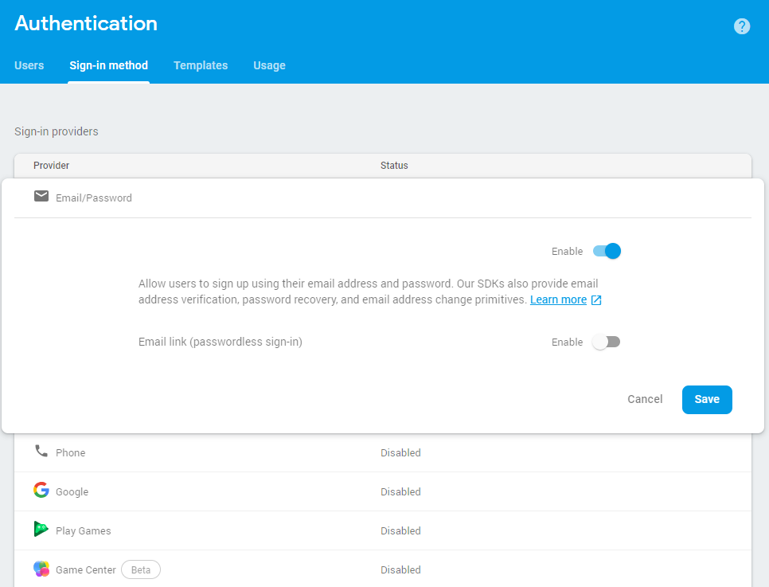
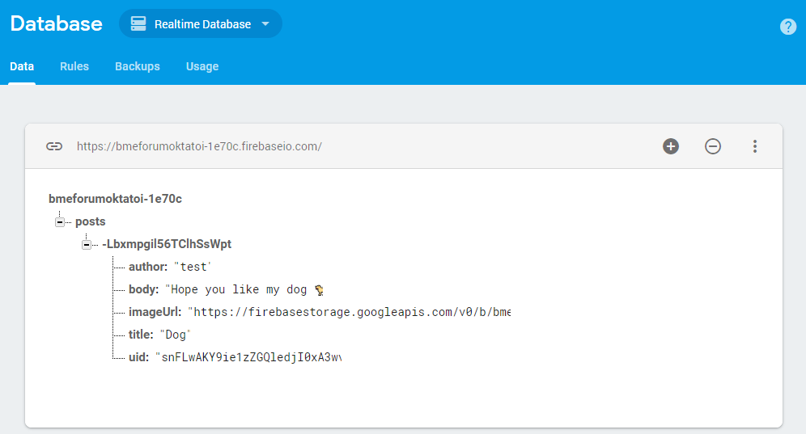
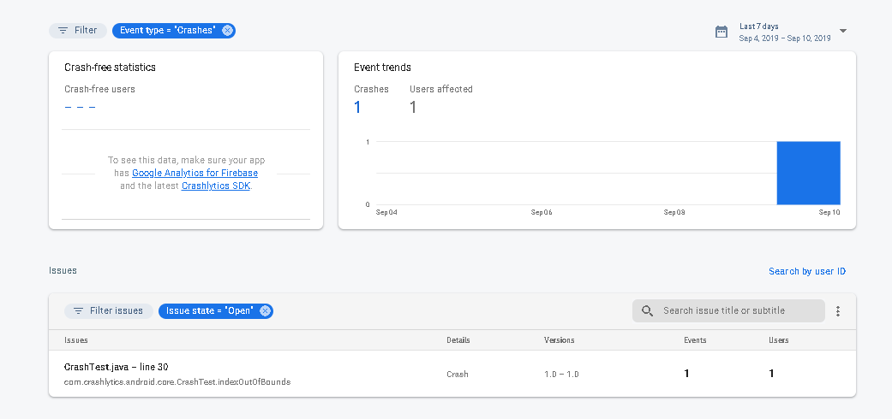

# Labor 12 - Firebase

## Bevezető

A labor során egy fórum alkalmazás kerül megvalósításra a Firebase Backend as a Service (BaaS) felhasználásával. A feladat célja, hogy szemléltesse, hogyan lehet közös backendet használó alkalmazást fejleszteni saját backend kód fejlesztése nélkül.

A Firebase manapság az egyik legnépszerűbb Backend as a Service megoldás Android, iOS és web kliensek támogatásával, mely számos szolgáltatást biztosít, mint például:
- real-time adatbáziskezelés
- storage
- authentikáció
- push értesítések
- analytics
- crash reporting

További általános információk a Firebase-ről: https://firebase.google.com/.

A laborfogalkozás célja, hogy bemutassa a Firebase legfontosabb szolgáltatásait egy komplett alkalmazás megvalósítása keretében. A megvalósítandó alkalmazás egy fórum megoldás lesz, melyen keresztül a felhasználók szöveges üzeneteket tudnak megosztani egymással valós időben, melyekhez opcionálisan képek is csatolhatók.
Az alkalmazás az alábbi fő funkciókat támogatja:
- regisztráció, bejelentkezés
- üzenetek listázása
- üzenet írás
- képek csatolása üzenetekhez
- üzenetek megjelenítése valós időben
- crash reporting
- analitika

A labor során nagyobb kódrészek kerülnek megírásra, ami miatt elnézést kérünk, de ez szükséges ahhoz, hogy egy hello-word jellegű alkalmazásnál többet tudjunk átadni a tárgy keretében. **Az anyag részletes megértéséhez javasoljuk, hogy figyelje a laborvezető utasításait és labor után is 10-20 percet szánjon a kódrészek megértésére.**

*Az útmutatóban levő példa kódok esetében a szöveges elemeket nem tettük strings.xml-be a könnyebb olvashatóság érdekében, de éles projektekben ezeket természetesen mindig ki kell szervezni erőforrásba.*

## Projekt előkészítése, konfiguráció

Első lépésként létre kell hozni egy Firebase projektet a Firebase admin felületén (Firebase console), majd egy Android Studio projektet és össze kell kötni az Android projektet a Firebase-ben létrehozott projekttel:
- Navigáljunk a Firebase console felületére: https://console.firebase.google.com/.
- Jelentkezzünk be jobb felül.
- Hozzunk létre egy új projektet az *Add project* elemet választva középen.
- A projekt neve legyen *BMEForumNEPTUN_KOD*, ahol a `NEPTUN_KOD` helyére a hallgato neptun kódját helyettesítsük. 
- A Country pedig *Hungary*.

>A neptun kódra azért van szükség, mert ugyanazon laborgép kulcsával ugyanolyan nevü projektet nem hozhatunk létre többször, és több labor csoport lévén ebből probléma adódhatna. Ugyanerre lesz majd szükség a package név esetén is.

Sikeres projekt létrehozás után fussák át a laborvezetővel közösen a Firebase console felületét az alábbi elemekre kitérve:
- Authentication, Database és Storage,
- Database>Rules.

Hozzunk létre egy új projektet Android Studio-ban,a package name legyen **hu.bme.aut.amorg.examples.firebaseNEPTUN_KOD**. Fontos hogy a neptun kód előtt ne legyen pont, mert ez gondot okozhat.

Válasszuk az *Empty Activity* sablont és a kezdő Activity-nk neve legyen *LoginActivity*, mivel elsőként a regisztrációs és bejelentkező nézetet fogjuk megvalósítani. Az egyszerűség kedvéért ugyanazt a felületet fogjuk használni regisztráció és bejelentkezés céljából.

Adjuk hozzá a Manifest file-hoz az Internet használati engedélyt:
```xml
<uses-permission android:name="android.permission.INTERNET" />

```

A projekt létrehozása után válasszuk Android Studioba a **Tools->Firebase** menüpontot, melynek hatására jobb oldalt megnyílik a *Firebase Assistant* funkció.

Amennyiben ilyen menüpont nem található a Studioban, telepíteni kell a plugint a *File->Settings->Plugins* alatt (Firebase Services).

A Firebase Assistant akkor fogja megtalálni a Firebase console-ba létrehozott projektet, ha Android Studio-ba is ugyanazzal az accounttal vagyunk bejelentkezve mint amivel a console-ban létrehoztuk a projektet. Ellenőrizzük ezt mindkét helyen.
Amennyiben a Firebase Assistant-ot nem sikerül beüzemelni, manuálisan is összeköthető a projekt. A leírásban ismertetni fogjuk a lépéseket, amit az Assistant generál.

Válasszuk az Assistant-ban az *Authentication* szakaszt és azon belül az "Email and password authentication"-t, majd a *Connect to Firebase* gombot.
Ezt követően egy dialógus nyílik meg, ahol a második szakaszt választva kiválaszthatjuk a projektet amit a Firebase console-ban létrehoztunk, ha megfelelőek az accountok. Itt egyébként lehetőség van új projektet is létrehozni.

A háttérben valójában annyi történik, hogy az alkalmazásunk package neve és az aláíró kulcs *SHA-1*-e alapján létrejön egy Android projekt a Firebase console-ba és az ahhoz tartozó konfigurációs *google-services.json* file letöltődik a projektünk könyvtárába az alapértelmezett (app) modul alá.
Ezt a lépéssorozatot manuálisan is végrehajthatjuk a Firebase console-ban az "Add another app"-ot választva. A debug kulcs SHA-1 lenyomata a gradle->[projektnév]->Tasks->android->signingReport taskot futtatva kinyerhető alul az execution/text módot választva.


Következő lépésben szintén az Assistant-ban az "Email and password authentication" alatt válasszuk az "Add Firebase Authentication to your app" elemet, itt látható is, hogy milyen módosítások történnek a projekt és modul szintű build.gradle fileokban.


Vegyük fel függőségként a Firebase authentikációs könyvtárát:

```gradle
implementation 'com.google.firebase:firebase-auth:12.0.1'
```

Ahhoz, hogy az e-mail alapú regisztráció és authentikáció megfelelően működjön, a Firebase console-ban, az Authentication->Sign-in method-ban az *Email/Password* provider-t engedélyezni kell.



Végezetül a Studioban vegyük fel a modulhoz tartozó build.gradle-be az alábbi függőségeket még; tekintsük át a laborvezetővel ezeket:
```gradle
implementation 'com.android.support:design:26.1.0'
implementation 'com.android.support:cardview-v7:26.1.0'
implementation 'com.jakewharton:butterknife:8.8.1'
annotationProcessor 'com.jakewharton:butterknife-compiler:8.8.1'
implementation 'com.flaviofaria:kenburnsview:1.0.7'
implementation 'com.github.bumptech.glide:glide:4.6.1'
implementation 'com.google.firebase:firebase-database:12.0.1'
```

## Regisztráció, bejelentkezés

Első lépésként valósítsuk meg a regisztráció/bejelentkező képernyő felületét. Mivel ehhez hasonló felületeket már készítettünk korábban egyszerűség kedvéért megadjuk a felület kódját, melyet helyezzen az *activity_login.xml*-be:

```xml
<?xml version="1.0" encoding="utf-8"?>
<ScrollView
    xmlns:android="http://schemas.android.com/apk/res/android"
    xmlns:app="http://schemas.android.com/apk/res-auto"
    android:layout_width="match_parent"
    android:layout_height="match_parent"
    android:fitsSystemWindows="true">

    <LinearLayout
        android:orientation="vertical"
        android:layout_width="match_parent"
        android:layout_height="wrap_content"
        android:paddingTop="56dp"
        android:paddingLeft="24dp"
        android:paddingRight="24dp">

        <ImageView android:src="@mipmap/ic_launcher"
            android:layout_width="wrap_content"
            android:layout_height="72dp"
            android:layout_marginBottom="24dp"
            android:layout_gravity="center_horizontal" />

        <android.support.design.widget.TextInputLayout
            android:layout_width="match_parent"
            android:layout_height="wrap_content"
            android:layout_marginTop="8dp"
            android:layout_marginBottom="8dp">
            <EditText android:id="@+id/etEmail"
                android:layout_width="match_parent"
                android:layout_height="wrap_content"
                android:inputType="textEmailAddress"
                android:text=""
                android:hint="Email" />
        </android.support.design.widget.TextInputLayout>

        <android.support.design.widget.TextInputLayout
            android:layout_width="match_parent"
            android:layout_height="wrap_content"
            android:layout_marginTop="8dp"
            android:layout_marginBottom="8dp"
            app:passwordToggleEnabled="true">
            <EditText android:id="@+id/etPassword"
                android:layout_width="match_parent"
                android:layout_height="wrap_content"
                android:inputType="textPassword"
                android:text=""
                android:hint="Password"/>
        </android.support.design.widget.TextInputLayout>

        <Button
            android:id="@+id/btnLogin"
            android:layout_width="match_parent"
            android:layout_height="wrap_content"
            android:layout_marginTop="24dp"
            android:layout_marginBottom="12dp"
            android:padding="12dp"
            android:text="Login"/>

        <Button
            android:id="@+id/btnRegister"
            android:layout_width="match_parent"
            android:layout_height="wrap_content"
            android:padding="12dp"
            android:text="Register"/>

    </LinearLayout>
</ScrollView>
```

Tekintsük át a felhasználói felület kódját. Figyeljük meg, hogy, hogy a jelszó mezőhöz tartozó TextInputLayout *app:passwordToggleEnabled="true"* beállítás hatására a mező mellett egy kis ikon segítségével láthatóvá tehetjük az alkalmazásban a jelszót.


Az alkalmazás során több Activity-nk lesz, melyek közös funkcióit, mint például progress dialog megjelenítést és felhasználói adatok lekérdezését szervezzük ki egy *BaseActivity* osztályba (ez csak egy külön osztály, nem kell a Manifestbe regisztrálni):

```java
public class BaseActivity extends AppCompatActivity {

    private ProgressDialog progressDialog;

    public void showProgressDialog() {
        if (progressDialog == null) {
            progressDialog = new ProgressDialog(this);
            //progressDialog.setCancelable(false);
            progressDialog.setMessage("Loading...");
        }

        progressDialog.show();
    }

    public void hideProgressDialog() {
        if (progressDialog != null && progressDialog.isShowing()) {
            progressDialog.dismiss();
        }
    }

    public String getUid() {
        return FirebaseAuth.getInstance().getCurrentUser().getUid();
    }

    public String getUserName() {
        return FirebaseAuth.getInstance().getCurrentUser().getDisplayName();
    }

    public String getUserEmail() {
        return FirebaseAuth.getInstance().getCurrentUser().getEmail();
    }
}
```

Származtassuk a meglevő *LoginActivity*-t a *BaseActivity*-ből, majd vegyük fel a kezdő tagváltozókat és végezzük el a megfelelő inicializálásokat az *onCreate(...)*-ben:

```java
@BindView(R.id.etEmail)
EditText etEmail;
@BindView(R.id.etPassword)
EditText etPassword;
private ProgressDialog progressDialog;
private FirebaseAuth firebaseAuth;

@Override
protected void onCreate(Bundle savedInstanceState) {
    super.onCreate(savedInstanceState);
    setContentView(R.layout.activity_login);
    firebaseAuth = FirebaseAuth.getInstance();
    ButterKnife.bind(this);
}
```

A Firebase authentikációért a *firebaseAuth* objektum lesz a felelős.

Adjunk a *LoginActivity*-hez két segédfüggvényt, melyek a nézet validációjáért, valamint a felhasználónév e-mail címből való kivágásáért felelősek:

```java
private boolean isFormValid() {
    if (TextUtils.isEmpty(etEmail.getText().toString())) {
        etEmail.setError("Required");
        return false;
    }

    if (TextUtils.isEmpty(etPassword.getText().toString())) {
        etPassword.setError("Required");
        return false;
    }

    return true;
}

private String userNameFromEmail(String email) {
    if (email.contains("@")) {
        return email.split("@")[0];
    } else {
        return email;
    }
}
```

Ezt kővetően valósítsuk meg a regisztráció gomb eseménykezelőjét. Figyeljük meg, hogyan történik a form validációja, a progress dialógus megjelenítése, valamint aszinkron módon a válasz és az esetleges hiba kezelése (éles projektben hibajelzésre a *Toast*-ot nem javasoljuk (mivel nem feltűnő), helyette egy speciális dialógus vagy egyéb hibakezelés javasolt).

```java
@OnClick(R.id.btnRegister)
public void registerClick() {
    if (!isFormValid()) {
        return;
    }

    showProgressDialog();

    firebaseAuth.createUserWithEmailAndPassword(
            etEmail.getText().toString(), etPassword.getText().toString()
    ).addOnCompleteListener(new OnCompleteListener<AuthResult>() {
        @Override
        public void onComplete(@NonNull Task<AuthResult> task) {
            hideProgressDialog();

            if (task.isSuccessful()) {
                FirebaseUser firebaseUser = task.getResult().getUser();
                firebaseUser.updateProfile(
                        new UserProfileChangeRequest.Builder().
                                setDisplayName(
                                        userNameFromEmail(
                                          firebaseUser.getEmail())).build()
                );

                Toast.makeText(LoginActivity.this, "REG OK",
                        Toast.LENGTH_SHORT).show();
            } else {
                Toast.makeText(LoginActivity.this, "Failed: "+
                        task.getException().getLocalizedMessage(),
                        Toast.LENGTH_SHORT).show();
            }
        }
    }).addOnFailureListener(new OnFailureListener() {
        @Override
        public void onFailure(@NonNull Exception e) {
            hideProgressDialog();
            Toast.makeText(LoginActivity.this,
                    "error: "+e.getMessage(),
                    Toast.LENGTH_SHORT).show();
        }
    });
}
```

Végül valósítsuk meg a login eseménykezelőt (*PostsActivity*-nk még nincs, ezt hamarosan létrehozzuk, ezért az a sor hibás lesz):

```java
@OnClick(R.id.btnLogin)
void loginClick() {
    if (!isFormValid()) {
        return;
    }

    showProgressDialog();

    firebaseAuth.signInWithEmailAndPassword(
            etEmail.getText().toString(),
            etPassword.getText().toString()
    ).addOnCompleteListener(this, new OnCompleteListener<AuthResult>() {
        @Override
        public void onComplete(@NonNull Task<AuthResult> task) {

            hideProgressDialog();

            if (task.isSuccessful()) {
                startActivity(new Intent(LoginActivity.this,
                        PostsActivity.class));
                finish();

            } else {
                Toast.makeText(LoginActivity.this,
                        task.getException().getMessage(),
                        Toast.LENGTH_SHORT).show();
            }
        }
    });
}
```

A *Navigation Drawer Activity* sablont használva készítsük el az új *PostsActivity*-t, mely a *BaseActivity*-ből származzon le.

Próbáljuk ki az alkalmazás jelenlegi működését. Vizsgáljuk meg, hogy, Firebase console-ban látszik-e a regisztrált felhasználó.


## Postok listázása

Első lépésként tekintse át a laborvezetővel a PostsActivity kódját és a hozzá tartozó felhasználói felületet.
A PostsActivity feladata lesz a fórum üzenetek megjelenítése egy RecyclerView-ban. Az egyes üzenetek egy *CardView*-n kerülnek megjelenítésre. A lista valós időben fog frissülni, ha egy új üzenet került fel a Firebase-be.

Adjuk hozzá a projekthez a *Firebase Realtime Database* támogatást az Assistant-on keresztül. Figyeljünk rá, hogy a behozott függőség verzióját is írjuk át, ha emulátoron tesztelünk:
```gradle
implementation 'com.google.firebase:firebase-database:12.0.1'
```

Változtassuk meg a Navigation Drawer menüjét, hogy csak egy Logout menüelem szerepeljen rajta; a res/menu/activity_posts_drawer.xml:
```xml
<?xml version="1.0" encoding="utf-8"?>
<menu xmlns:android="http://schemas.android.com/apk/res/android">
    <item
        android:id="@+id/nav_logout"
        android:icon="@drawable/ic_menu_share"
        android:title="Logout" />
</menu>
```

A *PostsActivity* *onCreateOptionsMenu(...)* és *onOptionsItemSelected(...)* függvényei és a *menu/posts.xml* törölhetők.

A *NavigationDrawer* menü kezelő függvényében pedig csak a logout menüt kell kezelni:
```java
@Override
public boolean onNavigationItemSelected(MenuItem item) {
    // Handle navigation view item clicks here.
    int id = item.getItemId();

    if (id == R.id.nav_logout) {
        FirebaseAuth.getInstance().signOut();
        startActivity(new Intent(this, LoginActivity.class));
        finish();
    }

    DrawerLayout drawer = (DrawerLayout) findViewById(R.id.drawer_layout);
    drawer.closeDrawer(GravityCompat.START);
    return true;
}
```

Cseréljük le az *app_bar_posts.xml*-ben az *AppBarLayout*-ot az alábbira, amely az alkalmazás ikonját használva egy *KenBurns* effektet valósít meg (a kép tetszőlegesen lecserélhető).

```xml
<android.support.design.widget.AppBarLayout
    xmlns:android="http://schemas.android.com/apk/res/android"
	xmlns:app="http://schemas.android.com/apk/res-auto"
    android:layout_width="match_parent"
    android:layout_height="190dp"
    android:theme="@style/AppTheme.AppBarOverlay">

    <android.support.design.widget.CollapsingToolbarLayout
        android:id="@+id/collapsing_toolbar"
        android:layout_width="match_parent"
        android:layout_height="match_parent"
        android:fitsSystemWindows="true"
        app:contentScrim="?attr/colorPrimary"
        app:expandedTitleMarginBottom="32dp"
        app:expandedTitleMarginEnd="64dp"
        app:expandedTitleMarginStart="48dp"
        app:layout_scrollFlags="scroll|exitUntilCollapsed">

        <com.flaviofaria.kenburnsview.KenBurnsView
            android:id="@+id/header"
            android:layout_width="match_parent"
            android:layout_height="match_parent"
            android:src="@mipmap/ic_launcher"
            app:layout_collapseMode="parallax" />

        <android.support.v7.widget.Toolbar
            android:id="@+id/toolbar"
            android:layout_width="match_parent"
            android:layout_height="?attr/actionBarSize"
            app:layout_collapseMode="pin"
            app:popupTheme="@style/ThemeOverlay.AppCompat.Light" />
    </android.support.design.widget.CollapsingToolbarLayout>
</android.support.design.widget.AppBarLayout>
```

A *PostsActivity* központi felülete a *content_posts.xml*-ben található, melynek a tartalma legyen az alábbi:

```xml
<?xml version="1.0" encoding="utf-8"?>
<android.support.v7.widget.RecyclerView xmlns:android="http://schemas.android.com/apk/res/android"
    xmlns:app="http://schemas.android.com/apk/res-auto"
    android:id="@+id/recyclerViewPosts"
    app:layout_behavior="@string/appbar_scrolling_view_behavior"
    android:layout_width="match_parent"
    android:layout_height="match_parent" />
 ```

Próbáljuk ki a jelenlegi állapotot, ellenőrizzük a kijelentkezés funkciót.


A következő lépés a Post listázás megvalósítása. Ehhez először hozzunk létre egy *data* package-t és benne egy *Post* osztályt a következő tartalommal:
```java
public class Post {
    private String uid;
    private String author;
    private String title;
    private String body;
    private String imageUrl;

    public Post() {
    }

    public Post(String uid, String author, String title, String body) {
        this.uid = uid;
        this.author = author;
        this.title = title;
        this.body = body;
    }

    public String getUid() {
        return uid;
    }

    public void setUid(String uid) {
        this.uid = uid;
    }

    public String getAuthor() {
        return author;
    }

    public void setAuthor(String author) {
        this.author = author;
    }

    public String getTitle() {
        return title;
    }

    public void setTitle(String title) {
        this.title = title;
    }

    public String getBody() {
        return body;
    }

    public void setBody(String body) {
        this.body = body;
    }

    public String getImageUrl() {
        return imageUrl;
    }

    public void setImageUrl(String imageUrl) {
        this.imageUrl = imageUrl;
    }
}
```

Ez az osztály tárolja az üzenet szerzőjét, címét, tartalmát és a hozzá tartozó kép URL-jét opcionálisan.

Valósítsuk meg az egy Post-ot megjelenítő felületet card_post.xml néven a res/layout mappába:

```xml
<?xml version="1.0" encoding="utf-8"?>
<android.support.v7.widget.CardView xmlns:android="http://schemas.android.com/apk/res/android"
    xmlns:card_view="http://schemas.android.com/apk/res-auto"
    android:id="@+id/card_view"
    android:layout_width="match_parent"
    android:layout_height="wrap_content"
    android:layout_gravity="center"
    android:layout_margin="10dp"
    card_view:cardCornerRadius="4dp">

    <RelativeLayout
        android:layout_width="match_parent"
        android:layout_height="wrap_content"
        android:padding="10dp">

        <LinearLayout
            android:layout_width="wrap_content"
            android:layout_height="wrap_content"
            android:gravity="center_vertical"
            android:layout_alignParentLeft="true"
            android:layout_centerVertical="true"
            android:orientation="vertical">

            <TextView
                android:id="@+id/tvAuthor"
                android:layout_width="wrap_content"
                android:layout_height="wrap_content" />

            <TextView
                android:id="@+id/tvTitle"
                android:layout_width="wrap_content"
                android:layout_height="wrap_content"
                android:textStyle="bold" />

            <TextView
                android:id="@+id/tvBody"
                android:layout_width="wrap_content"
                android:layout_height="wrap_content" />

            <ImageView
                android:id="@+id/imgPost"
                android:visibility="gone"
                android:layout_width="70dp"
                android:layout_height="70dp" />

        </LinearLayout>

    </RelativeLayout>


</android.support.v7.widget.CardView>
```


A következő lépés a *Post*-ok *RecyclerView*-ban való megjelenítéséért felelős *Adapter* osztály, melyet egy új adapter *package*-be hozzunk létre *PostsAdapter* néven:

```java
public class PostsAdapter extends RecyclerView.Adapter<PostsAdapter.ViewHolder> {

    public static class ViewHolder extends RecyclerView.ViewHolder {
        public TextView tvAuthor;
        public TextView tvTitle;
        public TextView tvBody;
        public ImageView imgPost;

        public ViewHolder(View itemView) {
            super(itemView);
            tvAuthor = itemView.findViewById(R.id.tvAuthor);
            tvTitle = itemView.findViewById(R.id.tvTitle);
            tvBody = itemView.findViewById(R.id.tvBody);
            imgPost = itemView.findViewById(R.id.imgPost);
        }
    }

    private Context context;
    private List<Post> postList;
    private int lastPosition = -1;

    public PostsAdapter(Context context) {
        this.context = context;
        this.postList = new ArrayList<Post>();
    }

    @Override
    public ViewHolder onCreateViewHolder(ViewGroup viewGroup, int i) {
        View v = LayoutInflater.from(viewGroup.getContext())
                .inflate(R.layout.card_post, viewGroup, false);
        ViewHolder vh = new ViewHolder(v);
        return vh;
    }

    @Override
    public void onBindViewHolder(final ViewHolder viewHolder, final int position) {
        Post tmpPost = postList.get(position);
        viewHolder.tvAuthor.setText(tmpPost.getAuthor());
        viewHolder.tvTitle.setText(tmpPost.getTitle());
        viewHolder.tvBody.setText(tmpPost.getBody());

        if (!TextUtils.isEmpty(tmpPost.getImageUrl())) {
            Glide.with(context).load(tmpPost.getImageUrl()).into(viewHolder.imgPost);
            viewHolder.imgPost.setVisibility(View.VISIBLE);
        } else {
            viewHolder.imgPost.setVisibility(View.GONE);
        }

        setAnimation(viewHolder.itemView, position);
    }

    @Override
    public int getItemCount() {
        return postList.size();
    }

    public void addPost(Post post, String key) {
        postList.add(post);
        notifyDataSetChanged();
    }

    private void setAnimation(View viewToAnimate, int position) {
        if (position > lastPosition) {
            Animation animation = AnimationUtils.loadAnimation(context,
                    android.R.anim.slide_in_left);
            viewToAnimate.startAnimation(animation);
            lastPosition = position;
        }
    }
}
```

A *RecyclerView* *Adapter*-el való összekötését a *PostsActivity*-ben valósítjuk meg. Vegyünk fel két tagváltozót az osztályba:
```java
private RecyclerView recyclerViewPosts;
private PostsAdapter postsAdapter;
```

Majd az *onCreate(...)* végére tegyük a *RecyclerView* adapterrel való összekötéséért felelős kódrészt:
```java
postsAdapter = new PostsAdapter(getApplicationContext());
recyclerViewPosts = (RecyclerView) findViewById(
        R.id.recyclerViewPosts);
LinearLayoutManager layoutManager = new LinearLayoutManager(this);
layoutManager.setReverseLayout(true);
layoutManager.setStackFromEnd(true);
recyclerViewPosts.setLayoutManager(layoutManager);
recyclerViewPosts.setAdapter(postsAdapter);
```

Ahhoz, hogy  az üzenet lista (*RecyclerView*) frissüljön, ha egy új üzenet érkezett, illetve, hogy kezdetben fel legyen töltve az eddigi adatokkal, a Firebase adatbázis "posts" ágára kell készítenünk egy *ChildEventListener*-t, melynek *onChildAdded(...)* függvénye első híváskor minden eddig bent levő elemre meghívódik, majd minden új elemre is. Látható, hogy ez az eseményekezlő aktiválódik további esetekben is (változás, törlés, stb.).
Valósítsuk meg az alábbi *initPostsListener()* függvényt és hívjuk meg a *PostsActivity* *onCreate(...)* függvényének végén:

```java
private void initPostsListener() {
    DatabaseReference ref = FirebaseDatabase.getInstance().getReference("posts");
    ref.addChildEventListener(new ChildEventListener() {
        @Override
        public void onChildAdded(DataSnapshot dataSnapshot, String s) {
            Post newPost = dataSnapshot.getValue(Post.class);
            postsAdapter.addPost(newPost, dataSnapshot.getKey());
        }

        @Override
        public void onChildChanged(DataSnapshot dataSnapshot, String s) {

        }

        @Override
        public void onChildRemoved(DataSnapshot dataSnapshot) {
            // remove post from adapter
        }

        @Override
        public void onChildMoved(DataSnapshot dataSnapshot, String s) {

        }

        @Override
        public void onCancelled(DatabaseError databaseError) {

        }
    });
}
```

(Alternatív megoldásként a *Firebase-UI* osztálykönyvtár ad egy *FirebaseRecyclerAdapter* implementációt, melynek megoldása teljesen hasonló, de nehezebben testreszabható - https://github.com/firebase/FirebaseUI-Android - Jelen laborfoglalkozásban ezt nem használjuk.

Próbáljuk ki az alkalmazás működését. A lista jelenleg még üres lesz, hacsak nem veszünk fel a Firebase console-on elemeket, de fontos, hogy már hiba nélkül kell futnia az alkalmazásnak.


## Postok készítése

A következő lépés az üzenetek írása, melynek hatására már tartalom kerülhet a listába.
Elsőként kapcsoljuk be a Firebase Assistant-ban a Storage funkciót. Ne felejtsük a *build.gradle*-ben a verziót az emulátorhoz igazítani:
```gradle
implementation 'com.google.firebase:firebase-storage:12.0.1'
```

Következő lépés a *CreatePostActivity* létrehozása Empty Activity sablont használva, melynek felülete legyen az alábbi és az osztály a BaseActivity-ből származzon le:

```xml
<?xml version="1.0" encoding="utf-8"?>
<LinearLayout xmlns:android="http://schemas.android.com/apk/res/android"
    xmlns:tools="http://schemas.android.com/tools"
    android:id="@+id/activity_write_post"
    android:layout_width="match_parent"
    android:layout_height="match_parent"
    android:paddingBottom="@dimen/activity_vertical_margin"
    android:paddingLeft="@dimen/activity_horizontal_margin"
    android:paddingRight="@dimen/activity_horizontal_margin"
    android:paddingTop="@dimen/activity_vertical_margin"
    android:orientation="vertical">

    <EditText
        android:id="@+id/etTitle"
        android:layout_width="match_parent"
        android:layout_height="wrap_content"
        android:hint="Title"
        android:maxLines="1" />

    <EditText
        android:id="@+id/etBody"
        android:layout_width="match_parent"
        android:layout_height="wrap_content"
        android:layout_below="@+id/field_title"
        android:hint="Write your post..."
        android:inputType="textMultiLine"
        android:maxLines="10"
        android:scrollHorizontally="false" />

    <ImageView
        android:id="@+id/imgAttach"
        android:visibility="gone"
        android:layout_width="70dp"
        android:layout_height="70dp" />

    <Button
        android:id="@+id/btnAttach"
        android:layout_width="wrap_content"
        android:layout_height="wrap_content"
        android:text="Attach image"/>

    <Button
        android:id="@+id/btnSend"
        android:layout_width="wrap_content"
        android:layout_height="wrap_content"
        android:text="Send"/>

</LinearLayout>
```


A *CreatePostActivity* felületén lehetőség van új üzenet írására a cím, szöveg és opcionálisan kép megadással. A kép megadáskor a beépített kamera alkalmazással van lehetőségünk képet készíteni, melynek módját korábbi laboron már áttekintettük (*implicit Intent* + *onActivityResult(...)*);

A következőkben megadjuk a *CreatePostActivity* kódját, de bemásolás után a laborvezetővel közösen nézze át a kódot, vizsgálja meg, hogy történik a Storage API-val a kép feltöltés, majd a Firebase-en eltárolt kép URL-jének elmentése az új *Post*-hoz.

```java
public class CreatePostActivity extends BaseActivity {

    @BindView(R.id.etTitle)
    EditText etTitle;
    @BindView(R.id.etBody)
    EditText etBody;
    @BindView(R.id.imgAttach)
    ImageView imgAttach;

    @Override
    protected void onCreate(Bundle savedInstanceState) {
        super.onCreate(savedInstanceState);
        setContentView(R.layout.activity_create_post);

        ButterKnife.bind(this);
    }

    @OnClick(R.id.btnSend)
    void sendClick() {
        if (!isFormValid()) {
            return;
        }

        if (imgAttach.getVisibility() != View.VISIBLE) {
            uploadPost();
        } else {
            try {
                uploadPostWithImage();
            } catch (Exception e) {
                e.printStackTrace();
            }
        }
    }

    private void uploadPost(String... imageUrl) {
        String key = FirebaseDatabase.getInstance().getReference().child("posts").push().getKey();
        Post newPost = new Post(getUid(), getUserName(), etTitle.getText().toString(),
                etBody.getText().toString());

        if (imageUrl != null && imageUrl.length>0) {
            newPost.setImageUrl(imageUrl[0]);
        }

        FirebaseDatabase.getInstance().getReference().child("posts").child(key).setValue(newPost).addOnCompleteListener(new OnCompleteListener<Void>() {
            @Override
            public void onComplete(@NonNull Task<Void> task) {
                Toast.makeText(CreatePostActivity.this, "Post created", Toast.LENGTH_SHORT).show();
                finish();
            }
        });
    }

    @OnClick(R.id.btnAttach)
    void attachClick() {
        Intent takePictureIntent = new Intent(MediaStore.ACTION_IMAGE_CAPTURE);
        startActivityForResult(takePictureIntent, 101);
    }


    private boolean isFormValid() {
        boolean result = true;
        if (TextUtils.isEmpty(etTitle.getText().toString())) {
            etTitle.setError("Required");
            result = false;
        } else {
            etTitle.setError(null);
        }

        if (TextUtils.isEmpty(etBody.getText().toString())) {
            etBody.setError("Required");
            result = false;
        } else {
            etBody.setError(null);
        }

        return result;
    }

    @Override
    protected void onActivityResult(int requestCode, int resultCode, Intent data) {
        if (requestCode == 101 && resultCode == RESULT_OK) {
            Bundle extras = data.getExtras();
            Bitmap imageBitmap = (Bitmap) extras.get("data");
            imgAttach.setImageBitmap(imageBitmap);
            imgAttach.setVisibility(View.VISIBLE);
        }
    }

    public void uploadPostWithImage() throws Exception {
        imgAttach.setDrawingCacheEnabled(true);
        imgAttach.buildDrawingCache();
        Bitmap bitmap = imgAttach.getDrawingCache();
        ByteArrayOutputStream baos = new ByteArrayOutputStream();
        bitmap.compress(Bitmap.CompressFormat.JPEG, 100, baos);
        byte[] imageInBytes = baos.toByteArray();

        StorageReference storageRef = FirebaseStorage.getInstance().getReference();
        String newImage = URLEncoder.encode(UUID.randomUUID().toString(), "UTF-8")+".jpg";
        StorageReference newImageRef = storageRef.child(newImage);
        StorageReference newImageImagesRef = storageRef.child("images/"+newImage);
        newImageRef.getName().equals(newImageImagesRef.getName());
        newImageRef.getPath().equals(newImageImagesRef.getPath());

        UploadTask uploadTask = newImageImagesRef.putBytes(imageInBytes);
        uploadTask.addOnFailureListener(new OnFailureListener() {
            @Override
            public void onFailure(@NonNull Exception exception) {
                // Handle unsuccessful uploads
                Toast.makeText(CreatePostActivity.this, exception.getMessage(), Toast.LENGTH_SHORT).show();
            }
        }).addOnSuccessListener(new OnSuccessListener<UploadTask.TaskSnapshot>() {
            @Override
            public void onSuccess(UploadTask.TaskSnapshot taskSnapshot) {
                // taskSnapshot.getMetadata() contains file metadata such as size, content-type, and download URL.
                uploadPost(taskSnapshot.getDownloadUrl().toString());
            }
        });
    }
}
```

Ezt követően kössük be a *CreatePostActivity*-t a Floating Action Button megnyomására.

A *PostsActivity* *onCreate(...)* metódusában írjuk felül a Floating Action Button onClickListenerjének tartalmát:

```java
Intent createPostIntent = new Intent(PostsActivity.this, CreatePostActivity.class);
startActivity(createPostIntent);
```

Vizsgálja meg az elkészült alkalmazást, üzenetek létrehozását és az adatbázis épülését a Firebase console-ban.




## Push értesítések
Android Stuidoban a Firebase Assistant segítségével adjuk hozzá a Notifications-t az alkalmazáshoz.
Ügyeljünk ismét az emulátor kompatibilis verzóra:
```gradle
implementation 'com.google.firebase:firebase-messaging:12.0.1'
```

Csupán ennyi elegendő a push alap működéséhez, innentől fogva, ha újfa fordítjuk az alkalmazást, a Firebase felületéről, vagy API-jával küldött push üzeneteket automatikusan megkapják a mobil kliensek és egy notification-ben megjelenítik.


Próbáljuk ki a push küldést a Firebase console-ból és vizsgáljuk meg hogyan érkezik meg telefonra, ha nem fut az alkalmazás.


Természetesen lehetőség van saját push üzenet feldolgozó szolgáltatás készítésére is egy FirebaseMessagingService létrehozásával, melyről további részletek itt olvashatók:
https://firebase.google.com/docs/cloud-messaging/android/receive 

## Crash reporting

A Crash reporting és az analitika használatához az alábbi engedélyekre is szükségünk lesz:

```xml
<uses-permission android:name="android.permission.ACCESS_NETWORK_STATE" />
<uses-permission android:name="android.permission.ACCESS_WIFI_STATE" />
```

Android Stuidoban a Firebase Assistant segítségével adjuk hozzá a Crash reporting-ot az alkalmazáshoz.
Ügyeljünk ismét az emulátor kompatibilis verzóra:
```gradle
implementation 'com.google.firebase:firebase-crash:12.0.1'
```



Vegyünk fel egy új menüpontot az *activity_post_drawer.xml* menübe, amellyel hibaüzenetet fogunk
küldeni:

```xml
<item
    android:id="@+id/nav_error"
    android:icon="@drawable/ic_menu_share"
    android:title="Error" />
```

Próbáljuk ki saját hibajelzések készítését a menü eseménykezelőjében. A *PostsActivity*
osztályában az *onNavigationItemSelected()* metódusban szükséges egy else if ággal
bővíteni a választott menüelem tesztelését:

```java
if (id == R.id.nav_logout) {
    FirebaseAuth.getInstance().signOut();
    startActivity(new Intent(this, LoginActivity.class));
    finish();
} else if (id == R.id.nav_error) {
    FirebaseCrash.log("Random failure.");
}
```

## Analitika

Az alkalmazás jelenleg is naplóz alapvető analitikákat, használati statisztikákat, melyek a Firebase console Analytics menüpontja alatt érhetők el.

Emellett természetesen lehetőség van az analitika kibővítésére és testreszabására is. Android Studioban, a Firebase Assistant segítségével kapcsoljuk be az Analytics támogatást,
valamint fel kell vennünk egy újabb függőséget:

```gradle
implementation 'com.google.firebase:firebase-core:12.0.1'
```

Készítsünk saját analitika üzeneteket egy újabb menüpontból küldve.  Ugyanabba a menü
erőforrásba vegyük fel a menüpontot:

```xml
<item
    android:id="@+id/nav_analytics"
    android:icon="@drawable/ic_menu_share"
    android:title="Analytics" />
```

Majd bővítsük az eseménykezelőt:

```java
if (id == R.id.nav_logout) {
    FirebaseAuth.getInstance().signOut();
    startActivity(new Intent(this, LoginActivity.class));
    finish();
} else if (id == R.id.nav_error) {
    FirebaseCrash.log("Random failure.");
} else if (id == R.id.nav_analytics) {
    //mentsük el akár osztály tagváltozóként
    FirebaseAnalytics firebaseAnalytics = FirebaseAnalytics.getInstance(this);

    // analitika küldése
    Bundle bundle = new Bundle();
    bundle.putString("demo_key", "idabc");
    bundle.putString("data_key", "mydata");
    firebaseAnalytics.logEvent(FirebaseAnalytics.Event.LOGIN, bundle);
}
```

Lehet saját eseményeket is definiálni, melyeket a Firebase console-ban egyedi Audience-ként definiálva lehet elérni.

Fontos kiemelni, hogy nem garantált, hogy az analitika valós időben látszik a Firebase console-ban.


## Bonus feladatok
1. Valósítsa meg, hogy a *Navigation Drawer* fejléce a felhasználó nevét és e-mail címét mutassa.
2. Valósítsa meg, hogy a *PostsActivity*-n a vissza gomb hatására egy megerősítő kérdés után logout történjen.
