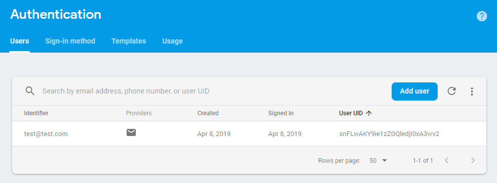
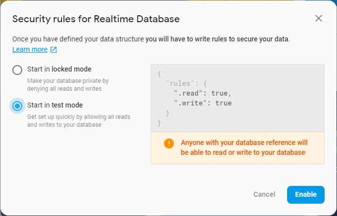
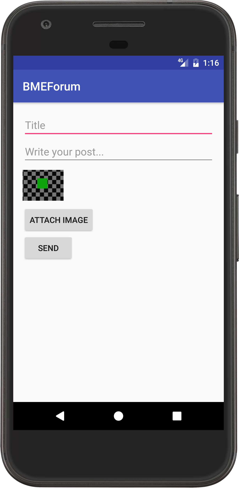

# Labor 12 - Firebase

## Bevezető

A labor során egy fórum alkalmazás kerül megvalósításra a Firebase Backend as a Service (BaaS) felhasználásával. A feladat célja, hogy szemléltesse, hogyan lehet közös backendet használó alkalmazást fejleszteni saját backend kód fejlesztése nélkül.

A Firebase manapság az egyik legnépszerűbb Backend as a Service megoldás Android, iOS és web kliensek támogatásával, mely számos szolgáltatást biztosít, például:
- real-time adatbáziskezelés
- storage
- authentikáció
- push értesítések
- analytics
- crash reporting

További általános információk a Firebase-ről: [https://firebase.google.com/](https://firebase.google.com/).

A laborfoglalkozás célja, hogy bemutassa a Firebase legfontosabb szolgáltatásait egy komplett alkalmazás megvalósítása keretében. A megvalósítandó alkalmazás egy fórum megoldás lesz, melyen keresztül a felhasználók szöveges üzeneteket tudnak megosztani egymással valós időben, melyekhez opcionálisan képek is csatolhatók.
Az alkalmazás az alábbi fő funkciókat támogatja:
- regisztráció, bejelentkezés
- üzenetek listázása
- üzenetírás
- képek csatolása üzenetekhez
- üzenetek megjelenítése valós időben
- crash reporting
- analitika

A labor során nagyobb kódrészek kerülnek megírásra, ami miatt elnézést kérünk, de ez szükséges ahhoz, hogy egy "Hello World!" jellegű alkalmazásnál többet tudjunk átadni a tárgy keretében. **Az anyag részletes megértéséhez javasoljuk, hogy figyelje a laborvezető utasításait és labor után is 10-20 percet szánjon a kódrészek megértésére.**

*Az útmutatóban szereplő példa kódok esetében a szöveges elemeket nem tettük a `strings.xml`-be a könnyebb olvashatóság érdekében, de éles projektekben ezeket természetesen mindig ki kell szervezni erőforrásba.*

## Projekt előkészítése, konfiguráció

Első lépésként létre kell hozni egy Firebase projektet a Firebase admin felületén (Firebase console), majd egy Android Studio projektet és a kettőt össze kell kötni:
- Navigáljunk a Firebase console felületére: [https://console.firebase.google.com/](https://console.firebase.google.com/) !
- Jelentkezzünk be!
- Hozzunk létre egy új projektet az *Add project* elemet választva!

<p align="center">

</p>

<p align="center">

</p>

- A projekt neve legyen *BMEForumNEPTUN_KOD*, ahol a `NEPTUN_KOD` helyére a saját Neptun kódunkat helyettesítsük!
- Az analitikát most még nem szükséges konfigurálni.

>A Neptun kódra azért van szükség, mert ugyanazon laborgép kulcsával ugyanolyan nevű projektet nem hozhatunk létre többször, és több laborcsoport lévén ebből probléma adódhatna. Ugyanerre lesz majd szükség a package név esetén is.

Sikeres projekt létrehozás után fussák át a laborvezetővel közösen a Firebase console felületét az alábbi elemekre kitérve:
- Authentication, Database és Storage,
- Database -> Rules.

Hozzunk létre egy új projektet Android Studioban az *Empty Activity* sablont választva `BMEForum` néven,
a package name legyen `hu.bme.aut.android.bmeforumNEPTUN_KOD`. Fontos hogy a Neptun kód előtt ne legyen pont, mert ez gondot okozhat.

A létrejövő `MainActivity` lesz a login formunk, mivel elsőként a regisztrációs és bejelentkező nézetet fogjuk megvalósítani. Az egyszerűség kedvéért ugyanazt a felületet fogjuk használni regisztráció és bejelentkezés céljából.

Adjuk hozzá az `AndroidManifest.xml` fájlhoz az internet használati engedélyt:

```xml
<uses-permission android:name="android.permission.INTERNET" />
```

A projekt létrehozása után válasszuk Android Studioban a *Tools -> Firebase* menüpontot, melynek hatására jobb oldalt megnyílik a *Firebase Assistant* funkció.

A *Firebase Assistant* akkor fogja megtalálni a Firebase console-on létrehozott projektet, ha Android Studioba is ugyanazzal a Google accounttal vagyunk bejelentkezve, mint amivel a console-on létrehoztuk a projektet. Ellenőrizzük ezt mindkét helyen! Amennyiben a *Firebase Assistant*-ot nem sikerül beüzemelni, manuálisan is összeköthető a két projekt. A leírásban ismertetni fogjuk a lépéseket, amelyeket az *Assistant* végez el.

Válasszuk az *Assistant*-ban az *Authentication* szakaszt és azon belül az *Email and password authentication*-t, majd a *Connect to Firebase* gombot.
Ezt követően egy dialog nyílik meg, ahol ha megfelelőek az accountok, a második szakaszt (*Choose an existing Firebase or Google project*) választva kiválaszthatjuk a projektet, amit a Firebase console-on már létrehoztunk. Itt egyébként lehetőség van új projektet is létrehozni. (Ha elsőre hibát látunk a projekttel való összekapcsolásnál, próbáljuk újra, másodszorra általában sikeresen megtörténik az Android Studio projekt szinkronizálása a Firebase projekttel.)

A háttérben valójában annyi történik, hogy az alkalmazásunk package neve és az aláíró kulcs *SHA-1 hash-e* alapján hozzáadódik egy Android alkalmazás a Firebase console-on lévő projektünkhöz, és az ahhoz tartozó konfigurációs (`google-services.json`) fájl letöltődik a projektünk könyvtárába az alapértelmezett (`app`) modul alá.

Ezt a lépéssorozatot manuálisan is végrehajthatjuk a Firebase console-on az *Add Firebase to your Android app*-et választva. A debug kulcs *SHA-1* lenyomata ilyenkor a jobb oldalon található Gradle fülön a *Gradle -> [projektnév] -> Tasks -> android -> signingReport* taskot futtatva kinyerhető alul az *execution/text* módot választva.

<p align="center">

</p>

Következő lépésben szintén az *Assistant*-ban az *Email and password authentication* alatt válasszuk az *Add Firebase Authentication to your app* elemet, itt látható is, hogy milyen módosítások történnek a projekt és modul szintű `build.gradle` fájlokban.

<p align="center">

</p>

Sajnos a Firebase plugin nincs rendszeresen frissítve, és így majdnem mindig a függőségek régi verzióját adja hozzá a `build.gradle` fájlokhoz. Ezért most frissíteni fogjuk az imént automatikusan felvett függőségeket, valamint innentől manuálisan fogjuk hozzáadni az újabbakat az *Assistant* használata helyett. Fontos, hogy mindenből az itt leírt verziót használjuk.

Cseréljük le a projekt szintű `build.gradle` fájlban a `google-services`-t az alábbi verzióra:

```groovy
classpath 'com.google.gms:google-services:4.3.2'
```

Valamint a modul szintű `build.gradle`-ben a `firebase-auth` verziót a következőre:

```groovy
implementation 'com.google.firebase:firebase-auth:19.0.0'
```

A generált projektváz többi általános függősége (pl. appcompat és ktx-core könyvtárak) is elavult lehet, ezt az Android Studio jelzi is sötétsárga háttérrel. Ezekre ráállva a kurzorral az Alt-Enter gyorsbillenytűvel kiválaszthatjuk ezeknek a frissítését.

Ahhoz, hogy az e-mail alapú regisztráció és authentikáció megfelelően működjön, a *Firebase console*-ban az *Authentication -> Sign-in method* alatt az *Email/Password* providert engedélyezni kell.

<p align="center">

</p>

Végezetül a Studioban vegyük még fel a modulhoz tartozó `build.gradle`-be az alábbi függőségeket; tekintsük át a laborvezetővel ezeket:

```groovy
    implementation 'com.flaviofaria:kenburnsview:1.0.7'
    implementation 'com.github.bumptech.glide:glide:4.9.0'
```

## Regisztráció, bejelentkezés

Első lépésként valósítsuk meg a regisztrációs/bejelentkező képernyő felületét. Mivel ehhez hasonló felületeket már készítettünk korábban, az egyszerűség kedvéért megadjuk a felület kódját, amely az `activity_main.xml`-be kerül:

```xml
<?xml version="1.0" encoding="utf-8"?>
<ScrollView xmlns:android="http://schemas.android.com/apk/res/android"
    xmlns:app="http://schemas.android.com/apk/res-auto"
    android:layout_width="match_parent"
    android:layout_height="match_parent"
    android:fitsSystemWindows="true">

    <LinearLayout
        android:layout_width="match_parent"
        android:layout_height="wrap_content"
        android:orientation="vertical"
        android:paddingLeft="24dp"
        android:paddingRight="24dp"
        android:paddingTop="56dp">

        <ImageView
            android:layout_width="wrap_content"
            android:layout_height="72dp"
            android:layout_gravity="center_horizontal"
            android:layout_marginBottom="24dp"
            android:src="@mipmap/ic_launcher" />

        <com.google.android.material.textfield.TextInputLayout
            android:layout_width="match_parent"
            android:layout_height="wrap_content"
            android:layout_marginBottom="8dp"
            android:layout_marginTop="8dp">
            
            <EditText
                android:id="@+id/etEmail"
                android:layout_width="match_parent"
                android:layout_height="wrap_content"
                android:hint="Email"
                android:inputType="textEmailAddress"
                android:text="" />

        </com.google.android.material.textfield.TextInputLayout>

        <com.google.android.material.textfield.TextInputLayout
            android:layout_width="match_parent"
            android:layout_height="wrap_content"
            android:layout_marginBottom="8dp"
            android:layout_marginTop="8dp"
            app:passwordToggleEnabled="true">

            <EditText
                android:id="@+id/etPassword"
                android:layout_width="match_parent"
                android:layout_height="wrap_content"
                android:hint="Password"
                android:inputType="textPassword"
                android:text="" />

        </com.google.android.material.textfield.TextInputLayout>

        <Button
            android:id="@+id/btnLogin"
            android:layout_width="match_parent"
            android:layout_height="wrap_content"
            android:layout_marginBottom="12dp"
            android:layout_marginTop="24dp"
            android:padding="12dp"
            android:text="Login" />

        <Button
            android:id="@+id/btnRegister"
            android:layout_width="match_parent"
            android:layout_height="wrap_content"
            android:padding="12dp"
            android:text="Register" />

    </LinearLayout>

</ScrollView>
```

Tekintsük át a felhasználói felület kódját! Figyeljük meg, hogy a jelszó mezőhöz tartozó `TextInputLayout`-nál az `app:passwordToggleEnabled="true"` beállítással a mező mellett megjelenik egy kis ikon, amely segítségével láthatóvá tehetjük az alkalmazásban a jelszót.

<p align="center">

</p>

Az alkalmazásban több olyan `Activity` is lesz, amik közös funkciókkal rendelkeznek, például `ProgressDialog` megjelenítése, felhasználói adatok lekérdezése. Ezeket a közös funkciókat kiszervezzük egy `BaseActivity` osztályba (ez csak egy absztrakt osztály, nem egy konkrét `Activity`, így nem kell az `AndroidManifest.xml`-ben regisztrálni):

```kotlin
abstract class BaseActivity : AppCompatActivity() {

    private var progressDialog: ProgressDialog? = null

    private val firebaseUser: FirebaseUser?
        get() = FirebaseAuth.getInstance().currentUser

    protected val uid: String?
        get() = firebaseUser?.uid

    protected val userName: String?
        get() = firebaseUser?.displayName

    protected val userEmail: String?
        get() = firebaseUser?.email

    fun showProgressDialog() {
        if (progressDialog != null) {
            return
        }

        progressDialog = ProgressDialog(this).apply {
            setCancelable(false)
            setMessage("Loading...")
            show()
        }
    }

    protected fun hideProgressDialog() {
        progressDialog?.let { dialog ->
            if (dialog.isShowing) {
                dialog.dismiss()
            }
        }
        progressDialog = null
    }

    protected fun toast(message: String?) {
        Toast.makeText(this, message, Toast.LENGTH_SHORT).show()
    }

}
```

Származtassuk a meglevő `MainActivity`-t a `BaseActivity`-ből, majd vegyük fel a Firebase authentikációért felelős `firebaseAuth` tagváltozót és inicializáljuk az `onCreate`-ben:

```kotlin
private lateinit var firebaseAuth: FirebaseAuth

override fun onCreate(savedInstanceState: Bundle?) {
    super.onCreate(savedInstanceState)
    setContentView(R.layout.activity_main)

    firebaseAuth = FirebaseAuth.getInstance()
}
```

Adjunk a `MainActivity`-hez egy segédfüggvényt, mely az input mezők validációjáért lesz felelős:

```kotlin
private fun validateForm(): Boolean {
    if (etEmail.text.isEmpty()) {
        etEmail.error = "Required"
        return false
    }
    if (etPassword.text.isEmpty()) {
        etPassword.error = "Required"
        return false
    }
    return true
}
```

Itt láthatóan ugyanazt a kódot ismételjük többször (sőt, a következő képernyőinken is szükség lesz hasonló validációra), ezért jó lenne ezt kiszervezni valamilyen módon. Használjunk erre egy [extension function](https://kotlinlang.org/docs/reference/extensions.html#extension-functions)t. Hozzunk létre egy `extensions` package-et, azon belül pedig egy `EditText.kt` fájlt! Ide értelemszerűen az `EditText` osztályt bővítő függvényeinket fogjuk tenni. A fenti kód alapján így validáljuk, hogy egy `EditText` nem üres:

```kotlin
fun EditText.validateNonEmpty(): Boolean {
    if (text.isEmpty()) {
        error = "Required"
        return false
    }
    return true
}
```

Ennek a felhasználásával az előbbi függvényünk az alábbira egyszerűsödik:

```kotlin
private fun validateForm() = etEmail.validateNonEmpty() && etPassword.validateNonEmpty()
```

Ezt követően valósítsuk meg a regisztráció gomb eseménykezelőjét! Figyeljük meg, hogyan történik a form validációja, a progress dialógus megjelenítése, valamint aszinkron módon a válasz és az esetleges hiba kezelése. Éles projektben hibajelzésre a *Toast*-ot nem javasoljuk (mivel nem feltűnő), helyette egy speciális dialógus vagy egyéb hibakezelés javasolt.

```kotlin
private fun registerClick() {
    if (!validateForm()) {
        return
    }

    showProgressDialog()

    firebaseAuth
            .createUserWithEmailAndPassword(etEmail.text.toString(), etPassword.text.toString())
            .addOnSuccessListener { result ->
                hideProgressDialog()

                val firebaseUser = result.user
                val profileChangeRequest = UserProfileChangeRequest.Builder()
                        .setDisplayName(firebaseUser?.email?.substringBefore('@'))
                        .build()
                firebaseUser?.updateProfile(profileChangeRequest)

                toast("Registration successful")
            }
            .addOnFailureListener { exception ->
                hideProgressDialog()

                toast(exception.message)
            }
}
```

Végül valósítsuk meg a login eseménykezelőt (`PostsActivity` még nincs az alkalmazásban, ezt hamarosan létrehozzuk, ezért az a sor egyelőre hibás lesz):

```kotlin
private fun loginClick() {
    if (!validateForm()) {
        return
    }

    showProgressDialog()

    firebaseAuth
            .signInWithEmailAndPassword(etEmail.text.toString(), etPassword.text.toString())
            .addOnSuccessListener {
                hideProgressDialog()

                startActivity(Intent(this@MainActivity, PostsActivity::class.java))
                finish()
            }
            .addOnFailureListener { exception ->
                hideProgressDialog()

                toast(exception.localizedMessage)
            }
}
```

Ezeket az eseménykezelőket az `onCreate` függvényben állítsuk is be az adott gomboknak:

```kotlin
btnRegister.setOnClickListener { registerClick() }
btnLogin.setOnClickListener { loginClick() }
```

A *Navigation Drawer Activity* sablont használva készítsük el az új `PostsActivity`-t. Sajnos az útmutató írásakor
az Android Studio rosszul veszi fel a szükséges függőségeket. Javítsuk a modul szintű `build.gradle` fájlban, hogy ezek legyenek
az új függőségek:

```groovy
    implementation 'androidx.legacy:legacy-support-v4:1.0.0'
    implementation 'com.google.android.material:material:1.0.0'
    implementation 'androidx.lifecycle:lifecycle-extensions:2.1.0'
    implementation 'androidx.navigation:navigation-fragment-ktx:2.1.0'
    implementation 'androidx.navigation:navigation-ui-ktx:2.1.0'
```

A navigation libraryknek csak a *-ktx* utótagú verziója legyen megadva, különben elszáll a build, mert azonos
osztályok különböző verziói kerülnek a classpath-ra!

A kompatibilitási problémák megelőzése érdekében állítsuk át a project Java verzióját 1.8-ra! Ehhez másoljuk be az alábbi kódrészletet a modul szintű `build.gradle`-be az `android{...}` blokkon belülre:

```groovy
compileOptions {
    sourceCompatibility = JavaVersion.VERSION_1_8
    targetCompatibility = JavaVersion.VERSION_1_8
}

kotlinOptions {
    jvmTarget = "1.8"
}
```

Miután létrejött az Activity, változtassuk meg az ősosztályát az `AppCompatActivity`-ről a saját `BaseActivity` osztályunkra.

Próbáljuk ki az alkalmazás jelenlegi működését! Nézzük meg, hogy a *Firebase console*-on is látszik-e a regisztrált felhasználó!

<p align="center">

</p>

## Postok listázása

Első lépésként tekintse át a laborvezetővel a `PostsActivity` kódját és a hozzá tartozó felhasználói felületet.
A `PostsActivity` feladata lesz a fórum üzenetek megjelenítése egy `RecyclerView`-ban. Az egyes üzenetek egy-egy `CardView`-n kerülnek megjelenítésre. A lista valós időben fog frissülni, amikor egy új üzenet kerül a Firebase adatbázisba.

Adjuk hozzá a projekthez a *Firebase Realtime Database* támogatást (itt is fontos a verziószám). Frissíthetjük a
közben belegenerált függőségeket is, amelyeket a Navigation Drawer típusú Activity létrehozása változz ki.

```groovy
    implementation 'com.google.firebase:firebase-database:19.2.0'
```

Kapcsoljuk be a *Realtime Database*-t a *Firebase console*-on is (figyeljünk rá, hogy ne a *Cloud Firestore*-t válasszuk, ez egy újabb megoldás, komolyabb funkcionalitást nyújt, amire jelenleg nicns szükségünk). Az adatbázist *test mode*-ban fogjuk használni, így egyelőre publikusan írható/olvasható lesz, de cserébe nem kell konfigurálnunk a hozzáférés-szabályozást. Ezt természetesen később mindenképp meg kellene tenni egy éles projektben.

<p align="center">

</p>

Változtassuk meg a *Navigation Drawer* menüjét, hogy csak egy *Logout* menüpont szerepeljen benne! Ezt a `res/menu/activity_posts_drawer.xml`-ben tehetjük meg:

```xml
<?xml version="1.0" encoding="utf-8"?>
<menu xmlns:android="http://schemas.android.com/apk/res/android">
    <item
        android:id="@+id/nav_logout"
        android:icon="@drawable/ic_menu_share"
        android:title="Logout" />
</menu>
```

A `PostsActivity` `onCreateOptionsMenu` függvénye és a `menu/posts.xml` törölhetők, mivel a `Toolbar`-on lévő menüt nem fogjuk használni.

A *Navigation Drawer* menüjében csak a *Logout* menüpontot kell kezelni, ezt egyszerűen egy [`when` kifejezéssel](https://kotlinlang.org/docs/reference/control-flow.html#when-expression) tehetjük meg,
ezt három lépésen keresztül érjük el:

1. Az osztály implementálja a `NavigationView.OnNavigationItemSelectedListener` interfészt.
2. Az előírt metódusban elvégezzük a kiléptetést, és a `MainActivity`-re navigálunk.
3. Az `onCreate()` metódusban beregisztráljuk az eseménykezelőt.

A `PostsActivity` frissített kódja a következő:


```kotlin
class PostsActivity : AppCompatActivity(), NavigationView.OnNavigationItemSelectedListener {

    private lateinit var appBarConfiguration: AppBarConfiguration

    override fun onCreate(savedInstanceState: Bundle?) {
        super.onCreate(savedInstanceState)
        setContentView(R.layout.activity_posts)
        val toolbar: Toolbar = findViewById(R.id.toolbar)
        setSupportActionBar(toolbar)

        val fab: FloatingActionButton = findViewById(R.id.fab)
        fab.setOnClickListener { view ->
            Snackbar.make(view, "Replace with your own action", Snackbar.LENGTH_LONG)
                .setAction("Action", null).show()
        }
        val drawerLayout: DrawerLayout = findViewById(R.id.drawer_layout)
        val navView: NavigationView = findViewById(R.id.nav_view)
        navView.setNavigationItemSelectedListener(this)
    }

    override fun onNavigationItemSelected(item: MenuItem): Boolean {
        when (item.itemId) {
            R.id.nav_logout -> {
                FirebaseAuth.getInstance().signOut()
                startActivity(Intent(this, MainActivity::class.java))
                finish()
            }
        }

        drawer_layout.closeDrawer(GravityCompat.START)
        return true
    }
}
```

Cseréljük le az `app_bar_posts.xml`-ben az `AppBarLayout`-ot (csak azt, ne az egész fájl tartalmát!) az alábbira, amely az alkalmazás ikonját használva egy [*Ken Burns effektet*](https://en.wikipedia.org/wiki/Ken_Burns_effect) valósít meg (a kép tetszőlegesen lecserélhető).

```xml
    <com.google.android.material.appbar.AppBarLayout xmlns:android="http://schemas.android.com/apk/res/android"
        xmlns:app="http://schemas.android.com/apk/res-auto"
        android:layout_width="match_parent"
        android:layout_height="190dp"
        android:theme="@style/AppTheme.AppBarOverlay">

        <com.google.android.material.appbar.CollapsingToolbarLayout
            android:id="@+id/collapsing_toolbar"
            android:layout_width="match_parent"
            android:layout_height="match_parent"
            android:fitsSystemWindows="true"
            app:contentScrim="?attr/colorPrimary"
            app:expandedTitleMarginBottom="32dp"
            app:expandedTitleMarginEnd="64dp"
            app:expandedTitleMarginStart="48dp"
            app:layout_scrollFlags="scroll|exitUntilCollapsed">

            <com.flaviofaria.kenburnsview.KenBurnsView
                android:id="@+id/header"
                android:layout_width="match_parent"
                android:layout_height="match_parent"
                android:src="@mipmap/ic_launcher"
                app:layout_collapseMode="parallax" />

            <androidx.appcompat.widget.Toolbar
                android:id="@+id/toolbar"
                android:layout_width="match_parent"
                android:layout_height="?attr/actionBarSize"
                app:layout_collapseMode="pin"
                app:popupTheme="@style/ThemeOverlay.AppCompat.Light" />
        </com.google.android.material.appbar.CollapsingToolbarLayout>
    </com.google.android.material.appbar.AppBarLayout>
```

A `PostsActivity` központi felülete a `content_posts.xml`-ben található, ennek a tartalma legyen az alábbi:

```xml
<?xml version="1.0" encoding="utf-8"?>
<androidx.recyclerview.widget.RecyclerView xmlns:android="http://schemas.android.com/apk/res/android"
    xmlns:app="http://schemas.android.com/apk/res-auto"
    android:id="@+id/rvPosts"
    android:layout_width="match_parent"
    android:layout_height="match_parent"
    app:layout_behavior="@string/appbar_scrolling_view_behavior" />
 ```

Próbáljuk ki a jelenlegi állapotot, ellenőrizzük a kijelentkezés funkció működését!

<p align="center">

</p>

A következő lépés a `Post` listázás megvalósítása. Ehhez először hozzunk létre egy `data` package-et és benne egy `Post` osztályt a következő tartalommal:

```kotlin
class Post(
        var uid: String? = null,
        var author: String? = null,
        var title: String? = null,
        var body: String? = null,
        var imageUrl: String? = null
)
```

Ez az osztály tárolja az üzenet szerzőjét, címét, tartalmát és a hozzá tartozó kép URL-jét opcionálisan.

Valósítsuk meg az egy `Post`-ot megjelenítő felületet `card_post.xml` néven és kerüljön a `res/layout` mappába:

```xml
<?xml version="1.0" encoding="utf-8"?>
<androidx.cardview.widget.CardView xmlns:android="http://schemas.android.com/apk/res/android"
    xmlns:card_view="http://schemas.android.com/apk/res-auto"
    android:id="@+id/card_view"
    android:layout_width="match_parent"
    android:layout_height="wrap_content"
    android:layout_gravity="center"
    android:layout_margin="10dp"
    card_view:cardCornerRadius="4dp">

    <RelativeLayout
        android:layout_width="match_parent"
        android:layout_height="wrap_content"
        android:padding="10dp">

        <LinearLayout
            android:layout_width="wrap_content"
            android:layout_height="wrap_content"
            android:gravity="center_vertical"
            android:layout_alignParentStart="true"
            android:layout_centerVertical="true"
            android:orientation="vertical">

            <TextView
                android:id="@+id/tvAuthor"
                android:layout_width="wrap_content"
                android:layout_height="wrap_content" />

            <TextView
                android:id="@+id/tvTitle"
                android:layout_width="wrap_content"
                android:layout_height="wrap_content"
                android:textStyle="bold" />

            <TextView
                android:id="@+id/tvBody"
                android:layout_width="wrap_content"
                android:layout_height="wrap_content" />

            <ImageView
                android:id="@+id/imgPost"
                android:visibility="gone"
                android:layout_width="70dp"
                android:layout_height="70dp" />

        </LinearLayout>

    </RelativeLayout>

</androidx.cardview.widget.CardView>
```

A következő lépés a `Post`-ok `RecyclerView`-ban való megjelenítéséért felelős adapter osztály megírása. Ezt hozzuk létre egy új, `adapter` nevű package-ben, `PostsAdapter` néven:

```kotlin
class PostsAdapter(private val context: Context) : RecyclerView.Adapter<PostsAdapter.ViewHolder>() {

    private val postList: MutableList<Post> = mutableListOf()
    private var lastPosition = -1

    class ViewHolder(itemView: View) : RecyclerView.ViewHolder(itemView) {
        val tvAuthor: TextView = itemView.tvAuthor
        val tvTitle: TextView = itemView.tvTitle
        val tvBody: TextView = itemView.tvBody
        val imgPost: ImageView = itemView.imgPost
    }

    override fun onCreateViewHolder(viewGroup: ViewGroup, viewType: Int): ViewHolder {
        val view = LayoutInflater
                .from(viewGroup.context)
                .inflate(R.layout.card_post, viewGroup, false)
        return ViewHolder(view)
    }

    override fun onBindViewHolder(viewHolder: ViewHolder, position: Int) {
        val tmpPost = postList[position]
        viewHolder.tvAuthor.text = tmpPost.author
        viewHolder.tvTitle.text = tmpPost.title
        viewHolder.tvBody.text = tmpPost.body

        if (tmpPost.imageUrl.isNullOrBlank()) {
            viewHolder.imgPost.visibility = View.GONE
        } else {
            Glide.with(context).load(tmpPost.imageUrl).into(viewHolder.imgPost)
            viewHolder.imgPost.visibility = View.VISIBLE
        }

        setAnimation(viewHolder.itemView, position)
    }

    override fun getItemCount() = postList.size

    fun addPost(post: Post?) {
        post ?: return

        postList.add(post)
        notifyDataSetChanged()
    }

    private fun setAnimation(viewToAnimate: View, position: Int) {
        if (position > lastPosition) {
            val animation = AnimationUtils.loadAnimation(context, android.R.anim.slide_in_left)
            viewToAnimate.startAnimation(animation)
            lastPosition = position
        }
    }

}
```

Az elérhető `AnimationUtils` osztályokból importáljuk a `android.view.animation.AnimationUtils` osztályt. 

A `RecyclerView` adapterrel való összekötését a `PostsActivity`-ben valósítjuk meg. Vegyünk fel egy tagváltozót az osztályba az adapter számára:

```kotlin
private lateinit var postsAdapter: PostsAdapter
```

Majd az `onCreate(...)` végére tegyük a `RecyclerView` adapterrel való összekötéséért felelős kódrészt:

```kotlin
postsAdapter = PostsAdapter(applicationContext)
rvPosts.layoutManager = LinearLayoutManager(this).apply {
    reverseLayout = true
    stackFromEnd = true
}
rvPosts.adapter = postsAdapter
```

Ahhoz, hogy  az üzenetlista (`RecyclerView`) frissüljön, ha egy új üzenet érkezett, illetve, hogy kezdetben fel legyen töltve az eddigi adatokkal, a Firebase adatbázis `posts` ágára kell készítenünk egy `ChildEventListener`-t, melynek `onChildAdded` függvénye első híváskor minden eddig bent levő elemre meghívódik, majd minden új elemre is. Látható, hogy ez az eseménykezelő aktiválódik további eseményekre is (változás, törlés, stb.), ezeket most nem fogjuk kezelni.

Valósítsuk meg az alábbi `initPostsListener` függvényt és **hívjuk is meg** a `PostsActivity` `onCreate` függvényének végén:

```kotlin
private fun initPostsListener() {
    FirebaseDatabase.getInstance()
            .getReference("posts")
            .addChildEventListener(object : ChildEventListener {
                override fun onChildAdded(dataSnapshot: DataSnapshot, s: String?) {
                    val newPost = dataSnapshot.getValue<Post>(Post::class.java)
                    postsAdapter.addPost(newPost)
                }

                override fun onChildChanged(dataSnapshot: DataSnapshot, s: String?) {
                }

                override fun onChildRemoved(dataSnapshot: DataSnapshot) {
                }

                override fun onChildMoved(dataSnapshot: DataSnapshot, s: String?) {
                }

                override fun onCancelled(databaseError: DatabaseError) {
                }
            })
}
```

(Alternatív megoldásként a *Firebase-UI* osztálykönyvtár ad egy `FirebaseRecyclerAdapter` implementációt, melynek megoldása teljesen hasonló, de nehezebben testreszabható. Jelen laborfoglalkozásban ezt nem használjuk, de elérhető a https://github.com/firebase/FirebaseUI-Android címen.)

Próbáljuk ki az alkalmazás működését! A lista jelenleg még üres lesz, hacsak nem veszünk fel a *Firebase console*-on elemeket, de fontos, hogy már hiba nélkül kell futnia az alkalmazásnak.

<p align="center">

</p>

## Postok készítése

A következő lépés az üzenetek írása, melynek hatására már tartalom kerülhet a listába. Ehhez vegyük fel a *Firebase Storage* függőséget, amit a képek feltöltéséhez fogunk használni:

```groovy
implementation 'com.google.firebase:firebase-storage:19.1.0'
```

A *Firebase console*-on is inicializáljuk a *Storage* funkciót a megfelelő menüben.

Hozzuk létre a `CreatePostActivity`-t az *Empty Activity* sablont használva, és ez is származzon le a `BaseActivity`-ből. A felülete pedig legyen az alábbi:

```xml
<?xml version="1.0" encoding="utf-8"?>
<LinearLayout xmlns:android="http://schemas.android.com/apk/res/android"
    android:id="@+id/activity_write_post"
    android:layout_width="match_parent"
    android:layout_height="match_parent"
    android:paddingBottom="@dimen/activity_vertical_margin"
    android:paddingLeft="@dimen/activity_horizontal_margin"
    android:paddingRight="@dimen/activity_horizontal_margin"
    android:paddingTop="@dimen/activity_vertical_margin"
    android:orientation="vertical">

    <EditText
        android:id="@+id/etTitle"
        android:layout_width="match_parent"
        android:layout_height="wrap_content"
        android:hint="Title"
        android:maxLines="1" />

    <EditText
        android:id="@+id/etBody"
        android:layout_width="match_parent"
        android:layout_height="wrap_content"
        android:hint="Write your post..."
        android:inputType="textMultiLine"
        android:maxLines="10"
        android:scrollHorizontally="false" />

    <ImageView
        android:id="@+id/imgAttach"
        android:visibility="gone"
        android:layout_width="70dp"
        android:layout_height="70dp" />

    <Button
        android:id="@+id/btnAttach"
        android:layout_width="wrap_content"
        android:layout_height="wrap_content"
        android:text="Attach image" />

    <Button
        android:id="@+id/btnSend"
        android:layout_width="wrap_content"
        android:layout_height="wrap_content"
        android:text="Send" />

</LinearLayout>
```

<p align="center">

</p>

A `CreatePostActivity` felületén lehetőség van új üzenet írására a cím, a szöveg és opcionálisan a kép megadásával. A kép megadásakor a beépített kamera alkalmazással van lehetőségünk képet készíteni, melynek módját egy korábbi laboron már áttekintettük (implicit `Intent` + `onActivityResult`).

A következőkben megadjuk a `CreatePostActivity` kódját, de bemásolás után a laborvezetővel közösen nézze át a kódot, vizsgálja meg, hogyan történik a *Storage API*-val a képfeltöltés, majd a Firebase-en eltárolt kép URL-jének lekérdezése és hozzáadása az új `Post`-hoz.

```kotlin
class CreatePostActivity : BaseActivity() {

    companion object {
        private const val REQUEST_CODE = 101
    }

    override fun onCreate(savedInstanceState: Bundle?) {
        super.onCreate(savedInstanceState)
        setContentView(R.layout.activity_create_post)

        btnSend.setOnClickListener { sendClick() }
        btnAttach.setOnClickListener { attachClick() }
    }

    private fun sendClick() {
        if (!validateForm()) {
            return
        }

        if (imgAttach.visibility != View.VISIBLE) {
            uploadPost()
        } else {
            try {
                uploadPostWithImage()
            } catch (e: Exception) {
                e.printStackTrace()
            }
        }
    }

    private fun validateForm() = etTitle.validateNonEmpty() && etBody.validateNonEmpty()

    private fun uploadPost(imageUrl: String? = null) {
        val key = FirebaseDatabase.getInstance().reference.child("posts").push().key ?: return
        val newPost = Post(uid, userName, etTitle.text.toString(), etBody.text.toString(), imageUrl)

        FirebaseDatabase.getInstance().reference
            .child("posts")
            .child(key)
            .setValue(newPost)
            .addOnCompleteListener {
                toast("Post created")
                finish()
            }
    }

    private fun attachClick() {
        val takePictureIntent = Intent(MediaStore.ACTION_IMAGE_CAPTURE)
        startActivityForResult(takePictureIntent, REQUEST_CODE)
    }

    override fun onActivityResult(requestCode: Int, resultCode: Int, data: Intent?) {
        super.onActivityResult(requestCode, resultCode, data)
        if (resultCode != Activity.RESULT_OK) {
            return
        }

        if (requestCode == REQUEST_CODE) {
            val imageBitmap = data?.extras?.get("data") as? Bitmap ?: return
            imgAttach.setImageBitmap(imageBitmap)
            imgAttach.visibility = View.VISIBLE
        }
    }

    private fun uploadPostWithImage() {
        val bitmap: Bitmap = (imgAttach.drawable as BitmapDrawable).bitmap
        val baos = ByteArrayOutputStream()
        bitmap.compress(Bitmap.CompressFormat.JPEG, 100, baos)
        val imageInBytes = baos.toByteArray()

        val storageReference = FirebaseStorage.getInstance().reference
        val newImageName = URLEncoder.encode(UUID.randomUUID().toString(), "UTF-8") + ".jpg"
        val newImageRef = storageReference.child("images/$newImageName")

        newImageRef.putBytes(imageInBytes)
            .addOnFailureListener { exception ->
                toast(exception.message)
            }
            .continueWithTask { task ->
                if (!task.isSuccessful) {
                    task.exception?.let { throw it }
                }

                newImageRef.downloadUrl
            }
            .addOnSuccessListener { downloadUri ->
                uploadPost(downloadUri.toString())
            }
    }

}
```

Ezt követően kössük be a `CreatePostActivity`-t a `FloatingActionButton` megnyomására.

A `PostsActivity` `onCreate` metódusában írjuk felül a `FloatingActionButton` `onClickListener`-jének tartalmát:

```kotlin
fab.setOnClickListener {
    val createPostIntent = Intent(this, CreatePostActivity::class.java)
    startActivity(createPostIntent)
}
```

Vizsgálja meg az elkészült alkalmazást, az üzenetek létrehozását és az adatbázis épülését a *Firebase console*-on!

<p align="center">

</p>

<p align="center">

</p>

## Push értesítések

Adjuk hozzá a projektünkhöz a `firebase-messaging` függőséget:

```groovy
implementation 'com.google.firebase:firebase-messaging:20.0.0'
```

Csupán ennyi elegendő a push alapvető működéséhez, ha így újrafordítjuk az alkalmazást, a Firebase felületéről vagy API-jával küldött push üzeneteket automatikusan megkapják a mobil kliensek és egy *Notification*-ben megjelenítik.

Próbáljuk ki a push küldést a *Firebase console*-ról (*Cloud messaging menüpont* alatt *Send your first message*), és vizsgáljuk meg, hogyan érkezik meg telefonra, **ha nem fut az alkalmazás**. (Amikor fut az alkalmazás, akkor tőlünk várja az üzenet lekezelését az API.)
A `Notification` szekció alatt írjuk be az üzenet címét és szövegét, a `Target` résznél pedig
válasszuk ki az alkalmazást, hogy minden futó példány megkapja az üzenetet.

<p align="center">

</p>

<p align="center">

</p>

<p align="center">

</p>

Természetesen lehetőség van saját push üzenet feldolgozó szolgáltatás készítésére is egy `FirebaseMessagingService` létrehozásával, melyről további részletek [itt olvashatók](https://firebase.google.com/docs/cloud-messaging/android/receive).  

## Crashlytics

A Firebase 2018 szeptemberétől a régebben a [Fabric](https://get.fabric.io/)-hez tartozó Crashlytics szolgáltatást nyújtja a *Firebase crash reporting* helyett. 

Ennek beüzemeléséhez több változtatásra lesz szükség az alkalmazásban, mint az eddigi függőségek felvételnél. A projekt szintű `build.gradle` fájlban fel kell vennünk egy buildscript repository-t, illetve egy függőséget, amely ebből a repository-ból kerül majd letöltésre. Ezek egysoros változtatások, de az egyszerűség kedvéért itt a teljes `buildscript` blokk ezek hozzáadása után:
 
```groovy
buildscript {
    ext.kotlin_version = '1.3.50'
    repositories {
        google()
        jcenter()
        maven { url 'https://maven.fabric.io/public' }
    }
    dependencies {
        classpath 'com.android.tools.build:gradle:3.5.1'
        classpath "org.jetbrains.kotlin:kotlin-gradle-plugin:$kotlin_version"
        classpath 'com.google.gms:google-services:4.3.2'
        classpath 'io.fabric.tools:gradle:1.31.1'
        classpath 'androidx.navigation:navigation-safe-args-gradle-plugin:2.1.0'
    }
}
```

Ezekkel a módosításokkal egy Gradle plugint adtunk hozzá a projektünkhöz, amit a modul szintű `build.gradle` fájl elején be kell kapcsolnunk a már meglévők után:

```groovy
apply plugin: 'io.fabric'
```

Végül pedig szükségünk van egy egyszerű Gradle függőségre is, amit a meglévő Firebase függőségek mellé helyezhetünk, a modul szintű `build.gradle` fájlban:

```groovy
implementation 'com.crashlytics.sdk.android:crashlytics:2.10.1'
```

<p align="center">

</p>

Vegyünk fel egy új menüpontot az `activity_post_drawer.xml` fájlban definiált menübe, amellyel hibaüzenetet fogunk küldeni:

```xml
<item
    android:id="@+id/nav_error"
    android:icon="@drawable/ic_menu_share"
    android:title="Error" />
```

Végül a *Firebase console-ban* is engedélyezzük a funkciót a *Crashlytics* menüpont alatt.

Próbáljuk ki saját hibajelzések készítését a menü eseménykezelőjében. A `PostsActivity` osztály `onNavigationItemSelected` metódusában kell egy új ágat felvennünk a `when` kifejezésbe, ahol egy Crashlytics függvény meghívásával szándékos crash-t okozunk:

```kotlin
when (item.itemId) {
    R.id.nav_logout -> {
        FirebaseAuth.getInstance().signOut()
        startActivity(Intent(this, MainActivity::class.java))
        finish()
    }
    R.id.nav_error -> Crashlytics.getInstance().crash()
}
```

## Analitika

Most engedélyezzük az analitikát a *Firebase console* *Analytics* menüpontja alatt!

<p align="center">

</p>

Ezután az alkalmazás már naplóz alapvető analitikákat, használati statisztikákat, melyek
ugyanezen menüpont alatt lesznek elérhetők.

Emellett természetesen lehetőség van az analitika kibővítésére és testreszabására is. Vegyük fel függőségnek a Firebase analitikát:

```groovy
implementation 'com.google.firebase:firebase-core:17.2.0'
```

Készítsünk saját analitika üzeneteket egy újabb menüpontból küldve, ami szintén a *Navigation Drawer* menüjébe kerül:

```xml
<item
    android:id="@+id/nav_analytics"
    android:icon="@drawable/ic_menu_share"
    android:title="Analytics" />
```

Majd bővítsük ki az eseménykezelőt:

```kotlin
R.id.nav_analytics -> {
    val bundle = Bundle()
    bundle.putString("demo_key", "idabc")
    bundle.putString("data_key", "mydata")

    FirebaseAnalytics.getInstance(this)
            .logEvent(FirebaseAnalytics.Event.LOGIN, bundle)
}
```

Fontos kiemelni, hogy nem garantált, hogy az analitika valós időben látszik a *Firebase console*-on. 30 percig vagy tovább is tarthat, mire egy-egy esemény itt megjelenik.

<p align="center">

</p>

## Bónusz feladatok
1. Sikeres regisztráció után automatikusan jelentkezzen is be a felhasználó.
2. A *Navigation Drawer* fejléce a felhasználó nevét és e-mail címét mutassa.
3. A `PostsActivity`-n a vissza gomb hatására egy megerősítő dialógus után logout történjen.
