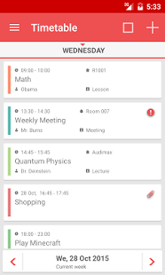
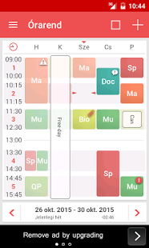
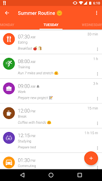

# Labor 14 - Órarend

## Bevezető
A labor során a feladat egy **órarend** alkalmazás elkészítése, ahol a felhasználó grafikus felületen szerkesztheti és láthatja a napi, valamint heti beosztását.


  


Az Play Storeban számos ilyen szoftver található, melyeket érdemes megvizsgálni és ötleteket meríteni a megvalósításhoz.    

Az alkalmazás megtervezése és megvalósítása teljes mértékben kötetlen, az elvárt minimális funkcionalitás:

*	Óra (esemény) létrehozása, szerkesztése, törlése. Attribútumai (legalább): Kezdési, befejezési idő (pl. 8:15-11:45), Tárgy (pl. Android alapú szoftverfejlesztés), Helyszín (pl. QBF09), Szín, amellyel megjelenik a naptárban (pl. #234567)

*	Órák átlátható megjelenítése napi és heti bontásban teljes képernyőn
*	Egy óra részletes adatlapja

*	Adatok perzisztens tárolása 

A fenti specifikáció megvalósítása 4-es osztályzatot jelent, jobb minősítéshez további kreatív funkciók beépítése és igényes felhasználói felület szükséges.

Néhány ötlet:

*	Widget
*	Emlékeztető beállítása az órákhoz
*	A-hét, B-hét támogatása
*	Vizsgák, ZH-k beépítése
*	telefon és tablet, álló-fekvő felhasználói felület
*	nem default UI elemek használata (mint a School Helper-ben)
*	Események importálása naptárból, vagy iCal fájlból
*	Teljes órarend exportálása-importálása saját tervezésű fájlba
*	Több skin támogatása


## Feltöltendő anyag
Az AUT portálra feltöltendő az alkalmazás projekt könyvtárán felül egy 2-3 oldalas felhasználói kézikönyv, ami leírja az elkészített szoftver funkcióit, és képeket is tartalmaz minden releváns képernyőről. 