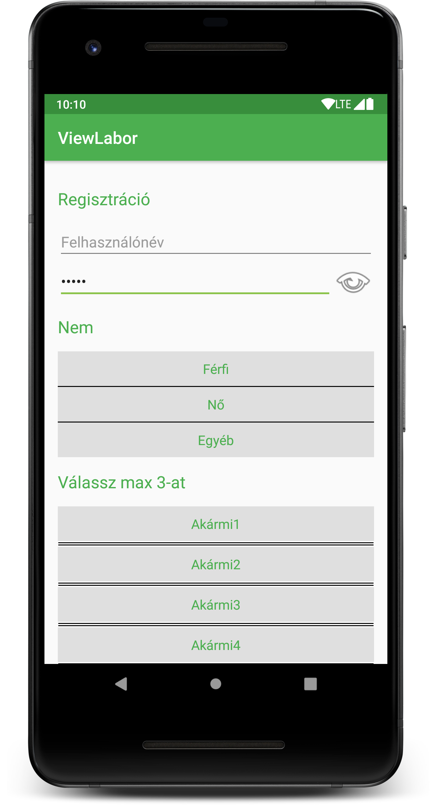

# Labor 2 - Nézetek

A laboron egy regisztrációs nézetet készítünk el, melyben számos egyedi `View` található. Ezek az egyedi nézetek az előző laborral ellentétben nem a `View` ősosztályból származnak le, hanem meglévő, komplexebb `View` elemeket bővítenek ki.

A labor során az alábbiakat nézzük meg:

*   Színek és stílusok definiálása erőforrásokban
*   Alapértelmezett téma módosítása
*   Material szín paletta generálása
*   Saját View létrehozása
*   Egyedi attribútumok definiálása és kezelése

A labor során az alábbi regisztrációs nézetet állítjuk elő egyedi `View`-k segítségével:



<p align="middle"><i>Az alkalmazás felülete</i></p>

## Kezdő nézet

1. Hozzunk létre egy új Android Studio projectet egy *Empty Activity*-vel
2. A projekt neve legyen `ViewLabor`
3. A *Package name* legyen `hu.bme.aut.android.viewlabor`
4. A nyelv legyen *Kotlin*
5. A minimum SDK szint legyen *API21: Android 5.0*
6. Az *instant app* támogatást NE pipáljuk be

## Material Palette

URL: [https://www.materialpalette.com/](https://www.materialpalette.com/)

A honlap segítségével saját Material színsémát generálhatunk az alkalmazásunkhoz. Két kiválasztott szín alapján állíthatjuk össze a Material színpalettáról az alkalmazásunk színvilágát.

Nyissuk meg a honlapot, majd az alábbi beállításokkal generáljunk témát:

1.  Elsődleges színnek válasszuk ki a *Green*-t
2.  Másodlagos színnek pedig a *Light Green*-t
3.  A *Download*-ot kiválasztva, *XML* formátumban töltsük le a generált színeket tartalmazó fájlt
4.  A kapott fájl tartalmát másoljuk a `colors.xml`-be.

Az alkalmazásunkban használt stílusokat pedig definiáljuk a `styles.xml` fájlban az alábbi módon:

```xml
<?xml version="1.0" encoding="utf-8"?>
<resources>
    <!-- Base application theme. -->
    <style name="AppTheme" parent="Theme.AppCompat.Light.DarkActionBar">
        <!-- Customize your theme here. -->
        <item name="colorPrimary">@color/primary</item>
        <item name="colorPrimaryDark">@color/primary_dark</item>
        <item name="colorAccent">@color/accent</item>
        <item name="android:textViewStyle">@style/TextView</item>
    </style>

    <style name="TextView" parent="android:Widget.TextView">
        <item name="android:textColor">@color/primary</item>
    </style>

    <style name="Subtitle">
        <item name="android:textSize">20sp</item>
        <item name="android:paddingTop">16dp</item>
        <item name="android:paddingBottom">16dp</item>
    </style>

</resources>
```

Az `AndroidManifest.xml` fájlban látható, hogy az alkalmazásunk alapértelmezett témája az `AppTheme`. Amit ebben a stílusban definiálunk, az lesz az alapértelmezett kinézet az egész alkalmazásban. Így például az `android:textViewStyle` definiálja, hogy hogyan néz ki az adott alkalmazásban egy `TextView`. Ezeknek a felüldefiniált stílusoknak minden esetben a beépített stílusból kell leszármaznia. Jelen esetben az egyedi, `TextView` nevű stílust az `android:Widget.TextView` stílusból kell származtatnunk.
 Ebben megadhatjuk a `textColor` attribútumot, aminek hatására minden `TextView` alapértelmezett betűszíne megváltozik az ott megadottra.

## Saját View létrehozása

A következő lépés az egyedi nézetek létrehozása.

### Kiinduló elrendezés létrehozása

Módosítsuk a `MainActivity` elrendezését (`res/layout/activity_main.xml`), használjuk az alábbi XML-t.

```xml
<?xml version="1.0" encoding="utf-8"?>
<ScrollView
    xmlns:android="http://schemas.android.com/apk/res/android"
    android:layout_width="match_parent"
    android:layout_height="match_parent">

    <LinearLayout
        android:layout_width="match_parent"
        android:layout_height="wrap_content"
        android:paddingLeft="@dimen/activity_horizontal_margin"
        android:paddingRight="@dimen/activity_horizontal_margin"
        android:paddingTop="@dimen/activity_vertical_margin"
        android:paddingBottom="@dimen/activity_vertical_margin"
        android:orientation="vertical">

        <TextView
            style="@style/Subtitle"
            android:text="Regisztráció"
            android:layout_width="wrap_content"
            android:layout_height="wrap_content"/>

        <EditText
            android:hint="Felhasználónév"
            android:layout_width="match_parent"
            android:layout_height="wrap_content"/>

        <!-- Ide jön majd a saját jelszó nézet -->

        <TextView
            style="@style/Subtitle"
            android:layout_width="match_parent"
            android:layout_height="wrap_content"
            android:text="Nem"/>

        <!-- Ide jön egy egyszeres kiválasztás nézet -->

        <TextView
            style="@style/Subtitle"
            android:layout_width="match_parent"
            android:layout_height="wrap_content"
            android:text="Válassz max 3-at"/>

        <!-- Ide jön egy többszörös kiválasztás nézet -->

    </LinearLayout>
    
</ScrollView>
```

Az ebben szereplő `dimen` erőforrásokat rajtuk <kbd>Alt</kbd> + <kbd>Enter</kbd>-t nyomva hozzuk létre, értékük legyen `16dp`. 

> Ügyeljünk rá, hogy a `dp` mértékegység ne maradjon le! Anélkül a rendszer nem fogja tudni értelmezni a megadott méreteket.

### Egyedi jelszó nézet

Elsőként az egyedi jelszó nézetet valósítjuk meg. Ez a nézet egy beviteli mezőből és egy képből áll. A beviteli mező a jelszó mezőktől elvárt módon elrejti a tartalmát, viszont a képre nyomva megjeleníti azt.

Az elrendezéshez hozzuk létre a `res/layout/view_password_edittext.xml` layout erőforrást és a tartalma legyen az alábbi kód:

```xml
<?xml version="1.0" encoding="utf-8"?>
<merge xmlns:android="http://schemas.android.com/apk/res/android">

    <ImageView
        android:id="@+id/ivPassword"
        android:layout_width="50dp"
        android:layout_height="50dp"
        android:layout_alignParentEnd="true"
        android:layout_centerVertical="true"
        android:src="@android:drawable/ic_menu_view" />

    <EditText
        android:id="@+id/etPassword"
        android:layout_width="0dp"
        android:layout_height="wrap_content"
        android:layout_alignParentStart="true"
        android:layout_centerVertical="true"
        android:layout_toStartOf="@+id/ivPassword" />

</merge>
```

Ez a nézetünk a `RelativeLayout` osztályból fog származni. A `RelativeLayout` gyerekei a fenti `EditText` és `ImageView` lesznek úgy, hogy az `ImageView`-t jobbra rendezzük és az `EditText` bal oldalról indulva kitölti a rendelkezésre álló helyet. 

A `viewlabor` package-en belül hozzunk létre egy `view` package-et  és azon belül egy `PasswordEditText` osztályt, melynek a kódja az alábbi:

```kotlin
@SuppressLint("ClickableViewAccessibility")
class PasswordEditText : RelativeLayout {

    constructor(context: Context) : super(context)
    constructor(context: Context?, attrs: AttributeSet?) : super(context, attrs)
    constructor(context: Context?, attrs: AttributeSet?, defStyleAttr: Int) : super(context, attrs, defStyleAttr)

    init {
        LayoutInflater.from(context).inflate(R.layout.view_password_edittext, this, true)

        ivPassword.setOnTouchListener { view, motionEvent ->
            when (motionEvent.action) {
                MotionEvent.ACTION_DOWN -> {
                    setTransformationMethod(null)
                    true
                }
                MotionEvent.ACTION_UP, MotionEvent.ACTION_CANCEL -> {
                    setTransformationMethod(PasswordTransformationMethod.getInstance())
                    true
                }
                else -> false
            }
        }

        setTransformationMethod(PasswordTransformationMethod.getInstance())
    }

    private fun setTransformationMethod(method: TransformationMethod?) {
        val ss = etPassword.selectionStart
        val se = etPassword.selectionEnd
        etPassword.transformationMethod = method
        etPassword.setSelection(ss, se)
    }

    fun getText(): Editable? {
        return etPassword.text
    }

    fun setError(str: CharSequence) {
        etPassword.error = str
    }

    fun setText(text: CharSequence) {
        etPassword.setText(text)
    }

    override fun getWindowToken(): IBinder? {
        return etPassword.windowToken
    }

}
```

Ahhoz, hogy egy `ViewGroup`-ból származó osztálynak kódból tudjuk megadni a tartalmát, a már XML-ben definiált layoutot fel kell fújni (*inflate*) a nézet gyerekeként. Ezt az `init` blokkban látható

```kotlin
LayoutInflater.from(context).inflate(R.layout.view_password_edittext, this, true)
```

kódrészlettel érhetjük el. Ennek hatására a `RelativeLayout`-nak lesz két gyerek nézete, egy `ImageView` és egy `EditText`.

> Figyeljük meg a felfújt layout XML leíróját! Az eddig látottakkal ellentétben az XML gyökéreleme nem egy konkrét `View` vagy `ViewGroup` leszármazott, hanem a [`<merge>`](https://developer.android.com/training/improving-layouts/reusing-layouts#Merge) tag. Ez azt jelenti, hogy az ebből az XML-ből felfújt nézet hierarchia (a `<merge>` tagen belül leírt nézetek) szülője közvetlenül a felfújáskor megadott nézet lesz.

> A [`View`](https://developer.android.com/reference/android/view/View) ősosztálynak, és így a [`RelativeLayout`](https://developer.android.com/reference/android/widget/RelativeLayout)-nak is számos különböző konstruktora van, amelyek attól függően hívódnak meg, hogy hogyan jön létre a `View` példány (layout-ból "felfújva", stb.). Mi a saját `PasswordEditText` osztályunkban [secondary constructor](https://kotlinlang.org/docs/reference/classes.html#secondary-constructors)-ok segítségével hozunk létre ezeknek megfelelő konstruktorokat, és mindegyikből áthívunk az ősosztály azonos paraméterezésű konstruktorába.

> Az `ivPassword` és az `etPassword` nevű `View`-kat a fenti kódban csak az ID-juk szerint hivatkoztuk, `findViewById` hívások nélkül. Ezt a kényelmi funkciót a [`Kotlin Android Extensions`](https://kotlinlang.org/docs/tutorials/android-plugin.html#view-binding) plugin adja, amely a Kotlin támogatással együtt automatikusan hozzá lett adva a projektünkhöz. A plugin custom `View`-kban, `Activity`-kben, és `Fragment`-ekben is hasonlóképpen tudja nekünk kikeresni a különböző `View`-kat. Használatakor mindig figyeljünk rá, hogy az általa nyújtott `kotlinx.` csomagnévvel kezdődő property-ket importáljuk, és ne az `R` fájlban lévő azonosítókat.

A Kotlin osztály fontosabb részei:

*   `init`: Az osztályt inicializálja. "Felfújja" a `View`-kat, valamint beállítja a szükséges `onTouchListenert`-t az `ImageView`-hoz.
*   `setTransformationMethod`: Átállítja az `EditText`-hez tartozó szöveg transzformációt, valamint elmenti és visszatölti a kijelölést.
*   `getText`, `setError`, `setText`, `getWindowToken`: az `EditText` függvényei, melyet kiajánlunk a saját, `RelativeLayout`-ból származó osztályunkon kívülre.

Az egyedi nézetünk használathoz adjuk hozzá az alábbi kódot az `activity_main.xml` elrendezés "Ide jön majd a saját jelszó nézet" kommentje után:

```xml
<hu.bme.aut.android.viewlabor.view.PasswordEditText
    android:id="@+id/petRegistration"
    android:layout_width="match_parent"
    android:layout_height="wrap_content" />
```

*Ahogy az előző laboron, itt is fontos, hogy az egyedi nézeteink package neve megegyezzen a forrás fájlban és az XML leíróban, ahol felhasználjuk.*

Próbáljuk ki az alkalmazást!

### ChoiceLayout

A második egyedi nézet egy különleges választó. Ez egy olyan nézet, amelyhez XML-ben adhatunk gyermek elemeket, amelyek így kiválaszhatóvá válnak a nézeten. A szülő elemben egyedi attribútumok segítségével módosíthatjuk a működést. A `multiple` attribútummal azt szeretnék beállítani, hogy hány elem legyen kijelölhető a `ViewGroup`-on belül. A `dividerType` attribútum pedig azt adja meg, hogy mi válassza el a benne lévő elemeket (ez lehet semmi, szimpla vonal, vagy dupla vonal).

Ezek alapján a `MainActivity` elrendezésében kétszer szeretnénk ezt a nézetet felhasználni.

*   Először egy nem választó nézetet szeretnénk. Itt 3 lehetőség legyen, amik közül a felhasználó maximum 1-et választhat. Az elválasztó elem legyen szimpla vonalas.
*   Másodszor pedig egy 6 opciós választást szeretnénk a felhasználónak nyújtani. Itt a 6 opcióból maximum 3 választható ki. Ebben az esetben az elválasztó elem dupla vonalas.

#### Stílusok definiálása

Első lépésben hozzuk létre a színeket és stílusokat, amiket a `ChoiceLayout` használni fog.

Adjuk hozzá a következő színeket a `colors.xml` fájlhoz:

```xml
<color name="choiceItemBackground">#DFDFDF</color>
<color name="choiceItemActiveBackground">#FF45FB95</color>
<color name="choiceItemPressedBackground">#FF3BC769</color>
```

Ezeket a színeket használjuk majd a különböző állapotok háttereként.

A háttér megadására több lehetőség van. Megoldhatjuk, hogy kódból figyeljük az egyes állapotok (lenyomva, kiválasztva, normál) változását és ennek megfelelően állítsuk az elemek háttérszínét, azonban ez jelentős plusz munka lenne. Az Android platformon van ennél egyszerűbb megoldás is: használhatunk `selector` típusú erőforrást. Ez egy olyan kirajzolható erőforrás, amely kinézete az azt használó `View` állapotától függ.

Hozzunk létre a `res/drawable` mappában egy `selector_choice_item.xml` fájlt, majd másoljuk bele a következő `selector` kódot:

```xml
<?xml version="1.0" encoding="utf-8"?>
<selector xmlns:android="http://schemas.android.com/apk/res/android" android:enterFadeDuration="100" android:exitFadeDuration="100">
    <item android:drawable="@color/choiceItemPressedBackground" android:state_pressed="true" />
    <item android:drawable="@color/choiceItemActiveBackground" android:state_selected="true" />
    <item android:drawable="@color/choiceItemBackground" />
</selector>
```

Vegyünk fel egy ezt használó stílust a `styles.xml` fájlban:

```xml
<style name="ChoiceOptionStyle">
    <item name="android:gravity">center</item>
    <item name="android:textSize">16sp</item>
    <item name="android:paddingTop">10dp</item>
    <item name="android:paddingBottom">10dp</item>
    <item name="android:background">@drawable/selector_choice_item</item>
</style>
```

Ez a stílus az előbb létrehozott `selector`-t használja háttérként. Az a `View`, amely ezt a stílust használja, az állapota alapján változtatja majd automatikusan a hátterét.

#### Osztály létrehozása

Először csak a `multiple` attribútumot implementáljuk. Ehhez hozzuk létre az `attrs.xml` fájlt a `res/values` mappában, az alábbiakkal:

```xml
<?xml version="1.0" encoding="utf-8"?>
<resources>
    <declare-styleable name="ChoiceLayout">
        <attr name="multiple" format="integer" />
    </declare-styleable>
</resources>
```

Ezzel definiáltunk egy stílusozható objektumot, aminek egy `multiple` nevű, egész szám típusú paramétere lesz.

A `view` package-ben hozzuk létre a `ChoiceLayout` nevű Kotlin osztályt:

```kotlin
class ChoiceLayout : LinearLayout {

    private var multiple: Int = 1

    constructor(context: Context) : super(context, null) {
        init(context, null)
    }

    constructor(context: Context, attrs: AttributeSet?) : super(context, attrs) {
        init(context, attrs)
    }

    constructor(context: Context, attrs: AttributeSet?, defStyleAttr: Int) : super(context, attrs, defStyleAttr) {
        init(context, attrs)
    }

    private fun init(context: Context, attrs: AttributeSet?) {
        orientation = VERTICAL
        
        if (attrs == null) {
            return
        }

        val attributes = context.obtainStyledAttributes(attrs, R.styleable.ChoiceLayout)
        try {
            multiple = attributes.getInt(R.styleable.ChoiceLayout_multiple, 1)
        } finally {
            attributes.recycle()
        }
    }

    override fun addView(child: View) {
        super.addView(child)
        refreshAfterAdd(child)
    }

    override fun addView(child: View, params: ViewGroup.LayoutParams?) {
        super.addView(child, params)
        refreshAfterAdd(child)
    }

    private fun getSelectedCount(): Int {
        var selectedCount = 0
        for (i in 0 until childCount) {
            if (getChildAt(i).isSelected) {
                selectedCount++
            }
        }
        return selectedCount
    }

    private fun refreshAfterAdd(child: View) {
        child.isClickable = true
        child.setOnClickListener { view ->
            if (multiple > 1) {
                if (view.isSelected || getSelectedCount() < multiple) {
                    view.isSelected = !view.isSelected
                }
            } else {
                for (i in 0 until childCount) {
                    val v = getChildAt(i)
                    v.isSelected = (v == view)
                }
            }
        }
    }
}
```

Fontosabb függvények:

*   Konstruktorok: szintén az ős `View` miatt szükséges a 3 implementáció
*   `init()`: a saját inicializáló függvény. Beállítjuk az `orientation`-t, majd kiolvassuk az attribútumokat (ha elérhetőek).
*   `addView` felüldefiniálás: itt kapjuk el azt a hívást, ahol egy új `View` belekerül a  `ChoiceLayout`-ba. Meghívjuk az ős implementációját, amely hozzáadja a `LinearLayout`-hoz a `View`-t, majd a hozzáadott nézeten műveleteket végzünk a `refreshAfterAdd` függvényben.
*   `refreshAfterAdd`: a paraméterként kapott `View`-t kattinthatóvá teszi, majd beállít egy `onClickListener`-t rá.
*   `getSelectedCount`: visszaadja, hogy hány gyerek elem van kiválasztva.

Az egyedi attribútumok eléréséhez a `Context` `obtainStyledAttributes` függvényét használhatjuk. Ez első paraméterként egy `AttributeSet`-et vár, amit az osztály bizonyos konstruktoraiban kapunk meg, második paraméterként pedig egy attribútum referencia tömböt. Ezt a tömböt a fordító automatikusan generálja az `attrs.xml` fájlban megadott tag `name` attribútuma alapján - jelen esetben az `R.styleable.ChoiceLayout` reprezentálja ezt a tömböt. Az `obtainStyledAttributes` függvény visszatérési értéke egy `TypedArray`, ez tartalmazza a lekért attribútumok értékét. A megfelelő `get…` függvény segítségével lekérhető az `Int`, `String` vagy egyéb típusú érték, amit XML-ben megadtunk. *FONTOS, hogy a `TypedArray` használata után mindig kell az aktuális példányon egy `recycle()` függvényhívás*, amely felszabadítja a használt attribútumokat. Erre szolgál a `try-finally` megoldás a kódban.

Az `OnClickListener` felelős az egyes elemek kiválasztásáért. Az implementáció két részre oszlik. 

* Amennyiben a `multiple` változó értéke nagyobb mint 1, tehát több mint 1 elem választható ki: ha éppen kikattintunk egy elemet, akkor megváltoztatjuk a `selected` értékét az ellentétjére; ha pedig kiválasztunk egy elemet, akkor megnézzük, hogy elértük-e már a maximumot és ez alapján választjuk ki.
* A másik esetben a `multiple` értéke 1\. Ilyenkor csak egyetlen elem választható ki; a kiválasztás során az előző kiválasztást kiszedjük és az újat hagyjuk bent.

#### Használat XML-ből

Adjuk hozzá az `Activity` layout-jához az első példányunkat, az *Ide jön egy egyszeres kiválasztás nézet* helyére:

```xml
<hu.bme.aut.android.viewlabor.view.ChoiceLayout
    android:id="@+id/clFirst"
    android:layout_width="match_parent"
    android:layout_height="wrap_content"
    app:multiple="1">

    <TextView
        style="@style/ChoiceOptionStyle"
        android:layout_width="match_parent"
        android:layout_height="wrap_content"
        android:text="Férfi" />

    <TextView
        style="@style/ChoiceOptionStyle"
        android:layout_width="match_parent"
        android:layout_height="wrap_content"
        android:text="Nő" />

    <TextView
        style="@style/ChoiceOptionStyle"
        android:layout_width="match_parent"
        android:layout_height="wrap_content"
        android:text="Egyéb" />
</hu.bme.aut.android.viewlabor.view.ChoiceLayout>
```

Majd a másodikat is, az *Ide jön egy többszörös kiválasztás nézet* helyére:

```xml
<hu.bme.aut.android.viewlabor.view.ChoiceLayout
    android:id="@+id/clSecond"
    android:layout_width="match_parent"
    android:layout_height="wrap_content"
    app:multiple="3">

    <TextView
        style="@style/ChoiceOptionStyle"
        android:layout_width="match_parent"
        android:layout_height="wrap_content"
        android:text="Akármi1" />

    <TextView
        style="@style/ChoiceOptionStyle"
        android:layout_width="match_parent"
        android:layout_height="wrap_content"
        android:text="Akármi2" />

    <TextView
        style="@style/ChoiceOptionStyle"
        android:layout_width="match_parent"
        android:layout_height="wrap_content"
        android:text="Akármi3" />

    <TextView
        style="@style/ChoiceOptionStyle"
        android:layout_width="match_parent"
        android:layout_height="wrap_content"
        android:text="Akármi4" />

    <TextView
        style="@style/ChoiceOptionStyle"
        android:layout_width="match_parent"
        android:layout_height="wrap_content"
        android:text="Akármi5" />

    <TextView
        style="@style/ChoiceOptionStyle"
        android:layout_width="match_parent"
        android:layout_height="wrap_content"
        android:text="Akármi6" />

</hu.bme.aut.android.viewlabor.view.ChoiceLayout>
```

A saját attribútumok saját névtéren keresztül érhetőek el, ez konvenció szerint `app`, az app névtérre állva <kbd>Alt</kbd> + <kbd>Enter</kbd> segítségével felvehető.

Látható, hogy a saját `View` behivatkozás szintén a teljes, package nevet is tartalmazó osztálynév segítségével történik. A `multiple` attribútum használatára mindkét esetben látunk példát az erőforrásban. Az `app` attribútumokhoz is működik Android Studio alatt a kódkiüegészítés, érdemes kipróbálni.

Próbáljuk ki az alkalmazást!

#### ChoiceLayout kiegészítése a dividerType attribútummal

Azt szeretnénk megoldani, hogy az egyes kiválasztható elemek között egyedi, a nézet által definiált elválasztó elem legyen, ahol több lehetőség közül választhatunk.

Ehhez első lépésben az `attrs.xml` állományt kell módosítani. Hozzá kell adni a *`declare-styleable` tag-en belül* az alábbi elemeket:

```xml
<attr name="dividerType" format="enum">
    <enum name="none" value="0" />
    <enum name="simple_divider" value="1" />
    <enum name="double_divider" value="2" />
</attr>
```

A `multiple` integer formátumú attribútum volt, most viszont 3 fix érték közül szeretnénk majd választani. Ehhez `enum` formátumot használunk. Ezt megadva az adott `attr` tag gyerek elemei definiálják a lehetséges értékeket. Jelen esetben lehet `none`: kikapcsolt, `simple_divider`: egyszerű vonal, `double_divider`: dupla vonal.

A két divider típushoz első lépésben definiálunk két kirajzolható erőforrást a `drawable` mappában. Ehhez xml-ben leírt drawable elemeket használunk.

Az első elem a szimpla vonal, melyhez létrehozunk egy `choice_divider_simple.xml` erőforrást a `drawable` mappában az alábbi tartalommal:

```xml
<?xml version="1.0" encoding="utf-8"?>
<shape xmlns:android="http://schemas.android.com/apk/res/android">
    <solid android:color="#000000" />
    <size android:height="1dp" />
</shape>
```

Létrehozunk egy egyszerű `shape` elemet, aminek egyszínű hátteret adunk (fekete) és beállítjuk `1dp` magasra. Ezt az alakot vízszintesen elnyújtva egy fekete vonalat kapunk.

A második elem a dupla vonal, melyhez a `choice_divider_double.xml` erőforrást hozzuk létre:

```xml
<?xml version="1.0" encoding="utf-8"?>
<layer-list xmlns:android="http://schemas.android.com/apk/res/android">
    <item android:bottom="3dp">
        <shape android:shape="line">
            <stroke android:color="#000000" android:width="1dp" />
            <size android:height="4dp" />
        </shape>
    </item>
    <item android:top="3dp">
        <shape android:shape="line">
            <stroke android:color="#000000" android:width="1dp" />
            <size android:height="4dp" />
        </shape>
    </item>
</layer-list>
```

Ebben az esetben egy kicsit komplexebb leírást használunk. Itt egy `layer-list` elemben definiálunk több elemet. Ennek a lényege, hogy az egyes elemek majd egymásra rajzolódnak és így komplexebb grafika is definiálható XML-ben. A `layer-list` első `item`-e egy vonal, amely a `4dp` magas vásznon `1dp` széles vonalat húz alsó, `3dp`-s padding-gel. A második elem pedig szintén egy ugyanilyen vonalat húz, de felső, `3dp`-s padding-gal. Ennek eredménye egy `4dp` magas kép, aminek a felső és alsó pixelsora fekete. Ezt széltében nyújtva két vízszintes vonalat kapunk.

Ezt a két drawable elemet fogjuk felhasználni elválasztóként a `ChoiceLayout`-ban. Következő lépésben a `ChoiceLayout` osztályt kell kiegészíteni.

Adjuk hozzá az osztályhoz a `divider` lehetséges értékeit. Az itt használt `Int` értékek megfelelnek az `attrs.xml`-ben megadott enum értékeknek:

```kotlin
companion object {
    private const val DIVIDER_NONE = 0
    private const val DIVIDER_SIMPLE = 1
    private const val DIVIDER_DOUBLE = 2
}

private var dividerType: Int = DIVIDER_NONE
```

> Kotlinban nincs `static` kulcsszó, és így nincsenek statikus változók vagy függvények sem. Az osztály szintű funkcionalitást és konstansokat egy speciális, az osztályon belül elhelyezett singleton-ban, a [companion object](https://kotlinlang.org/docs/reference/object-declarations.html#companion-objects)-ben implementálhatjuk.

Ezután ki kell olvasni az `init` függvényben az elválasztó típust az attribútumok közül. Ehhez a `multiple` kiolvasás után, a `try`-on belül adjuk hozzá az alábbi sort:

```kotlin
dividerType = attributes.getInt(R.styleable.ChoiceLayout_dividerType, DIVIDER_NONE)
```

Hozzáadunk az osztályhoz egy új függvényt, ami a divider elem hozzáadást végzi:

```kotlin
private fun addDivider() {
    if (dividerType != DIVIDER_NONE) {
        val divider = ImageView(context)
        val imageResource = when (dividerType) {
            DIVIDER_SIMPLE -> R.drawable.choice_divider_simple
            DIVIDER_DOUBLE -> R.drawable.choice_divider_double
            else -> throw IllegalArgumentException("No such divider type!")
        }
        divider.setImageResource(imageResource)
        val layoutParams = LayoutParams(ViewGroup.LayoutParams.MATCH_PARENT, ViewGroup.LayoutParams.WRAP_CONTENT)
        super.addView(divider, layoutParams)
    }
}
```

A függvény létrehoz egy `ImageView`-t és a `dividerType` alapján beállítja annak háttereként az előbbiekben létrehozott két drawable közül a megfelelőt. `LayoutParams` segítségével beállítjuk, hogy a magassága a tartalom alapján legyen kiszámolva, míg a szélessége a szülő szélességével egyezzen meg. Ezután az `addView` függvény segítségével hozzáadjuk a `View`-t a saját layoutunkhoz. Azért explicit módon az ős függvényét hívjuk, hogy itt ne fusson le a saját `addView` logikánk, amit a kijelölhetőség érdekében hoztunk létre, hiszen az elválasztókat nem akarjuk kattinthatóvá és kijelölhetővé tenni.

> Figyeljük meg a [`when`](https://kotlinlang.org/docs/reference/control-flow.html#when-expression) egy újabb tulajdonságát - van visszatérési értéke is, ami nem más, mint a lefutott ág utolsó kifejezése (és az ágban egyetlen kifejezés elhelyezése esetén nincs szükség a kapcsos zárójelek kiírására). Ezzel jelen esetben elkerüljük az értékadási logika leírását minden ágban, helyette egy változóba helyezzük a megfelelő erőforrást, és a `when` futása után beállítjuk azt az elválasztónak.

Illesszük be *mindkét* `addView` függvény legelejére az alábbi kódot:

```kotlin
if (childCount > 0) {
    addDivider()
}
```

Ez biztosítja, hogy minden elem hozzáadás előtt bekerül egy divider a layoutba (kivéve a legelső elem hozzáadásánál, mert ott nincs szükség rá).

Ezzel végeztünk a `ChoiceLayout` osztály módosításával. Már csak egyetlen dolog maradt hátra: használjuk az új attribútumot. Ehhez a `MainActivity` elrendezését módosítsuk úgy, hogy mindkét `ChoiceLayout` kapjon egy újabb attribútumot `dividerType` névvel. Az első nézetnél legyen:

```xml
app:dividerType="simple_divider"
```

A második nézetnél legyen:

```xml
app:dividerType="double_divider"
```

Érdemes megfigyelni, hogy az `enum` típus lehetséges értékeiben is segít a kódkiegészítés.

## Önálló feladat

Módosítsa a `PasswordEditText` osztályt úgy, hogy attribútumként megadható legyen a jelszó mezőben található kép.

Segítség, az ehhez szükséges lépések:

*   Új attribútum felvétele az `attrs.xml`-be `reference` típussal. Figyeljünk rá, hogy ez egy új `styleable`-höz tartozzon, és ne a `ChoiceLayout` attribútumaihoz adjuk hozzá.
*   Ezt a feldolgozó osztályban *Resource ID*-ként olvashatjuk ki (`getResourceId()` függvény). Itt alapértelmezett értéknek használhatjuk ugyanazt a beépített `@android:drawable/ic_menu_view` erőforrást, amit a `view_password_edittext`-ben eddig is használtunk az `ImageView` forrásaként, ezt Kotlin kódból az `android.R.drawable.ic_menu_view` szintaxissal érhetjük el.
*   Az így kapott azonosítóhoz tartozó `Drawable`-t a `resources.getDrawable(resourceId)` függvény segítségével kérhetjük le.
*   A `PasswordEditText` osztály bővítése, hogy az `attrs` paraméterből olvassa ki a referenciát.
*   Az attribútum használata a `MainActivity` elrendezésében.
*   A kinyert `Drawable` beállítása az `ivPassword` objektum képének (`setImageDrawable()` függvény).
