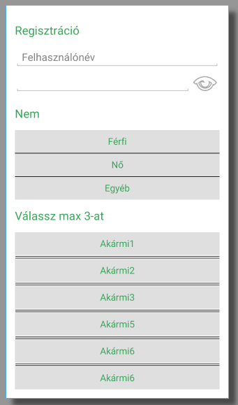

# Labor 2 - Nézetek

A labor során egy regisztrációs nézetet készítünk el, melyben számos egyedi View található. Ezek az egyedi nézetek az előző laborhoz képest nem a View osztályt bővítik, hanem egy meglévő, komplexebb View elemet bővítenek.

A labor során az alábbi dolgokat nézzük meg:

*   Színek és stílusok definiálása erőforrásokban
*   Alapértelmezett téma módosítása
*   Material Paletta színezés generálása
*   Saját View létrehozása
*   Egyedi attribútumok definiálása és kezelése

A labor során az alábbi regisztrációs nézetet rakjuk össze az egyedi View-k segítségével.



Alkalmazás felülete

## Kezdő nézet

Hozzunk létre egy új Android Studio Projektet **ViewLabor** néven.

A Company Domain mező tartalmát töröljük ki és hagyjuk is üresen.

A packagename legyen **hu.bme.aut.amorg.examples.viewlabor**

A támogatott céleszközök a **Telefon és Tablet**, valamint a minimum SDK szint a **API19: Android 4.4**

A kezdő projekthez adjuk hozzá egy **Empty Activity**-t, melynek neve legyen **ViewLaborActivity**.

A legenerált projektből töröljük ki a teszteket (ezekre most nem lesz szükség).

## Material Palette

URL: [https://www.materialpalette.com/](https://www.materialpalette.com/)

A honlap segítségével saját Material színsémát generálhatunk az alkalmazásunkhoz, a két kiválasztott szín segítségével a Material színpalettáról állítja össze a honlap az alkalmazásunk színvilágát.

Nyissuk meg a honlapot, majd az alábbi beállításokkal generáljunk témát:

1.  Elsődleges színnek válasszuk ki a **Green**-t
2.  Másodlagos színnek pedig a **Light Green**-t
3.  Majd a **Download**-ot kiválasztva …
4.  … **XML** formátumban töltsük is le.
5.  A kapott file tartalmát másoljuk a **colors.xml**-be.

Az alkalmazásunkban használt stílusokat pedig a _styles.xml_ állományban definiáljuk.

```xml
<?xml version="1.0" encoding="utf-8"?>
<resources>
	<!-- Base application theme. -->
	<style name="AppTheme" parent="Theme.AppCompat.Light.DarkActionBar">
		<!-- Customize your theme here. -->
		<item name="colorPrimary">@color/primary</item>
		<item name="colorPrimaryDark">@color/primary_dark</item>
		<item name="colorAccent">@color/accent</item>
		<item name="android:textViewStyle">@style/TextView</item>
	</style>

	<style name="TextView" parent="android:Widget.TextView">
		<item name="android:textColor">@color/primary</item>
	</style>

	<style name="Subtitle">
		<item name="android:textSize">20sp</item>
		<item name="android:paddingTop">16dp</item>
		<item name="android:paddingBottom">16dp</item>
	</style>

</resources>
```

Az AndroidManifest állományt megnézve látható, hogy az alkalmazásunk alapértelmezett témája az *AppTheme*. Így amit ebben a stílusban definiálunk, az lesz alapértelmezett kinézet az egész alkalmazásunkban. Az *android:textViewStyle* definiálja, hogy hogy néz ki az adott alkalmazásban az alapértelmezett TextView egy felüldefiniált stílus segítségével. Ezeknek a felüldefiniált stílusoknak minden esetben a beépített stílusból kell leszármaznia, jelen esetünkben a saját TextView stílusunknak az *android:Widget.TextView* stílusból. Ebben megadhatjuk a *textColor* attribútumot, aminek hatására minden TextView alapértelmezett betűszíne megváltozik az ott megadottra.

```xml
<item name="android:textColor">@color/accent</item>
<item name="android:textColorPrimary">@color/accent</item>
<item name="android:textColorSecondary">@color/accent</item>
```

## Saját View létrehozása

A következő lépés az egyedi nézetek létrehozása.

### Kiinduló elrendezés létrehozása

Módosítsuk az Activity elrendezését (*activity_view_labor.xml*), használjuk az alábbi XML-t.

```XML
<ScrollView
	xmlns:android="http://schemas.android.com/apk/res/android"
	android:layout_width="match_parent"
	android:layout_height="match_parent">

	<LinearLayout
		android:layout_width="match_parent"
		android:layout_height="wrap_content"
		android:paddingLeft="@dimen/activity_horizontal_margin"
		android:paddingRight="@dimen/activity_horizontal_margin"
		android:paddingTop="@dimen/activity_vertical_margin"
		android:paddingBottom="@dimen/activity_vertical_margin"
		android:orientation="vertical">

		<TextView
			style="@style/Subtitle"
			android:text="Regisztráció"
			android:layout_width="wrap_content"
			android:layout_height="wrap_content"/>

		<EditText
			android:hint="Felhasználónév"
			android:layout_width="match_parent"
			android:layout_height="wrap_content"/>

		<!-- Ide jön majd a saját jelszó nézet -->

		<TextView
			style="@style/Subtitle"
			android:layout_width="match_parent"
			android:layout_height="wrap_content"
			android:text="Nem"/>

		<!-- Ide jön single ChoiceLayout -->

		<TextView
			style="@style/Subtitle"
			android:layout_width="match_parent"
			android:layout_height="wrap_content"
			android:text="Válassz max 3-at"/>

		<!-- Ide jön multiple ChoiceLayout -->

	</LinearLayout>
	
</ScrollView>
```

Ha az ebben szereplő *dimen* erőforrások hiányoznak, rajtuk **Alt+Enter**-t nyomva hozzuk létre őket, értékük legyen 16dp.

### Egyedi jelszó nézet

Elsőként az egyedi jelszó nézetet valósítjuk meg. Ez a nézet egy beviteli mezőből áll és egy képből, amelyre rákattintva a jelszó mező megmutatja, hogy mit gépeltünk a mezőbe.

Hozzunk létre egy *view* package-et és azon belül egy *PasswordEditText* osztályt, melynek a kódja az alábbi:

```kotlin
@SuppressLint("ClickableViewAccessibility")
class PasswordEditText : RelativeLayout {

    private val passwordEditText by lazy { findViewById<EditText>(R.id.passwordET) }
    private val eyeImageView by lazy { findViewById<ImageView>(R.id.passwordIV) }

    constructor(context: Context) : super(context)
    constructor(context: Context?, attrs: AttributeSet?) : super(context, attrs)
    constructor(context: Context?, attrs: AttributeSet?, defStyleAttr: Int) : super(context, attrs, defStyleAttr)

    init {
        LayoutInflater.from(context).inflate(R.layout.view_password_edittext, this, true)
        
        eyeImageView.setOnTouchListener { view, motionEvent ->
			when (motionEvent.action) {
				MotionEvent.ACTION_DOWN -> {
					setTransformationMethod(null)
					true
				}
				MotionEvent.ACTION_UP, MotionEvent.ACTION_CANCEL -> {
					setTransformationMethod(PasswordTransformationMethod.getInstance())
					true
				}
				else -> false
			}
		}

        setTransformationMethod(PasswordTransformationMethod.getInstance())
    }

    private fun setTransformationMethod(method: TransformationMethod?) {
        val ss = passwordEditText.selectionStart
        val se = passwordEditText.selectionEnd
        passwordEditText.transformationMethod = method
        passwordEditText.setSelection(ss, se)
    }

    fun getText(): Editable? {
        return passwordEditText.text
    }

    fun setError(str: CharSequence) {
        passwordEditText.error = str
    }

    fun setText(text: CharSequence) {
        passwordEditText.setText(text)
    }

    override fun getWindowToken(): IBinder? {
        return passwordEditText.windowToken
    }
    
}
```

Az osztály a RelativeLayout-ból származik. A RelativeLayout elemei pedig egy EditText és egy ImageView lenne úgy, hogy az ImageView-t jobbra rendezzük és az EditText kitölti bal oldalt a rendelkezésre álló helyet. Ahhoz, hogy egy felüldefiniált ViewGroup-ból származó osztálynak kódból meg tudjuk adni az elrendezését szükségünk van egy *merge* layout-ra. Ezt a layout-ot a 

```kotlin
LayoutInflater.from(context).inflate(R.layout.view_password_edittext, this, true)
```
 
kóddal tudjuk a RelativeLayout-ba felfújni, aminek hatására a RelativeLayout-nak lesz két gyerek nézete, egy ImageView és egy EditText.

Az elrendezéshez hozzunk létre egy _view_password_edittext.xml_ layout erőforrást és a tartalma legyen az alábbi kód:

```xml
<?xml version="1.0" encoding="utf-8"?>
<merge xmlns:android="http://schemas.android.com/apk/res/android">

	<ImageView
		android:id="@+id/passwordIV"
		android:layout_alignParentRight="true"
		android:layout_width="50dp"
		android:layout_height="50dp"
		android:layout_centerVertical="true"
		android:src="@android:drawable/ic_menu_view"/>

	<EditText
		android:id="@+id/passwordET"
		android:layout_alignParentLeft="true"
		android:layout_toLeftOf="@+id/passwordIV"
		android:layout_centerVertical="true"
		android:layout_width="0dp"
		android:layout_height="wrap_content"/>

</merge>
```

A laborvezetővel tekintsék át az ImageView és az EditText elhelyezését a RelativeLayout-on belül.

A Kotlin osztály fontosabb függvényei:

*   Konstruktorok: ezek szükségesek az ősosztály megfelelő inicializálásához
*   init: a saját nézetünket inicializálja. "Felfújja" a view-kat valamint beállítja az onTouchListenert-t az ImageView-hoz.
*   setTransformationMethod: átállítja az EditText-hez tartozó szöveg transzformációt, valamint elmenti és visszatölti a kijelölést.
*   getText, setError, setText, getWindowToken: az EditText függvényei, melyet kiajánlunk a saját, RelativeLayout-ból származó osztályunkon kívülre.

A használathoz az alábbi kódot adjuk hozzá az _activity_view_labor.xml_ elrendezés “Ide jön majd a saját jelszó nézet” kommentje után:

```xml
<hu.bme.aut.amorg.examples.viewlabor.PasswordEditText
	android:id="@+id/registrationPET"
	android:layout_width="match_parent"
	android:layout_height="wrap_content"/>
```

Ezután az Activity-ből az alábbi kóddal érhetjük el a saját osztályunkat:

```kotlin
val passwordEditText = findViewById<PasswordEditText>(R.id.registrationPET)
```

### ChoiceLayout

A második egyedi nézet egy különleges választó. Ez egy olyan nézet, amelyhez XML-ben adhatunk gyermek elemeket, amelyek így kiválaszhatóvá válnak a szülőben. A szülő elemben pedig egyedi attribútumok segítségével módosíthatjuk a működést. A **multiple** attribútummal azt szeretnék beállítani, hogy hány elem legyen kijelölhető a ViewGroup-on belül. A **dividerType** attribútum pedig azt adja meg, hogy mi válassza el a benne lévő elemeket (lehet semmilyen, szimpla vonal, dupla vonal).

Ezek alapján az Activity elrendezésében kétszer szeretnénk ezt a nézetet felhasználni.

*   Először egy nem választó nézetet szeretnénk. Itt 3 lehetőség legyen, amik közül a felhasználó maximum 1-et választhat. Az elválasztó elem jelen esetben legyen szimpla vonalas.
*   Másodszor pedig egy 6 opciós választást szeretnénk a felhasználónak nyújtani. Itt a 6 opcióból maximum 3 választható ki. Ebben az esetben az elválasztó elem dupla vonalas.

#### Stílusok definiálása

Első lépésben hozzuk létre a színeket és stílusokat, amiket a nézetünk használni fog.

Színek hozzáadása a _colors.xml_ fájlhoz:
```xml
<color name="choiceItemBackground">#DFDFDF</color>
<color name="choiceItemActiveBackground">#FF45FB95</color>
<color name="choiceItemPressedBackground">#FF3BC769</color>
```

Ezeket a színeket használjuk majd a különböző állapotok hátteréhez.

A háttér megadására több lehetőség van. Megoldhatjuk, hogy kódból figyeljük az egyes állapotok (lenyomva, kiválasztva, normál) változását és kódból állítgatjuk az elemek háttérszínét, azonban ez jelentős plusz munka lenne. Az Android platformon van ennél egyszerűbb megoldás is: használhatjuk a *selector* erőforrást. Ez egy olyan kirajzolható erőforrás, amely a View állapotától függ, amelyhez hozzárendeltük.

Hozzunk létre a drawable mappában egy _selector_choice_item.xml_ fájlt, majd a következő selector kódot másoljuk bele:

```xml
<?xml version="1.0" encoding="utf-8"?>
<selector xmlns:android="http://schemas.android.com/apk/res/android" android:enterFadeDuration="100" android:exitFadeDuration="100">
	<item android:drawable="@color/choiceItemPressedBackground" android:state_pressed="true" />
	<item android:drawable="@color/choiceItemActiveBackground" android:state_selected="true" />
	<item android:drawable="@color/choiceItemBackground" />
</selector>
```

Szükséges stílus hozzáadása a _styles.xml_ fájlhoz:

```xml
<style name="ChoiceOptionStyle">
    <item name="android:gravity">center</item>
    <item name="android:textSize">16sp</item>
    <item name="android:paddingTop">10dp</item>
    <item name="android:paddingBottom">10dp</item>
    <item name="android:background">@drawable/selector_choice_item</item>
</style>
```

Ez a stílus a selector-t használja háttérként, tehát az a View, amely ezt a stílust használja az állapota alapján változtatja majd automatikusan a hátterét.

#### Osztály létrehozása

Kezdetben a *dividerType* attribútumot a Kotlin osztályban kihagyjuk és csak a *multiple* attribútumot implementáljuk.

Attribútumok (hozzuk létre az _attrs.xml_ fájlt):

```xml
<?xml version="1.0" encoding="utf-8"?>
<resources>
	<declare-styleable name="ChoiceLayout">
		<attr name="multiple" format="integer" />
	</declare-styleable>
</resources>
```

Kotlin kód:

```kotlin
class ChoiceLayout : LinearLayout {

    var multiple: Int = 1

    constructor(context: Context) : super(context, null)
    constructor(context: Context, attrs: AttributeSet?) : super(context, attrs) {
        init(context, attrs)
    }

    constructor(context: Context, attrs: AttributeSet?, defStyleAttr: Int) : super(context, attrs, defStyleAttr) {
        init(context, attrs)
    }

    private fun init(context: Context, attrs: AttributeSet?) {
        orientation = LinearLayout.VERTICAL
        attrs ?: return

        val a = context.obtainStyledAttributes(attrs, R.styleable.ChoiceLayout)
        try {
            multiple = a.getInt(R.styleable.ChoiceLayout_multiple, 1)
        } finally {
            a.recycle()
        }
    }

    override fun addView(child: View) {
        super.addView(child)
        refreshAfterAdd(child)
    }

    override fun addView(child: View, params: ViewGroup.LayoutParams?) {
        super.addView(child, params)
        refreshAfterAdd(child)
    }

    private fun getSelectedCount(): Int {
		var selectedCount = 0
		for (i in 0 until childCount) {
			if (getChildAt(i).isSelected) {
				selectedCount++
			}
		}
		return selectedCount
	}

    private fun refreshAfterAdd(child: View) {
        child.isClickable = true
        child.setOnClickListener {
            if (multiple > 1) {
                if (it.isSelected || getSelectedCount() < multiple) {
                    it.isSelected = !it.isSelected
                }
            } else {
                for (i in 0 until childCount) {
                    val v = getChildAt(i)
                    v.isSelected = v == it
                }
            }
        }
    }
}
```

Fontosabb függvények:

*   Konstruktorok: szintén az ős View miatt szükséges a 3 implementáció
*   init: a saját inicializáló függvény. Beállítjuk az orientation-t, majd kiolvassuk az attribútumokat (ha elérhetőek).
*   addView felüldefiniálás: itt kapjuk el azt a hívást, ahol egy új View belekerül a Layout-ba. Itt meghívjuk az ős implementációját, majd a hozzáadott nézeten műveletet végzünk a refreshAfterAdd függvényben
*   refreshAfterAdd: a paraméterként kapott View-t kattinthatóvá állítja, majd beállít egy onClickListener-t a View-ra.
*   getSelectedCount: visszaadja, hogy hány gyerek elem van kiválasztva

Az egyedi attribútumok eléréséhez a context obtainStyledAttributes függvényét használhatjuk. Ez első paraméterként egy *AttributeSet*-et vár (amit az osztály konstruktorában kapunk meg), második paraméterként pedig egy attribútum referencia tömböt. Ezt a tömböt a fordító automatikusan generálja az _attrs.xml_ fájlban megadott tag name attribútuma alapján. Tehát jelen esetben az R.styleable.ChoiceLayout reprezentálja ezt a tömböt.
Az obtainStyledAttributes függvény visszatérési értéke egy TypedArray, ez tartalmazza a lekért attribútumok értékét. A megfelelő get… függvény segítségével lekérhető a megfelelő integer, String vagy bármely egyéb érték, amit XML-ben megadtunk. **FONTOS, hogy a TypedArray használata után mindig kell az aktuális példányon egy recycle() függvényhívás**, amely felszabadítja a használt attribútumokat (erre van a try … finally megoldás a kódban).

Az OnClickListener felelős az egyes elemek kiválasztásáért. Az implementáció két részre oszlik. Amennyiben a multiple változó értéke nagyobb mint 1, tehát több mint 1 elem választható ki: ha éppen kikattintunk egy elemet, akkor megváltoztatjuk a selected értékét az ellentétjére; ha pedig kiválasztunk egy elemet, akkor megnézzük, hogy elértük-e már a maximumot és ez alapján választjuk ki.
A másik esetben a multiple értéke 1\. Ilyenkor csak egyetlen elem választható ki; a kiválasztás során az előző kiválasztást kiszedjük és csak az újat hagyjuk bent.

#### Használat XML-ből

```xml
<hu.bme.aut.amorg.examples.viewlabor.ChoiceLayout
	android:id="@+id/firstCL"
	app:multiple="1"
	android:layout_width="match_parent"
	android:layout_height="wrap_content">

	<TextView
		style="@style/ChoiceOptionStyle"
		android:layout_width="match_parent"
		android:layout_height="wrap_content"
		android:text="Férfi"/>

	<TextView
		style="@style/ChoiceOptionStyle"
		android:layout_width="match_parent"
		android:layout_height="wrap_content"
		android:text="Nő"/>

	<TextView
		style="@style/ChoiceOptionStyle"
		android:layout_width="match_parent"
		android:layout_height="wrap_content"
		android:text="Egyéb"/>
</hu.bme.aut.amorg.examples.viewlabor.ChoiceLayout>
```

Második ChoiceLayout hozzáadása az activity_view_labor.xml-hez:

```xml
<hu.bme.aut.amorg.examples.viewlabor.ChoiceLayout
	android:id="@+id/secondCL"
	android:layout_width="match_parent"
	android:layout_height="wrap_content"
	app:multiple="3">

	<TextView
		style="@style/ChoiceOptionStyle"
		android:layout_width="match_parent"
		android:layout_height="wrap_content"
		android:text="Akármi1"/>

	<TextView
		style="@style/ChoiceOptionStyle"
		android:layout_width="match_parent"
		android:layout_height="wrap_content"
		android:text="Akármi2"/>

	<TextView
		style="@style/ChoiceOptionStyle"
		android:layout_width="match_parent"
		android:layout_height="wrap_content"
		android:text="Akármi3"/>

	<TextView
		style="@style/ChoiceOptionStyle"
		android:layout_width="match_parent"
		android:layout_height="wrap_content"
		android:text="Akármi4"/>

	<TextView
		style="@style/ChoiceOptionStyle"
		android:layout_width="match_parent"
		android:layout_height="wrap_content"
		android:text="Akármi5"/>

	<TextView
		style="@style/ChoiceOptionStyle"
		android:layout_width="match_parent"
		android:layout_height="wrap_content"
		android:text="Akármi6"/>
</hu.bme.aut.amorg.examples.viewlabor.ChoiceLayout>
```

A saját attribútumok saját névtéren keresztül érhetőek el, ez konvenció szerint **app**, az app névtérre állva _Alt+Enter_ segítségével felvehető.

Látható, hogy a saját View behivatkozás szintén a teljes, package nevet is tartalmazó osztálynév segítségével történik. A multiple attribútum használatára mindkét esetben látunk példát az erőforrásban. Az **app** attribútumhoz is működik Android Studio alatt a kódkiegészítés, érdemes kipróbálni.

#### ChoiceLayout kiegészítése a dividerType attribútummal

Azt szeretnénk megoldani, hogy az egyes kiválasztható elemek között egyedi, a nézet által definiált elválasztó elem legyen, ahol több lehetőség közül választhatunk.

Ehhez első lépésben az _attrs.xml_ állományt kell módosítani. Hozzá kell adni a **declare-styleable tag-en belül** az alábbi elemeket:

```xml
<attr name="dividerType" format="enum">
			<enum name="none" value="0" />
			<enum name="simple_divider" value="1" />
			<enum name="double_divider" value="2" />
</attr>
```

Ez most egy másik formátum. A *multiple* integer formátumú attribútum volt, most viszont 3 érték közül szeretnénk majd választani. Ehhez enum formátumot kell használni. Ezt megadva az adott attr tag gyerek elemei definiálják a lehetséges értékeket. Jelen esetben lehet none: kikapcsolt; simple_divider: egyszerű vonal; double_divider: dupla vonal.

A két divider típushoz első lépésben definiálunk két kirajzolható erőforrást a drawable mappában. Ehhez xml-ben leírt drawable elemeket használunk.

Az első elem a szimpla vonal, melyhez létrehozunk egy _choice_divider_simple.xml_ erőforrást az alábbi tartalommal:

```xml
<?xml version="1.0" encoding="utf-8"?>
<shape xmlns:android="http://schemas.android.com/apk/res/android">
	<solid android:color="#000000" />
	<size android:height="1dp" />
</shape>
```

Itt lérehozunk egy egyszerű shape elemet, aminek egyszínű hátteret adunk (fekete) és beállítjuk 1dp magasra.

A második elem a dupla vonal, melyhez a __choice_divider_double.xml__ erőforrást hozzuk létre:

```xml
<?xml version="1.0" encoding="utf-8"?>
<layer-list xmlns:android="http://schemas.android.com/apk/res/android">
	<item android:bottom="3dp">
		<shape android:shape="line">
			<stroke android:color="#000000" android:width="1dp" />
			<size android:height="4dp" />
		</shape>
	</item>
	<item android:top="3dp">
		<shape android:shape="line">
			<stroke	android:color="#000000"	android:width="1dp" />
			<size android:height="4dp" />
		</shape>
	</item>
</layer-list>
```

Ebben az esetben egy kicsit komplexebb leírást használunk. Itt egy *layer-list* elemben definiálunk több elemet. Ennek a lényege, hogy az egyes elemek majd egymásra rajzolódnak és így definiálható komplexebb grafika XML-ben. Az első item-e a layer-list-nek egy vonal, amely a 4dp magas vásznon 1dp széles vonalat húz alsó, 3dp-s padding-gal. A második elem pedig szintén egy ugyanilyen vonalat húz, de felső, 3dp-s padding-gal. Ennek eredménye egy 4 dp magas kép, aminek a felső és alsó pixele fekete. Ezt széltében nyújtva horizontális vonalat kapunk.

Tehát ezt a két drawable elemet fogjuk felhasználni divider-ként a ChoiceLayout-ban. Következő lépésben a ChoiceLayout osztályt kell kiegészíteni.

Adjuk hozzá az osztályhoz a Divider lehetséges értékeit companion object-ként:

```kotlin
companion object {
	private const val DIVIDER_NONE = 0
	private const val DIVIDER_SIMPLE = 1
	private const val DIVIDER_DOUBLE = 2
}

var dividerType:Int = DIVIDER_NONE
```

Ezután ki kell olvasni az *initLayout* függvényben az elválasztó típust az attribútumok közül. Ehhez a *multiple* kiolvasás után adjuk hozzá az alábbi sort:

```kotlin
dividerType = a.getInt(R.styleable.ChoiceLayout_dividerType, 0)
```

Hozzáadunk az osztályhoz egy új függvényt, ami a divider elem hozzáadást végzi:

```kotlin
private fun addDivider() {
    if (dividerType != DIVIDER_NONE) {
        val div = ImageView(context)
        when (dividerType) {
            DIVIDER_SIMPLE -> div.setImageResource(R.drawable.choice_divider_simple)
            DIVIDER_DOUBLE -> div.setImageResource(R.drawable.choice_divider_double)
        }
        val lp: LinearLayout.LayoutParams = LinearLayout.LayoutParams(ViewGroup.LayoutParams.MATCH_PARENT, ViewGroup.LayoutParams.WRAP_CONTENT)
        super.addView(div,lp)
    }
}
```

A függvény létrehoz egy ImageView-t és a dividerType alapján beállítja az előbbiekben létrehozott két drawable közül a megfelelőt ennek az ImageView-nak. LayoutParams segítségével beállítjuk, hogy a magassága a tartalom alapján dőljön el, míg a szélessége a szülő alapján. Ezután az addView függvény segítségével hozzáadjuk a View-t a saját layout-hoz. Azért az ős függvényét hívjuk, hogy ne fusson le a saját addView logikánk, amit a kijelölhetőség érdekében hoztunk létre.

Ezután mindkét *addView* függvény elejére beillesztjük az alábbi kódot:

```kotlin
if (childCount > 0) {
	addDivider()
}
```

Ez biztosítja, hogy minden elem hozzáadás előtt bekerül egy divider a layout-ba (kivétel az első elem hozzáadásánál, mert ott nincs szükség rá).

Ezzel végeztünk a ChoiceLayout osztály módosításával. Már csak egyetlen dolog maradt hátra: használjuk az új attribútumot. Ehhez az activity elrendezését módosítsuk úgy, hogy mindkét ChoiceLayout kapjon egy újabb custom attribútumot, dividerType névvel. Az első nézetnél legyen:

```xml
app:dividerType="simple_divider"
```

A második nézetnél legyen:

```xml
app:dividerType="double_divider"
```


Érdemes megfigyelni, hogy az enumeráció lehetséges értékeiben segít a kódkiegészítés.

## Önálló feladat

Módosítsa a PasswordEditText osztályt úgy, hogy attribútumként megadható legyen a jelszó mezőben található kép.
Segítség:

*   Új attribútum az **attrs.xml**-be. A típusa legyen _reference_.
*   Ezt a feldolgozó osztályban ResourceId-ként olvashatjuk ki (_getResourceId()_ függvény).
*   Az így kapott azonosítóhoz tartozó Drawable-t, a _getResources().getDrawable(resourceId)_ függvény segítségével kérhetjük le.
*   A PasswordEditText osztály _init_ függvényének bővítése, hogy az _attrs_ paraméterből olvassa ki a referenciát
*   Az attribútum használata az Activity elrendezésében
*   A kinyert Drawable beállítása az eyeImageView objektum képének (_setImageDrawable()_ függvény)
