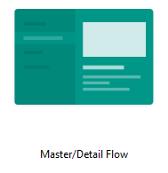

# 3. Labor - Todo Alkalmazás

A labor célja, hogy bemutassa, hogyan lehet ún. Master/Detail nézetet tartalmazó alkalmazást készíteni, kiemelve a Fragment-eket és az  erőforrásminősítők használatát.

Első lépésben készítsünk egy új alkalmazást, neve legyen **Todo**

A package név legyen:

```xml
hu.bme.aut.amorg.examples.todo
```

A sablonválasztónál válasszuk a **Master/Detail Flow** opciót!



A következő ablakban írjuk be rendre, hogy **Todo, Todos, Todos**! Ennek csak a generált sablonban van szerepe, de legalább az Activity nevét nem kell később átírnunk.

Laborvezetővel elemezzék a generált alkalmazás működését, próbálják ki emulátoron, készüléken! A Master/Detail nézet célja, hogy egyetlen alkalmazással megoldjunk egy lista és annak egy elemének megjelenítését tableten és mobiltelefonon egyaránt. Működésének a lényege, hogy egy activity-hez tartozó layoutnak kétféle változata van. Egy kétpaneles és egy egypaneles változat. Egy módszer az, ha erőforrás minősítőkkel biztosítjuk, hogy tableten a kétpaneles változat töltődjön be, míg mobilon az egypaneles. Az activityben megpróbálunk referenciát szerezni a második panelre, és ha sikerül, akkor tableten vagyunk, ha nem, akkor mobilon. Az első panel tartalma egy **RecyclerView** a másodiké pedig egy sima Fragment a lista egy elemének megjelenítésére. Ha mobilon vagyunk, akkor a listaelemre kattintva új activitybe töltjük a részletező fragmentet, míg tableten egyszerűen betöltjük a jobb oldali panelbe. (a generált kód másképpen működik, ott a refs.xml állomány-t minősíti)

## Átalakítás Todo alkalmazássá

Készítsen egy új package-t **model** néven, ebbe pedig hozza létre a **Todo** osztályt! (Getter és Setter Android Studióban automatikusan is generálható: *Alt + Insert -> Getter And Setter -> az összes tagváltozó kijelölése majd OK*)

```java
public class Todo {


    public interface Priority {
        int LOW = 0;
        int MEDIUM = 1;
        int HIGH = 2;
    }

    private String title;
    private int priority;
    private String dueDate;
    private String description;

    public Todo(String title, int priority, String dueDate, String description) {
        this.title = title;
        this.priority = priority;
        this.dueDate = dueDate;
        this.description = description;
    }

    public String getTitle() {
        return title;
    }

    public void setTitle(String title) {
        this.title = title;
    }

    public int getPriority() {
        return priority;
    }

    public void setPriority(int priority) {
        this.priority = priority;
    }

    public String getDueDate() {
        return dueDate;
    }

    public void setDueDate(String dueDate) {
        this.dueDate = dueDate;
    }

    public String getDescription() {
        return description;
    }

    public void setDescription(String description) {
        this.description = description;
    }
}
```

Figyeljük meg az osztály eleji interfészt! Az interfészben deklarált mezők **public static final** mezőkké fordulnak. Ezen konstansoknak megfelelő ikonokat fogunk használni a listában.

Töröljük ki a **dummy** nevű package-t!

Írjuk felül a TodoDetailFragment osztály tartalmát, mely a Todo leírását fogja megjeleníteni.

A TodoDetailFragment tartalma az alábbi:

```java
public class TodoDetailFragment extends Fragment {

    public static final String TAG = "TodoDetailFragment";

    public static final String KEY_TODO_DESCRIPTION = "todoDesc";

    private TextView todoDescription;

    private static Todo selectedTodo;

    public static TodoDetailFragment newInstance(String todoDesc) {
        TodoDetailFragment result = new TodoDetailFragment();

        Bundle args = new Bundle();
        args.putString(KEY_TODO_DESCRIPTION, todoDesc);
        result.setArguments(args);

        return result;
    }

    public static TodoDetailFragment newInstance(Bundle args) {
        TodoDetailFragment result = new TodoDetailFragment();

        result.setArguments(args);

        return result;
    }

    @Override
    public void onCreate(Bundle savedInstanceState) {
        super.onCreate(savedInstanceState);

        if (savedInstanceState == null) {
            if (getArguments() != null) {
                selectedTodo = new Todo("cim", Todo.Priority.LOW, "1987.23.12",
                        getArguments().getString(KEY_TODO_DESCRIPTION));
            }
        }
    }

    @Override
    public View onCreateView(LayoutInflater inflater, ViewGroup container,
                             Bundle savedInstanceState) {
        View root = inflater.inflate(R.layout.todo_detail, container,
                false);

        todoDescription = (TextView) root.findViewById(R.id.todo_detail);
        todoDescription.setText(selectedTodo.getDescription());

        return root;
    }
}
```

A megváltozott kulcs miatt át kell alakítani a TodoDetailActivity onCreate metódusát is.

```java
arguments.putString(TodoDetailFragment.KEY_TODO_DESCRIPTION, getIntent().getStringExtra(TodoDetailFragment.KEY_TODO_DESCRIPTION));
```

A két Activity és a jobb oldali panel már fel van készítve az új működésre. A Listactivity el tudja dönteni, hogy egy vagy két panel jelenik meg, listenerként pedig majd betölti a DetailActivityt vagy a jobb oldali fragmentet.

Már csak egy dolog van hátra: ahhoz, hogy a Todoink megfelelően jelenjenek meg a listában, módosítanunk kell a sablonban létrejött *SimpleItemRecyclerViewAdapter*-t. Először is töröljük a TodoListActivity-ből az SimpleItemRecyclerViewAdapter belső osztályt és hozzunk létre a **SimpleItemRecyclerViewAdapter** osztályt az **adapter** package-ben. Ennek tartalma legyen a következő:

```java
public class SimpleItemRecyclerViewAdapter
        extends RecyclerView.Adapter<SimpleItemRecyclerViewAdapter.ViewHolder> {

    private boolean mTwoPane;
    private AppCompatActivity activity;

    private final List<Todo> todos;

    public SimpleItemRecyclerViewAdapter(List<Todo> todos, boolean mTwoPane, AppCompatActivity activity) {
        this.todos = todos;
        this.mTwoPane = mTwoPane;
        this.activity = activity;
    }

    @Override
    public ViewHolder onCreateViewHolder(ViewGroup parent, int viewType) {
        View view = LayoutInflater.from(parent.getContext())
                .inflate(R.layout.row_todo, parent, false);
        return new ViewHolder(view);
    }


    @Override
    public void onBindViewHolder(final ViewHolder holder, final int position) {
        holder.mTodo = todos.get(position);
        holder.title.setText(todos.get(position).getTitle());
        holder.dueDate.setText(todos.get(position).getDueDate());

        switch (todos.get(position).getPriority()) {
            case Todo.Priority.LOW:
                holder.priority.setImageResource(R.drawable.ic_low);
                break;
            case Todo.Priority.MEDIUM:
                holder.priority.setImageResource(R.drawable.ic_medium);
                break;
            case Todo.Priority.HIGH:
                holder.priority.setImageResource(R.drawable.ic_high);
                break;
            default:
                holder.priority.setImageResource(R.drawable.ic_high);
                break;
        }

        holder.mView.setOnClickListener(new View.OnClickListener() {
            @Override
            public void onClick(View v) {
                if (mTwoPane) {
                    Bundle arguments = new Bundle();
                    arguments.putString(TodoDetailFragment.KEY_TODO_DESCRIPTION, todos.get(position).getDescription());
                    TodoDetailFragment fragment = new TodoDetailFragment();
                    fragment.setArguments(arguments);
                    activity.getSupportFragmentManager().beginTransaction()
                            .replace(R.id.todo_detail_container, fragment)
                            .commit();
                } else {
                    Context context = v.getContext();
                    Intent intent = new Intent(context, TodoDetailActivity.class);
                    intent.putExtra(TodoDetailFragment.KEY_TODO_DESCRIPTION, todos.get(position).getDescription());

                    context.startActivity(intent);
                }
            }
        });

    }

    public void deleteRow(int position) {
        todos.remove(position);
        notifyDataSetChanged();
    }


    public void addItem(Todo aTodo) {
        todos.add(aTodo);
    }

    @Override
    public int getItemCount() {
        return todos.size();
    }

    public class ViewHolder extends RecyclerView.ViewHolder {
        public final View mView;
        public final TextView dueDate;
        public final TextView title;
        public final ImageView priority;
        public Todo mTodo;

        public ViewHolder(View view) {
            super(view);
            mView = view;
            title = (TextView) view.findViewById(R.id.textViewTitle);
            dueDate = (TextView) view.findViewById(R.id.textViewDueDate);
            priority = (ImageView) view.findViewById(R.id.imageViewPriority);
        }
    }
}
```
Figyeljük meg a ViewHolder patternt az adapterben. A RecyclerView már kikényszeríti ennek használatát, mivel így jóval gyorsabb szoftvert kapunk.

Ez az adapter hivatkozik egy **row_todo.xml**-re. Hozzuk létre ezt az álloimányt a _res/layout_ mappába (new -> layout resource file -> Filename: row_todo.xml -> OK):


```xml
<?xml version="1.0" encoding="utf-8"?>
<LinearLayout
    xmlns:android="http://schemas.android.com/apk/res/android"
    android:orientation="horizontal"
    android:layout_width="fill_parent"
    android:layout_height="wrap_content">

    <ImageView
        android:id="@+id/imageViewPriority"
        android:layout_height="wrap_content"
        android:layout_width="wrap_content"
        android:src="@drawable/ic_high"
        android:padding="5dp"/>

    <RelativeLayout
        android:layout_margin="8dp"
        android:layout_height="wrap_content"
        android:layout_width="fill_parent">

        <TextView
            android:id="@+id/textViewTitle"
            android:textSize="16dp"
            android:text="Title"
            android:layout_width="wrap_content"
            android:layout_height="wrap_content"
            android:layout_alignParentTop="true"/>

        <TextView
            android:id="@+id/textViewDueDate"
            android:textSize="12dp"
            android:text="DueDate"
            android:layout_width="wrap_content"
            android:layout_height="wrap_content"
            android:layout_below="@id/textViewTitle"
            android:layout_alignParentBottom="true"
            android:gravity="bottom"/>
    </RelativeLayout>

</LinearLayout>
```

Szükségünk van még a nézetekhez az alábbi három képre. Ezek különböző méreteinek legenerálásához használjuk az [Asset Studio](https://romannurik.github.io/AndroidAssetStudio/index.html)-t (azon belül a Generic icon generator-t), majd a kapott mappákat másoljuk a _res_ mappába.


Írjuk felül a TodoListActivity **setupRecyclerView** metódusát az alábbi kóddal. (Ez a metódus felel az adapter példaadatokkal való feltöltéséért.)

```java
private void setupRecyclerView(@NonNull RecyclerView recyclerView) {
    ArrayList<Todo> todos = new ArrayList<Todo>();
    todos.add(new Todo("title1", Todo.Priority.LOW, "2011. 09. 26.", "description1"));
    todos.add(new Todo("title2", Todo.Priority.MEDIUM, "2011. 09. 27.", "description2"));
    todos.add(new Todo("title3", Todo.Priority.HIGH, "2011. 09. 28.", "description3"));
    recyclerView.setAdapter(new SimpleItemRecyclerViewAdapter(todos, mTwoPane, TodoListActivity.this));
}
```


Ha valamelyik osztályban még hibát jelezne az IDE, ellenőrizzük, hogy nem-e maradt felesleges import a **dummy** csomag elemeire.

Mivel a generált kód előbb állítja be az adapter, mint hogy eldöntené hogy telefon/tablet az eszköz, így ezt a két hívást meg kell cserélnünk a TodoListActivity onCreate metódusban:


```java
    @Override
    protected void onCreate(Bundle savedInstanceState) {
        super.onCreate(savedInstanceState);
        setContentView(R.layout.activity_todo_list);

        Toolbar toolbar = (Toolbar) findViewById(R.id.toolbar);
        setSupportActionBar(toolbar);
        toolbar.setTitle(getTitle());

        FloatingActionButton fab = (FloatingActionButton) findViewById(R.id.fab);
        fab.setOnClickListener(new View.OnClickListener() {
            @Override
            public void onClick(View view) {
                Snackbar.make(view, "Replace with your own action", Snackbar.LENGTH_LONG)
                        .setAction("Action", null).show();
            }
        });

        View recyclerView = findViewById(R.id.todo_list);
        assert recyclerView != null;

        if (findViewById(R.id.todo_detail_container) != null) {
            // The detail container view will be present only in the
            // large-screen layouts (res/values-w900dp).
            // If this view is present, then the
            // activity should be in two-pane mode.
            mTwoPane = true;
        }

        setupRecyclerView((RecyclerView) recyclerView);
    }
```


Próbálja ki az alkalmazást!
Tipp: A gyorsabb teszteléshez, keresse ki a tablet mérethez tartozó (layout-w900dp) `todo_list.xml` felületleírót, majd másolja a layount-land mappába (hozza létre a mappát!). Ezáltal a mobiltelefon álló orientációjában egy-, míg fekvtetve kétpaneles viselkedést kapunk.

## Todo törlése

Az adapterben láttuk a törlésre szolgáló metódust, hát használjuk is! A cél, hogy egy Todora hosszan érintve megjelenjen egy menü, ahol törölhetjük a Todot.
Az elemek érintés eseménykezelője már el van készítve, a todo törléséhez készítsünk az elemekhez hosszú érintés gesztus detektálót, majd ekkor dobjunk fel egy popup ablakot, ahol a kívánt művelet kiválasztható lesz. Adjuk hozzá az alábbi sorokat az Adapter _onBindViewHolder_ metódusához:

```java
holder.mView.setOnLongClickListener(new View.OnLongClickListener() {
    @Override
    public boolean onLongClick(View v) {
        PopupMenu popup = new PopupMenu(v.getContext(), v);
        popup.inflate(R.menu.menu_todo);
        popup.setOnMenuItemClickListener(new PopupMenu.OnMenuItemClickListener() {
            @Override
            public boolean onMenuItemClick(MenuItem item) {
                if (R.id.delete == item.getItemId()) {
                    deleteRow(position);
                }
                return false;
            }
        });
        popup.show();
        return false;
    }
});
```

Az onCreateContextMenu hivatkozik egy layout erőforrásra, ami tartalmazza a lehetséges menüpontokat. Hozzuk létre a `menu_todo.xml` fájlt a menu mappában.
(Legegyszerűbb módon az `R.menu.menu_todo` piros részére helyezve a kurzort, majd ALT+ENTER -> “Create menu resource file…”)

```xml
<?xml version="1.0" encoding="utf-8"?>
<menu xmlns:android="http://schemas.android.com/apk/res/android"
    xmlns:app="http://schemas.android.com/apk/res-auto">
    <item
        android:id="@+id/delete"
        android:title="DELETE"
        app:showAsAction="always" />
    <item
        android:id="@+id/back"
        android:title="BACK"
        app:showAsAction="always" />
</menu>
```

Próbáljuk ki a törlést!

## Új Todo létrehozása

A TodoListActivity-hez adjunk egy saját menüt, melyben egy „Create new Todo” menüpont található, melyet kiválasztva dialógus formában egy új DialogFragment jelenik meg, hasonlóan a korábbi laboron látott megoldáshoz.

Ehhez természetesen szükségünk lesz egy menü erőforrásra. A _menu_ mappában hozzuk létre a **menu_list.xml** állományt!

```xml
<?xml version="1.0" encoding="utf-8"?>
<menu xmlns:android="http://schemas.android.com/apk/res/android">
    <item android:id="@+id/itemCreateTodo"
        android:title="@string/itemCreateTodo"/>
</menu>
```

Hozzuk létre a hiányzó szöveges erőforrást is! (Hibára állva Alt+Enter segít):


```xml
<string name="itemCreateTodo">Create</string>
```

Majd az _TodoListActivity_-n belül kezeljük az ehhez tartozó metódusokat is. Az OptionsMenu-höz is van onCreate és onOptionsItemSelected metódus:

```java
@Override
public boolean onCreateOptionsMenu(Menu menu) {
    getMenuInflater().inflate(R.menu.menu_list, menu);
    return super.onCreateOptionsMenu(menu);
}

@Override
public boolean onOptionsItemSelected(MenuItem item) {
    if (item.getItemId() == R.id.itemCreateTodo) {
        TodoCreateFragment createFragment = new TodoCreateFragment();
        android.support.v4.app.FragmentManager fm = getSupportFragmentManager();
        createFragment.show(fm, TodoCreateFragment.TAG);
    }
    return super.onOptionsItemSelected(item);
}
```

Készítsünk egy új osztályt **TodoCreateFragment** néven ami a _DialogFragment_-ből származik. Az onAttach hívás során ellenőrizzük, hogy van-e listener objektum beregisztrálva a dialógusunk számára. A TodoListActivity fog értesülni az új Todo-ról, úgy ahogyan a TodoCreateFragment-ünk is értesülni fog a dátumválasztásról.

```java
public class TodoCreateFragment extends DialogFragment{

    public static final String TAG = "TodoCreateFragment";

    // UI
    private EditText editTodoTitle;
    private Spinner spnrTodoPriority;
    private TextView txtDueDate;
    private EditText editTodoDescription;

    // Listener
    private TodoCreatedListener listener;

    @Override
    public void onAttach(Activity activity) {
        super.onAttach(activity);

        if (getTargetFragment() != null) {
            try {
                listener = (TodoCreatedListener) getTargetFragment();
            } catch (ClassCastException ce) {
                Log.e(TAG,
                        "Target Fragment does not implement fragment interface!");
            } catch (Exception e) {
                Log.e(TAG, "Unhandled exception!");
                e.printStackTrace();
            }
        } else {
            try {
                listener = (TodoCreatedListener) activity;
            } catch (ClassCastException ce) {
                Log.e(TAG,
                        "Parent Activity does not implement fragment interface!");
            } catch (Exception e) {
                Log.e(TAG, "Unhandled exception!");
                e.printStackTrace();
            }
        }
    }

    @Override
    public View onCreateView(LayoutInflater inflater, ViewGroup container,
                             Bundle savedInstanceState) {
        View root = inflater.inflate(R.layout.fragment_create, container, false);

        // Dialog cimenek beallitasa
        getDialog().setTitle(R.string.itemCreateTodo);

        // UI elem referenciak elkerese
        editTodoTitle = (EditText) root.findViewById(R.id.todoTitle);

        spnrTodoPriority = (Spinner) root.findViewById(R.id.todoPriority);
        String[] priorities = new String[3];
        priorities[0] = "Low";
        priorities[1] = "Medium";
        priorities[2] = "High";
        spnrTodoPriority.setAdapter(new ArrayAdapter<String>(getActivity(),
                android.R.layout.simple_spinner_item, priorities));

        txtDueDate = (TextView) root.findViewById(R.id.todoDueDate);
        txtDueDate.setText("  -  ");
        txtDueDate.setOnClickListener(new View.OnClickListener() {
            public void onClick(View v) {
                //Itt jon a datumvalaszto
            }
        });

        editTodoDescription = (EditText) root
                .findViewById(R.id.todoDescription);

        // A gombok esemenykezeloinek beallitasa
        Button btnOk = (Button) root.findViewById(R.id.btnCreateTodo);
        btnOk.setOnClickListener(new View.OnClickListener() {
            public void onClick(View v) {
                int selectedPriority = Todo.Priority.LOW;

                switch (spnrTodoPriority.getSelectedItemPosition()) {
                    case 0:
                        selectedPriority = Todo.Priority.LOW;
                        break;
                    case 1:
                        selectedPriority = Todo.Priority.MEDIUM;
                        break;
                    case 2:
                        selectedPriority = Todo.Priority.HIGH;
                        break;
                    default:
                        break;
                }

                if (listener != null) {
                    listener.onTodoCreated(new Todo(editTodoTitle.getText()
                            .toString(), selectedPriority, txtDueDate.getText()
                            .toString(), editTodoDescription.getText()
                            .toString()));
                }

                dismiss();
            }
        });

        Button btnCancel = (Button) root.findViewById(R.id.btnCancelCreateTodo);
        btnCancel.setOnClickListener(new View.OnClickListener() {
            public void onClick(View v) {
                dismiss();
            }
        });

        return root;
    }

    // Listener interface
    public interface TodoCreatedListener {
        public void onTodoCreated(Todo newTodo);
    }
}
```

Most ugorjunk vissza a TodoListActivity-re, és valósítsuk meg az TodoCreatedListener interfészt! Ehhez a RecyclerView adapteréből készítsünk mezőt, majd írjuk meg az interfész által elvárt metódust:

Új mező az adapterből:

```java
private SimpleItemRecyclerViewAdapter adapter;
```

_OnCreate_-ben, SetupRecyclerView metódus után:

```java
adapter = (SimpleItemRecyclerViewAdapter) ((RecyclerView) recyclerView).getAdapter();
```

OnTodoCreated interface megvalósítása:

```java
public class TodoListActivity extends AppCompatActivity implements TodoCreateFragment.TodoCreatedListener
```

```java
    @Override
    public void onTodoCreated(Todo newTodo) {
        adapter.addItem(newTodo);
        adapter.notifyDataSetChanged();
    }
```

Hozzuk létre a fragment layoutját, ez a **fragment_create.xml** ,tartalma a következő:

```xml
<?xml version="1.0" encoding="utf-8"?>
<TableLayout xmlns:android="http://schemas.android.com/apk/res/android"
    android:layout_width="wrap_content"
    android:layout_height="wrap_content"
    android:stretchColumns="1">
    <TableRow>
        <TextView
            android:layout_column="1"
            android:text="@string/lblTodoTitle"
            android:layout_width="wrap_content"
            android:gravity="right"/>
        <EditText
            android:id="@+id/todoTitle"
            android:width="200dp"/>
    </TableRow>
    <TableRow>
        <TextView
            android:layout_column="1"
            android:text="@string/lblTodoPriority"
            android:layout_width="wrap_content"
            android:gravity="right"/>
        <Spinner
            android:id="@+id/todoPriority"
            android:width="200dp"/>
    </TableRow>
    <TableRow>
        <TextView
            android:layout_column="1"
            android:text="@string/lblTodoDueDate"
            android:layout_width="wrap_content"
            android:gravity="right"/>
        <TextView
            android:id="@+id/todoDueDate"
            android:textSize="20dp"
            android:width="200dp"
            android:gravity="center"/>
    </TableRow>
    <TableRow>
        <TextView
            android:layout_column="1"
            android:text="@string/lblTodoDescription"
            android:layout_width="wrap_content"
            android:gravity="right"/>
        <EditText
            android:id="@+id/todoDescription"
            android:width="200dp"
            android:text=""/>
    </TableRow>

    <TableRow>
        <Button
            android:id="@+id/btnCreateTodo"
            android:layout_column="1"
            android:text="@string/btnOk"
            android:layout_width="wrap_content"
            android:gravity="right"/>
        <Button
            android:id="@+id/btnCancelCreateTodo"
            android:text="@string/btnCancel"
            android:layout_width="wrap_content"
            android:gravity="left"/>
    </TableRow>
</TableLayout>
```

Szöveges erőforrásokat vagy hozzuk létre, vagy másoljuk be őket a string.xml-be:

```xml
<string name="lblTodoTitle">Todo label</string>
<string name="lblTodoPriority">Priority</string>
<string name="lblTodoDueDate">Due date</string>
<string name="lblTodoDescription">Description</string>
<string name="btnOk">OK</string>
<string name="btnCancel">Cancel</string>
<string name="dummyDescription">dummyDescription</string>
```

Ezek után ellenőrizzük, hogy működik az új Todo felvitele (kivéve a dátumválasztást)!

## Önálló feladat

### Dátumválasztó elkészítése

A _TodoCreateFragment_-ünk implementálja a _DateListener_ interfészét a _DatePickerDialogFragment_-ünknek, így a Dátumválasztásról értesül az új Todo felvitele DialogFragment-ünk. Először is csináljuk még egy DialogFragment-ből származó osztályt, ezúttal nevezzük **DatePickerDialogFragment**-nek.

Importálásnál használjuk az _android.support.v4.DialogFragment_-et, _java.util.calendar_-t, _java.util.date_-t

```java
public class DatePickerDialogFragment extends DialogFragment {

    // Log tag
    public static final String TAG = "DatePickerDialog";

    // State
    private Calendar calSelectedDate = Calendar.getInstance();

    // Listener
    private DateListener listener;

    @Override
    public void onAttach(Activity activity) {
        super.onAttach(activity);

        if (getTargetFragment() != null) {
            try {
                listener = (DateListener) getTargetFragment();
            } catch (ClassCastException ce) {
                Log.e(TAG,
                        "Target Fragment does not implement fragment interface!");
            } catch (Exception e) {
                Log.e(TAG, "Unhandled exception!");
                e.printStackTrace();
            }
        } else {
            try {
                listener = (DateListener) activity;
            } catch (ClassCastException ce) {
                Log.e(TAG,
                        "Parent Activity does not implement fragment interface!");
            } catch (Exception e) {
                Log.e(TAG, "Unhandled exception!");
                e.printStackTrace();
            }
        }
    }

    @Override
    public void onCreate(Bundle savedInstanceState) {
        super.onCreate(savedInstanceState);

        calSelectedDate.setTime(new Date(System.currentTimeMillis()));
    }

    @Override
    public Dialog onCreateDialog(Bundle savedInstanceState) {
        return new DatePickerDialog(getActivity(), mDateSetListener,
                calSelectedDate.get(Calendar.YEAR),
                calSelectedDate.get(Calendar.MONTH),
                calSelectedDate.get(Calendar.DAY_OF_MONTH));
    }

    private DatePickerDialog.OnDateSetListener mDateSetListener = new DatePickerDialog.OnDateSetListener() {
        public void onDateSet(DatePicker view, int year, int monthOfYear,
                int dayOfMonth) {

            calSelectedDate.set(Calendar.YEAR, year);
            calSelectedDate.set(Calendar.MONTH, monthOfYear);
            calSelectedDate.set(Calendar.DAY_OF_MONTH, dayOfMonth);

            if (listener != null) {
                listener.onDateSelected(buildDateText());
            }

            dismiss();
        }
    };

    private String buildDateText() {
        StringBuilder dateString = new StringBuilder();
        dateString.append(calSelectedDate.get(Calendar.YEAR));
        dateString.append(". ");
        dateString.append(calSelectedDate.get(Calendar.MONTH) + 1);
        dateString.append(". ");
        dateString.append(calSelectedDate.get(Calendar.DAY_OF_MONTH));
        dateString.append(".");

        return dateString.toString();
    }

    public interface DateListener{
        public void onDateSelected(String date);
    }

}
```

Ugorjunk vissza a _TodoCreateFragment_-re és valósítsuk meg a *DateListener* interfészt, illetve állítsuk be a txtDueDate onClickListener(…)-jében, hogy mutassunk egy DialogFragment-et.

```java
public class TodoCreateFragment extends DialogFragment implements DatePickerDialogFragment.DateListener

```


```java
private void showDatePickerDialog() {
    FragmentManager fm = getFragmentManager();

    DatePickerDialogFragment datePicker = new DatePickerDialogFragment();
    datePicker.setTargetFragment(this, 0);
    datePicker.show(fm, DatePickerDialogFragment.TAG);
}

@Override
public void onDateSelected(String date) {
    txtDueDate.setText(date);
}
```

Az onCreateView-ben adjuk hozzá a megfelelő metódust a Dátumválasztó textView-hoz

```java
txtDueDate.setOnClickListener(new View.OnClickListener() {
    public void onClick(View v) {
        showDatePickerDialog();
    }
});
```
