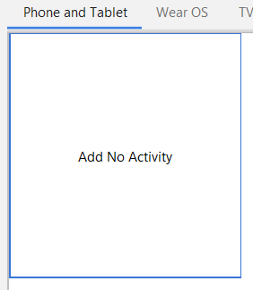
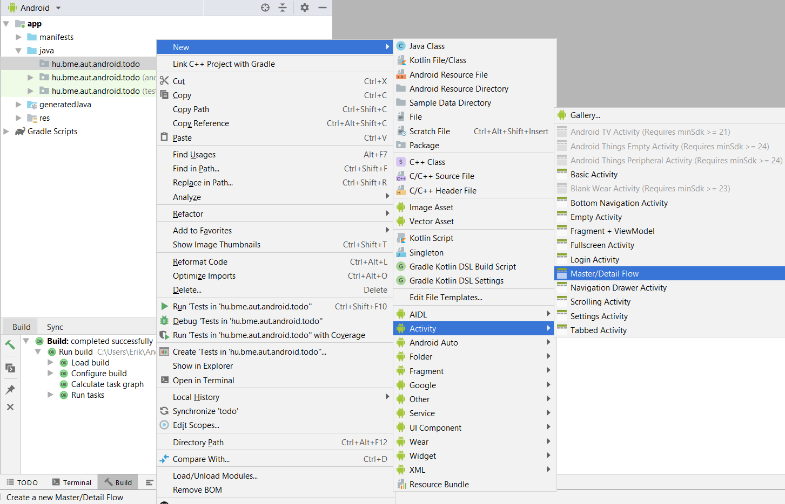
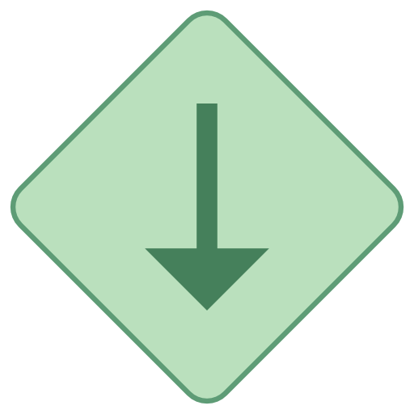

# 3. Labor - Todo Alkalmazás

A labor célja, hogy bemutassa, hogyan lehet ún. Master/Detail nézetet tartalmazó alkalmazást készíteni, kiemelve a `Fragment`-eket és az erőforrásminősítők használatát.

Első lépésként indítsuk el az Android Studio-t, majd:

1. Hozzunk létre egy új projektet, válasszuk az *Add No Activity* lehetőséget.
2. A projekt neve legyen `Todo`, a kezdő package pedig `hu.bme.aut.android.todo`.
3. Nyelvnek válasszuk a *Kotlin*-t.
4. A minimum API szint legyen 19 (Android 4.4).
5. Az *instant app* támogatást NE pipáljuk be, az *AndroidX* használata maradjon bepipálva.

<p align="center">
  
</p>

Amikor az üres projekt elkészült, hozzunk létre egy Master/Detail Flow-t a `hu.bme.aut.android.todo` package-ben.

<p align="center">
    
</p>

A következő ablakban írjuk be rendre, hogy *Todo*, *Todos*, *Todos*. Ennek csak a generált sablonban van szerepe, de legalább az `Activity` nevét nem kell később átírnunk. Ezt követően pipáljuk be a Launcher Activity checkboxot, majd kattintsunk a Finishre.

Laborvezetővel elemezzék a generált alkalmazás működését, próbálják ki emulátoron, készüléken! A Master/Detail nézet célja, hogy egyetlen alkalmazással megoldjuk egy lista és annak egy elemének részletes megjelenítését tableten és mobiltelefonon egyaránt. Működésének a lényege, hogy egy `Activity`-hez tartozó layoutnak kétféle változata van, egy kétpaneles és egy egypaneles változat. Az ezek közötti választást erőforrás minősítőkkel biztosítjuk, hogy tableten a kétpaneles változat töltődjön be, míg mobilon az egypaneles. 

Ezután kódból az `Activity`-ben megpróbálunk referenciát szerezni a második panelre, és ha sikerül, akkor tudjuk hogy tableten vagyunk, ha nem, akkor mobilon. Az első panel tartalma egy `RecyclerView`, a másodiké pedig egy sima `Fragment` a lista egy elemének megjelenítésére. Ha mobilon vagyunk, akkor a listaelemre kattintva új `Activity`-be töltjük a részletező `Fragment`-et, míg tableten egyszerűen betöltjük a jobb oldali panelbe.

*Tipp: Az egyszerűbb teszteléshez keresse ki a tablet mérethez tartozó (`layout-w900dp`) felületleírót (`todo_list.xml`), majd másolja a `layout-land` mappába (hozza létre a mappát!). Ezáltal a mobiltelefon álló orientációjában egy-, míg fektetve kétpaneles viselkedést kapunk.*

## Átalakítás Todo alkalmazássá

Készítsünk egy új package-t `model` néven, ebben pedig hozzuk létre a `Todo` osztályt! 

```kotlin
class Todo(
        var title: String,
        var priority: Priority,
        var dueDate: String,
        var description: String
) {

    enum class Priority {
        LOW, MEDIUM, HIGH
    }

}
```

Figyeljük meg az enum-ot az osztályunkban. Ezen konstansoknak megfelelő ikonokat fogunk később használni a listában a prioritás megjelenítéséhez.

Töröljük ki a `dummy` nevű package-et!

Írjuk felül a `TodoDetailFragment` osztály tartalmát, mely a `Todo` leírását fogja megjeleníteni. Ez legyen az alábbi:

```kotlin
class TodoDetailFragment : Fragment() {

    private var selectedTodo: Todo? = null

    companion object {

        private const val KEY_TODO_DESCRIPTION = "KEY_TODO_DESCRIPTION"

        fun newInstance(todoDesc: String): TodoDetailFragment {
            val args = Bundle()
            args.putString(KEY_TODO_DESCRIPTION, todoDesc)

            val result = TodoDetailFragment()
            result.arguments = args
            return result
        }

    }

    override fun onCreate(savedInstanceState: Bundle?) {
        super.onCreate(savedInstanceState)

        arguments?.let { args ->
            selectedTodo = Todo(
                    title = "cim",
                    priority = Todo.Priority.LOW,
                    dueDate = "1987.23.12",
                    description = args.getString(KEY_TODO_DESCRIPTION) ?: ""
            )
        }
    }

    override fun onCreateView(inflater: LayoutInflater, container: ViewGroup?, savedInstanceState: Bundle?): View? {
        return inflater.inflate(R.layout.todo_detail, container, false)
    }

    override fun onViewCreated(view: View, savedInstanceState: Bundle?) {
        super.onViewCreated(view, savedInstanceState)
        tvTodoDetail.text = selectedTodo?.description
    }

}
```

> A [`let`](https://kotlinlang.org/api/latest/jvm/stdlib/kotlin/let.html) függvény tetszőleges objektumon meghívható, és csupán annyit csinál, hogy lefuttatja a paramétereként adott lambdát, odaadva neki az objektumot. Ez önmagában elég haszontalan, viszont a [safe call operátorral](https://kotlinlang.org/docs/reference/null-safety.html#safe-calls) (`?.`) kombinálva a `null` ellenőrzések egyik legkényelmesebb formáját nyújtja. Amennyiben a `?.let` előtt álló kifejezés `null`, a `let` függvény nem hívódik meg (ezt csinálja az említett operátor), ha pedig nem `null`, akkor a `let` függvényen belül már biztosan nem `null`-ként kapjuk meg az objektumunkat. Jelen esetben ha az [`arguments`](https://developer.android.com/reference/android/support/v4/app/Fragment#getarguments) nem `null`, meghívódik a `let` és a lambdába beérkező `args` nevű paraméter már biztosan nem `null`, így szabadon használható.

> A `Todo` konstruktor hívásánál [elnevezett paraméterekkel](https://kotlinlang.org/docs/reference/functions.html#named-arguments) (illetve sortörésekkel) tettük olvashatóbbá a kódot. Elnevezett paramétereket bármilyen Kotlibnan definiált függvény meghívásakor használhatunk.

> Abban az esetben, ha az `args.getString(...)` hívás `null` értéket adna vissza, az [Elvis operátor](https://kotlinlang.org/docs/reference/null-safety.html#elvis-operator) (`?:`) használatával adunk a visszatérési értéke helyett egy default értéket a `description` paraméternek. Ez az operátor ha a bal oldalán lévő kifejezés értéke nem `null`, akkor a bal oldali kifejezést, egyébként pedig a jobb oldali kifejezést adja vissza.

A megváltozott kulcs illetve a `newInstance` hívás miatt át kell alakítani a `TodoDetailActivity` `onCreate` metódusát is.

```kotlin
val fragment = TodoDetailFragment.newInstance(intent.getStringExtra(KEY_DESC))
```

Vegyük fel a `TodoDetailActivity`-ben az alábbi kulcsot ami még hiányzik: 

```kotlin
companion object {
    const val KEY_DESC = "KEY_DESC"
}
```

A két `Activity` és a jobb oldali panel már fel van készítve az új működésre. A `TodoListActivity` el tudja dönteni, hogy egy vagy két panel jelenik meg, listenerként pedig majd betölti a `TodoDetailActivity`-t vagy a jobb oldali `Fragment`-et.

Már csak egy dolog van hátra: ahhoz, hogy a Todo-ink megfelelően jelenjenek meg a listában, módosítanunk kell a sablonban létrejött `SimpleItemRecyclerViewAdapter`-t. Először is töröljük a `TodoListActivity`-ből az `SimpleItemRecyclerViewAdapter` belső osztályt és hozzunk létre a `SimpleItemRecyclerViewAdapter` osztályt az `adapter` package-ben. Ennek tartalma legyen a következő:

```kotlin
class SimpleItemRecyclerViewAdapter : RecyclerView.Adapter<SimpleItemRecyclerViewAdapter.ViewHolder>() {

    private val todoList = mutableListOf<Todo>()

    var itemClickListener: TodoItemClickListener? = null

    override fun onCreateViewHolder(parent: ViewGroup, viewType: Int): ViewHolder {
        val view = LayoutInflater.from(parent.context)
                .inflate(R.layout.row_todo, parent, false)
        return ViewHolder(view)
    }

    override fun onBindViewHolder(holder: ViewHolder, position: Int) {
        val todo = todoList[position]

        holder.todo = todo

        holder.tvTitle.text = todo.title
        holder.tvDueDate.text = todo.dueDate

        val resource = when (todo.priority) {
            Todo.Priority.LOW -> R.drawable.ic_low
            Todo.Priority.MEDIUM -> R.drawable.ic_medium
            Todo.Priority.HIGH -> R.drawable.ic_high
        }
        holder.ivPriority.setImageResource(resource)
    }

    fun addItem(todo: Todo) {
        val size = todoList.size
        todoList.add(todo)
        notifyItemInserted(size)
    }

    fun addAll(todos: List<Todo>) {
        val size = todoList.size
        todoList += todos
        notifyItemRangeInserted(size, todos.size)
    }

    fun deleteRow(position: Int) {
        todoList.removeAt(position)
        notifyItemRemoved(position)
    }

    override fun getItemCount() = todoList.size

    inner class ViewHolder(itemView: View) : RecyclerView.ViewHolder(itemView) {
        val tvDueDate: TextView = itemView.tvDueDate
        val tvTitle: TextView = itemView.tvTitle
        val ivPriority: ImageView = itemView.ivPriority

        var todo: Todo? = null

        init {
            itemView.setOnClickListener {
                todo?.let { todo -> itemClickListener?.onItemClick(todo) }
            }

            itemView.setOnLongClickListener { view ->
                itemClickListener?.onItemLongClick(adapterPosition, view)
                true
            }
        }
    }

    interface TodoItemClickListener {
        fun onItemClick(todo: Todo)
        fun onItemLongClick(position: Int, view: View): Boolean
    }

}
```

Figyeljük meg a `ViewHolder` patternt az adapterben. A `RecyclerView` már kikényszeríti ennek használatát, mivel így hatékony, gyors listakezelést kapunk.

> A [`mutableListOf`](https://kotlinlang.org/api/latest/jvm/stdlib/kotlin.collections/mutable-list-of.html) egy újabb collection létrehozó függvény a standard library-ből. Fontos különbség van a [`List`](https://kotlinlang.org/api/latest/jvm/stdlib/kotlin.collections/-list/index.html) és [`MutableList`](https://kotlinlang.org/api/latest/jvm/stdlib/kotlin.collections/-mutable-list/index.html) típusok között Kotlinban: előbbinek a tartalmát a létrehozása után nem tudjuk módosítani. Ha ilyen listára van szükségünk, a sima [`listOf()`](https://kotlinlang.org/api/latest/jvm/stdlib/kotlin.collections/list-of.html) függvény áll rendelkezésünkre. Érdemes is listák létrehozásánál alapvetően ezt használni, és csak akkor módosíthatóvá tenni őket, ha erre tényleg szükségünk van, így elkerülhetjük a véletlen módosításokat.

> A lista módosításánál kihasználjuk a Kotlinban elérhető operátorokat is. A `[]` operátor egy [`get`](https://kotlinlang.org/api/latest/jvm/stdlib/kotlin.collections/-list/get.html) hívásnak, míg a `+=` operátor egy [`plusAssign`](https://kotlinlang.org/api/latest/jvm/stdlib/kotlin.collections/plus-assign.html) hívásnak felel meg.

> Ismét látjuk a `?.let` és a `?.` operátor használatát is a `ViewHolder` listener implementációiban. Például a `setOnClickListener` csak akkor fogja meghívni az `onItemClick` függvényt, ha mind a `todo`, mind az `itemClickListener` nem `null` értékű.

> A `ViewHolder` implementációjában a [Kotlin Android Extensions](https://kotlinlang.org/docs/tutorials/android-plugin.html#view-binding) egy új formáját használtuk, hogy az `itemView` gyerek elemei közül keressünk ki ID szerint `View`-kat. 

Ez az adapter hivatkozik egy `row_todo.xml`-re. Hozzuk létre ezt a fájlt a `res/layout` mappába (*New -> Layout resource file -> Filename: `row_todo.xml` -> OK*):

```xml
<?xml version="1.0" encoding="utf-8"?>
<LinearLayout xmlns:android="http://schemas.android.com/apk/res/android"
    android:layout_width="match_parent"
    android:layout_height="wrap_content"
    android:orientation="horizontal">

    <ImageView
        android:id="@+id/ivPriority"
        android:layout_width="wrap_content"
        android:layout_height="wrap_content"
        android:padding="5dp"
        android:src="@drawable/ic_high" />

    <RelativeLayout
        android:layout_width="match_parent"
        android:layout_height="wrap_content"
        android:layout_margin="8dp">

        <TextView
            android:id="@+id/tvTitle"
            android:layout_width="wrap_content"
            android:layout_height="wrap_content"
            android:layout_alignParentTop="true"
            android:text="Title"
            android:textSize="16dp" />

        <TextView
            android:id="@+id/tvDueDate"
            android:layout_width="wrap_content"
            android:layout_height="wrap_content"
            android:layout_alignParentBottom="true"
            android:layout_below="@id/tvTitle"
            android:gravity="bottom"
            android:text="DueDate"
            android:textSize="12dp" />

    </RelativeLayout>

</LinearLayout>
```

Szükségünk van még a nézetekhez az alábbi három képre. Ezek különböző méreteinek legenerálásához használjuk az [Asset Studio](https://romannurik.github.io/AndroidAssetStudio/index.html)-t (azon belül a *Generic icon generator*-t), majd a kapott mappákat másoljuk a `res` mappába.




Írjuk felül a `TodoListActivity` `setupRecyclerView` metódusát az alábbi kóddal. (Ez a metódus felel az adapter példaadatokkal való feltöltéséért, ne felejtsük el a template által generált paramétert törölni a hívás helyén):

```kotlin
private fun setupRecyclerView() {
    val demoData = mutableListOf(
            Todo("title1", Todo.Priority.LOW, "2011. 09. 26.", "description1"),
            Todo("title2", Todo.Priority.MEDIUM, "2011. 09. 27.", "description2"),
            Todo("title3", Todo.Priority.HIGH, "2011. 09. 28.", "description3")
    )
    simpleItemRecyclerViewAdapter = SimpleItemRecyclerViewAdapter()
    simpleItemRecyclerViewAdapter.itemClickListener = this
    simpleItemRecyclerViewAdapter.addAll(demoData)
    todo_list.adapter = simpleItemRecyclerViewAdapter
}
```

Majd vegyük fel az `Activity`-ben a hiányzó adapter property-t:

```kotlin
private lateinit var simpleItemRecyclerViewAdapter: SimpleItemRecyclerViewAdapter
```

> A [`lateinit`](https://kotlinlang.org/docs/reference/properties.html#late-initialized-properties-and-variables) kulcsszóval megjelölt property-ket a fordító megengedi inicializálatlanul hagyni az osztály konstruktorának lefutása utánig, anélkül, hogy nullable-ként kéne azokat megjelölnünk (ami később kényelmetlenné tenné a használatukat, mert mindig ellenőriznünk kéne, hogy `null`-e az értékük). Ez praktikus olyan esetekben, amikor egy osztály inicializálása nem a konstruktorában történik (például ahogy az `Activity`-k esetében az `onCreate`-ben), mert később az esetleges `null` eset lekezelése nélkül használhatjuk majd a property-t. A `lateinit` használatával átvállaljuk a felelősséget a fordítótól, hogy a property-t az első használata előtt inicializálni fogjuk - ellenkező esetben kivételt kapunk.

Implementálja a `TodoListActivity` a `TodoItemClickListener` interfészt, illetve generáljuk ki az interfész implementációs metódusokat (tipp: a `setupRecyclerView()`-ban a `this`-en *Alt+Enter*-t nyomva az IDE felajánlja a generálást), ebből az `onItemClick` megvalósítása:

```kotlin
override fun onItemClick(todo: Todo) {
    if (twoPane) {
        val fragment = TodoDetailFragment.newInstance(todo.description)
        supportFragmentManager
                .beginTransaction()
                .replace(R.id.todo_detail_container, fragment)
                .commit()
    } else {
        val intent = Intent(this, TodoDetailActivity::class.java)
        intent.putExtra(TodoDetailActivity.KEY_DESC, todo.description)
        startActivity(intent)
    }
}
```

Minden fejlesztés során fontos a kódolási konvenciók betartása, hogy könyebben olvasható kódot adjunk ki a kezünkből amelyra ha más ránéz, nem lehet problémája a megértésével. Ezért itt alkalmazzuk a widget elemek típusukkal való prefixelését, tehát adjunk új id-t a `todo_detail.xml`-ben a `TextView`-nak, ez legyen `tvTodoDetail`.

Ha valamelyik osztályban még hibát jelezne az IDE, ellenőrizzük, hogy nem-e maradt felesleges import a `dummy` csomag elemeire, valamint importáljuk be az imént átnevezett `View`-t ID szerint a `TodoDetailFragment` osztályban.

Próbálja ki az alkalmazást!

## Todo törlése

Az adapterben láttuk a törlésre szolgáló metódust, hát használjuk is! A cél, hogy egy Todora hosszan érintve megjelenjen egy menü, ahol törölhetjük a Todot.
Az elemek érintés eseménykezelője már el van készítve, a todo törléséhez készítsünk az elemekhez hosszú érintés gesztus detektálót, majd ekkor dobjunk fel egy popup ablakot, ahol a kívánt művelet kiválasztható lesz. Adjuk hozzá az alábbi sorokat az `Activity` interfészt megvalósító metódusához:

```kotlin
override fun onItemLongClick(position: Int, view: View): Boolean {
    val popup = PopupMenu(this, view)
    popup.inflate(R.menu.menu_todo)
    popup.setOnMenuItemClickListener { item ->
        when (item.itemId) {
            R.id.delete -> simpleItemRecyclerViewAdapter.deleteRow(position)
        }
        false
    }
    popup.show()
    return false
}
```

Az `onItemLongClick`-ben hivatkozunk egy menü erőforrásra, ami tartalmazza a lehetséges menüpontokat. Hozzuk létre a `menu_todo.xml` fájlt a `menu` mappában (amit létre kell hoznunk).

```xml
<?xml version="1.0" encoding="utf-8"?>
<menu xmlns:android="http://schemas.android.com/apk/res/android"
    xmlns:app="http://schemas.android.com/apk/res-auto">
    <item
        android:id="@+id/delete"
        android:title="DELETE"
        app:showAsAction="always" />
    <item
        android:id="@+id/back"
        android:title="BACK"
        app:showAsAction="always" />
</menu>
```

Próbáljuk ki a törlést!

## Új Todo létrehozása

A `TodoListActivity`-hez adjunk egy saját menüt, melyben egy *Create* menüpont található, melyet kiválasztva dialógus formában egy új `DialogFragment` jelenik meg, hasonlóan a korábbi laboron látott megoldáshoz.

Ehhez természetesen szükségünk lesz egy menü erőforrásra. A `menu` mappában hozzuk létre a `menu_list.xml` állományt!

```xml
<?xml version="1.0" encoding="utf-8"?>
<menu xmlns:android="http://schemas.android.com/apk/res/android">
    <item android:id="@+id/itemCreateTodo"
        android:title="@string/itemCreateTodo"/>
</menu>
```

Hozzuk létre a hiányzó szöveges erőforrást is! (Hibára állva ismét segít az *Alt+Enter*):

```xml
<string name="itemCreateTodo">Create</string>
```

Majd az `TodoListActivity`-n belül kezeljük az ehhez tartozó metódusokat is. Az OptionsMenu-höz is van `onCreate` és `onOptionsItemSelected` metódus:

```kotlin
override fun onCreateOptionsMenu(menu: Menu?): Boolean {
    menuInflater.inflate(R.menu.menu_list, menu)
    return super.onCreateOptionsMenu(menu)
}

override fun onOptionsItemSelected(item: MenuItem?): Boolean {
    if (item?.itemId == R.id.itemCreateTodo) {
        val todoCreateFragment = TodoCreateFragment()
        todoCreateFragment.show(supportFragmentManager, "TAG")
    }
    return super.onOptionsItemSelected(item)
}
```

Készítsünk egy új osztályt `TodoCreateFragment` néven ami a `DialogFragment`-ből származik. Az `onAttach` hívás során ellenőrizzük, hogy van-e listener objektum beregisztrálva a dialógusunk számára. A `TodoListActivity` fog értesülni az új Todo-ról, úgy ahogyan a `TodoCreateFragment`-ünk is értesülni fog a dátumválasztásról.

```kotlin
class TodoCreateFragment : DialogFragment() {

    private lateinit var listener: TodoCreatedListener

    override fun onAttach(context: Context?) {
        super.onAttach(context)

        try {
            listener = if (targetFragment != null) {
                targetFragment as TodoCreatedListener
            } else {
                activity as TodoCreatedListener
            }
        } catch (e: ClassCastException) {
            throw RuntimeException(e)
        }
    }

    override fun onCreateView(inflater: LayoutInflater, container: ViewGroup?, savedInstanceState: Bundle?): View? {
        val view = inflater.inflate(R.layout.fragment_create, container, false)
        dialog.setTitle(R.string.itemCreateTodo)
        return view
    }

    override fun onViewCreated(view: View, savedInstanceState: Bundle?) {
        super.onViewCreated(view, savedInstanceState)

        spnrTodoPriority.adapter = ArrayAdapter(
                requireContext(),
                android.R.layout.simple_spinner_item,
                listOf("Low", "Medium", "High")
        )
        tvTodoDueDate.text = "  -  "

        btnCreateTodo.setOnClickListener {
            val selectedPriority = when (spnrTodoPriority.selectedItemPosition) {
                0 -> Todo.Priority.LOW
                1 -> Todo.Priority.MEDIUM
                2 -> Todo.Priority.HIGH
                else -> Todo.Priority.LOW
            }

            listener.onTodoCreated(Todo(
                    title = etTodoTitle.text.toString(),
                    priority = selectedPriority,
                    dueDate = tvTodoDueDate.text.toString(),
                    description = etTodoDescription.text.toString()
            ))
            dismiss()
        }

        btnCancelCreateTodo.setOnClickListener {
            dismiss()
        }

    }

    private fun showDatePickerDialog() {
        //TODO 
    }

    interface TodoCreatedListener {
        fun onTodoCreated(todo: Todo)
    }

}
```

> Az `onAttach` függvényben láthatjuk, hogy mint sok más nyelvi elem a Kotlinban az [`if-else`](https://kotlinlang.org/docs/reference/control-flow.html#if-expression) is használható kifejezésként, értéke pedig a lefutott ág utolsó kifejezése.

Hozzuk létre a `Fragment` layoutját, ez a `fragment_create.xml`, tartalma a következő:

```xml
<?xml version="1.0" encoding="utf-8"?>
<TableLayout xmlns:android="http://schemas.android.com/apk/res/android"
    android:layout_width="wrap_content"
    android:layout_height="wrap_content"
    android:stretchColumns="1">

    <TableRow>

        <TextView
            android:layout_width="wrap_content"
            android:layout_column="1"
            android:gravity="end"
            android:text="@string/lblTodoTitle" />

        <EditText
            android:id="@+id/etTodoTitle"
            android:width="200dp" />

    </TableRow>

    <TableRow>

        <TextView
            android:layout_width="wrap_content"
            android:layout_column="1"
            android:gravity="end"
            android:text="@string/lblTodoPriority" />

        <Spinner
            android:id="@+id/spnrTodoPriority"
            android:width="200dp" />
    </TableRow>

    <TableRow>

        <TextView
            android:layout_width="wrap_content"
            android:layout_column="1"
            android:gravity="end"
            android:text="@string/lblTodoDueDate" />

        <TextView
            android:id="@+id/tvTodoDueDate"
            android:width="200dp"
            android:gravity="center"
            android:textSize="20dp" />

    </TableRow>

    <TableRow>

        <TextView
            android:layout_width="wrap_content"
            android:layout_column="1"
            android:gravity="end"
            android:text="@string/lblTodoDescription" />

        <EditText
            android:id="@+id/etTodoDescription"
            android:width="200dp"
            android:text="" />

    </TableRow>

    <TableRow>

        <Button
            android:id="@+id/btnCreateTodo"
            android:layout_width="wrap_content"
            android:layout_column="1"
            android:gravity="end"
            android:text="@string/btnOk" />

        <Button
            android:id="@+id/btnCancelCreateTodo"
            android:layout_width="wrap_content"
            android:gravity="left"
            android:text="@string/btnCancel" />

    </TableRow>

</TableLayout>
```

A szöveges erőforrásokat vagy hozzuk létre a hibákból kiindulva, vagy másoljuk be őket a `strings.xml`-be:

```xml
<string name="lblTodoTitle">Todo label</string>
<string name="lblTodoPriority">Priority</string>
<string name="lblTodoDueDate">Due date</string>
<string name="lblTodoDescription">Description</string>
<string name="btnOk">OK</string>
<string name="btnCancel">Cancel</string>
<string name="dummyDescription">dummyDescription</string>
```

Most ugorjunk vissza a `TodoListActivity`-re, és valósítsuk meg a `TodoCreatedListener` interfészt!

```kotlin
class TodoListActivity : AppCompatActivity(), TodoCreateFragment.TodoCreatedListener, SimpleItemRecyclerViewAdapter.TodoItemClickListener
```

```kotlin
override fun onTodoCreated(todo: Todo) {
    
    simpleItemRecyclerViewAdapter.addItem(todo)
}
```

Ezek után ellenőrizzük, hogy működik az új Todo felvitele (kivéve a dátumválasztást)!

## Önálló feladat

### Dátumválasztó elkészítése

Először is csináljunk még egy `DialogFragment`-ből származó osztályt, ezúttal nevezzük `DatePickerDialogFragment`-nek. A `TodoCreateFragment`-ünk implementálja a `DateListener` interfészét a `DatePickerDialogFragment`-ünknek, így értesül a dátumválasztásról.

```kotlin
class DatePickerDialogFragment : DialogFragment() {

    companion object {
        const val TAG = "DatePickerDialog"
    }

    private val calSelectedDate = Calendar.getInstance()

    private lateinit var listener: DateListener

    private val dateSetListener = object : DatePickerDialog.OnDateSetListener {
        override fun onDateSet(datePicker: DatePicker?, year: Int, monthOfYear: Int, dayOfMonth: Int) {
            // Setting the new date
            calSelectedDate.set(Calendar.YEAR, year)
            calSelectedDate.set(Calendar.MONTH, monthOfYear)
            calSelectedDate.set(Calendar.DAY_OF_MONTH, dayOfMonth)

            listener.onDateSelected(buildDateText())

            dismiss()
        }
    }

    override fun onCreate(savedInstanceState: Bundle?) {
        super.onCreate(savedInstanceState)
        calSelectedDate.time = Date(System.currentTimeMillis())
    }

    override fun onCreateDialog(savedInstanceState: Bundle?): Dialog {
        return DatePickerDialog(
                requireContext(),
                dateSetListener,
                calSelectedDate.get(Calendar.YEAR),
                calSelectedDate.get(Calendar.MONTH),
                calSelectedDate.get(Calendar.DAY_OF_MONTH)
        )
    }

    override fun onAttach(context: Context?) {
        super.onAttach(context)

        try {
            listener = if (targetFragment != null) {
                targetFragment as DateListener
            } else {
                activity as DateListener
            }
        } catch (e: ClassCastException) {
            throw RuntimeException(e)
        }
    }

    private fun buildDateText(): String {
        val dateString = StringBuilder()

        dateString.append(calSelectedDate.get(Calendar.YEAR))
        dateString.append(".")
        dateString.append(calSelectedDate.get(Calendar.MONTH) + 1)
        dateString.append(".")
        dateString.append(calSelectedDate.get(Calendar.DAY_OF_MONTH))
        dateString.append(".")

        return dateString.toString()
    }

    interface DateListener {
        fun onDateSelected(date: String)
    }

}
```

> A `DatePickerDialog.OnDateSetListener` implementációhoz egy anonim osztályt használunk egy [`object expression`](https://kotlinlang.org/docs/reference/object-declarations.html#object-expressions)-nel leírva, ami az `object` kulcsszó harmadik előfordulása a nyelvben. (Mi volt az előző kettő?)

Ugorjunk vissza a `TodoCreateFragment`-re és valósítsuk meg a `DateListener` interfészt, illetve állítsuk be a `txtDueDate` `onClickListener(…)`-jében, hogy mutassunk egy `DatePickerDialogFragment`-et a megnyomásakor.

```kotlin
class TodoCreateFragment : DialogFragment(), DatePickerDialogFragment.DateListener 
```

```kotlin
private fun showDatePickerDialog() {
    val datePicker = DatePickerDialogFragment()
    datePicker.setTargetFragment(this, 0)
    datePicker.show(fragmentManager, DatePickerDialogFragment.TAG)
}

override fun onDateSelected(date: String) {
    tvTodoDueDate.text = date
}
```

Végül az `onViewCreated`-ben adjuk hozzá a megfelelő eseménykezelőt a dátummegjelenítő `TextView`-hoz:

```kotlin
tvTodoDueDate.setOnClickListener { showDatePickerDialog() }
```
