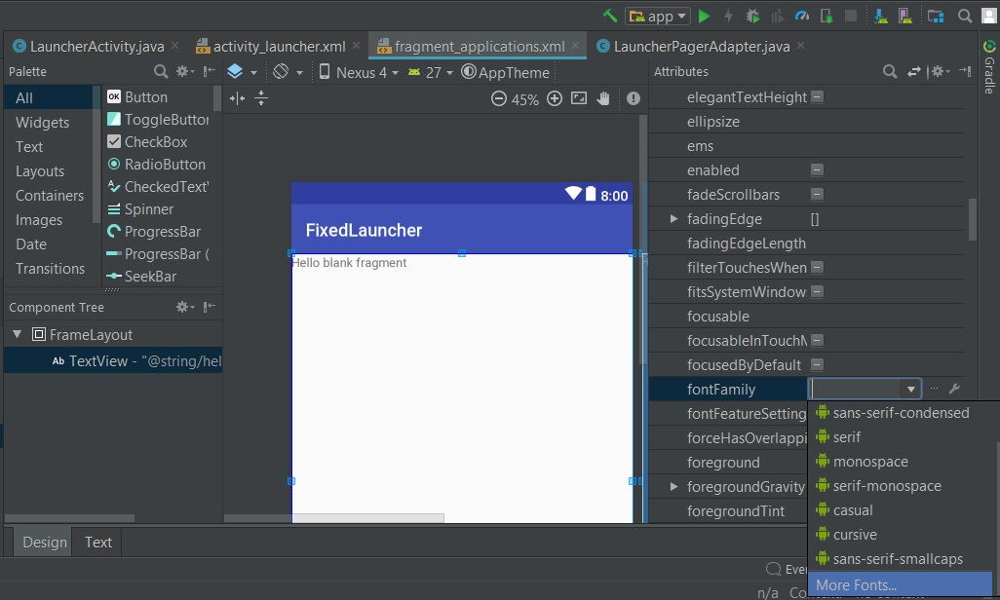
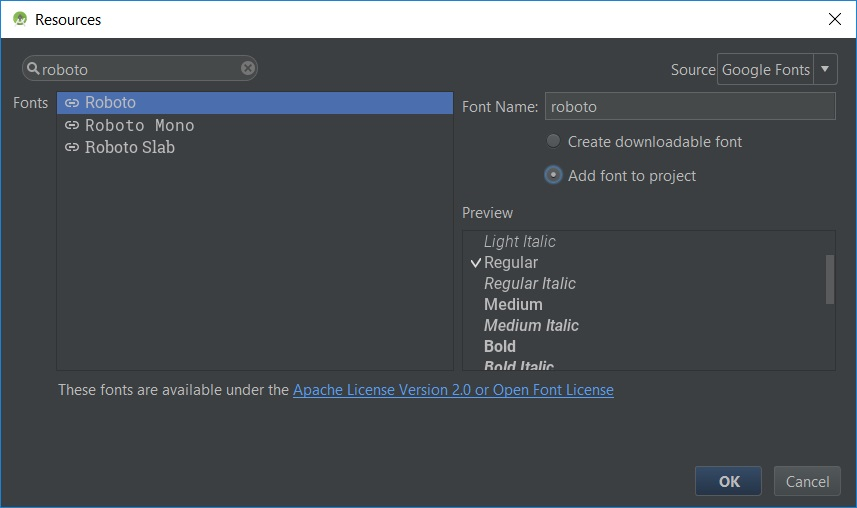

# Labor 4 - Launcher

A labor során egy **Launcher** vagy **Home Screen** alkalmazást fogunk készíteni, amelyben egy *ViewPager* található, benne 2 *fragment*-tel.

A bal oldali egy tárcsázó, a jobb oldali pedig az alkalmazásokat listázza ki.


A *ViewPager* használatához szükség van a support v4 csomagra. Importoknál ha lehetséges mindig a supportos változatot használjuk !

Első lépésben készítsünk egy új alkalmazást **Launcher** néven.

A package név legyen: **hu.bme.aut.amorg.examples.launcher**

A Min Api level legyen **16**!


Készítsünk egy új Empty Activity-t ,akár projekt létrehozásakor, akár később **LauncherActivity** néven, de gondoskodjunk róla,
hogy a **AppCompatActivity**-ből származik le!

A projektünkben ez az egy Activity lesz. Nem szeretnénk, hogy el lehessen forgatni, illetve szeretnénk, ha home alkalmazásként viselkedhetne.

Mindkét igény miatt a Manifest állományunkat kell módosítani.

Az activity elem az alábbi legyen:

```xml
<activity
    android:name=".LauncherActivity"
    android:label="@string/app_name"
    android:launchMode="singleTask"
    android:screenOrientation="portrait">
    <intent-filter>
        <action android:name="android.intent.action.MAIN" />

        <category android:name="android.intent.category.LAUNCHER" />
        <category android:name="android.intent.category.DEFAULT" />
        <category android:name="android.intent.category.HOME" />
    </intent-filter>
</activity>
```
Az Activity szempontjából egyetlen View kell az *activity_main* XML-be: egy ViewPager

```xml
<android.support.v4.view.ViewPager xmlns:android="http://schemas.android.com/apk/res/android"
    android:id="@+id/pager"
    android:layout_width="match_parent"
    android:layout_height="match_parent" />
```

Ebben a ViewPagerben két Fragment jelenik meg. Készítsünk egy **fragments** nevű csomagot!

Hozzunk létre benne 2 Fragment osztályt **DialerFragment** és **ApplicationsFragment** néven!
(A fragment nevének megadásakor vegyük ki a pipát az **Include fragment factory methods** és **Include interface callbacks** opciók elől)

A ViewPager működéséhez szükségünk van egy adapterre, ami szolgáltatja a Fragmenteket. Az Activity-nk kódja az alábbi módon alakul:

```java
private ViewPager pager;
private PagerAdapter pagerAdapter;
```

OnCreate metódusunk:
```java
@Override
protected void onCreate(Bundle savedInstanceState) {
    super.onCreate(savedInstanceState);
    setContentView(R.layout.activity_launcher);

    pager = (ViewPager) findViewById(R.id.pager);
    pagerAdapter = new LauncherPagerAdapter(getSupportFragmentManager());
    pager.setAdapter(pagerAdapter);
}
```

Ezután hozzuk létre az **adapter** csomagot. Benne a **LauncherPagerAdapter** osztályal.

```java
public class LauncherPagerAdapter extends FragmentStatePagerAdapter {

    private static final int NUM_PAGES = 2;

    public LauncherPagerAdapter(FragmentManager manager) {
        super(manager);
    }

    @Override
    public Fragment getItem(int position) {
        switch (position){
            case 0: return new DialerFragment();
            case 1: return new ApplicationsFragment();
            default: return new ApplicationsFragment();
        }
    }

    @Override
    public int getCount() {
        return NUM_PAGES;
    }
}
```
Próbáljuk ki az alkalmazást!

### Saját téma Roboto betűtípussal

Az Android hivatalos betűtípusa a Roboto család (annak ellenére, hogy beépítve nem szerepel minden verzióban):

* Roboto
* Roboto slab (talpas változat)
* Roboto condensed (keskeny változat)

Töltsük le a Roboto betűtípust az Android Studio segítségével. Ehhez válasszunk egy olyan layout fájlt, amin van TextView (pl. fragment_applications.xml), és váltsunk az editorban a Design nézetre.

Kattintsunk a TextView-re a renderelt eszköz képernyőn, majd jobb oldalon az Attributes-nál (ha nem látszik az összes meg kell nyomni alul a view all attributes gombot) keressük ki a fontFamily-t. A lenyíló listában alul válasszuk a **More fonts** opciót.



Töltsük le a Roboto Regular változatát ügyelve, hogy az **Add font to project** legyen kijelölve.



Ahhoz, hogy saját betűtípust alkalmazzunk meg kell változtassuk kódból a TextView-n. Használjunk stílust erre!

A tárcsázó gombjainak (12 darab) stílusát fogjuk össze, illetve egy kicsit szabjuk át a kinézetet!

**colors.xml**

```xml
<?xml version="1.0" encoding="utf-8"?>
<resources>
    <color name="primary">#9E9E9E</color>
    <color name="primary_dark">#9E9E9E</color>
    <color name="primary_light">#F5F5F5</color>
    <color name="accent">#607D8B</color>
    <color name="primary_text">#212121</color>
    <color name="secondary_text">#757575</color>
    <color name="icons">#212121</color>
    <color name="divider">#BDBDBD</color>
</resources>
```

**dimens.xml**

```xml
<?xml version="1.0" encoding="utf-8"?>
<resources>
    <!-- Default screen margins, per the Android Design guidelines. -->
    <dimen name="activity_horizontal_margin">16dp</dimen>
    <dimen name="activity_vertical_margin">16dp</dimen>
    <dimen name="dialer_text_size">40sp</dimen>
    <dimen name="drawer_text_size">15dp</dimen>
</resources>
```

**styles.xml**

```xml
<?xml version="1.0" encoding="utf-8"?>
<resources>

    <style name="AppTheme" parent="Theme.AppCompat.Light.NoActionBar">
        <!-- Customize your theme here. -->
        <item name="colorPrimary">@color/primary</item>
        <item name="colorPrimaryDark">@color/primary_dark</item>
        <item name="android:textViewStyle">@style/DefaultText</item>
    </style>

    <style name="DefaultText" parent="Widget.AppCompat.TextView.SpinnerItem">
        <item name="fontFamily">@font/roboto</item>
    </style>

    <style name="DialerButton" parent="Widget.AppCompat.Button">
        <item name="fontFamily">@font/roboto</item>

        <item name="android:textColor">@color/primary_text</item>
        <item name="android:gravity">center</item>
        <item name="android:layout_width">wrap_content</item>
        <item name="android:layout_height">wrap_content</item>
        <item name="android:textSize">@dimen/dialer_text_size</item>
    </style>

</resources>
```

**A DialerFragment layoutjának kódja:**

```xml
<?xml version="1.0" encoding="utf-8"?>
<RelativeLayout xmlns:android="http://schemas.android.com/apk/res/android"
    android:layout_width="match_parent"
    android:layout_height="match_parent"
    android:padding="@dimen/activity_horizontal_margin"
    android:background="@color/primary_light">

    <EditText
        android:id="@+id/callEditText"
        android:layout_width="match_parent"
        android:layout_height="wrap_content"
        android:layout_above="@+id/tableLayout"
        android:layout_alignParentLeft="true"
        android:layout_alignParentStart="true"
        android:layout_toLeftOf="@+id/callBackSpaceButton"
        android:layout_toStartOf="@+id/callBackSpaceButton"
        android:textSize="@dimen/dialer_text_size" />

    <ImageButton
        android:id="@+id/callBackSpaceButton"
        android:layout_width="wrap_content"
        android:layout_height="wrap_content"
        android:layout_above="@+id/tableLayout"
        android:layout_alignParentEnd="true"
        android:layout_alignParentRight="true"
        android:layout_alignTop="@+id/callEditText"
        android:src="@drawable/ic_backspace_black_24dp" />

    <Button
        android:id="@+id/call_button"
        android:layout_width="match_parent"
        android:layout_height="wrap_content"
        android:layout_alignParentBottom="true"
        android:gravity="center"
        android:padding="15dp"
        android:text="@string/call"
        android:textSize="30sp"
        style="@style/DialerButton"/>

    <TableLayout
        android:id="@+id/tableLayout"
        android:layout_width="match_parent"
        android:layout_height="wrap_content"
        android:layout_above="@id/call_button"
        android:stretchColumns="*">

        <TableRow>

            <Button
                style="@style/DialerButton"
                android:text="1" />

            <Button
                style="@style/DialerButton"
                android:text="2" />

            <Button
                style="@style/DialerButton"
                android:text="3" />
        </TableRow>

        <TableRow>

            <Button
                style="@style/DialerButton"
                android:text="4" />

            <Button
                style="@style/DialerButton"
                android:text="5" />

            <Button
                style="@style/DialerButton"
                android:text="6" />
        </TableRow>

        <TableRow>

            <Button
                style="@style/DialerButton"
                android:text="7" />

            <Button
                style="@style/DialerButton"
                android:text="8" />

            <Button
                style="@style/DialerButton"
                android:text="9" />
        </TableRow>

        <TableRow>

            <Button
                style="@style/DialerButton"
                android:text="*" />

            <Button
                style="@style/DialerButton"
                android:text="0" />

            <Button
                style="@style/DialerButton"
                android:text="#" />
        </TableRow>

    </TableLayout>

</RelativeLayout>
```

Ez az elrendezés hivatkozik az **ic_action_backspace** erőforrásra. 
Ezt töltsük le a [https://materialdesignicons.com/](https://materialdesignicons.com/) oldalról. Keressünk rá a backspace -re , majd válassuk ki a számunkra megfelelőt.

Tömörítsük ki, majd az másoljuk be az összes erőforrást a **res** mappánkba illetve készítsük el a *call* string erőforrást.

Laborvezető segítségével vizsgáljuk meg az elrendezést!

Próbáljuk ki az alkalmazást! Mit tapasztalunk?

Alakítsuk át a Fragment kódját, hogy ne jöjjön fel a billentyűzet, amikor fókuszt kap az EditText! A** fragment_dialer.xml **-ben a RobotoEditText `clickable` és `focusable` értékét állítsuk false-ra.

```xml
    <EditText
        android:id="@+id/callEditText"
        android:layout_width="match_parent"
        android:layout_height="wrap_content"
        android:layout_above="@+id/tableLayout"
        android:layout_alignParentLeft="true"
        android:layout_alignParentStart="true"
        android:clickable="false"
        android:focusable="false"
        android:layout_toLeftOf="@+id/callBackSpaceButton"
        android:layout_toStartOf="@+id/callBackSpaceButton"
        android:textSize="@dimen/dialer_text_size" />
```

### Alkalmazások listája

Az alkalmazásokat listázó Fragment tartalma egy RecyclerView. Laborvezetővel tekintsük át az xml-jét!

```xml
<?xml version="1.0" encoding="utf-8"?>
<RelativeLayout
    xmlns:android="http://schemas.android.com/apk/res/android"
    android:layout_width="match_parent"
    android:layout_height="match_parent">

    <android.support.v7.widget.RecyclerView
        android:id="@+id/applicationRV"
        android:layout_width="match_parent"
        android:layout_height="match_parent"/>

</RelativeLayout>
```

A RecyclerView support könyvtárként érhető el, ezt hivatkozzuk be a **build.gradle**-ben.

```groovy
implementation 'com.android.support:recyclerview-v7:26.1.0'
```


Az **adapter** csomagba hozzuk létre az **ApplicationsAdapter** osztályt. Tartalma a következő:

```java

public class ApplicationsAdapter extends RecyclerView.Adapter<ApplicationsAdapter.ViewHolder> {

    private Context context;
    private final List<ApplicationInfo> applications;
    private LayoutInflater mInflater;

    public ApplicationsAdapter(Context context, List<ApplicationInfo> applications) {
        this.mInflater = LayoutInflater.from(context);
        this.context = context;
        this.applications = applications;
    }

    @Override
    public ViewHolder onCreateViewHolder(ViewGroup parent, int viewType) {
        View view = mInflater.inflate(R.layout.li_application, parent, false);
        return new ViewHolder(view);
    }

    @Override
    public void onBindViewHolder(ViewHolder holder, int position) {
        final ApplicationInfo app = applications.get(position);
        holder.nameTV.setText(app.getTitle());
        holder.iconIV.setImageDrawable(app.getIcon());

        holder.applicationsLL.setOnClickListener(new View.OnClickListener() {
            @Override
            public void onClick(View view) {
                context.startActivity(app.getIntent());
            }
        });
        
    }

    @Override
    public int getItemCount() {
        return applications.size();
    }


    public class ViewHolder extends RecyclerView.ViewHolder {
        public LinearLayout applicationsLL;
        public TextView nameTV;
        public ImageView iconIV;

        public ViewHolder(View view) {
            super(view);
            applicationsLL = (LinearLayout) view.findViewById(R.id.applicationLL);
            nameTV = (TextView) view.findViewById(R.id.nameTV);
            iconIV = (ImageView) view.findViewById(R.id.iconIV);
           
        }
    }
}
```

A getView metódus hivatkozik egy erőforrásra, alább egyetlen cella layoutja (li_application.xml).

```xml
<?xml version="1.0" encoding="utf-8"?>
<LinearLayout xmlns:android="http://schemas.android.com/apk/res/android"
    xmlns:app="http://schemas.android.com/apk/res-auto"
    android:layout_width="match_parent"
    android:layout_height="wrap_content"
    android:id="@+id/applicationLL"
    android:orientation="vertical">

    <ImageView
        android:id="@+id/iconIV"
        android:layout_width="50dp"
        android:layout_height="50dp" />

    <TextView
        android:id="@+id/nameTV"
        android:layout_width="wrap_content"
        android:layout_height="wrap_content"
        android:textSize="@dimen/drawer_text_size"
       />

</LinearLayout>
```

Össze kell gyűjtenünk az adatokat, amiből majd az adapter dolgozhat. Ehhez hozzunk létre egy **model** nevű csomagot,
majd abban egy osztályt, amiben tárolhatjuk az alkalmazásinforációkat:

```java
public class ApplicationInfo {
    private CharSequence title;
    private Intent intent;
    private Drawable icon;
    private boolean filtered;

    public final void setActivity(ComponentName className, int launchFlags) {
        intent = new Intent(Intent.ACTION_MAIN);
        intent.addCategory(Intent.CATEGORY_LAUNCHER);
        intent.setComponent(className);
        intent.setFlags(launchFlags);
    }

    @Override
    public boolean equals(Object o) {
        if (this == o) {
            return true;
        }
        if (!(o instanceof ApplicationInfo)) {
            return false;
        }

        ApplicationInfo that = (ApplicationInfo) o;
        return title.equals(that.title) &&
                intent.getComponent().getClassName().equals(
                        that.intent.getComponent().getClassName());
    }

    @Override
    public int hashCode() {
        int result;
        result = (title != null ? title.hashCode() : 0);
        final String name = intent.getComponent().getClassName();
        result = 31 * result + (name != null ? name.hashCode() : 0);
        return result;
    }

    public CharSequence getTitle() {
        return title;
    }

    public void setTitle(CharSequence title) {
        this.title = title;
    }

    public Intent getIntent() {
        return intent;
    }

    public void setIntent(Intent intent) {
        this.intent = intent;
    }

    public Drawable getIcon() {
        return icon;
    }

    public void setIcon(Drawable icon) {
        this.icon = icon;
    }

    public boolean isFiltered() {
        return filtered;
    }

    public void setFiltered(boolean filtered) {
        this.filtered = filtered;
    }
}
```
Ahhoz hogy a főképernyőn megjeleníthessünk minden szükséges alkalmazást, a PackageManager osztály queryIntentActivities()
metódusát hívjuk segítségül. Ez a kapott Intentnek megfelelő összes Activity-t képes visszaadni egy listában, nekünk pedig
éppen erre van szükségünk (Intent feloldást végez a háttérben). Az így visszakapott Activity-k adatait olvassuk be egy
ApplicationInfo objektumokból álló kollekcióba, melyet a Fragmentünkben definiáltunk.
Hozzunk létre a Fragmentben egy segédmetódust, ami összeszedi az információkat, majd listát készít az alkalmazásokból:

```java
   private void loadApplications() {
        PackageManager manager = getActivity().getPackageManager();

        // creating a list of every application we want to display
        Intent mainIntent = new Intent(Intent.ACTION_MAIN, null);
        mainIntent.addCategory(Intent.CATEGORY_LAUNCHER);
        final List<ResolveInfo> apps = manager.queryIntentActivities(mainIntent, 0);
        // sorting by name
        Collections.sort(apps, new ResolveInfo.DisplayNameComparator(manager));

        // filling the ApplicationInfo array for every app (we want to display)
        if (apps != null) {
            final int count = apps.size();

            if (applications == null) {
                applications = new ArrayList<ApplicationInfo>(count);
            }
            applications.clear();

            for (int i = 0; i < count; i++) {
                ApplicationInfo application = new ApplicationInfo();
                ResolveInfo info = apps.get(i);

                // app's name
                application.setTitle(info.loadLabel(manager));
                // we need an Intent to start the app when touched the icon
                application.setActivity(
                        new ComponentName(info.activityInfo.applicationInfo.packageName, info.activityInfo.name),
                        Intent.FLAG_ACTIVITY_NEW_TASK | Intent.FLAG_ACTIVITY_RESET_TASK_IF_NEEDED);
                // icon
                application.setIcon(info.activityInfo.loadIcon(manager));

                applications.add(application);
            }
        }
    }
```

Az applications objektumon álltva CTRL+ALT+F kombinációval mezővé alakíthatjuk.

Ezt a metódust hívjuk meg a Fragment onCreate életciklusfüggvényében.
A Fragment onCreate metódusa tipikusan erre való: olyan feladatok elvégzése, ami még nem igényel valódi nézetet.

Ezek után össze kell kössük az összeszedett információkat a Recycler-val. Másoljuk be az alábbi metódust,
majd hívjuk meg a Fragment onCreateView életciklus függvényében!

```java
private void bindApplications(View root) {
    RecyclerView appsRV = (RecyclerView) root.findViewById(R.id.applicationRV);
    appsRV.setLayoutManager(new GridLayoutManager(getContext(), 4));
    appsRV.setAdapter(new ApplicationsAdapter(getActivity(), applications));
}
```    


```java
@Override
public void onCreate(@Nullable Bundle savedInstanceState) {
    super.onCreate(savedInstanceState);
    loadApplications();
}

@Override
public View onCreateView(LayoutInflater inflater, ViewGroup container, Bundle savedInstanceState) {

    View view = inflater.inflate(R.layout.fragment_applications, container, false);
    bindApplications(view);
    return view;
}
```


#### Próbáljuk ki az alkalmazást!


## Önálló feladat

### Írja meg a tárcsázó működését!

Tárcsázó segítség:
A gombokat lássuk el id-kkal!
A gombok eseménykezelője legyen közös, a kattintott View objektum id-ja alapján állítsa
be a felhívandó telefonszámot az EditTextben (ha kell töröljön is), majd indítsa a hívást ha a hívás gombot nyomtuk meg!

```java
String phoneNumber = "tel:+36201234567";
Intent i = new Intent(
    Intent.ACTION_CALL,
    Uri.parse(phoneNumber)
    );
startActivity(i);
```

A telefonhíváshoz engedély szükséges, ezt a manifestben az `application` tag-en kívül kell megadnunk. 

```xml
<uses-permission android:name="android.permission.CALL_PHONE" />
```

Ez az engedély egy veszélyesnek minősített engedély, ezért Android 6.0 (API level 23) felett ezt futásidőben kellene elkérni. Jelen esetben ezt kerüljük ki, az app modul `build.gradle` -ben a `targetSDKVersion`-t állítsuk `22`-re (Android 5.1).
