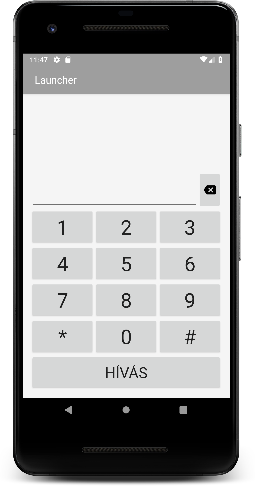
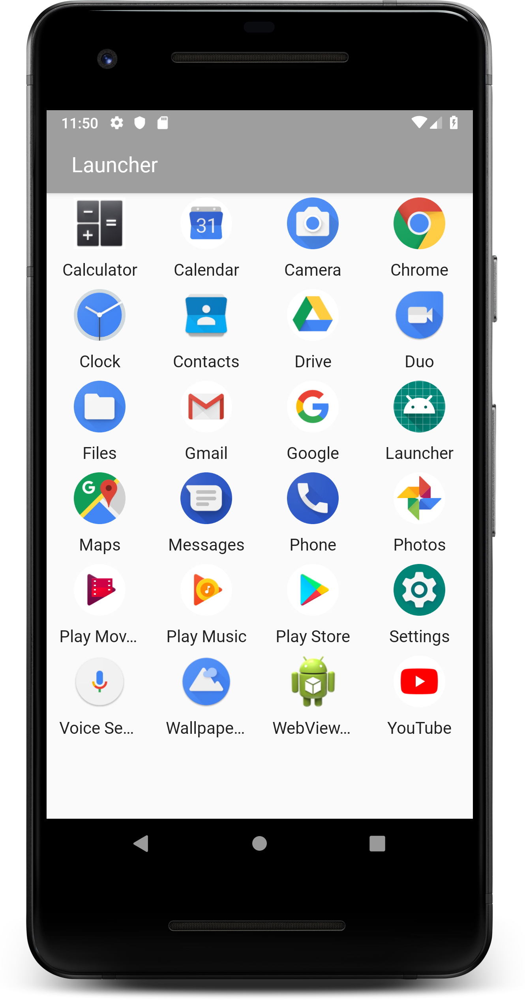
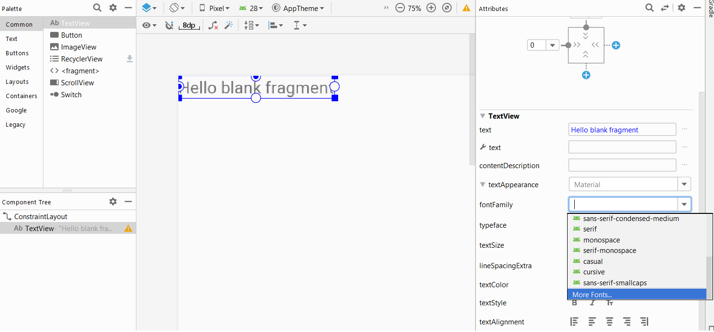
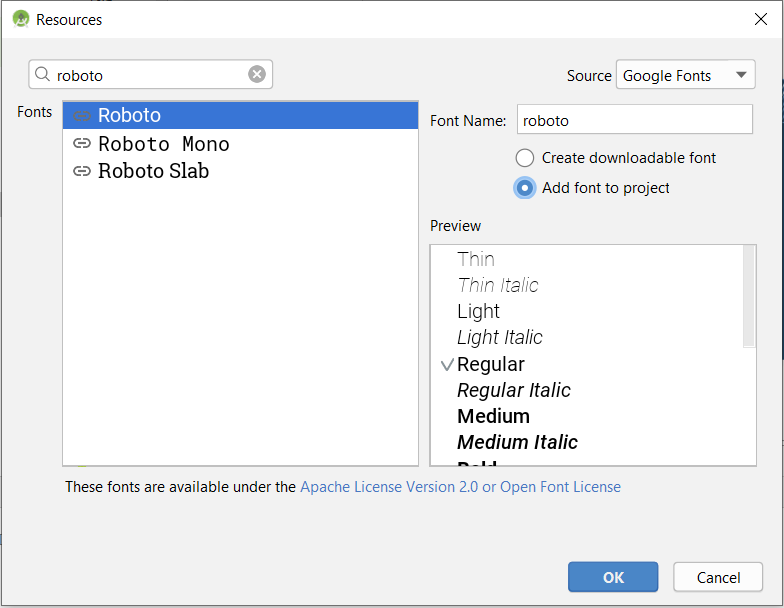
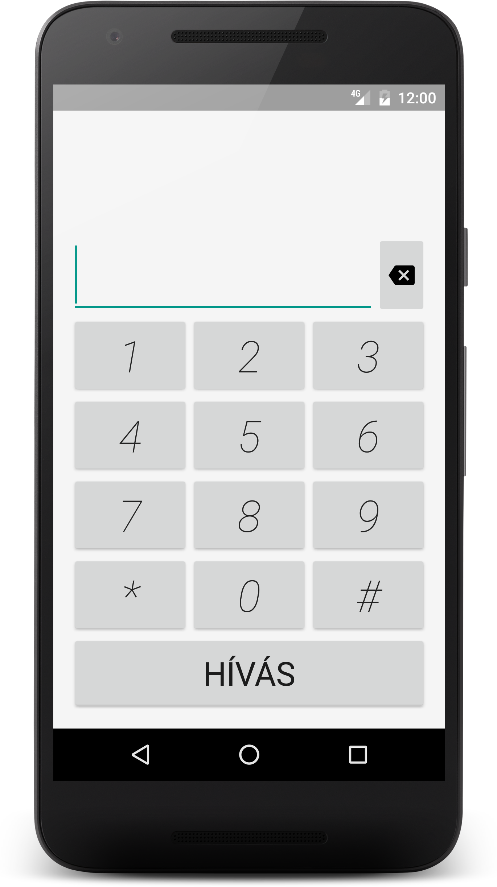
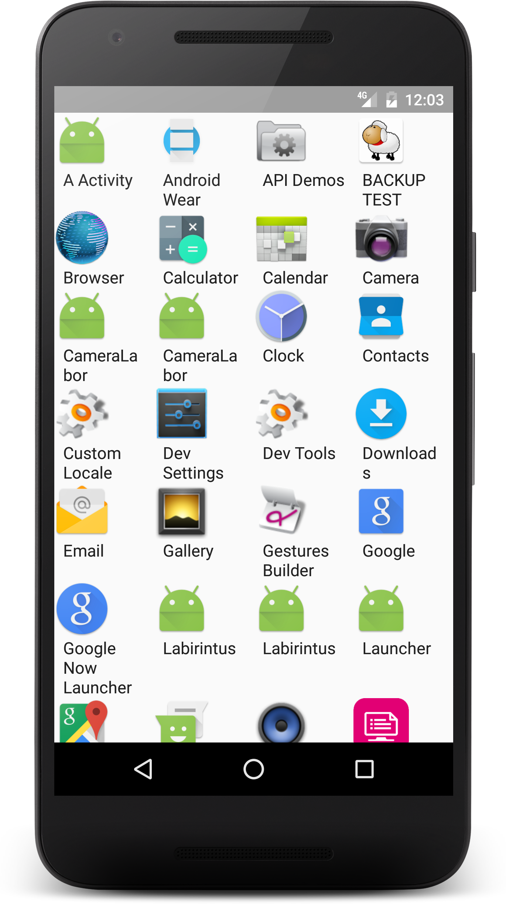

# Labor 4 - Launcher

A labor során egy úgynevezett *Launcher*, avagy *Home Screen* alkalmazást fogunk készíteni.

Az alkamazás két nézetből fog állni, az egyik egy tárcsázó, a másik pedig a telepített alkalmazásokat listázza majd ki.

A nézetek `Fragment`-ek lesznek, és a két nézet között `ViewPager` használatával lehet majd navigálni.

<p align=center>


</p>

## Projekt létrehozása

Első lépésként indítsuk el az Android Studio-t, majd:

1. Hozzunk létre egy új projektet, válasszuk az *Empty Activity* lehetőséget.
2. A projekt neve legyen `Launcher`, a kezdő package pedig `hu.bme.aut.android.launcher`.
3. Nyelvnek válasszuk a *Kotlin*-t.
4. A minimum API szint legyen 19 (Android 4.4).
5. Az *instant app* támogatást NE pipáljuk be, az *AndroidX* támogatás maradjon bepipálva.

## Activity átnevezése

A projekt létrehozását követően egyből próbáljuk is ki a `Refactor` funkciót. A generált `MainActivity`-re állva jobb egérkattintás hatására érjük el a `Refactor`-t, azon belül válasszuk a `Rename...` lehetőséget. Nevezzük át az Activity-t `LauncherActivity`-re. Ezután ismételjük meg ugyanezt az `activity_main` layout fájllal is, annak a neve legyen `activity_launcher`.


A projektünkben ez az egy `Activity` lesz. Nem szeretnénk, hogy el lehessen forgatni, illetve szeretnénk, ha launcher alkalmazásként viselkedhetne. Mindkét igény miatt az `AndroidManifest.xml` fájlt kell módosítani.

Módosítsuk az `<activity>` leíróját az alábbiak szerint:

```xml
<activity
    android:name=".LauncherActivity"
    android:label="@string/app_name"
    android:launchMode="singleTask"
    android:screenOrientation="portrait">
    <intent-filter>
        <action android:name="android.intent.action.MAIN" />

        <category android:name="android.intent.category.LAUNCHER" />
        <category android:name="android.intent.category.DEFAULT" />
        <category android:name="android.intent.category.HOME" />
    </intent-filter>
</activity>
```

A `LauncherActivity`-hez tartozó `activity_launcher.xml` fájlt módosítsuk úgy, hogy egyetlen `ViewPager`-ből álljon:

```xml
<?xml version="1.0" encoding="utf-8"?>
<androidx.viewpager.widget.ViewPager xmlns:android="http://schemas.android.com/apk/res/android"
    android:id="@+id/vpLauncherPanels"
    android:layout_width="match_parent"
    android:layout_height="match_parent" />
```

A `ViewPager`-ben két `Fragment`-et szeretnénk megjeleníteni. Hozzuk létre a `fragment` nevű package-et!

Hozzunk létre a `hu.bme.aut.android.launcher.fragment` package-ben két `Fragment` osztályt `DialerFragment` és `ApplicationsFragment` néven! Figyeljünk oda, hogy a két választható `Fragment` import közül mindig az `androidx.fragment.app` library-ből származót válasszuk!

```kotlin
class DialerFragment : Fragment() {

    override fun onCreateView(inflater: LayoutInflater, container: ViewGroup?, savedInstanceState: Bundle?): View? {
        return inflater.inflate(R.layout.fragment_dialer, container, false)
    }

}
```

```kotlin
class ApplicationsFragment : Fragment() {

    override fun onCreateView(inflater: LayoutInflater, container: ViewGroup?, savedInstanceState: Bundle?): View? {
        return inflater.inflate(R.layout.fragment_applications, container, false)
    }

}
```

Hozzuk létre a hozzájuk tartozó layout fájlokat is (<kbd>Alt</kbd> + <kbd>Enter</kbd>), egyelőre tetszőleges tartalommal.

A `ViewPager` működéséhez szükség van egy adapterre, ami meghatározza az egyes oldalakon megjelenő `Fragment`-eket.

Hozzuk létre a `adapter` package-et, majd benne a `LauncherPagerAdapter` osztályt:

```kotlin
class LauncherPagerAdapter(manager: FragmentManager) : FragmentStatePagerAdapter(manager) {

    companion object {
        private const val NUM_PAGES = 2
    }

    override fun getCount(): Int = NUM_PAGES

    override fun getItem(position: Int): Fragment {
        return when (position) {
            0 -> DialerFragment()
            1 -> ApplicationsFragment()
            else -> throw IllegalArgumentException("No such page!")
        }
    }

}
```

Itt is fontos, hogy a `FragmentManager` és a `Fragment` osztályokat az `androidx.fragment.app` package-ből importáljuk.

> Mivel a `getCount` függvény [egyetlen kifejezéssel tér vissza](https://kotlinlang.org/docs/reference/functions.html#single-expression-functions), nem kell törzset adnunk neki. Akár a visszatérési értékét is elhagyhatnánk (mivel kikövetkeztethető), ezt most csak a könnyebb érthetőség kedvéért nem tettük meg.

Használjuk fel az eddig létrehozott `ViewPager`-t és `LauncherPagerAdapter`-t a `LauncherActivity`-ben:

```kotlin
class LauncherActivity : AppCompatActivity() {

    override fun onCreate(savedInstanceState: Bundle?) {
        super.onCreate(savedInstanceState)
        setContentView(R.layout.activity_launcher)

        vpLauncherPanels.adapter = LauncherPagerAdapter(supportFragmentManager)
    }

}
```

Próbáljuk ki az alkalmazást!

### Saját téma Roboto betűtípussal

Az Android hivatalos betűtípusa a *Roboto* család, annak ellenére, hogy beépítve nem szerepel minden verzióban:

* Roboto
* Roboto Slab (talpas változat)
* Roboto Mono (keskeny változat)

Töltsük le a Roboto betűtípust az Android Studio segítségével. Ehhez válasszunk egy olyan layout fájlt, amin van `TextView` (pl. `fragment_applications.xml`, ha nincs rajta, helyezzünk el rajta egyet) és váltsunk a szerkesztőben a *Design* nézetre.

Kattintsunk a `TextView`-ra a renderelt előnézeten, jobb oldalon az *Attributes* panelen keressük ki a *fontFamily* tulajdonságot, kattintsunk rá, majd a lenyíló listában alul válasszuk a *More fonts* opciót.



Töltsük le a *Roboto Regular* változatát, ügyelve arra, hogy az *Add font to project* legyen kijelölve.



Ahhoz, hogy saját betűtípust alkalmazzunk, be kell állítanunk a `TextView`-nak. Használjunk stílust erre!

A tárcsázó gombjainak (12 darab) stílusát fogjuk össze, illetve módosítsuk a kinézetet!

Vegyük fel az alábbi színeket a `colors.xml` fájlba:

```xml
<?xml version="1.0" encoding="utf-8"?>
<resources>
    <color name="colorPrimary">#9E9E9E</color>
    <color name="colorPrimaryDark">#9E9E9E</color>
    <color name="colorAccent">#F5F5F5</color>
    <color name="accent">#607D8B</color>
    <color name="primary_text">#212121</color>
    <color name="secondary_text">#757575</color>
    <color name="icons">#212121</color>
    <color name="divider">#BDBDBD</color>
</resources>
```

Hozzuk létre a `dimens.xml` fájlt, és töltsük fel az alábbiakkal:

```xml
<?xml version="1.0" encoding="utf-8"?>
<resources>
    <!-- Default screen margins, per the Android Design guidelines. -->
    <dimen name="activity_horizontal_margin">16dp</dimen>
    <dimen name="activity_vertical_margin">16dp</dimen>
    <dimen name="dialer_text_size">40sp</dimen>
    <dimen name="drawer_text_size">16sp</dimen>
</resources>
```

Végül állítsunk be egy alapértelmezett szöveg típust az egész alkalmazásra, és adjuk hozzá a tárcsázó gombjainak stílusát a `styles.xml` fájlhoz:

```xml
<?xml version="1.0" encoding="utf-8"?>
<resources>

    <!-- Base application theme. -->
    <style name="AppTheme" parent="Base.Theme.AppCompat.Light.DarkActionBar">
        <!-- Customize your theme here. -->
        <item name="colorPrimary">@color/colorPrimary</item>
        <item name="colorPrimaryDark">@color/colorPrimaryDark</item>
        <item name="colorAccent">@color/colorAccent</item>
        <item name="android:textViewStyle">@style/DefaultText</item>
    </style>

    <style name="DefaultText" parent="Widget.AppCompat.TextView.SpinnerItem">
        <item name="fontFamily">@font/roboto</item>
    </style>

    <style name="DialerButton" parent="Widget.AppCompat.Button">
        <item name="fontFamily">@font/roboto</item>
        <item name="android:textColor">@color/primary_text</item>
        <item name="android:gravity">center</item>
        <item name="android:textSize">@dimen/dialer_text_size</item>
    </style>

</resources>
```

Ezt felhasználva már elkészíthetjük a `DialerFragment` layoutját, ennek kódja (`fragment_dialer.xml`):

```xml
<?xml version="1.0" encoding="utf-8"?>
<RelativeLayout xmlns:android="http://schemas.android.com/apk/res/android"
    android:layout_width="match_parent"
    android:layout_height="match_parent"
    android:background="@color/colorAccent"
    android:padding="@dimen/activity_horizontal_margin">

    <EditText
        android:id="@+id/etCall"
        android:layout_width="match_parent"
        android:layout_height="wrap_content"
        android:layout_above="@+id/tableLayout"
        android:layout_alignParentStart="true"
        android:layout_toStartOf="@+id/btnCallBackSpace"
        android:textSize="@dimen/dialer_text_size" />

    <ImageButton
        android:id="@+id/btnCallBackSpace"
        android:layout_width="wrap_content"
        android:layout_height="wrap_content"
        android:layout_above="@+id/tableLayout"
        android:layout_alignParentEnd="true"
        android:layout_alignTop="@+id/etCall"
        android:src="@drawable/ic_backspace_black_24dp" />

    <Button
        android:id="@+id/btnCall"
        style="@style/DialerButton"
        android:layout_width="match_parent"
        android:layout_height="wrap_content"
        android:layout_alignParentBottom="true"
        android:gravity="center"
        android:padding="15dp"
        android:text="@string/call"
        android:textSize="30sp" />

    <TableLayout
        android:id="@+id/tableLayout"
        android:layout_width="match_parent"
        android:layout_height="wrap_content"
        android:layout_above="@id/btnCall"
        android:stretchColumns="*">

        <TableRow>

            <Button
                android:id="@+id/btnDialer1"
                style="@style/DialerButton"
                android:text="1" />

            <Button
                android:id="@+id/btnDialer2"
                style="@style/DialerButton"
                android:text="2" />

            <Button
                android:id="@+id/btnDialer3"
                style="@style/DialerButton"
                android:text="3" />

        </TableRow>

        <TableRow>

            <Button
                android:id="@+id/btnDialer4"
                style="@style/DialerButton"
                android:text="4" />

            <Button
                android:id="@+id/btnDialer5"
                style="@style/DialerButton"
                android:text="5" />

            <Button
                android:id="@+id/btnDialer6"
                style="@style/DialerButton"
                android:text="6" />

        </TableRow>

        <TableRow>

            <Button
                android:id="@+id/btnDialer7"
                style="@style/DialerButton"
                android:text="7" />

            <Button
                android:id="@+id/btnDialer8"
                style="@style/DialerButton"
                android:text="8" />

            <Button
                android:id="@+id/btnDialer9"
                style="@style/DialerButton"
                android:text="9" />

        </TableRow>

        <TableRow>

            <Button
                android:id="@+id/btnDialerStar"
                style="@style/DialerButton"
                android:text="*" />

            <Button
                android:id="@+id/btnDialer0"
                style="@style/DialerButton"
                android:text="0" />

            <Button
                android:id="@+id/btnDialerHashmark"
                style="@style/DialerButton"
                android:text="#" />

        </TableRow>

    </TableLayout>

</RelativeLayout>
```

Ez az elrendezés hivatkozik a `@drawable/ic_backspace_black_24dp` erőforrásra. 

A [https://materialdesignicons.com/](https://materialdesignicons.com/) oldalon keressünk rá a *backspace*-re, majd töltsük le a számunkra megfelelőt ikont (ehhez válasszuk az *Icon Package*, majd az *Android 5.x* opciót). 

Tömörítsük ki, majd másoljuk be az összes erőforrást a `res` mappába.

Hozzuk létre a layout-ban használt `call` string erőforrást a `strings.xml` fájlban a `<resources>` elemen belül:

```xml
<string name="call">Hívás</string>
```

A laborvezető segítségével vizsgáljuk meg az elrendezést!

Próbáljuk ki az alkalmazást! Mit tapasztalunk?

Alakítsuk át a `Fragment` kódját, hogy ne jöjjön fel a billentyűzet, amikor fókuszt kap az `EditText`! A `fragment_dialer.xml`-ben az `EditText` `android:clickable` és `android:focusable` értékét állítsuk `false`-ra.

```xml
<EditText
    android:id="@+id/etCall"
    android:layout_width="match_parent"
    android:layout_height="wrap_content"
    android:layout_above="@+id/tableLayout"
    android:layout_alignParentStart="true"
    android:layout_toStartOf="@+id/btnCallBackSpace"
    android:clickable="false"
    android:focusable="false"
    android:textSize="@dimen/dialer_text_size" />
```

### Alkalmazások listája

Az alkalmazásokat listázó `ApplicationsFragment` egy `RecyclerView`-t fog megjeleníteni. Módosítsuk a `fragment_applications.xml` fájl tartalmát az alábbira:

```xml
<?xml version="1.0" encoding="utf-8"?>
<androidx.recyclerview.widget.RecyclerView xmlns:android="http://schemas.android.com/apk/res/android"
    android:id="@+id/rvApplications"
    android:layout_width="match_parent"
    android:layout_height="match_parent" />
```

A `RecyclerView` külön libraryként érhető el. Vegyük fel a következő függőséget `build.gradle (Module: app)` fájlban:

```groovy
dependencies {
    ...
    implementation 'androidx.recyclerview:recyclerview:1.0.0'
    ...
}
```

Készítsük el a modell osztályt, ami egy alkalmazás megjelenítendő adatait tudja tárolni. Hozzuk létre a `model` package-et, majd abban az `AppInfo` nevű osztályt:

```kotlin
class AppInfo(
        val title: CharSequence,
        val icon: Drawable,
        className: ComponentName
) {

    val intent: Intent

    init {
        intent = Intent(Intent.ACTION_MAIN)
        intent.addCategory(Intent.CATEGORY_LAUNCHER)
        intent.flags = Intent.FLAG_ACTIVITY_NEW_TASK or Intent.FLAG_ACTIVITY_RESET_TASK_IF_NEEDED
        intent.component = className
    }

}
```

Hozzunk létre a `res/layout` mappában egy `item_application.xml` nevű elrendezést: 

```xml
<?xml version="1.0" encoding="utf-8"?>
<LinearLayout xmlns:android="http://schemas.android.com/apk/res/android"
    android:layout_width="match_parent"
    android:layout_height="wrap_content"
    android:gravity="center_horizontal"
    android:orientation="vertical">

    <ImageView
        android:id="@+id/ivIcon"
        android:layout_width="50dp"
        android:layout_height="50dp"
        android:layout_margin="4dp" />

    <TextView
        android:id="@+id/tvName"
        android:layout_width="wrap_content"
        android:layout_height="wrap_content"
        android:layout_margin="4dp"
        android:ellipsize="end"
        android:maxLines="1"
        android:textSize="@dimen/drawer_text_size" />

</LinearLayout>
```

Az `adapter` csomagban hozzunk létre egy `ApplicationsAdapter` nevű osztályt:

```kotlin
class ApplicationsAdapter : RecyclerView.Adapter<ApplicationsAdapter.ViewHolder>() {

    private val applications: MutableList<AppInfo> = mutableListOf()

    var listener: OnApplicationClickedListener? = null

    override fun onCreateViewHolder(parent: ViewGroup, viewType: Int): ViewHolder {
        val view = LayoutInflater.from(parent.context).inflate(R.layout.item_application, parent, false)
        return ViewHolder(view)
    }

    override fun onBindViewHolder(holder: ViewHolder, position: Int) {
        val app = applications[position]
        holder.name.text = app.title
        holder.icon.setImageDrawable(app.icon)
        holder.app = app
    }

    override fun getItemCount(): Int = applications.size

    fun setApps(apps: List<AppInfo>) {
        applications.clear()
        applications.addAll(0, apps)
        notifyDataSetChanged()
    }

    inner class ViewHolder(itemView: View) : RecyclerView.ViewHolder(itemView) {
        var name: TextView = itemView.tvName
        var icon: ImageView = itemView.ivIcon

        var app: AppInfo? = null

        init {
            itemView.setOnClickListener {
                app?.let {
                    listener?.onApplicationClicked(it)
                }
            }
        }
    }

    interface OnApplicationClickedListener {
        fun onApplicationClicked(appInfo: AppInfo)
    }

}
```

Ahhoz hogy a főképernyőn megjeleníthessünk minden telepített alkalmazást, a `PackageManager` osztály `queryIntentActivities()` függvényét használhatjuk. Ez a függvény visszaadja az eszközre telepített összes alkalmazás összes `Activity`-jét, ami megfelel a kapott `Intent`-nek. A háttérben egyébként `Intent` feloldást végez. Az így visszakapott `Activity`-k adatait olvassuk be `AppInfo` objektumok listájába. Hozzunk létre az `ApplicationsFragment`-ben egy `applications` nevű lista propertyt és egy függvényt, ami összegyűjti az információkat, majd feltölti az `applications` listát:

```kotlin
private var applications: List<AppInfo> = emptyList()

private fun loadApplications() {
    val packageManager = requireActivity().packageManager

    // creating a list of every application we want to display
    val mainIntent = Intent(Intent.ACTION_MAIN, null)
    mainIntent.addCategory(Intent.CATEGORY_LAUNCHER)
    val apps = packageManager.queryIntentActivities(mainIntent, 0)

    // sorting by name, mapping to AppInfo
    applications = apps
            .sortedWith(ResolveInfo.DisplayNameComparator(packageManager))
            .map { app ->
                AppInfo(
                        title = app.loadLabel(packageManager),
                        icon = app.activityInfo.loadIcon(packageManager),
                        className = ComponentName(app.activityInfo.applicationInfo.packageName, app.activityInfo.name)
                )
            }
}
```

> Az [`emptyList`](https://kotlinlang.org/api/latest/jvm/stdlib/kotlin.collections/empty-list.html) egy kényelmes, beszédes (és hatékony) függvény üres listák létrehozására.

> A [`sortedWith`](https://kotlinlang.org/api/latest/jvm/stdlib/kotlin.collections/sorted-with.html) a számos collection-ökön definiált [extension function](https://kotlinlang.org/docs/reference/extensions.html#extension-functions) egyike a standard library-ből, ami rendez egy collection-t a megadott [`Comparator`](https://kotlinlang.org/api/latest/jvm/stdlib/kotlin/-comparator/index.html) segítségével, és visszaadja az új, rendezett listát.

> A [`map`](https://kotlinlang.org/api/latest/jvm/stdlib/kotlin.collections/map.html) függvény a neki átadott lambdát meghívja a collection minden elemére, és egy új listával tér vissza, ami az így transzformált elemeket tartalmazza. Jelen esetben egy `List<ResolveInfo>` típusú listát képeztük le egy `(ResolveInfo) -> AppInfo` típusú lambdával, így a végeredményünk egy `List<AppInfo>` lett.

Hívjuk meg a `loadApplications` metódust az `ApplicationFragment` `onCreate` életciklus függvényében:

```kotlin
override fun onCreate(savedInstanceState: Bundle?) {
    super.onCreate(savedInstanceState)
    loadApplications()
}
```

Ezek után össze kell kötnünk az összegyűjtött információkat a `RecyclerView`-val. Írjuk meg be az alábbi metódust, majd hívjuk meg az `ApplicationFragment` `onViewCreated` életciklus függvényében!

```kotlin
private fun setupRecyclerView() {
    val adapter = ApplicationsAdapter()
    adapter.listener = this
    rvApplications.layoutManager = GridLayoutManager(context, 4)
    rvApplications.adapter = adapter
    adapter.setApps(applications)
}
```    

```kotlin
override fun onViewCreated(view: View, savedInstanceState: Bundle?) {
    setupRecyclerView()
}
```

Az elvárt működés eléréséhez módosítsuk úgy az `ApplicationsFragment` osztályt, hogy az implementálja az `ApplicationsAdapter.OnApplicationClickedListener` interfészt:

```kotlin
class ApplicationsFragment : Fragment(), ApplicationsAdapter.OnApplicationClickedListener {
    ...
    
    override fun onApplicationClicked(appInfo: AppInfo) {
        requireContext().startActivity(appInfo.intent)
    }
}
```

Próbáljuk ki az alkalmazást!




## Önálló feladat

### Írja meg a tárcsázó működését!

Segítség a megoldáshoz:

A gombok eseménykezelője legyen közös, a kattintott `View` objektum `id`-ja alapján állítsa be a felhívandó telefonszámot
az `EditText`-ben (ha kell töröljön is). A hívás gomb megnyomására indítson hívást a beírt telefonszámra.

Példa a hívás indítására:

```kotlin
val phoneNumber = "tel:+36201234567"
val intent = Intent(Intent.ACTION_DIAL, Uri.parse(phoneNumber))
requireContext().startActivity(intent)
```

A fenti megoldás valójában implicit intenttel a beépített tárcsázót hívja meg. Lehetséges lenne a közvetlen hívásindítás is,
de ehhez a veszélyesnek minősített `CALL_PHONE` engedély szükséges, ezért Android 6.0 (API level 23) felett futásidőben kellene elkérni,
ezt pedig egy későbbi labor során fogjuk csak vizsgálni.
