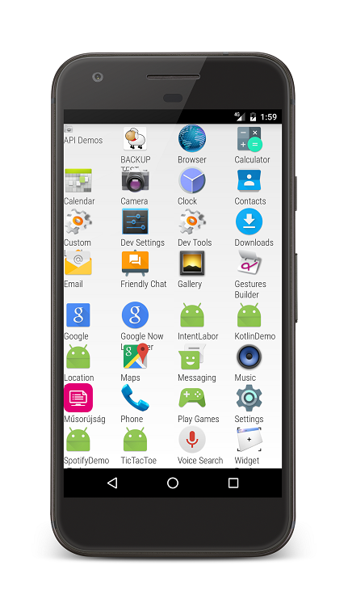

# Labor 4 - Intentek, Broadcast receiverek

A labor során egy launcher vagy home screen alkalmazást fogunk készíteni, amelyben egy *ViewPager* található, benne 2 *fragment*-tel.
A bal oldali egy tárcsázó, a jobb oldali pedig az alkalmazásokat listázza ki.




! A *ViewPager* használatához szükség van a support v4 csomagra. Importoknál ha lehetséges mindig a supportos változatot használjuk !

Első lépésben készítsünk egy új alkalmazást, package név legyen:
> hu.bme.aut.amorg.examples.intentlabor

Készítsünk egy új Empty Activity-t ,akár projekt létrehozásakor, akár később **LauncherActivity** néven, de gondoskodjunk róla,
hogy a **FragmentActivity**-ből származik le!

A projektünkben ez az egy Activity lesz. Nem szeretnénk, hogy el lehessen forgatni, illetve szeretnénk, ha home alkalmazásként viselkedhetne.
Mindkét igény miatt a Manifest állományunkat kell módosítani.

Az activity elem az alábbi legyen:
```xml
<activity
    android:name=".LauncherActivity"
    android:label="@string/app_name"
    android:launchMode="singleTask"
    android:screenOrientation="portrait">
    <intent-filter>
        <action android:name="android.intent.action.MAIN" />

        <category android:name="android.intent.category.LAUNCHER" />
        <category android:name="android.intent.category.DEFAULT" />
        <category android:name="android.intent.category.HOME" />
    </intent-filter>
</activity>
```
Az Activity szempontjából egyetlen View kell az *activity_main* XML-be: egy ViewPager
```xml
<android.support.v4.view.ViewPager xmlns:android="http://schemas.android.com/apk/res/android"
    android:id="@+id/pager"
    android:layout_width="match_parent"
    android:layout_height="match_parent" />
```
Ebben a ViewPagerben két Fragment jelenik meg. Készítsünk egy fragments nevű java package-t!
Hozzunk létre benne 2 Fragment osztályt DialerFragment és AppDrawerFragment néven!

A ViewPager működéséhez szükségünk van egy adapterre, ami szolgáltatja a Fragmenteket. Az Activity-nk kódja az alábbi módon alakul:
```java
/* Number of views in the viewpager */
private static final int NUM_PAGES = 2;

/* The viewpager that is the only view in the xml */
private ViewPager pager;

/* Pageradapter, that holds the fragments */
private PagerAdapter pagerAdapter;
```

OnCreate metódusunk:
```java
@Override
protected void onCreate(Bundle savedInstanceState) {
    super.onCreate(savedInstanceState);
    setContentView(R.layout.activity_launcher);

    /* Getting reference to the viewpager, creating new adapter, and setting it to the pager */
    pager = (ViewPager) findViewById(R.id.pager);
    pagerAdapter = new HomeScreenPagerAdapter(getSupportFragmentManager());
    pager.setAdapter(pagerAdapter);
}
```
Majd az adapter, mint belső osztály (csak a példa kedvéért, ajánlott kiszervezni):
```java
private class HomeScreenPagerAdapter extends FragmentStatePagerAdapter {

    public HomeScreenPagerAdapter(FragmentManager manager) {
        super(manager);
    }

    @Override
    public Fragment getItem(int position) {
        switch (position){
            case 0: return new DialerFragment();
            case 1: return new AppDrawerFragment();
            default: return new AppDrawerFragment();
        }
    }

    @Override
    public int getCount() {
        return NUM_PAGES;
    }
}
```
Próbáljuk ki az alkalmazást!

### Saját téma és RobotoTextView

Az Android hivatalos betűtípusa a Roboto család (annak ellenére, hogy beépítve nem szerepel):

* Roboto
* Roboto slab (talpas változat)
* Roboto condensed (keskeny változat)

Ahhoz, hogy saját betűtípust alkalmazzunk meg kell változtassuk kódból a TextView-n.
Viszont ezt minden TextView-n és szöveget megjelnítő komponensen el kellene végezni, így ehelyett egy kész megoldást használunk:

[RobotoTextView Github](https://github.com/johnkil/Android-RobotoTextView)

Illesszük be a Gradle függőségek közé, leírása szerint (elvileg már rég szerepel ott a supportv4)!

A tárcsázó gombjainak (12 darab) stílusát fogjuk össze, illetve egy kicsit szabjuk át a kinézetet!

**colors.xml**
```xml
<?xml version="1.0" encoding="utf-8"?>
<resources>
    <color name="text_color">#ff051b3e</color>
    <color name="apptheme_color">#512DA8</color>
</resources>
```

**dimens.xml**
```xml
<?xml version="1.0" encoding="utf-8"?>
<resources>
    <!-- Default screen margins, per the Android Design guidelines. -->
    <dimen name="activity_horizontal_margin">16dp</dimen>
    <dimen name="activity_vertical_margin">16dp</dimen>
    <dimen name="dialer_text_size">40sp</dimen>
    <dimen name="drawer_text_size">15dp</dimen>
</resources>
```

**styles.xml**
```xml
<?xml version="1.0" encoding="utf-8"?>
<resources>

    <!-- Base application theme. -->

<style name="AppTheme" parent="android:Theme.Holo.Light.NoActionBar">
        <!-- Customize your theme here. -->
        <item name="android:textViewStyle">@style/DefaultText</item>
    </style>

<style name="DefaultText" parent="android:Widget.TextView">
        <!-- Attributes of RobotoTextView -->
        <item name="fontFamily">roboto</item>
        <item name="textWeight">normal</item>
        <item name="textStyle">normal</item>
    </style>

<style name="DialerButton" parent="android:Widget.Button">
        <!-- Attributes of RobotoButton -->
        <item name="fontFamily">roboto</item>
        <item name="textWeight">thin</item>
        <item name="textStyle">italic</item>

        <item name="android:textColor">@color/text_color</item>
        <item name="android:gravity">center</item>
        <item name="android:layout_width">wrap_content</item>
        <item name="android:layout_height">wrap_content</item>
        <item name="android:textSize">@dimen/dialer_text_size</item>
    </style>

</resources>
```

**A DialerFragment layoutjának kódja:**
```xml
<?xml version="1.0" encoding="utf-8"?>
<RelativeLayout xmlns:android="http://schemas.android.com/apk/res/android"
    xmlns:app="http://schemas.android.com/apk/res-auto"
    xmlns:tools="http://schemas.android.com/tools"
    android:layout_width="match_parent"
    android:layout_height="match_parent"
    android:background="@color/apptheme_color"
    tools:context="hu.bme.aut.amorg.examples.intentlabor.fragments.DialerFragment">

    <com.devspark.robototextview.widget.RobotoEditText
        android:id="@+id/callEditText"
        android:layout_width="match_parent"
        android:layout_height="wrap_content"
        android:layout_above="@+id/tableLayout"
        android:layout_alignParentLeft="true"
        android:layout_alignParentStart="true"
        android:layout_toLeftOf="@+id/callBackSpaceButton"
        android:layout_toStartOf="@+id/callBackSpaceButton"
        android:textSize="@dimen/dialer_text_size" />

    <ImageButton
        android:id="@+id/callBackSpaceButton"
        android:layout_width="wrap_content"
        android:layout_height="wrap_content"
        android:layout_above="@+id/tableLayout"
        android:layout_alignParentEnd="true"
        android:layout_alignParentRight="true"
        android:layout_alignTop="@+id/callEditText"
        android:src="@drawable/ic_backspace_black_24dp" />

    <com.devspark.robototextview.widget.RobotoButton
        android:id="@+id/call_button"
        android:layout_width="match_parent"
        android:layout_height="wrap_content"
        android:layout_alignParentBottom="true"
        android:gravity="center"
        android:padding="15dp"
        android:text="@string/call"
        android:textSize="30sp"
        app:fontFamily="roboto"
        app:textStyle="normal"
        app:textWeight="normal" />

    <TableLayout
        android:id="@+id/tableLayout"
        android:layout_width="match_parent"
        android:layout_height="wrap_content"
        android:layout_above="@id/call_button"
        android:stretchColumns="*">

        <TableRow>

            <com.devspark.robototextview.widget.RobotoButton
                style="@style/DialerButton"
                android:text="1" />

            <com.devspark.robototextview.widget.RobotoButton
                style="@style/DialerButton"
                android:text="2" />

            <com.devspark.robototextview.widget.RobotoButton
                style="@style/DialerButton"
                android:text="3" />
        </TableRow>

        <TableRow>

            <com.devspark.robototextview.widget.RobotoButton
                style="@style/DialerButton"
                android:text="4" />

            <com.devspark.robototextview.widget.RobotoButton
                style="@style/DialerButton"
                android:text="5" />

            <com.devspark.robototextview.widget.RobotoButton
                style="@style/DialerButton"
                android:text="6" />
        </TableRow>

        <TableRow>

            <com.devspark.robototextview.widget.RobotoButton
                style="@style/DialerButton"
                android:text="7" />

            <com.devspark.robototextview.widget.RobotoButton
                style="@style/DialerButton"
                android:text="8" />

            <com.devspark.robototextview.widget.RobotoButton
                style="@style/DialerButton"
                android:text="9" />
        </TableRow>

        <TableRow>

            <com.devspark.robototextview.widget.RobotoButton
                style="@style/DialerButton"
                android:text="*" />

            <com.devspark.robototextview.widget.RobotoButton
                style="@style/DialerButton"
                android:text="0" />

            <com.devspark.robototextview.widget.RobotoButton
                style="@style/DialerButton"
                android:text="#" />
        </TableRow>

    </TableLayout>

</RelativeLayout>
```

Ez az elrendezés hivatkozik az ic_action_backspace erőforrásra. Töltsük le az actionbar icon packot az alábbi linkről:
https://storage.googleapis.com/material-icons/external-assets/v4/icons/zip/ic_backspace_black_24dp.zip

Tömörítsük ki, majd az android mappából másoljuk be az összes erőforrást a res mappánkba illetve készítsük el a *call* string erőforrást.

Laborvezető segítségével vizsgáljuk meg az elrendezést!

Próbáljuk ki az alkalmazást! Mit tapasztalunk?

Alakítsuk át a Fragment kódját, hogy ne jöjjön fel a billentyűzet, amikor fókuszt kap az EditText!
Hogyan is működik ez a megoldás (emulátoron nem feltétlenül jön elő a billenytűzet de készüléken tesztelve mindenképp)?

```java
public class DialerFragment extends Fragment {

    public DialerFragment() {
        // Required empty public constructor
    }

    @Override
    public void onCreate(Bundle savedInstanceState) {
        super.onCreate(savedInstanceState);
    }

    @Override
    public View onCreateView(LayoutInflater inflater, ViewGroup container,
                             Bundle savedInstanceState) {
        // Inflate the layout for this fragment
        View layout = inflater.inflate(R.layout.fragment_dialer, container, false);
        RobotoEditText editText = (RobotoEditText) layout.findViewById(R.id.callEditText);
        //Disabling soft keyboard
        editText.setOnTouchListener(new View.OnTouchListener() {
            @Override
            public boolean onTouch(View v, MotionEvent event) {
                return true;
            }
        });
        return layout;
    }

}
```

### Alkalmazások listája

Az alkalmazásokat listázó Fragment tartalma egy GridView. Laborvezetővel tekintsük át az xml-jét!

```xml
<?xml version="1.0" encoding="utf-8"?>
<GridView xmlns:android="http://schemas.android.com/apk/res/android"
     xmlns:tools="http://schemas.android.com/tools"
     android:layout_width="match_parent"
     android:layout_height="match_parent"
     tools:context="hu.bute.daai.amorg.intentlabor.fragments.AppDrawerFragment"
     android:id="@+id/all_apps"
     android:persistentDrawingCache="animation|scrolling"
     android:alwaysDrawnWithCache="true"
     android:scrollbars="none"
     android:drawSelectorOnTop="false"
     android:numColumns="auto_fit"
     android:columnWidth="78dp"
     android:stretchMode="spacingWidth"
     android:layout_weight="1.0"
     android:stackFromBottom="true"
     android:visibility="visible">

</GridView>
```
A GridView feltöltéséhez szükségünk lesz egy adapterre, annak pedig egy adatszerkezetre. Vegyük fel az alábbiakat az AppDrawerFragment osztály elejére:

```java
private ArrayList<ApplicationInfo> mApplications;
private GridView mGrid;
```
Az adapterünk kódja a következő kódrészlet, vegyük fel a Fragmentbe belső osztályként!

```java
/**
 * Custom grid adapter for ApplicationInfo array
 */
private class ApplicationsAdapter extends ArrayAdapter<ApplicationInfo> {
    private Rect mOldBounds = new Rect();

    public ApplicationsAdapter(Context context, ArrayList<ApplicationInfo> apps) {
        super(context, 0, apps);
    }

    @Override
    public View getView(int position, View convertView, ViewGroup parent) {
        final ApplicationInfo info = mApplications.get(position);

        // This is the already discussed method: using convertview for smoothness!
        if (convertView == null) {
            final LayoutInflater inflater = getActivity().getLayoutInflater();
            convertView = inflater.inflate(R.layout.application, parent, false);
        }

        Drawable icon = info.getIcon();

        if (!info.isFiltered()) {
            final Resources resources = getContext().getResources();
            int width = (int) resources.getDimension(android.R.dimen.app_icon_size);
            int height = (int) resources.getDimension(android.R.dimen.app_icon_size);

            final int iconWidth = icon.getIntrinsicWidth();
            final int iconHeight = icon.getIntrinsicHeight();

            if (icon instanceof PaintDrawable) {
                PaintDrawable painter = (PaintDrawable) icon;
                painter.setIntrinsicWidth(width);
                painter.setIntrinsicHeight(height);
            }

            if (width > 0 && height > 0 && (width < iconWidth || height < iconHeight)) {
                 final float ratio = (float) iconWidth / iconHeight;
                 if (iconWidth > iconHeight) {
                    height = (int) (width / ratio);
                } else if (iconHeight > iconWidth) {
                    width = (int) (height * ratio);
                }

                final Bitmap.Config c =
                        icon.getOpacity() != PixelFormat.OPAQUE ?
                                Bitmap.Config.ARGB_8888 : Bitmap.Config.RGB_565;
                final Bitmap thumb = Bitmap.createBitmap(width, height, c);
                final Canvas canvas = new Canvas(thumb);
                canvas.setDrawFilter(new PaintFlagsDrawFilter(Paint.DITHER_FLAG, 0));
                // Copy the old bounds to restore them later
                // If we were to do oldBounds = icon.getBounds(),
                // the call to setBounds() that follows would
                // change the same instance and we would lose the
                // old bounds
                mOldBounds.set(icon.getBounds());
                icon.setBounds(0, 0, width, height);
                icon.draw(canvas);
                icon.setBounds(mOldBounds);
                icon = new BitmapDrawable(thumb);
                info.setIcon(icon);
                info.setFiltered(true);
            }
        }

        final TextView textView = (TextView) convertView.findViewById(R.id.label);
        textView.setText(info.getTitle());
        final ImageView imageView = (ImageView) convertView.findViewById(R.id.icon);
        imageView.setImageDrawable(info.getIcon());

        return convertView;
    }
}
```
A getView metódus hivatkozik egy erőforrásra, alább egyetlen grid elem xml layoutja.

```xml
<?xml version="1.0" encoding="utf-8"?>
<LinearLayout xmlns:android="http://schemas.android.com/apk/res/android"
     xmlns:app="http://schemas.android.com/apk/res-auto"
     android:layout_width="match_parent"
     android:layout_height="match_parent"
     android:orientation="vertical">

    <ImageView
         android:id="@+id/icon"
         android:layout_width="wrap_content"
         android:layout_height="wrap_content" />

    <com.devspark.robototextview.widget.RobotoTextView
         android:id="@+id/label"
         android:layout_width="wrap_content"
         android:layout_height="wrap_content"
         android:textSize="@dimen/drawer_text_size"
         app:fontFamily="roboto_condensed"
         app:textWeight="light" />

</LinearLayout>
```

Össze kell gyűjtenünk az adatokat, amiből majd az adapter dolgozhat. Ehhez hozzunk létre egy data nevű java package-t,
majd abban egy osztályt, amiben tárolhatjuk az alkalmazásinforációkat:
```java
public class ApplicationInfo {
    /**
     * The application name.
     */
    CharSequence title;

    /**
     * The intent used to start the application.
     */
    Intent intent;

    /**
     * The application icon.
     */
    Drawable icon;

    /**
     * When set to true, indicates that the icon has been resized.
     */
    boolean filtered;

    /**
     * Creates the application intent based on a component name and various launch flags.
     *
     * @param className the class name of the component representing the intent
     * @param launchFlags the launch flags
     */
    public final void setActivity(ComponentName className, int launchFlags) {
        intent = new Intent(Intent.ACTION_MAIN);
        intent.addCategory(Intent.CATEGORY_LAUNCHER);
        intent.setComponent(className);
        intent.setFlags(launchFlags);
    }

    @Override
    public boolean equals(Object o) {
        if (this == o) {
            return true;
        }
        if (!(o instanceof ApplicationInfo)) {
            return false;
        }

        ApplicationInfo that = (ApplicationInfo) o;
        return title.equals(that.title) &&
                intent.getComponent().getClassName().equals(
                        that.intent.getComponent().getClassName());
    }

    @Override
    public int hashCode() {
        int result;
        result = (title != null ? title.hashCode() : 0);
        final String name = intent.getComponent().getClassName();
        result = 31 * result + (name != null ? name.hashCode() : 0);
        return result;
    }

    public CharSequence getTitle() {
        return title;
    }

    public void setTitle(CharSequence title) {
        this.title = title;
    }

    public Intent getIntent() {
        return intent;
    }

    public void setIntent(Intent intent) {
        this.intent = intent;
    }

    public Drawable getIcon() {
        return icon;
    }

    public void setIcon(Drawable icon) {
        this.icon = icon;
    }

    public boolean isFiltered() {
        return filtered;
    }

    public void setFiltered(boolean filtered) {
        this.filtered = filtered;
    }
}
```
Ahhoz hogy a főképernyőn megjeleníthessünk minden szükséges alkalmazást, a PackageManager osztály queryIntentActivities()
metódusát hívjuk segítségül. Ez a kapott Intentnek megfelelő összes Activity-t képes visszaadni egy listában, nekünk pedig
éppen erre van szükségünk (Intent feloldást végez a háttérben). Az így visszakapott Activity-k adatait olvassuk be egy
ApplicationInfo objektumokból álló kollekcióba, melyet a Fragmentünkben definiáltunk.
Hozzunk létre a Fragmentben egy segédmetódust, ami összeszedi az információkat, majd listát készít az alkalmazásokból:
```java
private void loadApplications() {
    // Reference to the PackageManager
    PackageManager manager = getActivity().getPackageManager();

    // creating a list of every application we want to display
    Intent mainIntent = new Intent(Intent.ACTION_MAIN, null);
    mainIntent.addCategory(Intent.CATEGORY_LAUNCHER);
    final List<ResolveInfo> apps = manager.queryIntentActivities(mainIntent, 0);
    // sorting by name
    Collections.sort(apps, new ResolveInfo.DisplayNameComparator(manager));

    // filling the ApplicationInfo array for every app (we want to display)
    if (apps != null) {
        final int count = apps.size();

        if (mApplications == null) {
            mApplications = new ArrayList<ApplicationInfo>(count);
        }
        mApplications.clear();

        for (int i = 0; i < count; i++) {
            ApplicationInfo application = new ApplicationInfo();
            ResolveInfo info = apps.get(i);

            // app's name
            application.setTitle(info.loadLabel(manager));
            // we need an Intent to start the app when touched the icon
            application.setActivity(
                    new ComponentName(info.activityInfo.applicationInfo.packageName, info.activityInfo.name),
                    Intent.FLAG_ACTIVITY_NEW_TASK | Intent.FLAG_ACTIVITY_RESET_TASK_IF_NEEDED);
            // icon
            application.setIcon(info.activityInfo.loadIcon(manager));

            mApplications.add(application);
        }
    }
}
```
Ezt a metódust hívjuk meg a Fragment onCreate életciklusfüggvényében.
A Fragment onCreate metódusa tipikusan erre való: olyan feladatok elvégzése, ami még nem igényel valódi nézetet.

Ezek után össze kell kössük az összeszedett információkat a GridView-val. Másoljuk be az alábbi metódust,
majd hívjuk meg a Fragment onCreateView életciklus függvényében!

```java
/**
 * Creating and filling ApplicationsAdapter
 * Setting the onTouchListener
 */
private void bindApplications(View root) {
    if (mGrid == null) {
        mGrid = (GridView) root.findViewById(R.id.all_apps);
    }
    mGrid.setAdapter(new ApplicationsAdapter(getActivity(), mApplications));
    mGrid.setSelection(0);
    mGrid.setOnItemClickListener(new ApplicationLauncher());
}
```
Az előbbi függvénynek szüksége van egy onItemClickListenerre. Rögtön alá el is készíthetünk egy egyszerű implementációt:
```java
/**
 * Helper class that starts the new application
 */
private class ApplicationLauncher implements AdapterView.OnItemClickListener {
    @Override
    public void onItemClick(AdapterView<?> parent, View view, int position, long id) {
        ApplicationInfo app = (ApplicationInfo) parent.getItemAtPosition(position);
        startActivity(app.getIntent());
    }
}
```
#### Próbáljuk ki az alkalmazást!

## Önálló feladatok

* Írja meg a tárcsázó működését!
* Finomítsa az alkalmazások listáját, törekedjen esztétikus megjelenésre!

Tárcsázó segítség:
A gombokat lássuk el id-kkal!
A gombok eseménykezelője legyen közös, a kattintott View objektum id-ja alapján állítsa
be a felhívandó telefonszámot az EditTextben (ha kell töröljön is), majd indítsa a hívást ha a hívás gombot nyomtuk meg!
```java
//Hívás indítása Intenttel
//Ez csak egy példa string
String phoneNumber = "tel:+36205815693";
Intent i = new Intent(
    Intent.ACTION_CALL,
    Uri.parse(phoneNumber)
    );
startActivity(i);
```
### Otthoni plusz feladat
Készítsen egy egyszerű alkalmazást, aminek egyetlen Activity-je van és Toastot dob fel, amikor sms
érkezik a készülékre! (emulátoron célszerű tesztelni)

Segítség:
A következő fejezet bemutatja hogyan lehet Broadcast Intent-eket kezelni, ezzel felkészítve az
alkalmazásunkat rendszerszintű eseményekre. Célunk, hogy értesüljünk a bejövő SMS üzenekről, illetve Toast-ban jelenítsük meg a feladót és az SMS szövegét.

Hozzunk létre egy új alkalmazást, és vegyünk fel egy új osztályt, ami a BroadcastReceiver-ből származik.
Ez a származtatás kötelezően előírja az onReceive() metódus elüldefiniálását, aminek vázát megkapjuk az „Add unimplemented methods”
kiválasztásával. Ahogy a függvény fejlécéből látszik, megkapjuk az Intent objektumot, amire feliratkoztunk
a megfelelő Intent Filter beállításával.

Vegyünk fel egy Intent filtert a Manifestünkbe (application node-on belülre):

```xml
<receiver android:name="[BR osztály neve]" >
    <intent-filter>
        <action android:name="android.provider.Telephony.SMS_RECEIVED"/>
    </intent-filter>
</receiver>
```
Mivel személyes adathoz szeretnénk hozzáférni, permission-t kell kérni a felhasználótól.
A manifestben kérjük el az SMS fogadásához szükséges RECEIVE_SMS, olvasásához pedig a READ_SMS engedélyeket:

```xml
<uses-permission android:name="android.permission.RECEIVE_SMS"/>
<uses-permission android:name="android.permission.READ_SMS"/>
```

#### Broadcastreceiver kód
Az onReceive() metódusban kezeljük le a Broadcast üzenetet. SMS olvasásnál ez a következő módon történik (csak SMS kiolvasás esetén ilyen bonyolult az adat kinyerése):

```java
if(intent.getAction().equalsIgnoreCase("android.provider.Telephony.SMS_RECEIVED")){
    // 'pdus' nevu extraban egy Object tombot kapunk, amibol kinyerheto az sms
    Object[] pdus = (Object[]) intent.getExtras().get("pdus");
    if(pdus == null){
        Log.e("RECEIVER", "pdus are null");
    } else {
        Log.v("RECEIVER", "received " + pdus.length + " messages");
        SmsMessage msg = null;
        // Object tombot kaptunk, vegigmegyunk rajta
        for (Object pdu : pdus) {
            // a konkret SMS kinyerese
            msg = SmsMessage.createFromPdu((byte[])pdu);
            if(msg != null){
                showToast(context, "Message from " +msg.getOriginatingAddress()+ ": " +msg.getDisplayMessageBody());
            } else {
                Log.e("RECEIVER", "Sms is null");
            }
        }
    }
}
```
A showToast(String) egy segédfüggvény, ami a Toast.makeText() metódust hívja megfelelően paraméterezve.
Írja meg a showToast() függvényt, majd tesztelje az alkalmazást! (Az emulátorra a DDMS felületről tud SMS-t küldeni)

Bővítse ki az alkalmazást további két eseményre való figyeléssel! Néhány példa:

* Headset figyelése
* Telefon elindulásának figyelése
* Töltöttségi állpaot változása
* Hálózati állapot változása
* Kijelző ki-be

