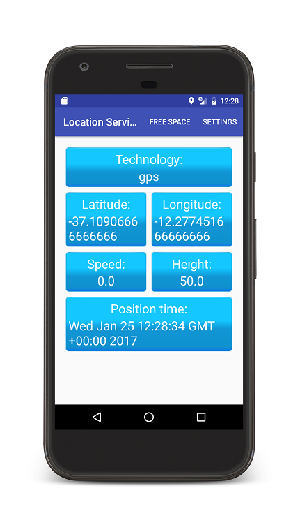
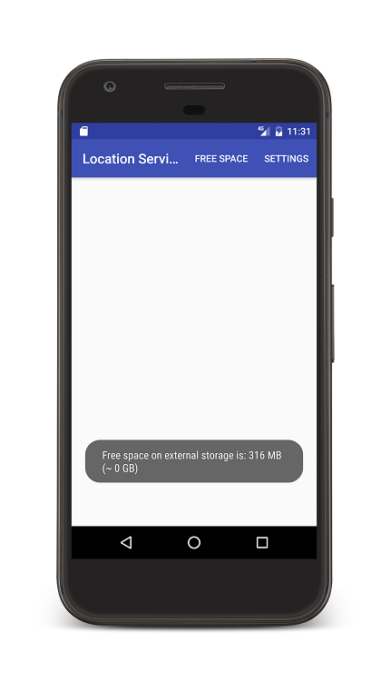
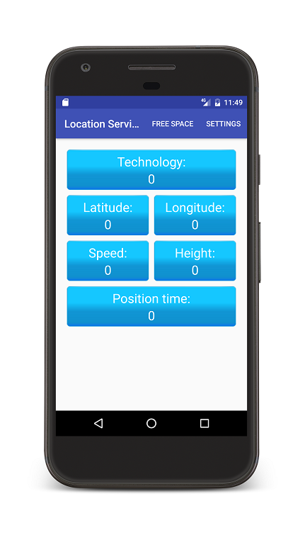
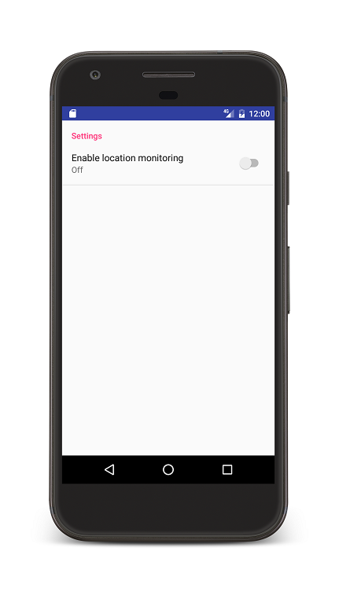
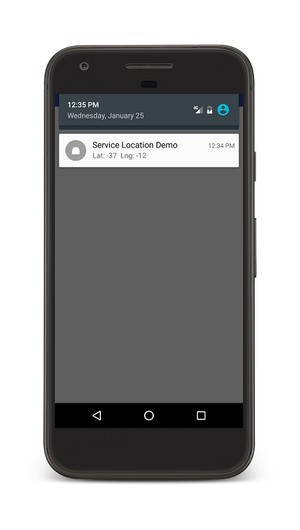
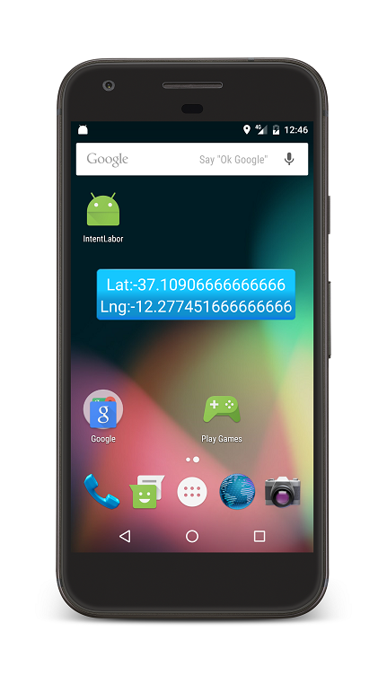
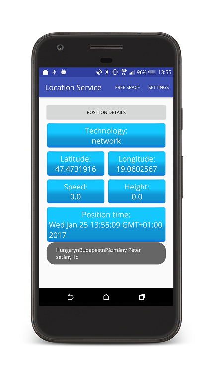

# Labor 6 - Service, Location

### Felkészülés a laborra

A labor célja a [`Service`-ek](https://developer.android.com/guide/components/services) készítésének bemutatása Android környezetben, valamint a helymeghatározási lehetőségek ismertetése.

### Szolgáltatások bevezetés

Android platformon két fő `Service` típus létezik, melyek közül az egyik tovább bontható, röviden:

* *Started Service*: Egyszerűen indítható szolgáltatás. A fő szálon fut, ha hosszan tartó műveleteket végzünk benne, a fejlesztő felelőssége ezekhez saját szálat létrehozni. Beállítható, hogy magas prioritással, *foreground* módban fusson, illetve megadható, hogy a leállása esetén milyen módon/prioritással indítsa újra a rendszer. Például, ha alacsony memóriaszint miatt lett kilőve, mi történjen, hogyan/mikor induljon újra.
* *Intent Service*: a *Started Service* speciális típusa. `Intent`-tel paraméterezhető, hogy milyen feladatot lásson el. A kéréseket sorosítja és már automatikusan külön szálon hajtja végre a benne megírt kódot.
* *Bound Service*: Lehetőséget biztosít arra, hogy más komponensek csatlakozzanak a `Service`-hez és egy egységes interface-en keresztül kommunikáljanak a `Service`-szel. Ha minden komponens lecsatlakozott róla, a `Service` leáll.

Fontos: Egy `Service` lehet egyszerre *Started Service* és *Bound Service* módban is!

### Helymeghatározás bevezetés

Android platformon két fő API létezik helymeghatározásra: a régebbi *LocationManager*, illetve az azt leváltó *Fused Location Provider*. A régebbi API-ban külön kezelhettük az eszköz által nyújtott különböző helymeghatározási lehetőségeket (GPS, hálózati adatok). Ezzel ellentétben a [*Fused Location Provider API*](https://developers.google.com/location-context/fused-location-provider/) kombinálja az összes elérhető helymeghatározási módot (a fentieken kívül például Wifi alapú helymeghatározást is használ), így nem kell őket külön kezelnünk. Elég csak pozíció frissítéseket kérnünk megfelelő paraméterekkel, és az API automatikusan a legjobb elérhető adatokat szolgáltatja.

A labor során, mivel már elérhető a Google Play Services a megfelelő emulátorokon, a *Fused Location Provider*-t fogjuk használni.

### Laborfeladat leírása

A labor során első lépésként egy egyszerű `Service`-t hozunk létre a szabad lemezterület lekérdezésére, majd egy helymeghatározásért felelős szolgáltatást készítünk, megjelenítjük a pozíció adatokat és egy értesítést, valamint "lebegő ablakot" is létrehozunk a szolgáltatáshoz.



## 1. Projekt előkészítése

Első lépésként hozzunk létre egy `ServiceDemo` nevű projektet, a `hu.bme.aut.android.servicedemo` package névvel, Kotlin támogatással, és kezdésnek egy *Empty Activity*-vel, `MainActivity` néven.

Vegyük fel előre az alkalmazás által használt szöveges erőforrásokat a `strings.xml` fájlba, hogy majd elérhetőek legyenek:

```xml
<?xml version="1.0" encoding="utf-8"?>
<resources>
    <string name="app_name">Service Demo</string>
    <string name="action_settings">Settings</string>
    <string name="action_free_space">Free space</string>
    <string name="txt_free_space">Free space on external storage is: %1$d MB (~ %2$d GB)</string>

    <string name="title_activity_settings">Settings</string>
    <string name="title_settings">Settings</string>
    <string name="title_with_floating">Floating view</string>
    <string name="title_start_service">Enable location monitoring</string>
    <string name="label_on">On</string>
    <string name="label_off">Off</string>

    <string name="txt_provider">Technology:</string>
    <string name="txt_latitude">Latitude:</string>
    <string name="txt_longitude">Longitude:</string>
    <string name="txt_speed">Speed:</string>
    <string name="txt_alt">Height:</string>
    <string name="txt_position_time">Position time:</string>
</resources>
```

Az `AndroidManifest.xml`-be is vegyük fel előre az összes engedélyt, amire szükségünk lesz később:

```xml
<uses-permission android:name="android.permission.ACCESS_FINE_LOCATION" />
<uses-permission android:name="android.permission.ACCESS_COARSE_LOCATION" />
<uses-permission android:name="android.permission.INTERNET" />
<uses-permission android:name="android.permission.ACCESS_NETWORK_STATE" />
<uses-permission android:name="android.permission.VIBRATE" />
<uses-permission android:name="android.permission.SYSTEM_ALERT_WINDOW" />
```

Utolsó lépésként a projekt előkészítésében vegyük fel a következő függőségeket a modul szintű `build.gradle` fájlunkba:

```groovy
implementation 'com.android.support:preference-v7:28.0.0'
implementation 'com.google.android.gms:play-services-location:15.0.1', {
    exclude group: 'com.android.support'
}
```

Ezek közül az első a beállítások képernyőnk elkészítéséhez lesz szükséges, míg utóbbi a *Fused Location Provider*-t nyújtja. 

## 2. Szabad lemezterület lekérdezése IntentService segítségével

A következőkben készítünk egy `IntentService`-t, mely lehetőséget biztosít a szabad lemezterület lekérdezésére.

Első lépésként hozzunk létre egy `service` package-et és hozzuk létre a `FileSystemStatsIntentService` osztályt, mely:
* Leszármazik az `IntentService` osztályból.
* Kérés hatására lekérdezi a szabad lemezterületet a külső adattárolón.
* A választ egy `Messenger`-en keresztül (amit az indító `Intent`-ben kapott) küldi vissza.

```kotlin
class FileSystemStatsIntentService : IntentService("FileSystemStatsIntentService") {

    companion object {
        const val KEY_MESSENGER = "KEY_MESSENGER"
    }

    override fun onHandleIntent(intent: Intent) {
        val freeSpace = calculateFreeSpace()
        sendResultFreeSpace(intent, freeSpace)
    }

    private fun calculateFreeSpace(): Long {
        val statFs = StatFs(Environment.getExternalStorageDirectory().absolutePath)
        val available = statFs.availableBlocksLong * statFs.blockSizeLong
        return available / 1024 / 1024
    }

    private fun sendResultFreeSpace(intent: Intent, freeSpace: Long) {
        val extras = intent.extras ?: return
        
        val messenger = extras.get(KEY_MESSENGER) as Messenger

        val msg = Message.obtain().apply {
            arg1 = Activity.RESULT_OK
            obj = freeSpace
        }

        try {
            messenger.send(msg)
        } catch (e: RemoteException) {
            e.printStackTrace()
        }
    }

}
```

Figyeljük meg, hogyan éri el a `Service` a `Messenger` objektumot amin keresztül vissza tud üzenni, valamint az üzenetet jelképező `Message`-et és annak használatát!

> A `Message` konfigurációjánál a Kotlin Standard Library [`apply`](https://kotlinlang.org/api/latest/jvm/stdlib/kotlin/apply.html) függvényét használjuk. Az ennek átadott lambdán belül annak az objektumnak a scope-jába kerülünk, amin a függvényt meghívtuk. Jelen esetben ez azt jelenti, hogy az `apply`-nak átadott kódblokkon belül a `this` a `Message` példányra mutat, így nem kell minden property beállításánál leírnunk a változó nevét.

A `Service` is egy teljes értékű alkalmazáskomponens, ezért a Manifest fájlban fel kell tüntetnünk (az `application` tagen belül):

```xml
<service android:name=".service.FileSystemStatsIntentService"/>
```

Következő lépésként készítsünk egy menü erőforrást a `res/menu` mappába `menu_main.xml` néven a `MainActivity`-hez, amely elindítja ezt a szolgáltatást - előre felveszünk egy *Settings* menüpontot is, ezt később használni fogjuk.

```xml
<?xml version="1.0" encoding="utf-8"?>
<menu xmlns:android="http://schemas.android.com/apk/res/android"
    xmlns:tools="http://schemas.android.com/tools"
    xmlns:app="http://schemas.android.com/apk/res-auto"
    tools:context=".MainActivity">

    <item android:id="@+id/action_free_space"
        android:title="@string/action_free_space"
        android:orderInCategory="100"
        app:showAsAction="ifRoom" />

    <item android:id="@+id/action_settings"
        android:title="@string/action_settings"
        android:orderInCategory="110"
        app:showAsAction="ifRoom" />

</menu>
```

Az `MainActivity`-ben hozzunk létre egy `Handler`-t, amely az `IntentService`-ből visszaérkező üzeneteket fogja kezelni, valamint állítsuk be az előbb definiált menüt és implementáljuk a *Free space* menüpont eseménykezelőjét. Figyeljük meg, hogy hogyan adjuk át a `Messenger` objektumot a `Service`-nek!

```kotlin
class MainActivity : AppCompatActivity() {

    @SuppressLint("HandlerLeak")
    private val freeSpaceHandler = object : Handler() {
        override fun handleMessage(msg: Message) {
            if (msg.arg1 == Activity.RESULT_OK) {
                val freeMB = msg.obj as Long
                val freeGB = freeMB / 1024
                Toast.makeText(this@MainActivity, getString(R.string.txt_free_space, freeMB, freeGB), Toast.LENGTH_SHORT).show()
            }
        }
    }

    private val freeSpaceMessenger = Messenger(freeSpaceHandler)

    override fun onCreate(savedInstanceState: Bundle?) {
        super.onCreate(savedInstanceState)
        setContentView(R.layout.activity_main)
    }

    override fun onCreateOptionsMenu(menu: Menu): Boolean {
        menuInflater.inflate(R.menu.menu_main, menu)
        return true
    }

    override fun onOptionsItemSelected(item: MenuItem): Boolean {
        when (item.itemId) {
            R.id.action_free_space -> {
                val intentStartService = Intent(this, FileSystemStatsIntentService::class.java)
                intentStartService.putExtra(FileSystemStatsIntentService.KEY_MESSENGER, freeSpaceMessenger)
                startService(intentStartService)
            }
        }

        return true
    }

}
```

Látható, hogy az `IntentService` milyen módon paraméterezhető, amennyiben összetettebb feladatokat hajtunk végre a `Service`-ben (pl. hálózati kommunikáció, letöltés, stb.), hasonlóan adhatók át a kérések paraméterei, például egy URL vagy különböző azonosítók.

Az `app` modul `build.gradle` fájljában állítsuk át a `targetSdkVersion` értékét 22-re, mivel 23-as API szinten és felette futásidőben kellene kezelnünk a veszélyes engedélyek elkérését. Ezt egy későbbi laboron nézzük majd meg.

Próbáljuk ki az alkalmazást működés közben!



Igazoljuk, hogy az `IntentService` valóban külön szálban, sorosítva hajtja végre a kéréseket! Ehhez ideiglenesen tegyünk egy `Thread.sleep(3000)` hívást az `onHandleIntent` függvénybe:

```kotlin
override fun onHandleIntent(intent: Intent) {
    val freeSpace = calculateFreeSpace()
    Thread.sleep(3000)
    sendResultFreeSpace(intent, freeSpace)
}
```

Indítsuk el így az alkalmazást és próbáljunk többször egymás után a menüre kattintani. Azt tapasztaljuk, hogy valóban nem foglalja a hívás a UI szálat, illetve hogy valóban sorban hajtja végre a kéréseket!

## 3. Felhasználói felület előkészítése helymeghatározáshoz

Az alábbi felhasználói felületet fogjuk elkészíteni egy `Fragment` segítségével.



Töltsük le a [kék, lekerekített négyzetet jelképező 9-patch képet](images/tile_bg.9.png) és tegyük be a minősítő nélküli `drawable` könyvtárba.

A `layout` mappában hozzunk létre egy `tile_info.xml`-t, ami egy kék téglalapot foglal magában, két `TextView`-val. Ennek a kódja az alábbi:

```xml
<?xml version="1.0" encoding="utf-8"?>
<LinearLayout xmlns:android="http://schemas.android.com/apk/res/android"
    android:layout_width="match_parent"
    android:layout_height="wrap_content"
    android:layout_margin="5dp"
    android:background="@drawable/tile_bg"
    android:gravity="center"
    android:orientation="vertical">

    <TextView
        android:id="@+id/tvHead"
        android:layout_width="wrap_content"
        android:layout_height="wrap_content"
        android:text="Data:"
        android:textColor="@android:color/white"
        android:textSize="24sp" />

    <TextView
        android:id="@+id/tvValue"
        android:layout_width="wrap_content"
        android:layout_height="wrap_content"
        android:text="0"
        android:textColor="@android:color/white"
        android:textSize="24sp" />

</LinearLayout>
```

Ezt követően készítsük el a `Fragment`-hez tartozó layout fájlt, mely az imént létrehozott elemekből felépíti a *Dashboard* felületet. Ehhez szintén a `layout` mappába hozzuk létre a `fragment_location_dashboard.xml` fájlt, a következő tartalommal:

```xml
<?xml version="1.0" encoding="utf-8"?>
<ScrollView xmlns:android="http://schemas.android.com/apk/res/android"
    xmlns:app="http://schemas.android.com/apk/res-auto"
    android:id="@+id/scroller"
    android:layout_width="match_parent"
    android:layout_height="match_parent"
    android:fillViewport="true">

    <android.support.constraint.ConstraintLayout
        android:layout_width="match_parent"
        android:layout_height="wrap_content">

        <include
            android:id="@+id/fieldProvider"
            layout="@layout/tile_info"
            android:layout_width="0dp"
            android:layout_height="wrap_content"
            android:layout_margin="6dp"
            app:layout_constraintEnd_toEndOf="parent"
            app:layout_constraintStart_toStartOf="parent"
            app:layout_constraintTop_toTopOf="parent" />

        <include
            android:id="@+id/fieldLat"
            layout="@layout/tile_info"
            android:layout_width="0dp"
            android:layout_height="wrap_content"
            android:layout_margin="6dp"
            app:layout_constraintEnd_toStartOf="@+id/fieldLng"
            app:layout_constraintStart_toStartOf="parent"
            app:layout_constraintTop_toBottomOf="@+id/fieldProvider" />

        <include
            android:id="@+id/fieldLng"
            layout="@layout/tile_info"
            android:layout_width="0dp"
            android:layout_height="wrap_content"
            android:layout_margin="6dp"
            app:layout_constraintEnd_toEndOf="parent"
            app:layout_constraintStart_toEndOf="@+id/fieldLat"
            app:layout_constraintTop_toBottomOf="@+id/fieldProvider" />

        <include
            android:id="@+id/fieldSpeed"
            layout="@layout/tile_info"
            android:layout_width="0dp"
            android:layout_height="wrap_content"
            android:layout_margin="6dp"
            app:layout_constraintEnd_toStartOf="@+id/fieldAlt"
            app:layout_constraintStart_toStartOf="parent"
            app:layout_constraintTop_toBottomOf="@+id/fieldLat" />

        <include
            android:id="@+id/fieldAlt"
            layout="@layout/tile_info"
            android:layout_width="0dp"
            android:layout_height="wrap_content"
            android:layout_margin="6dp"
            app:layout_constraintEnd_toEndOf="parent"
            app:layout_constraintStart_toEndOf="@+id/fieldSpeed"
            app:layout_constraintTop_toBottomOf="@+id/fieldLng" />

        <include
            android:id="@+id/fieldPosTime"
            layout="@layout/tile_info"
            android:layout_width="0dp"
            android:layout_height="wrap_content"
            android:layout_margin="6dp"
            app:layout_constraintEnd_toEndOf="parent"
            app:layout_constraintStart_toStartOf="parent"
            app:layout_constraintTop_toBottomOf="@+id/fieldSpeed" />

    </android.support.constraint.ConstraintLayout>

</ScrollView>
```

Figyeljük meg a fenti kódban, hogy hogyan lehet az XML felület leíróban `include`-olni a `tile_info.xml` tartalmát.

A `MainActivity` felületét (`activity_main.xml`) alakítsuk át, hogy `Fragment`-et tudjon tárolni. A mostani példában dinamikusan fogjuk rácsatolni a `Fragment`-et, ezért elegendő egy `FrameLayout`-ot tennünk az `activity_main.xml`-be:

```xml
<?xml version="1.0" encoding="utf-8"?>
<FrameLayout xmlns:android="http://schemas.android.com/apk/res/android"
    xmlns:tools="http://schemas.android.com/tools"
    android:id="@+id/layoutContainer"
    android:layout_width="match_parent"
    android:layout_height="match_parent"
    android:paddingBottom="@dimen/activity_vertical_margin"
    android:paddingLeft="@dimen/activity_horizontal_margin"
    android:paddingRight="@dimen/activity_horizontal_margin"
    android:paddingTop="@dimen/activity_vertical_margin"
    tools:context=".MainActivity" />
```

Az ebben szereplő `dimen` erőforrásokat rajtuk *Alt+Enter*-t nyomva hozzuk létre, értékük legyen `16dp`.

Hozzuk létre a `LocationDashboardFragment`-et az alábbi kóddal:

```kotlin
class LocationDashboardFragment : Fragment() {

    private lateinit var tvProviderValue: TextView
    private lateinit var tvLatValue: TextView
    private lateinit var tvLngValue: TextView
    private lateinit var tvSpeedValue: TextView
    private lateinit var tvAltValue: TextView
    private lateinit var tvPosTimeValue: TextView

    override fun onCreateView(inflater: LayoutInflater, container: ViewGroup?, savedInstanceState: Bundle?): View? {
        return inflater.inflate(R.layout.fragment_location_dashboard, container, false)
    }

    override fun onViewCreated(view: View, savedInstanceState: Bundle?) {
        super.onViewCreated(view, savedInstanceState)

        tvProviderValue = initField(view, R.id.fieldProvider, R.string.txt_provider)
        tvLatValue = initField(view, R.id.fieldLat, R.string.txt_latitude)
        tvLngValue = initField(view, R.id.fieldLng, R.string.txt_longitude)
        tvSpeedValue = initField(view, R.id.fieldSpeed, R.string.txt_speed)
        tvAltValue = initField(view, R.id.fieldAlt, R.string.txt_alt)
        tvPosTimeValue = initField(view, R.id.fieldPosTime, R.string.txt_position_time)
    }

    private fun initField(fragmentView: View, @IdRes fieldId: Int, @StringRes headTextRes: Int): TextView {
        val viewField = fragmentView.findViewById<View>(fieldId)

        val tvHead = viewField.findViewById<TextView>(R.id.tvHead)
        tvHead.setText(headTextRes)

        return viewField.findViewById(R.id.tvValue)
    }

}
```

Figyeljük meg, ahogy kikeressük a különböző ID-val ellátott `tile_info` elrendezéseket, beállítjuk nekik a megfelelő címkét, a bennük értékeket reprezentáló `TextView`-kat pedig elmentjük, hogy később frissíteni tudjuk őket.

Már csak az hiányzik, hogy a `MainActivity` dinamikusan felcsatolja ezt a `Fragment`-et. Ezt a `MainActivity` `onCreate` függvényének végén tegyük meg:

```kotlin
if (savedInstanceState == null) {
    supportFragmentManager.beginTransaction()
            .add(R.id.layoutContainer, LocationDashboardFragment())
            .commit()
}
```

Próbáljuk ki az alkalmazást és ellenőrizzük, hogy valóban megjelenik-e a kívánt felület!


## 4. Beállítások nézet létrehozása helymeghatározás vezérléséhez

Az alkalmazásban egy beállítások nézeten fogjuk vezérelni a háttérben történő helymeghatározást. Ehhez a *Preference API* használatával hozunk létre egy képernyőt, ahol egy `Switch` segítségével lehet majd elindítani és leállítani a szolgáltatást.

Első lépésként a `res` mappába hozzunk létre egy `xml` almappát, abban pedig egy `preferences.xml` fájlt, ami a `PreferenceScreen`-t írja le:

```xml
<?xml version="1.0" encoding="utf-8"?>
<PreferenceScreen xmlns:android="http://schemas.android.com/apk/res/android">
    <PreferenceCategory android:title="@string/title_settings">
        <SwitchPreference
            android:key="start_service"
            android:summaryOff="@string/label_off"
            android:summaryOn="@string/label_on"
            android:title="@string/title_start_service" />
    </PreferenceCategory>
</PreferenceScreen>
```

Figyeljük meg, hogy milyen egyszerűen le lehet írni XML segítségével egy beállítások felületet!

Ezt követően hozzunk létre egy *Empty Activity*-t `SettingsActivity` néven (*ne* használjuk a *Settings Activity* sablont). Ennek a kódja a következő lesz:

```kotlin
class SettingsActivity : AppCompatActivity(), SharedPreferences.OnSharedPreferenceChangeListener {

    companion object {
        const val KEY_START_SERVICE = "start_service"
    }

    override fun onCreate(savedInstanceState: Bundle?) {
        super.onCreate(savedInstanceState)

        supportFragmentManager.beginTransaction()
                .replace(android.R.id.content, FragmentSettingsBasic())
                .commit()
    }

    override fun onStart() {
        super.onStart()
        PreferenceManager.getDefaultSharedPreferences(this)
                .registerOnSharedPreferenceChangeListener(this)
    }

    override fun onStop() {
        PreferenceManager.getDefaultSharedPreferences(this)
                .unregisterOnSharedPreferenceChangeListener(this)

        super.onStop()
    }

    override fun onSharedPreferenceChanged(sharedPreferences: SharedPreferences, key: String) {
        when (key) {
            KEY_START_SERVICE -> {
                // TODO service indítása/leállítása
            }
        }
    }

    class FragmentSettingsBasic : PreferenceFragmentCompat() {
        override fun onCreatePreferences(savedInstanceState: Bundle?, key: String?) {
            addPreferencesFromResource(R.xml.preferences)
        }
    }

}
```

Fontos kiemelni, hogy a `PreferenceFragment` megoldás már automatikusan megoldja
a beállítások tárolását `SharedPreferences`-ben, ezt nem kell külön implementálnunk.

Figyeljük meg, hogyan iratkozunk fel a beállítások megváltozására az `onStart`-ban, mely majd az állapottól függően fogja indítani/leállítani a `Service`-t. Fontos, hogy ha feliratkoztunk a változásokra, akkor iratkozzunk is le róla a megfelelő helyen (pl. `onStop`), egyébként beragadhat ez a listener.

Hogy elérhessük a *Settings* nézetet, egészítsük ki a `MainActivity` menü kezelő függvényét
(`onOptionsItemSelected`), hogy a *Settings* menüpontot választva indítsa el a `SettingsActivity`-t:

```kotlin
R.id.action_settings -> {
    val intentSettings = Intent(this, SettingsActivity::class.java)
    startActivity(intentSettings)
}
```

Próbáljuk ki a beállítások nézetet! Láthatjuk, hogy a beállítás értéke tényleg megmarad az alkalmazás újraindítása után is.



## 5. Helymeghatározás megvalósítása Service-szel

A következőkben hozzuk létre a helymeghatározásért felelős osztályt, valamint egy `Service`-t, ami a háttérben vezérli a helymeghatározást.

Első lépésként hozzunk létre egy `location` package-et és benne egy `LocationHelper`
osztályt az alábbi kóddal:

```kotlin
class LocationHelper(private val context: Context, private val callback: LocationCallback) {

    fun startLocationMonitoring() {
        val request = LocationRequest().apply {
            interval = 5000L
            fastestInterval = 1000L
            priority = LocationRequest.PRIORITY_HIGH_ACCURACY
        }

        LocationServices.getFusedLocationProviderClient(context)
                .requestLocationUpdates(request, callback, Looper.getMainLooper())
    }

    fun stopLocationMonitoring() {
        LocationServices.getFusedLocationProviderClient(context).removeLocationUpdates(callback)
    }

}
```

Vizsgáljuk meg az osztály felépítését, az API felé intézett kérés felparaméterezését!

> Itt ismét az [`apply`](https://kotlinlang.org/api/latest/jvm/stdlib/kotlin/apply.html) függvényt használjuk, hogy egyszerűen és olvasható módon hozzunk létre egy `LocationRequest`-et.

Következő lépésként a `service` package-ben hozzuk létre a `LocationService` osztályt:

```kotlin
class LocationService : Service() {

    companion object {
        const val BR_NEW_LOCATION = "BR_NEW_LOCATION"
        const val KEY_LOCATION = "KEY_LOCATION"
    }

    private var locationHelper: LocationHelper? = null

    var lastLocation: Location? = null
        private set

    override fun onBind(intent: Intent): IBinder? = null

    override fun onStartCommand(intent: Intent, flags: Int, startId: Int): Int {
        if (locationHelper == null) {
            val helper = LocationHelper(applicationContext, LocationServiceCallback())
            helper.startLocationMonitoring()
            locationHelper = helper
        }

        return Service.START_STICKY
    }

    inner class LocationServiceCallback : LocationCallback() {
        override fun onLocationResult(result: LocationResult) {
            val location = result.lastLocation ?: return

            lastLocation = location

            val intent = Intent()
            intent.action = BR_NEW_LOCATION
            intent.putExtra(KEY_LOCATION, location)
            LocalBroadcastManager.getInstance(this@LocationService).sendBroadcast(intent)
        }

        override fun onLocationAvailability(locationAvailability: LocationAvailability) {
            // TODO
        }
    }

    override fun onDestroy() {
        locationHelper?.stopLocationMonitoring()
        super.onDestroy()
    }

}
```

Vizsgáljuk meg az osztály tartalmát:
* Az `onStartCommand` életciklus függvényben létrehoz egy `LocationHelper` példányt, és átadja neki a belső osztályként implementált `LocationCallback` egy példányát. Ennek a függvényei fognak meghívódni amikor a *Fused Location Provider* új adatokat kapott.
* A megkapott `Location` példányokat eltároljuk a `Service`-ben, valamint közzétesszük egy broadcast üzenetben a `LocalBroadcastManager` segítségével.  

Ne felejtsük el az `AndroidManifest.xml`-ben is felvenni az új `Service`-t:

```xml
<service android:name=".service.LocationService" />
```

Végül a `Service` indítása/leállítása céljából egészítsük ki a `SettingsActivity`-ben az `onSharedPreferenceChange` függvényt, hogy valóban elindítsa/leállítsa a `LocationService`-t:

```kotlin
override fun onSharedPreferenceChanged(sharedPreferences: SharedPreferences, key: String) {
    when(key) {
        KEY_START_SERVICE -> {
            startOrStopServiceAsNecessary(sharedPreferences, applicationContext)
        }
    }
}

companion object {
    const val KEY_START_SERVICE = "start_service"

    fun startOrStopServiceAsNecessary(sharedPreferences: SharedPreferences, context: Context) {
        val startService = sharedPreferences.getBoolean(KEY_START_SERVICE, false)

        val intent = Intent(context, LocationService::class.java)

        if (startService) {
            context.startService(intent)
        } else {
            context.stopService(intent)
        }
    }
}
```

A fenti kód még csak a beállítások változására reagál. Ha újraindul az alkalmazás, a `LocationService` nem fog elindulni, hiába hagytuk bekapcsolva a beállítást. Ezért hívjuk meg ezt a függvényt a `MainActivity` `onCreate`-jének végén is:

```kotlin
val sharedPreferences = PreferenceManager.getDefaultSharedPreferences(this)
SettingsActivity.startOrStopServiceAsNecessary(sharedPreferences, this)
```

## 6. Location adatok megjelenítése

Kész a szolgáltatásunk, most már csak el kell kapnunk az általa *Broadcast*-ként küldött adatokat a `LocationDashboardFragment`-ben.

Hozzunk létre itt egy property-t, ami egy `BroadcastReceiver` implementációt tárol, és a beérkező `Intent`-ből kiolvassa a `Location`-t, valamint beállítja a UI állapotát.

```kotlin
private val locationReceiver = object : BroadcastReceiver() {
    override fun onReceive(context: Context, intent: Intent) {
        val currentLocation = intent.getParcelableExtra<Location>(LocationService.KEY_LOCATION)

        tvLatValue.text = currentLocation.latitude.toString()
        tvLngValue.text = currentLocation.longitude.toString()
        tvAltValue.text = currentLocation.altitude.toString()
        tvSpeedValue.text = currentLocation.speed.toString()
        tvProviderValue.text = currentLocation.provider
        tvPosTimeValue.text = Date(currentLocation.time).toString()
    }
}
```

Ezt a `BroadcastReceiver`-t dinamikusan fogjuk beregisztrálni, amit az `onStart` és `onStop` függvényekben kezelünk:

```kotlin
override fun onStart() {
    super.onStart()

    LocalBroadcastManager.getInstance(requireContext())
            .registerReceiver(locationReceiver, IntentFilter(LocationService.BR_NEW_LOCATION))
}

override fun onStop() {
    LocalBroadcastManager.getInstance(requireContext())
            .unregisterReceiver(locationReceiver)

    super.onStop()
}
```

Próbáljuk ki az alkalmazást! Emulátoron teszteléshez nyissuk meg az oldalsó vezérlősáv további lehetőségeit, ahol a *Location* menüben egyszerűen tudunk pozíciót küldeni az emulátornak.


## 7. Értesítés megjelenítése

Következő lépésként valósítsuk meg, hogy a `LocationService` *foreground* módban induljon el. Ehhez szükség van arra, hogy egy *Notification* is jelezze a futását - ebben meg fogjuk jeleníti az aktuális koordinátákat, valamint rákattintva elindítjuk a `MainActivity`-t.

Vegyük fel az értesítés azonosító konstanst a *LocationService* osztály `companion object`-jébe:

```kotlin
private const val NOTIFICATION_ID = 101
```

Készítsünk két új függvényt az osztályba a *Notification* létrehozására és megjelenítésére/frissítésére:

```kotlin
private fun createNotification(text: String): Notification {
    val notificationIntent = Intent(this, MainActivity::class.java)
    notificationIntent.flags = Intent.FLAG_ACTIVITY_CLEAR_TASK

    val contentIntent = PendingIntent.getActivity(this,
            NOTIFICATION_ID,
            notificationIntent,
            PendingIntent.FLAG_CANCEL_CURRENT)

    return NotificationCompat.Builder(this)
            .setContentTitle("Service Location Demo")
            .setContentText(text)
            .setSmallIcon(R.mipmap.ic_launcher)
            .setVibrate(longArrayOf(1000, 2000, 1000))
            .setContentIntent(contentIntent)
            .build()
}

private fun updateNotification(text: String) {
    val notification = createNotification(text)
    val notificationManager = getSystemService(Context.NOTIFICATION_SERVICE) as NotificationManager
    notificationManager.notify(NOTIFICATION_ID, notification)
}
```

A `NotificationCompat.Builder` egyparaméteres konstruktora elavult, és ezt jelzi is nekünk a fejlesztőkörnyezet,
de ezzel most nincs teendőnk. Röviden ennek az az oka, hogy az Android 8.0 (API level 26) óta az értesítéseket
csatornához kell rendelni, és a csatorna azonosítóját a kétparaméteres konstruktor második paramétereként
adnánk meg.  Ez a témakör túlmutat a jelenlegi labor témáján, bővebben
[itt](https://developer.android.com/training/notify-user/channels) lehet a témáról olvasni.

A `LocationService`-t indító `onStartCommand` függvény legelején állítsuk be a *foreground* módot:

```kotlin
startForeground(NOTIFICATION_ID, createNotification("Starting location service..."))
```

Az `onLocationResult` függvényben új pozíció érkezésekor frissítsük a *Notification*-t:

```kotlin
updateNotification("Lat: ${location.latitude} Lng: ${location.longitude}")
```

A helymeghatározási szolgáltatás elérhetőségével kapcsolatos változások esetén szintén frissítsük az értesítés tartalmát:

```kotlin
override fun onLocationAvailability(locationAvailability: LocationAvailability) {
    updateNotification("Location available: ${locationAvailability.isLocationAvailable}")
}
```

Próbáljuk ki az alkalmazást működés közben és vizsgáljuk meg a *Notification* működését! Nézzük meg mi történik, ha rákattintunk az értesítésre!



## 8. Lebegő ablak megjelenítése

Egészítsük ki a megoldást, hogy bekapcsolható legyen egy áthelyezhető lebegő ablak is
a beállítások nézetben, mely (például a Facebook értesítőhöz hasonlóan) mindig előtérben van
és megjeleníti az aktuális pozíció információt.

Ehhez szükséges a `SYSTEM_ALERT_WINDOW` engedély, amit korábban már felvettünk.

Android 23 (Marshmallow) felett külön be kell állítani ezt az engedélyt a készüléken is, ezt a következő helyen lehet megtenni: *Settings -> Apps -> Service Demo -> Advanced -> Display over other apps* (*Beállítások -> Alkalmazások -> Service Demo -> Speciális -> A többi alkalmazás fölött*).

Először hozzuk létre a lebegő ablak felület leíróját, ez legyen a `float_layout.xml` fájl:
                                                   
```xml
<?xml version="1.0" encoding="utf-8"?>
<LinearLayout xmlns:android="http://schemas.android.com/apk/res/android"
    xmlns:tools="http://schemas.android.com/tools"
    android:layout_width="match_parent"
    android:layout_height="wrap_content"
    android:layout_margin="5dp"
    android:background="@drawable/tile_bg"
    android:gravity="center"
    android:orientation="vertical">

    <TextView
        android:id="@+id/tvFloatLat"
        android:layout_width="wrap_content"
        android:layout_height="wrap_content"
        android:textColor="@android:color/white"
        android:textSize="24sp"
        tools:text="Lat: 0" />

    <TextView
        android:id="@+id/tvFloatLng"
        android:layout_width="wrap_content"
        android:layout_height="wrap_content"
        android:textColor="@android:color/white"
        android:textSize="24sp"
        tools:text="Lng: 0" />

</LinearLayout>
```

Hozzuk létre a `ui` package-et és vegyünk fel egy új segédosztályt, amely a lebegő ablak megjelenítését fogja végezni:

```kotlin
class FloatingWindowHelper(private val context: Context) {

    private var windowManager: WindowManager? = null
    private var floatingView: View? = null
    private var tvFloatLat: TextView? = null
    private var tvFloatLng: TextView? = null

    @SuppressLint("ClickableViewAccessibility")
    fun showFloatingWindow() {
        hideFloatingWindow()

        windowManager = context.getSystemService(Context.WINDOW_SERVICE) as WindowManager

        val floatingView: View = LayoutInflater.from(context).inflate(R.layout.float_layout, null)
        tvFloatLat = floatingView.findViewById(R.id.tvFloatLat)
        tvFloatLng = floatingView.findViewById(R.id.tvFloatLng)

        val params = WindowManager.LayoutParams(
                WindowManager.LayoutParams.WRAP_CONTENT,
                WindowManager.LayoutParams.WRAP_CONTENT,
                WindowManager.LayoutParams.TYPE_PHONE,
                WindowManager.LayoutParams.FLAG_NOT_FOCUSABLE,
                PixelFormat.TRANSLUCENT)

        params.gravity = Gravity.TOP or Gravity.START
        params.x = 0
        params.y = 100

        windowManager?.addView(floatingView, params)

        floatingView.setOnTouchListener(object : View.OnTouchListener {
            private var initialX: Int = 0
            private var initialY: Int = 0
            private var initialTouchX: Float = 0.toFloat()
            private var initialTouchY: Float = 0.toFloat()

            override fun onTouch(v: View, event: MotionEvent): Boolean {
                when (event.action) {
                    MotionEvent.ACTION_DOWN -> {
                        initialX = params.x
                        initialY = params.y
                        initialTouchX = event.rawX
                        initialTouchY = event.rawY
                    }
                    MotionEvent.ACTION_MOVE -> {
                        params.x = initialX + (event.rawX - initialTouchX).toInt()
                        params.y = initialY + (event.rawY - initialTouchY).toInt()
                        windowManager?.updateViewLayout(floatingView, params)
                    }
                }
                return false
            }
        })

        this.floatingView = floatingView
    }

    fun hideFloatingWindow() {
        if (floatingView != null) {
            windowManager?.removeView(floatingView)
            floatingView = null
            tvFloatLat = null
            tvFloatLng = null
        }
    }

    fun updateLocation(location: Location) {
        tvFloatLat?.let { it.text = "Lat: ${location.latitude}" }
        tvFloatLng?.let { it.text = "Lng: ${location.longitude}" }
    }

}
```

Nézzük át az osztály kódját!

> Az `updateLocation` függvény [`let`](https://kotlinlang.org/api/latest/jvm/stdlib/kotlin/let.html) hívásainál a `let`-eknek átadott lambdák elején nem jelöltük az abba beérkező paramétereket. Ezt azért tehettük meg, mert ezek a lambdák egyetlen paraméterrel rendelkeznek, ilyen esetekben ez az egyetlen paraméter az implicit [`it` néven érhető el](https://kotlinlang.org/docs/reference/lambdas.html#it-implicit-name-of-a-single-parameter) (amennyiben nem adunk neki nevet).

Vegyünk fel egy példányt ebből az osztályból a `LocationService`-ben:

```kotlin
private val floatingWindowHelper = FloatingWindowHelper(this)
```

Az `onLocationResult` függvényben új pozíció érkezésekor frissítsük a *Notification*-ön kívül a lebegő ablak tartalmát is:

```kotlin
floatingWindowHelper.updateLocation(location)
```

Következő lépésként egészítsük ki a beállítások nézetet egy `CheckBox` vezérlővel, melyben megadhatjuk, hogy a `LocationService` indításakor megjelenjen-e a lebegő ablak.

Ehhez először a `preferences.xml`-ben vegyünk fel egy `CheckBoxPreference`-t (az előző beállításunkkal azonos `PreferenceCategory`-ba):

```xml
<CheckBoxPreference
   android:title="@string/title_with_floating"
   android:key="with_floating"
   android:text="Monitor location"/>
```

Egészítsük ki a `SettingsActivity` kódját egy, az új beállítás kulccsával egyező konstanssal, és az új beállítás változásakor is hívjuk meg a `Service` állapotát frissítő függvényünket, illetve frissítsük annak logikáját:

```kotlin
override fun onSharedPreferenceChanged(sharedPreferences: SharedPreferences, key: String) {
    when(key) {
        KEY_START_SERVICE, KEY_WITH_FLOATING -> {
            startOrStopServiceAsNecessary(sharedPreferences, applicationContext)
        }
    }
}

companion object {
    const val KEY_START_SERVICE = "start_service"
    const val KEY_WITH_FLOATING = "with_floating"

    fun startOrStopServiceAsNecessary(sharedPreferences: SharedPreferences, context: Context) {
        val startService = sharedPreferences.getBoolean(KEY_START_SERVICE, false)
        val withFloating = sharedPreferences.getBoolean(KEY_WITH_FLOATING, false)

        val intent = Intent(context, LocationService::class.java)

        context.stopService(intent)

        if (startService) {
            intent.putExtra(KEY_WITH_FLOATING, withFloating)
            context.startService(intent)
        }
    }
}
```

A `LocationService`-nek egy `Intent` extrán keresztül adjuk meg paraméterként, hogy szükség van-e a lebegő ablak megjelenítésére. Egészítsük is ki a `LocationService` `onStartCommand` függvényét úgy, hogy olvassa ki a kapott paramétert és annak függvényében jelenítse meg a lebegő ablakot:

```kotlin
if (intent.getBooleanExtra(SettingsActivity.KEY_WITH_FLOATING, false)) {
    floatingWindowHelper.showFloatingWindow()
}
```

Végül pedig a `LocationService` `onDestroy` függvényében pedig hívjuk meg a `hideFloatingWindow` függvényt, hogy a `Service` megszűnésekor törölje a lebegő ablakot is.

```kotlin
override fun onDestroy() {
    locationHelper?.stopLocationMonitoring()
    floatingWindowHelper.hideFloatingWindow()
    
    super.onDestroy()
}
```

Próbáljuk ki az alkalmazást működés közben! Figyeljük meg, hogy az alkalmazás háttérbe helyezésekor is mindig látszik a lebegő ablak.



## 9. Geocoding és Bound Service kiegészítés

(Amennyiben a labor idejébe belefér, valósítsuk meg közösen, ha nem, házi feladatként érdemes
végigkövetni az alábbiakat.)

Egészítsük ki a megoldást úgy, hogy a felületen elhelyezünk egy gombot az alábbi ábrának megfelelően, melyre kattintva az utolsó pozíció alapján (ha van), `Geocoder` segítségével kérdezzük le az aktuális címet.



Első lépésként a `LocationService` osztályba vegyünk fel egy belső osztályt, mely reprezentálja a `Binder`-t:

```kotlin
inner class ServiceLocationBinder : Binder() {
    val service: LocationService
        get() = this@LocationService
}
```

> A `service` egy speciális property: nem tárol tényleges adatot, helyette minden kiolvasásakor lefuttatja a custom [getterét](https://kotlinlang.org/docs/reference/properties.html#getters-and-setters), és ennek az eredményét adja vissza.

Vegyünk fel egy property-t is a `LocationService`-ben, amelyben tároljuk ennek a belső osztálynak egy példányát:

```kotlin
private val locationServiceBinder: IBinder = ServiceLocationBinder()
```

Alakítsuk át az `onBind` függvényt úgy, hogy adja vissza ezt a `Binder` implementációt:

```kotlin
override fun onBind(intent: Intent): IBinder? = locationServiceBinder
```

A fenti egy nagyon egyszerű `Binder` megoldás, összetettebb esetben érdemes olyan `Binder` implementációt készíteni, mely nem adja vissza közvetlenül a hozzá tartozó `Service` példányt, hanem helyette a különböző rajta keresztül elérhető funkcióknak megfelelő függvényeket tartalmaz.

A `fragment_location_dashboard.xml`-ben vegyünk fel egy új gombot, valamint frissítsük a `fieldProvider` elrendezését is az alábbiak szerint:

```xml
<Button
    android:id="@+id/btnGeocode"
    android:layout_width="0dp"
    android:layout_height="wrap_content"
    android:text="Position details"
    app:layout_constraintEnd_toEndOf="parent"
    app:layout_constraintStart_toStartOf="parent"
    app:layout_constraintTop_toTopOf="parent" />

<include
    android:id="@+id/fieldProvider"
    layout="@layout/tile_info"
    android:layout_width="0dp"
    android:layout_height="wrap_content"
    android:layout_margin="6dp"
    app:layout_constraintEnd_toEndOf="parent"
    app:layout_constraintStart_toStartOf="parent"
    app:layout_constraintTop_toBottomOf="@+id/btnGeocode" />
```

Vegyünk fel egy tagváltozót a `LocationDashboardFragment`-ben, melybe el tudjuk majd tárolni a hozzá csatolt `Service` `Binder` implementációját:

```kotlin
private var locationServiceBinder: LocationService.ServiceLocationBinder? = null
```

Ezt követően egészítsük ki egy `ServiceConnection` megvalósítással, melyben kezeljük a `Service`-hez való csatlakozás és lecsatlakozás eseményét:

```kotlin
private val serviceConnection = object : ServiceConnection {
    override fun onServiceConnected(componentName: ComponentName, binder: IBinder) {
        locationServiceBinder = binder as LocationService.ServiceLocationBinder
    }

    override fun onServiceDisconnected(componentName: ComponentName) {
        locationServiceBinder = null
    }
}
```

Alakítsuk át a `LocationDashboardFragment` `onStart` és `onStop` függvényeit, hogy végezzék el a `Service`-hez való csatlakozást is:

```kotlin
override fun onStart() {
    super.onStart()

    val context = requireContext()

    val intent = Intent(context, LocationService::class.java)
    context.bindService(intent, serviceConnection, Context.BIND_AUTO_CREATE)

    LocalBroadcastManager.getInstance(context)
            .registerReceiver(locationReceiver, IntentFilter(LocationService.BR_NEW_LOCATION))
}

override fun onStop() {
    val context = requireContext()

    if (locationServiceBinder != null) {
        context.unbindService(serviceConnection)
    }

    LocalBroadcastManager.getInstance(context)
            .unregisterReceiver(locationReceiver)

    super.onStop()
}
```

A `Geocoder` használatát háttérszálon fogjuk végezni. Ehhez hozzunk létre egy `task` package-et és benne az alábbi `GeocoderTask` osztályt, ami az `AsnycTask` osztályból származik.

A `GeocoderTask` osztály háttérszálon a paraméterként kapott `Location` objektumból kinyeri a latitude és longitude értékeket, egy `Geocoder` segítségével `Address`-szé alakítja őket (ez egy hálózati hívást jelent, ezért fontos hogy háttérszálon végezzük el), és az eredményt a fő szálra visszaütemezve megjeleníti azt egy `Toast` üzenetben.

```kotlin
@Suppress("FoldInitializerAndIfToElvis")
@SuppressLint("StaticFieldLeak")
class GeoCoderTask(private val context: Context) : AsyncTask<Location, Unit, String>() {

    override fun doInBackground(vararg params: Location): String {
        val result = StringBuilder()

        val location = params[0]

        try {
            val geocoder = Geocoder(context, Locale.getDefault())
            val address: Address? = geocoder.getFromLocation(location.latitude, location.longitude, 1).firstOrNull()

            if (address == null) {
                throw RuntimeException("No address found")
            }

            for (i in 0..address.maxAddressLineIndex) {
                result.append(address.getAddressLine(i))

                if (i != address.maxAddressLineIndex) {
                    result.append("\n")
                }
            }
        } catch (e: Exception) {
            result.append("No address: ")
            result.append(e.message)
        }

        return result.toString()
    }

    override fun onPostExecute(address: String) {
        Toast.makeText(context, address, Toast.LENGTH_LONG).show()
    }

}
```

Utolsó lépésként egészítsük ki a `LocationDashboardFragment` `onViewCreated` függvényét, hogy a gomb megnyomásának hatására kérdezze le a csatolt `Service` által ismert utolsó pozíciót, és azt dekódolja az előbb létrehozott `GeocoderTask` segítségével.

```kotlin
btnGeocode.setOnClickListener {
    val location = locationServiceBinder?.service?.lastLocation
    if (location != null) {
        GeoCoderTask(requireContext().applicationContext).execute(location)
    }
}
```

Próbáljuk ki a Geocoding működését!

### Feladatok
* Önálló feladat: Jelenítsünk meg további két adatot a LocationDashboard-on!
* Bónusz feladat: Jelenítsünk meg további adatokat a lebegő ablakban!
