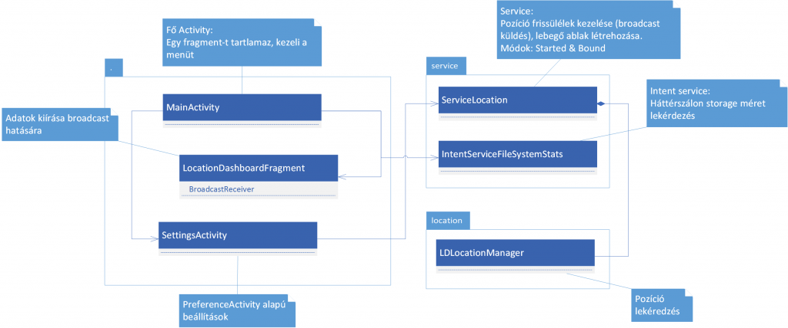

# Labor 6 - Service, Location

### Felkészülés a laborra

A labor célja a szolgáltatások készítésének bemutatása Android környezetben (Service komponens),
valamint a helymeghatározási lehetőségek ismertetése.

### Szolgáltatások bevezetés

Android platformon két fő Service típus létezik, melyek közül az egyik tovább bontható, röviden:

* **Started Service**: Egyszerűen indítható szolgáltatás. Fő szálban fut,
fejlesztő felelőssége saját szálat létrehozni. Beállítható, hogy magas prioritással,
foreground módban fusson, illetve megadható, hogy újraindítás esetén milyen módon/prioritással
indítsa újra a rendszer. Például ha alacsony memóriaszint miatt lett kilőve, mi történjen, hogyan/mikor induljon újra.
* **Intent Service**: Started Service speciális típusa. Intent-el paraméterezhető,
hogy milyen feladatot lásson el. A kéréseket sorosítja és már automatikusan külön szálon hajtja végre a
megadott kódrészt.
* **Bound Service**: Lehetőséget biztosít, hogy más komponensek csatlakozzanak a service-hez és
egy egységes interface-n keresztül kommunikáljanak a service-el. Ha minden komponens lecsatlakozott róla,
a service leáll.

**Fontos**: Egy service lehet egyszerre Started Service és Bound Service módban is!

### Helymeghatározás bevezetés
Android platformon két fő API létezik helymeghatározásra egy régebbi és egy újabb. A régebbi API
egyszerűen a LocationService segítségével nyújtott lehetőséget helymeghatározásra (GPS és hálózati egyaránt).
Az új Fused Location API a Google Play Services segítségével nem csak modern helymeghatározási
algoritmusokat alkalmaz, hanem biztosítja, hogy az alkalmazások egymás között a hely
adatokat megoszthassák egymással, ezáltal még gyorsabbá téve a pozíció információ lekérdezését.

A labor során a régebbi API-t fogjuk használni, mivel emulátoron a Google Play Services csak
virtualizáció nélkül érhető el és így lassú lenne a tesztelés. Fejlesztés szempontjából minimális
eltérés van a két API között, teljesen hasonlók az osztályok és az interfészek.

### Laborfeladat leírása
A labor során első lépésként egy egyszerű szolgáltatást hozunk létre a szabad lemezterület lekérdezésére,
majd egy helymeghatározásért felelős szolgáltatást készítünk, megjelenítjük a pozíció adatokat és egy értesítést,
valamint “lebegő ablak”-ot is létrehozunk a szolgáltatáshoz.


Projekt felépítése:


## 1. Projekt előkészítése
Első lépésként hozzunk létre egy ServiceDemo nevű projektet, hu.bme.aut.amorg.examples.servicedemo package-ben, kezdő Empty Activity-vel, MainActivity néven.

Vegyük fel a következő szöveges erőforrásokat, hogy később ne legyen hivatkozási probléma:
```xml
<?xml version="1.0" encoding="utf-8"?>
<resources>
    <string name="app_name">Location Service</string>
    <string name="action_settings">Settings</string>
    <string name="action_free_space">Free space</string>
    <string name="txt_free_space">Free space on external storage is: %1$d MB (~ %2$d GB)</string>

    <string name="title_activity_settings">Settings</string>
    <string name="title_settings">Settings</string>
    <string name="title_with_floating">Floating view</string>
    <string name="title_start_service">Enable location monitoring</string>
    <string name="label_on">On</string>
    <string name="label_off">Off</string>

    <string name="txt_provider">Technology:</string>
    <string name="txt_latitude">Latitude:</string>
    <string name="txt_longitude">Longitude:</string>
    <string name="txt_speed">Speed:</string>
    <string name="txt_alt">Height:</string>
    <string name="txt_position_time">Position time:</string>
</resources>
```
A Manifest-be vegyük fel az alábbi engedélyeket, ezekre később még szükség lesz:

```xml
<uses-permission android:name="android.permission.ACCESS_FINE_LOCATION" />
<uses-permission android:name="android.permission.ACCESS_COARSE_LOCATION" />
<uses-permission android:name="android.permission.INTERNET" />
<uses-permission android:name="android.permission.ACCESS_NETWORK_STATE" />
<uses-permission android:name="android.permission.VIBRATE" />
<uses-permission android:name="android.permission.SYSTEM_ALERT_WINDOW" />
```
## 2. Szabad lemezterület lekérdezése IntentService-el
A következőkben készítsünk egy *IntentService*-t, mely lehetőséget biztosít a szabad lemezterület lekérdezésére.

**Újdonság**: A választ messenger-handler megoldás segítségével juttassuk el az Activity számára!

Első lépésként hozzunk létre egy service package-t és készítsünk egy *IntentService*-t *IntentServiceFileSystemStats* néven, mely:
* Kérés hatására lekérdezi a szabad lemezterületet a külső adattárolón.
* A választ egy messenger-en keresztül (amit az indító Intent-ben kapott) küldi vissza.

```java
public class IntentServiceFileSystemStats extends IntentService {

    public static final String KEY_MESSENGER = "KEY_MESSENGER";

    public IntentServiceFileSystemStats() {
        super("IntentServiceFileSystemStats");
    }

    @Override
    protected void onHandleIntent(Intent intent) {
        long freeSpace = getFreeSpace();
        sendResultFreeSpace(intent, freeSpace);
    }

    private void sendResultFreeSpace(Intent intent, long freeSpace) {
        Bundle extras = intent.getExtras();
        if (extras != null) {
            Messenger messenger = (Messenger) extras.get(KEY_MESSENGER);
            Message msg = Message.obtain();
            msg.arg1 = Activity.RESULT_OK;
            msg.obj = new Long(freeSpace);
            try {
                messenger.send(msg);
            } catch (RemoteException e) {
                e.printStackTrace();
            }
        }
    }

    public long getFreeSpace() {
        StatFs statFs = new StatFs(
                Environment.getExternalStorageDirectory().getAbsolutePath()
        );
        statFs.restat(Environment.getExternalStorageDirectory().getAbsolutePath());
        long available = ((long)statFs.getAvailableBlocks() * (long)statFs.getBlockSize());
        return available/1024/1024;
    }
}
```

**Fontos:**
* Figyeljük meg, hogyan éri el a Service a Messenger objektumot, amin keresztül vissza tud üzenni!
* Figyeljük meg az üzenetet jelképező Message-t, illetve annak használatát!

**Kérdés**: Mit kell még tennünk, hogy a Service-t tudjuk használni? Hol és hogy tudjuk ezt megtenni?

**Válasz**: A Service is egy teljes értékű alkalmazás komponens, ezért a Manifest állományban fel kell tüntetnünk:
```xml
<service android:name=".service.IntentServiceFileSystemStats" />
```
Következő lépésként készítsünk egy menüt *main.xml* néven (res-en jobb gomb -> new -> Android resource file) az Activity-hez, amely elindítja az IntentService-t.
Az Activity-hez tartozó menü XML így nézzen ki (hagyjuk meg a beállítások menüt, szükség lesz rá később):
```xml
<?xml version="1.0" encoding="utf-8"?>
<menu xmlns:android="http://schemas.android.com/apk/res/android"
     xmlns:tools="http://schemas.android.com/tools"
     xmlns:app="http://schemas.android.com/apk/res-auto"
     tools:context=".MainActivity">
    <item android:id="@+id/action_free_space"
         android:title="@string/action_free_space"
         android:orderInCategory="100"
         app:showAsAction="ifRoom" />
    <item android:id="@+id/action_settings"
         android:title="@string/action_settings"
         android:orderInCategory="100"
         app:showAsAction="ifRoom" />
</menu>
``` 
Az Activity kódja a következő:
```java
public class MainActivity extends AppCompatActivity {

    private Handler handlerFreeSpaceIntentService = new Handler() {
        @Override
        public void handleMessage(Message msg) {
            if (msg.arg1 == RESULT_OK) {
                long freeMB = (Long) msg.obj;
                long freeGB = freeMB / 1024;
                Toast.makeText(MainActivity.this, getString(R.string.txt_free_space, freeMB, freeGB), Toast.LENGTH_SHORT).show();
            }
        }
    };

    private Messenger freeSpaceMessenger = new Messenger(handlerFreeSpaceIntentService);

    @Override
    protected void onCreate(Bundle savedInstanceState) {
        super.onCreate(savedInstanceState);
        setContentView(R.layout.activity_main);
    }

    @Override
    public boolean onCreateOptionsMenu(Menu menu) {
        MenuInflater inflater = getMenuInflater();
        inflater.inflate(R.menu.main, menu);
        return true;
    }

    @Override
    public boolean onOptionsItemSelected(MenuItem item) {
        switch (item.getItemId()) {
            case R.id.action_free_space:
                Intent intentStartService = new Intent(MainActivity.this,IntentServiceFileSystemStats.class);
                intentStartService.putExtra(IntentServiceFileSystemStats.KEY_MESSENGER, freeSpaceMessenger);
                startService(intentStartService);
                break;
        }

        return true;
    }
}
```
Vegyük ki az activity layout-jából a Hello World-re hivatkozó TextView-t!

Figyeljük meg a messenger, valamint a handler objektumok működését. Szintén figyeljük meg, hogy kerül
átadásra a messenger az *IntentService* számára!

**Fontos:** Látható, hogy az IntentService milyen módon paraméterezhető, amennyiben összetettebb
feladatokat hajtunk végre a Service-ben (pl. hálózati kommunikáció, letöltés, stb.), hasonlóan adhatók át a kérések paraméterei, például az URL.

**Fontos**: az APP modul gradle beállításai között a *targetSdkVersion*-t állítsuk vissza 22-re, mivel a
permission kezeléssel még nem foglalkozunk.

Próbáljuk ki az alkalmazást működés közben!


**Feladat**: Igazoljuk a laborvezető segítségével, hogy az **IntentService** valóban külön szálban, sorosítva hajtja végre a kéréseket!

Ehhez ideiglenesen tegyünk egy sleep(3000) hívást az onHandleIntent(…) függvény elejébe:

```java
try {
  Thread.sleep(5000);
} catch (InterruptedException e) {
  e.printStackTrace();
}
```
**Vizsgáljuk meg** így a kód futását, próbáljunk többször egymás után a menüre kattintani és nézzük meg,
hogy valóban nem foglalja a hívás a UI szálat, illetve hogy sorba hajtja végre a kéréseket!
## 3. Felhasználói felület előkészítése helymeghatározáshoz
Készítsük el az alábbi felhasználói felületet Fragment-el.


Töltsük le a kék [lekerekített négyzetet jelképező 9-patch képet](images/tile_bg.9.png) és tegyük be a
minősítő nélküli drawable könyvtárba, amit most hozzunk létre.

A res/layout mappába hozzunk létre egy tile_info.xml-t, ami egy “kék téglalapot” jelképez két
TextView-val. A **tile_info.xml** kódja az alábbi:
```xml
<?xml version="1.0" encoding="utf-8"?>
<LinearLayout xmlns:android="http://schemas.android.com/apk/res/android"
    android:layout_width="match_parent"
    android:layout_height="wrap_content"
    android:layout_margin="5dp"
    android:background="@drawable/tile_bg"
    android:gravity="center"
    android:orientation="vertical">

    <TextView
        android:id="@+id/tvHead"
        android:layout_width="wrap_content"
        android:layout_height="wrap_content"
        android:text="Data:"
        android:textColor="@android:color/white"
        android:textSize="24sp" />

    <TextView
        android:id="@+id/tvValue"
        android:layout_width="wrap_content"
        android:layout_height="wrap_content"
        android:text="0"
        android:textColor="@android:color/white"
        android:textSize="24sp" />

</LinearLayout>
```
Ezt követően készítsük el a fragment felületét, mely az imént létrehozott tile_info elemekből felépíti
a Dashboard felületet. Ehhez szintén a layout mappába hozzuk létre a *fragment_location_dashboard.xml*-t a
következő tartalommal:
```xml
<?xml version="1.0" encoding="utf-8"?>
<LinearLayout xmlns:android="http://schemas.android.com/apk/res/android"
    xmlns:tools="http://schemas.android.com/tools"
    android:layout_width="match_parent"
    android:layout_height="match_parent">

    <ScrollView
        android:id="@+id/scroller"
        android:layout_width="fill_parent"
        android:layout_height="fill_parent"
        android:fillViewport="true">

        <LinearLayout
            android:layout_width="match_parent"
            android:layout_height="wrap_content"
            android:orientation="vertical">

            <include
                android:id="@+id/fieldProvider"
                layout="@layout/tile_info" />

            <LinearLayout
                android:layout_width="fill_parent"
                android:layout_height="wrap_content"
                android:baselineAligned="false"
                android:weightSum="2">

                <LinearLayout
                    android:layout_width="0dp"
                    android:layout_height="wrap_content"
                    android:layout_weight="1">

                    <include
                        android:id="@+id/fieldLat"
                        layout="@layout/tile_info" />

                </LinearLayout>

                <LinearLayout
                    android:layout_width="0dp"
                    android:layout_height="wrap_content"
                    android:layout_weight="1">

                    <include
                        android:id="@+id/fieldLng"
                        layout="@layout/tile_info" />

                </LinearLayout>
            </LinearLayout>

            <LinearLayout
                android:layout_width="fill_parent"
                android:layout_height="wrap_content"
                android:baselineAligned="false"
                android:weightSum="2">

                <LinearLayout
                    android:layout_width="0dp"
                    android:layout_height="wrap_content"
                    android:layout_weight="1">

                    <include
                        android:id="@+id/fieldSpeed"
                        layout="@layout/tile_info" />
                </LinearLayout>

                <LinearLayout
                    android:layout_width="0dp"
                    android:layout_height="wrap_content"
                    android:layout_weight="1">

                    <include
                        android:id="@+id/fieldAlt"
                        layout="@layout/tile_info" />

                </LinearLayout>
            </LinearLayout>

            <include
                android:id="@+id/fieldPosTime"
                layout="@layout/tile_info" />

        </LinearLayout>
    </ScrollView>
</LinearLayout>
```
**Figyeljük meg** a fenti kódban, hogy lehet XML-be include-olni a tile_info-t.

A *MainActivity* felületét (activity_main.xml) alakításuk át, hogy Fragment-et tudjon tárolni.
A mostani példában dinamikusan fogjuk rácsatolni a Fragmentet, ezért elegendő egy *FrameLayout*-ot tennünk
az *activity_main.xml*-be:
```xml
<?xml version="1.0" encoding="utf-8"?>
<FrameLayout xmlns:android="http://schemas.android.com/apk/res/android"
    xmlns:tools="http://schemas.android.com/tools"
    android:id="@+id/layoutContainer"
    android:layout_width="match_parent"
    android:layout_height="match_parent"
    android:paddingBottom="@dimen/activity_vertical_margin"
    android:paddingLeft="@dimen/activity_horizontal_margin"
    android:paddingRight="@dimen/activity_horizontal_margin"
    android:paddingTop="@dimen/activity_vertical_margin"
    tools:context=".MainActivity" />
```

Ha az ebben szereplő *dimen* erőforrások hiányoznak, rajtuk **Alt+Enter**-t nyomva hozzuk létre őket, értékük legyen 16dp.

Hozzuk létre a LocationDashboardFragment Fragment-et az alábbi kóddal:
```java
public class LocationDashboardFragment extends Fragment {

    private TextView tvProviderValue;
    private TextView tvLatValue;
    private TextView tvLngValue;
    private TextView tvSpeedValue;
    private TextView tvAltValue;
    private TextView tvPosTimeValue;

    //private ServiceLocation.BinderServiceLocation binderServiceLocation = null;

    @Override
    public View onCreateView(LayoutInflater inflater, ViewGroup container,
                             Bundle savedInstanceState) {
        View rootView = inflater.inflate(R.layout.fragment_location_dashboard, container, false);
        return rootView;
    }

    @Override
    public void onViewCreated(View view, Bundle savedInstanceState) {
        super.onViewCreated(view, savedInstanceState);
        initField(R.id.fieldProvider,
                getActivity().getString(R.string.txt_provider));
        initField(R.id.fieldLat, getActivity().getString(R.string.txt_latitude));
        initField(R.id.fieldLng, getActivity()
                .getString(R.string.txt_longitude));
        initField(R.id.fieldSpeed, getActivity().getString(R.string.txt_speed));
        initField(R.id.fieldAlt, getActivity().getString(R.string.txt_alt));
        initField(R.id.fieldPosTime,
                getActivity().getString(R.string.txt_position_time));
    }

    private void initField(int fieldId, String headText) {
        View viewField = getView().findViewById(fieldId);
        TextView tvHead = viewField.findViewById(R.id.tvHead);
        tvHead.setText(headText);

        switch (fieldId) {
            case R.id.fieldProvider:
                tvProviderValue = viewField.findViewById(R.id.tvValue);
                break;
            case R.id.fieldLat:
                tvLatValue = viewField.findViewById(R.id.tvValue);
                break;
            case R.id.fieldLng:
                tvLngValue = viewField.findViewById(R.id.tvValue);
                break;
            case R.id.fieldSpeed:
                tvSpeedValue = viewField.findViewById(R.id.tvValue);
                break;
            case R.id.fieldAlt:
                tvAltValue = viewField.findViewById(R.id.tvValue);
                break;
            case R.id.fieldPosTime:
                tvPosTimeValue = viewField.findViewById(R.id.tvValue);
                break;
            default:
                break;
        }
    }

    @Override
    public void onResume() {
        super.onResume();
        LocalBroadcastManager.getInstance(getActivity()).registerReceiver(
                mMessageReceiver,
                new IntentFilter(ServiceLocation.BR_NEW_LOCATION));
    }

    @Override
    public void onPause() {
        LocalBroadcastManager.getInstance(getActivity()).unregisterReceiver(
                mMessageReceiver);

        super.onPause();
    }

    private BroadcastReceiver mMessageReceiver = new BroadcastReceiver() {
        @Override
        public void onReceive(Context context, Intent intent) {
            Location currentLocation = intent.getParcelableExtra(ServiceLocation.KEY_LOCATION);

            tvLatValue.setText("" + currentLocation.getLatitude());
            tvLngValue.setText("" + currentLocation.getLongitude());
            tvAltValue.setText("" + currentLocation.getAltitude());
            tvSpeedValue.setText("" + currentLocation.getSpeed());
            tvProviderValue.setText(currentLocation.getProvider());
            tvPosTimeValue.setText(new Date(currentLocation.getTime()).toString());
        }
    };
}
```
A Fragment gyakorlatilag inicializálja a mezőket és egy *LocalBroadcast*-en keresztül,
ha új pozíció információ érkezik, megjeleníti azt.

**Figyeljük meg**, hogy hogyan iratkozik a Fragment fel/le a broadcast-re/ről.

**Figyeljük meg** szintén hogy veszi át a Location információt az intent-ből?

**Kérdés**: Miért tehetjük ezt így meg?

**Válasz**: Azért mert a *Location* sorosítható!

Végül a felület befejezéséhez már csak az hiányzik, hogy az Activity dinamikusan felcsatolja a Fragment-et.
Ehhez a MainActivity onCreate(…) függvényének végéhez fűzzük az alábbi felcsatolásért felelős kódrészt:
```java
if (savedInstanceState == null) {
    getSupportFragmentManager().beginTransaction()
        .add(R.id.layoutContainer, new LocationDashboardFragment())
        .commit();
}
```
**Próbáljuk ki** az alkalmazást és ellenőrizzük, hogy valóban a kívánt felület jelenik-e meg.

(Az onResume() LocalBroadcastManager.getInstance(…) metódushívását és az anonim new BroadcastReceiver()
onReceive(…) metódusának tartalmát ehhez átmenetileg kommenteljük ki. A teszt után ne felejtsük törölni a kommentelő karaktereket.)

## 4. Beállítások nézet létrehozása helymeghatározás vezérléséhez
Valósítsuk meg, hogy az alkalmazás egy beállítások nézeten vezérelhesse a háttérben történő helymeghatározást.
A PreferencesFramework használatával hozzunk létre egy SettingsActivity-t, ahol egy Switch-csel lehessen indítani
és leállítani a szolgáltatást.

A Beállításokat is Fragment-el fogjuk megoldani úgy, hogy csak egy Fragment-et fog tartalmazni
a SettingsActivity és az fog megjelenni alapértelmezetten fej nélkül.

Első lépésként a res mappába hozzunk létre egy xml almappát, abban pedig egy mainsettings.xml-t, ami
a PreferenceScreen-t írja le:
```xml
<?xml version="1.0" encoding="utf-8"?>
<PreferenceScreen xmlns:android="http://schemas.android.com/apk/res/android">
    <PreferenceCategory android:title="@string/title_settings">
        <SwitchPreference
            android:key="start_service"
            android:summaryOff="@string/label_off"
            android:summaryOn="@string/label_on"
            android:title="@string/title_start_service" />
    </PreferenceCategory>
</PreferenceScreen>
```
**Figyeljük meg** milyen egyszerűen le lehet írni XML-el egy beállítások felületet.

Ezt követően hozzunk létre egy Empty Activity-t SettingsActivity néven (most ne használjuk a SettingsActivity wizard-ot).
A kódja a következő:
```java
public class SettingsActivity extends PreferenceActivity implements SharedPreferences.OnSharedPreferenceChangeListener {

    public static final String EXTRA_NO_HEADERS = ":android:no_headers";
    public static final String EXTRA_SHOW_FRAGMENT = ":android:show_fragment";
    public static final String KEY_START_SERVICE = "start_service";

    @Override
    protected void onCreate(Bundle savedInstanceState) {
        super.onCreate(savedInstanceState);
    }

    @Override
    protected void onStart() {
        super.onStart();
        PreferenceManager.getDefaultSharedPreferences(
                this).registerOnSharedPreferenceChangeListener(this);
    }

    @Override
    protected void onStop() {
        PreferenceManager.getDefaultSharedPreferences(
                this).unregisterOnSharedPreferenceChangeListener(this);

        super.onStop();
    }

    @Override
    protected boolean isValidFragment(String fragmentName) {
        return true;
    }

    @Override
    public void onSharedPreferenceChanged(SharedPreferences sharedPreferences, String key) {
        if (KEY_START_SERVICE.equals(key)) {
            // TODO: Service indítása/leállítása
        }
    }

    @Override
    public void onBuildHeaders(List<Header> target) {
        loadHeadersFromResource(R.xml.fragmentsettings, target);
    }

    public static class FragmentSettingsBasic extends PreferenceFragment {
        @Override
        public void onCreate(Bundle savedInstanceState) {
            super.onCreate(savedInstanceState);
            addPreferencesFromResource(R.xml.mainsettings);
        }
    }

}
```
**Fontos** kiemelni, hogy a PreferenceActivity/PreferenceFramework megoldás már automatikusan megoldja
a beállítások tárolását **SharedPreferences**-ben, ezt nem kell külön lekódolni!

Figyeljük meg, hogy iratkozunk fel *Preference* változásra az *onStart(…)*-ban, mely majd az állapottól
függően indítani/leállítani fogja a Service-t!
Fontos, hogy ha feliratkoztunk a *Preference* változásra, akkor iratkozzunk is le róla
a megfelelő helyen (pl. *onStop(…)*), egyébként beragadhat ez a listener!

A fenti kód hiányolja a *fragmentsettings* erőforrást, ezért következő lépésként a res/xml mappában
hozzunk létre egy *fragmentsettings.xml*-t a következő tartalommal, ez írja le a *SettingsActivity* tartalmát.
```xml
<preference-headers xmlns:android="http://schemas.android.com/apk/res/android">
    <header
        android:fragment="hu.bme.aut.amorg.examples.servicedemo.SettingsActivity$FragmentSettingsBasic"
        android:icon="@mipmap/ic_launcher"
        android:title="@string/title_settings">
        <extra
            android:name="extraKey"
            android:value="extraValue" />
    </header>
</preference-headers>
```
A fenti kód megadja, hogy egy “lapja” lesz a SettingsActivity-nek amit a SettingsActivity
osztály belső FragmentSettingsBasic osztálya valósít meg.

Hogy elérhessük a Settings nézetet, egészítsük ki a *MainActivity* menü kezelő függvényét
(*onOptionsItemSelected(…)*), hogy a *Settings* menüpontot választva indítsa el a *SettingsActivity*-t:
```java
case R.id.action_settings:
    Intent intentSettings = new Intent(MainActivity.this, SettingsActivity.class);
    intentSettings.putExtra(SettingsActivity.EXTRA_SHOW_FRAGMENT,
            SettingsActivity.FragmentSettingsBasic.class.getName());
    intentSettings.putExtra(SettingsActivity.EXTRA_NO_HEADERS, true);
    startActivity(intentSettings);
    break;
```
**Figyeljük meg**, hogy érjük el, hogy címkék nélkül induljon el a SettingsActivity és behozzon
egy alapértelmezett beállítások Fragment-et.

A **Manifest** állományba vegyük fel az új activity-t (ha az Empty Activity varázslót használtuk, akkor csak
egészítsük ki az *IntentFilter*-rel):
```xml
<activity android:name=".SettingsActivity">
    <intent-filter>
        <action android:name=".Preferences" />
        <category android:name="android.intent.category.PREFERENCE" />
    </intent-filter>
</activity>

```
**Próbáljuk ki** a beállítások nézetet!


## 5. Helymeghatározás megvalósítása Service-el
A következőkben hozzuk létre a helymeghatározásért felelős osztályt, valamint egy *Service*-t
ami a háttérben vezérli a helymeghatározást.

Első lépésként hozzunk létre egy location package-t és benne egy *LDLocationManager*
osztályt az alábbi kóddal:
```java
public class LDLocationManager  {

    private Context context;
    private LocationListener listener;
    private LocationManager locMan;

    public LDLocationManager(Context aContext, LocationListener listener) {
        context = aContext;
        this.listener = listener;
        locMan = (LocationManager) context.getSystemService(Context.LOCATION_SERVICE);
    }

    public void startLocationMonitoring() {
        locMan.requestLocationUpdates(
                LocationManager.GPS_PROVIDER,
                100, 100, listener);
        // EMULÁTORON A NETWORK PROVIDER NEM ÉRHETŐ EL!!!
        /*locMan.requestLocationUpdates(
                LocationManager.NETWORK_PROVIDER,
                0, 0, listener);*/
    }

    public void stopLocationMonitoring() {
        if (locMan != null) {
            locMan.removeUpdates(listener);
        }
    }
}
```
Vizsgáljuk meg az osztály felépítését.

Következő lépésként a service package-ben hozzuk létre a _ServiceLocation_ osztályt, mely
implementálja a LocationListener interfészt.
```java
public class ServiceLocation extends Service implements LocationListener {
    public static final String BR_NEW_LOCATION = "BR_NEW_LOCATION";
    public static final String KEY_LOCATION = "KEY_LOCATION";

    private LDLocationManager ldLocationManager = null;
    private boolean locationMonitorRunning = false;

    private Location firstLocation = null;
    private Location lastLocation = null;

    @Override
    public IBinder onBind(Intent intent) {
        return null;
    }

    @Override
    public int onStartCommand(Intent intent, int flags, int startId) {
        firstLocation = null;

        if (!locationMonitorRunning) {
            locationMonitorRunning = true;
            ldLocationManager = new LDLocationManager(getApplicationContext(), this);
            ldLocationManager.startLocationMonitoring();
        }

        return START_STICKY;
    }

    @Override
    public void onDestroy() {
        if (ldLocationManager != null) {
            ldLocationManager.stopLocationMonitoring();
        }

        super.onDestroy();
    }

    @Override
    public void onLocationChanged(Location location) {
        if (firstLocation == null) {
            firstLocation = location;
        }
        lastLocation = location;

        Intent intent = new Intent(BR_NEW_LOCATION);
        intent.putExtra(KEY_LOCATION, location);
        LocalBroadcastManager.getInstance(this).sendBroadcast(intent);
    }

    @Override
    public void onStatusChanged(String provider, int status, Bundle extras) {
        // TBD
    }

    @Override
    public void onProviderEnabled(String provider) {
        // TBD
    }

    @Override
    public void onProviderDisabled(String provider) {
        // TBD
    }
}
```
Ne felejtsük el a *Manifest*-ben is felvenni az új *Service*-t:
```xml
<service android:name=".service.ServiceLocation" />
```
Végül a Service indítása/leállítása céljából egészítsük ki a *SettingsActivity*-ben az
*onSharedPreferenceChange(…)* függvényt, hogy valóban elindítsa/leállítsa a *Service*-t.
Ehhez felveszünk egy statikus metódust is segítségül:

```java
@Override
public void onSharedPreferenceChanged(SharedPreferences sharedPreferences, String key) {
    if (KEY_START_SERVICE.equals(key)) {
    startServiceWhenEnabled(sharedPreferences, getApplicationContext());
    }
}

static void startServiceWhenEnabled(SharedPreferences sharedPreferences, Context ctx) {
    boolean startService = sharedPreferences.getBoolean(KEY_START_SERVICE, false);

    Intent i = new Intent(ctx, ServiceLocation.class);

    if (startService) {
        ctx.startService(i);
    } else {
        ctx.stopService(i);
    }
}
```

A fenti kód csak a beállítások változására reagál. Viszont ha újraindul az alkalmazás, akkor
még nem fog a Service elindulni, hiába hagytuk bekapcsolva. Ezért a *MainActivity*
*onCreate()* metódusának végén is hívjuk meg az indító kódot:

```java
SettingsActivity.startServiceWhenEnabled(PreferenceManager.getDefaultSharedPreferences(this), this);
```

*Próbáljuk ki* az alkalmazást! Régi típusú emulátoron teszteléshez nyissuk meg az Android Device Monitor-t
és küldjünk pozíció információkat az emulátornak új típusú emulátoron az oldalsó vezérlő sáv
további lehetőségeit választva (**...**) tudunk pozíciót küldeni egyszerűen az emulátornak.


## 6. Értesítés megjelenítése
Következő lépésként valósítsuk meg, hogy a Service *foreground* módban induljon el. Ehhez valósítsuk meg,
hogy egy *Notification* is jelezze a Service futását, mely megjeleníti az aktuális koordinátákat
és melyre kattintva elindul a *MainActivity*. Android Oreo óta a Notificationhöz tartoznia kell egy
NotificationChannelnek is, ezért az őjabb verziókon ezt külön létre kell hozni.

Vegyük fel az értesítés azonosító konstanst és a channel konstansát a *ServiceLocation* osztály elejére:
```java
private final int NOTIF_FOREGROUND_ID = 101;
private final String NOTIF_CHANNEL_ID = "location_service";
```

Az onStartCommand() elejére vegyük fel a NotificationChannel létrehozását:

```java
if (Build.VERSION.SDK_INT >= Build.VERSION_CODES.O) {
    NotificationManager notifMan = (NotificationManager) getSystemService(NOTIFICATION_SERVICE);
    CharSequence name = getString(R.string.channel_name);// The user-visible name of the channel.
    int importance = NotificationManager.IMPORTANCE_HIGH;
    NotificationChannel mChannel = new NotificationChannel(NOTIF_CHANNEL_ID, name, importance);
    notifMan.createNotificationChannel(mChannel);
}
```

Készítsünk két függvényt a *ServiceLocation* osztályba a *Notification* megjelenítésére és frissítésére:
```java
private Notification getMyNotification(String text) {
    Intent notificationIntent = new Intent(this, MainActivity.class);
    notificationIntent.setFlags(Intent.FLAG_ACTIVITY_CLEAR_TASK);
    PendingIntent contentIntent = PendingIntent.getActivity(this,
            NOTIF_FOREGROUND_ID,
            notificationIntent,
            PendingIntent.FLAG_CANCEL_CURRENT);

    Notification notification = new NotificationCompat.Builder(this)
            .setContentTitle("Service Location Demo")
            .setContentText(text)
            .setSmallIcon(R.mipmap.ic_launcher)
            .setVibrate(new long[]{1000,2000,1000})
            .setContentIntent(contentIntent)
            .setChannelId(NOTIF_CHANNEL_ID).build(); // Régebbi API szintek getNotification() a build() helyett
    return  notification;
}


private void updateNotification(String text) {
    Notification notification = getMyNotification(text);
    NotificationManager notifMan = (NotificationManager) getSystemService(NOTIFICATION_SERVICE);
    notifMan.notify(NOTIF_FOREGROUND_ID,notification);
}
```
A Service-t indító *onStartCommand(…)* függvény elején állítsuk be a *Foreground* módot:
```java
startForeground(NOTIF_FOREGROUND_ID, getMyNotification("starting..."));
```
Az onLocationChanged(…) függvényben új pozíció érkezésekor frissítsük a Notification-t:
```java
updateNotification("Lat: "+location.getLatitude()+"n"+
        "Lng: "+location.getLongitude());
```
Helymeghatározással kapcsolatos további állapotváltozások esetén szintén frissítsük a Notification tartalmát:
```java
@Override
public void onStatusChanged(String provider, int status, Bundle extras) {
    updateNotification("Status changed: " + status);
}

@Override
public void onProviderEnabled(String provider) {
    updateNotification("Provider enabled: "+provider);
}

@Override
public void onProviderDisabled(String provider) {
    updateNotification("Provider disabled: "+provider);
}
```
**Próbáljuk ki** az alkalmazást működés közben és vizsgáljuk meg a Notification működését!

**Próbáljuk ki** mi történik, ha rákattintunk az értesítésre!


## 7. Lebegő ablak megjelenítése
Egészítsük ki a megoldást, hogy bekapcsolható legyen egy áthelyezhető lebegő ablak is
a beállítások nézetben mely a (Facebook értesítőhöz hasonlóan) mindig előtérben van
és megjeleníti az aktuális pozíció információt.

Ehhez szükséges a SYSTEM_ALERT_WINDOW engedély, amit korábban már felvettünk.

Android 23 (Marshmallow) felett külön is be kell állítani ezt az engedélyt a készüléken is, ezt a következő helyen lehet megtenni: Alkalmazások->Beállítások->Megjelenítés más alkalmazások felett (Apps->Settings->Draw over other apps)

Vegyük fel a ServiceLocation osztály elejére az alábbi tagváltozókat:
```java
private WindowManager windowManager;
private View floatingView;
private TextView tvFloatLat;
private TextView tvFloatLng;
```
Készítsük el a _ServiceLocation_ osztályban a lebegő ablakot megjelenítő és elrejtő függvényeket:
```java
private void showFloatingWindow() {
    windowManager = (WindowManager) getSystemService(WINDOW_SERVICE);

    floatingView = ((LayoutInflater)getSystemService(LAYOUT_INFLATER_SERVICE)).inflate(R.layout.float_layout, null);
    tvFloatLat = floatingView.findViewById(R.id.tvFloatLat);
    tvFloatLng = floatingView.findViewById(R.id.tvFloatLng);

    final WindowManager.LayoutParams params = new WindowManager.LayoutParams(
            WindowManager.LayoutParams.WRAP_CONTENT,
            WindowManager.LayoutParams.WRAP_CONTENT,
            WindowManager.LayoutParams.TYPE_PHONE,
            WindowManager.LayoutParams.FLAG_NOT_FOCUSABLE,
            PixelFormat.TRANSLUCENT);

    params.gravity = Gravity.TOP | Gravity.LEFT;
    params.x = 0;
    params.y = 100;

    windowManager.addView(floatingView, params);

    try {
        floatingView.setOnTouchListener(new View.OnTouchListener() {
            private WindowManager.LayoutParams paramsF = params;
            private int initialX;
            private int initialY;
            private float initialTouchX;
            private float initialTouchY;

            @Override public boolean onTouch(View v, MotionEvent event) {
                switch (event.getAction()) {
                    case MotionEvent.ACTION_DOWN:
                        initialX = paramsF.x;
                        initialY = paramsF.y;
                        initialTouchX = event.getRawX();
                        initialTouchY = event.getRawY();
                        break;
                    case MotionEvent.ACTION_UP:
                        break;
                    case MotionEvent.ACTION_MOVE:
                        paramsF.x = initialX + (int) (event.getRawX() - initialTouchX);
                        paramsF.y = initialY + (int) (event.getRawY() - initialTouchY);
                        if (floatingView != null) {
                            windowManager.updateViewLayout(floatingView, paramsF);
                        }
                        break;
                }
                return false;
            }
        });
    } catch (Exception e) {
        e.printStackTrace();
    }
}

private void hideFloatingWindow() {
    if (floatingView != null) {
        windowManager.removeView(floatingView);
        floatingView = null;
        tvFloatLat = null;
        tvFloatLng = null;
    }
}
```
Az onLocationChanged(…) függvényben új pozíció érkezésekor frissítsük a lebegő ablak tartalmát:
```java
if(tvFloatLat != null && tvFloatLng!=null){
     tvFloatLat.setText("Lat:" + location.getLatitude() );
     tvFloatLng.setText("Lng:" + location.getLongitude() );
}
```
A kód hivatkozik egy float_layout.xml-re. Ezt a tile_info.xml mintájára hozzuk létre:
```xml
<?xml version="1.0" encoding="utf-8"?>
<LinearLayout xmlns:android="http://schemas.android.com/apk/res/android"
    xmlns:tools="http://schemas.android.com/tools"
    android:layout_width="match_parent"
    android:layout_height="wrap_content"
    android:layout_margin="5dp"
    android:background="@drawable/tile_bg"
    android:gravity="center"
    android:orientation="vertical">

    <TextView
        android:id="@+id/tvFloatLat"
        android:layout_width="wrap_content"
        android:layout_height="wrap_content"
        android:textColor="@android:color/white"
        android:textSize="24sp"
        tools:text="Lat: 0" />

    <TextView
        android:id="@+id/tvFloatLng"
        android:layout_width="wrap_content"
        android:layout_height="wrap_content"
        android:textColor="@android:color/white"
        android:textSize="24sp"
        tools:text="Lng: 0" />
</LinearLayout>
```
Következő lépésként egészítsük ki a beállítások nézetet, hogy egy CheckBox-al, melyben megadhatjuk,
hogy a service indításakor megjelenjen-e a lebegő ablak.
Ehhez először a res/xml/mainsettings.xml-be vegyünk fel egy CheckBoxPreference-t:
```xml
<CheckBoxPreference
       android:title="@string/title_with_floating"
       android:key="with_floating"
       android:text="Monitor location"/>
```
Egészítsük ki a SettingsActivity kódját az elején egy konstanssal:
```java
public static final String KEY_WITH_FLOATING = "with_floating";
```
Valamint a SettingsActivity startServiceWhenEnabled(…) metódusát valósítsuk meg úgy, hogy ellenőrizzük
a CheckBox állapotát és a Service-t indító Intent paramétereként adjuk meg, hogy megjelenjen-e
a lebegő ablak vagy sem:
```java
static void startServiceWhenEnabled(SharedPreferences sharedPreferences, Context ctx) {
    boolean startService = sharedPreferences.getBoolean(KEY_START_SERVICE, false);
    boolean withFloating = sharedPreferences.getBoolean(KEY_WITH_FLOATING, false);

    Intent i = new Intent(ctx, ServiceLocation.class);

    if (startService) {
        i.putExtra(KEY_WITH_FLOATING, withFloating);
        ctx.startService(i);
    } else {
        ctx.stopService(i);
    }
}
```
Végül a ServiceLocation onStartCommand(…) függvényét egészítsük ki úgy, hogy olvassa ki a kapott
paramétert és annak függvényében jelenítse meg a lebegő ablakot:
```java
if (intent.getBooleanExtra(SettingsActivity.KEY_WITH_FLOATING, false)) {
    showFloatingWindow();
}
```
A ServiceLocation onDestroy() függvényében pedig hívjuk meg a hideFloatingWindow() függvényt, hogy
ha megszűnik a service, törölje a lebegő ablakot is.
```java
hideFloatingWindow();
```
Próbáljuk ki az alkalmazást működés közben! Figyeljük meg, hogy az alkalmazás  háttérbe helyezésekor
is mindig látszik a lebegő ablak.


## 8. GeoCoding és Bind Service kiegészítés
(Amennyiben a labor idejébe belefér valósítsuk meg közösen, ha nem, házi feladatként érdemes
végigkövetni az alábbiakat.)

Egészítsük ki a megoldást úgy, hogy a felületen helyezzünk el egy gombot az alábbi ábrának megfelelően,
melyre kattintva az utolsó pozíció alapján (ha van), Geocoder segítségével kérdezzük le az aktuális címet.

Első lépésként a ServiceLocation osztályba vegyünk fel egy belső osztályt,
mely reprenzentálja a Binder-t:
```java
public class BinderServiceLocation extends Binder {
    public ServiceLocation getService() {
        return ServiceLocation.this;
    }
}
```
Vegyünk fel egy tagváltozót ugyan ide (ServiceLocation osztály):
```java
private IBinder binderServiceLocation = new BinderServiceLocation();
```
Alakítsuk át az onBind(…) függvényt, hogy adja vissza a Binder-t:
```java
@Override
public IBinder onBind(Intent intent) {
    return binderServiceLocation;
}
```
Egészítsük még ki a ServiceLocation osztályt két “getter” jellegű függvénnyel:
```java
public boolean isLocationMonitorRunning() {
    return locationMonitorRunning;
}

public Location getLastLocation() {
    return lastLocation;
}
```
A fenti megoldás egy nagyon egyszerű Binder megoldás, összetettebb esetben érdemes olyan Binder-t kialakítani,
mely nem feltétlenül a Service-t téríti vissza, hanem feladata specifikus függvényeket tartalmaz.

A fragment_location_dashboard.xml-ben a ScrollView-n belüli LinearLayout-ba első elemként vegyük fel a gombot:
```xml
<Button
      android:id="@+id/btnGeocode"
       android:layout_width="match_parent"
       android:layout_height="wrap_content"
       android:text="Position details"/>
```
Vegyünk fel egy tagváltozót a LocationDashboardFragment-ben, mely jelképezi a csatolt szolgáltatás Binder-ét:
```java
private ServiceLocation.BinderServiceLocation binderServiceLocation = null;
```
Ezt követően egészítsük ki a LocationDashboardFragment-et egy ServiceConnection megvalósítással,
melyben kezeljük a Service-hez való csatlakozás eseményét:
```java
private ServiceConnection servConn = new ServiceConnection() {
    @Override
    public void onServiceConnected(ComponentName componentName, IBinder iBinder) {
        binderServiceLocation = ((ServiceLocation.BinderServiceLocation) iBinder);
    }

    @Override
    public void onServiceDisconnected(ComponentName componentName) {
    }
};
```
Alakítsuk át a LocationDashboardFragment onResume(…) és onPause(…) függvényeit, hogy kezelje
a Service-hez való csatlakozást:
```java
@Override
public void onResume() {
    super.onResume();
    Intent i = new Intent(getActivity(), ServiceLocation.class);
    getActivity().bindService(i, servConn, Context.BIND_AUTO_CREATE);

    LocalBroadcastManager.getInstance(getActivity()).registerReceiver(
            mMessageReceiver,
            new IntentFilter(ServiceLocation.BR_NEW_LOCATION));
}

@Override
public void onPause() {
    if (binderServiceLocation != null) {
        getActivity().unbindService(servConn);
    }
    LocalBroadcastManager.getInstance(getActivity()).unregisterReceiver(
            mMessageReceiver);

    super.onPause();
}
```
Utolsó lépésként egészítsük ki a LocationDashboardFragment onViewCreated(…) függvényét,
hogy a gomb eseménykezelő hatására kérdezze le a csatolt Service által ismert utolsó pozíciót
 és egy anonym AsyncTask-al Geocodol-ja azt, majd az eredményt jelenítse meg egy Toast-ban.

Fontos kiemelni, hogy a Geocoding hálózati kommunikációt használ, ezért kell külön szálban futtatni.
Az AsyncTask doInBackground(…) függvénye külön szálon fut, míg az onPostExecute(…) már a főszálon.
```java
Button btnGeocode = view.findViewById(R.id.btnGeocode);
btnGeocode.setOnClickListener(new View.OnClickListener() {
    @Override
    public void onClick(View v) {
        if (binderServiceLocation != null && binderServiceLocation.getService() != null &&
                binderServiceLocation.getService().isLocationMonitorRunning()) {
            Location loc = binderServiceLocation.getService().getLastLocation();
            if (loc != null) {
                new AsyncTask<Location, Void, String>() {
                    @Override
                    protected String doInBackground(Location... params) {
                        String result = "";
                        try {
                            Geocoder gc = new Geocoder(getActivity(), Locale.getDefault());
                            List<Address> addrs = null;
                            addrs = gc.getFromLocation(params[0].getLatitude(),
                                    params[0].getLongitude(), 1);

                            result = addrs.get(0).getCountryName() + "n" +
                                     addrs.get(0).getAddressLine(0) + "n" +
                                     addrs.get(0).getAddressLine(1);
                        } catch (Exception e) {
                            result = "No address: " + e.getMessage();
                        }
                        return result;
                    }

                    @Override
                    protected void onPostExecute(String address) {
                        Toast.makeText(getActivity(),
                                address,
                                Toast.LENGTH_LONG).show();
                    }
                }.execute(loc);
            }
        }
    }
});
```
Próbáljuk ki a Geocoding működését!


### Feladatok
* **Önálló feladat**: Jelenítsünk meg további két adatot a LocationDashboard-on!
* **Bonusz feladat**: Jelenítsünk meg további adatokat a lebegő ablakon!


