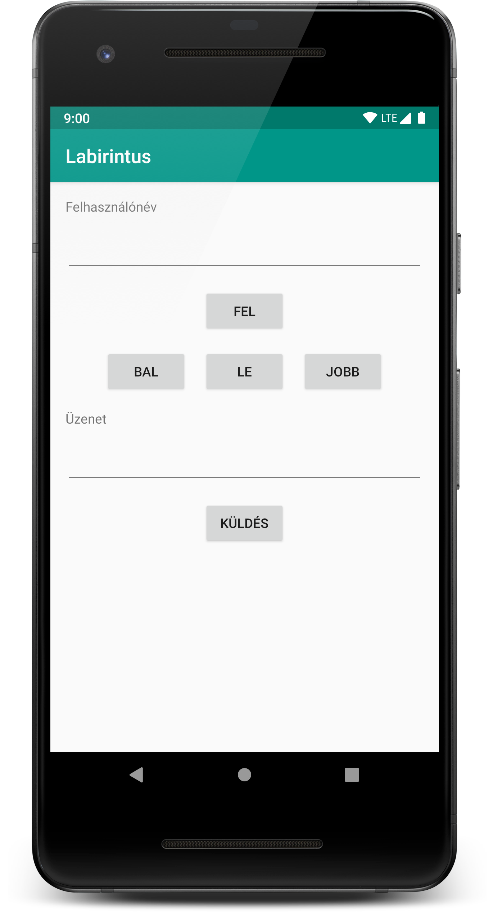
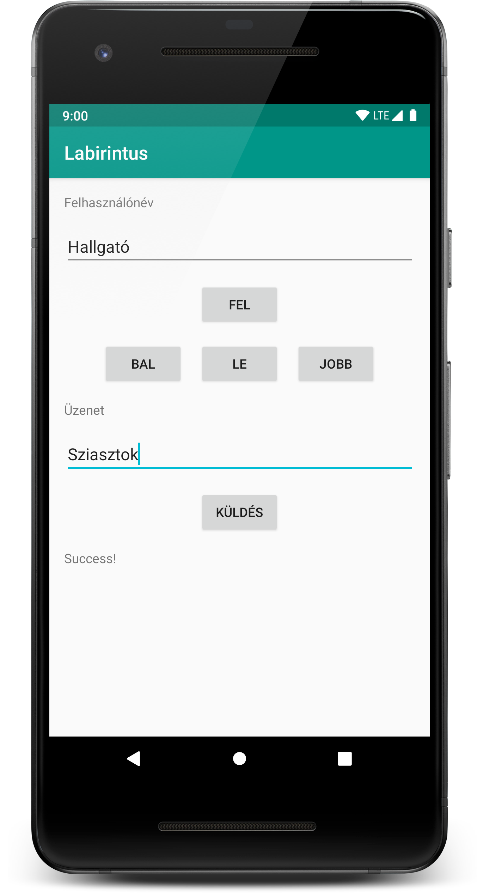
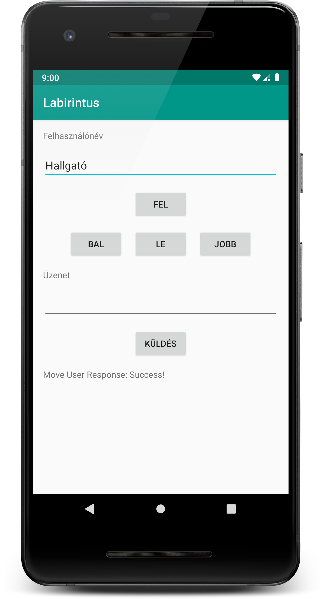

# Labor 7 - Hálózatkezelés

## Bevezetés

A labor célja a hálózati kommunikáció, azon belül is a platformon leginkább használt HTTP kommunikáció alapjainak bemutatása, valamint az ehhez kapcsolódó aszinkron hívások ismertetése. A labor során egy multiplayer labirintus játékhoz fogunk mobil klienst fejleszteni. A kliens segítségével irányíthatunk a labirintusban egy bábut, továbbá lehetőség lesz üzenetek küldésére is. A labor az alábbi témákat érinti:

*   HTTP hálózati hívások
*   Aszinkron hívások szálakkal
*   Események kezelése EventBus-szal

## A feladat

A következőkben egy olyan Android alkalmazást készítünk, mely egy kliens alkalmazás egy multiplayer labirintus játékhoz.

A játék tényleges felülete nem az Android alkalmazás része, azt egy előre elkészített webes alkalmazás jeleníti meg, amely elérhető az alábbi címen:

[https://aut-android-labyrinth.herokuapp.com/](https://aut-android-labyrinth.herokuapp.com/)

A játék szabályai egyszerűek, a játékosunkat a készülékről négy gomb segítségével (bal, jobb, fel, le) irányíthatjuk, továbbá lehetőség van még üzenetküldésre is. Az első lépésünk során kerül rá az új játékos a játéktérre egy véletlen pozícióra (színes GitHub ikon). Ha egy játékos egy pontot érő mezőre lép (színes pipa), akkor pontot szerez, és egy újabb pontot érő mező kerül a pályára véletlenszerű helyre. A játékosok nem tudnak a fal (fekete négyzet) elemen átlépni, illetve másik játékos által foglalt mezőre sem léphetnek!

<p align="center">

</p>

## A felhasználói felület elkészítése

Hozzunk létre egy új Android Studio projektet. Válasszuk a *Phone and Tablet* szekcióban az *EmptyActivity*-t.

Az alkalmazás neve legyen `NetworkLabor`, a package név legyen `hu.bme.aut.android.networklabor`, és természetesen válasszuk a Kotlin nyelvet.

A minimum SDK szint az *API 19: Android 4.4*, az Instant alkalmazásokat nem támogatjuk, de az AndroidX függőségeket hagyjuk bejelölve.

Első lépésként készítsük el az alkalmazás felhasználói felületét XML erőforrásból. A felületen helyezzünk el két `EditText`-et, egyet a felhasználónév, egyet pedig az üzenet bekéréséhez. Emellett legyen összesen öt gomb: négy gomb az irányításhoz, egy az üzenet elküldéséhez, valamint három `TextView` az üzenetek megjelenítéséhez. 



Az ehhez megfelelő XML állomány a következő:

```xml  
<?xml version="1.0" encoding="utf-8"?>
<LinearLayout xmlns:android="http://schemas.android.com/apk/res/android"
    android:layout_width="match_parent"
    android:layout_height="match_parent"
    android:orientation="vertical"
    android:padding="@dimen/default_padding">

    <TextView
        style="@style/DefaultViewMarginStyle"
        android:layout_width="match_parent"
        android:layout_height="wrap_content"
        android:text="@string/title_username"/>

    <EditText
        android:id="@+id/etUsername"
        style="@style/DefaultViewMarginStyle"
        android:layout_width="match_parent"
        android:layout_height="wrap_content"/>

    <RelativeLayout
        android:layout_width="match_parent"
        android:layout_height="wrap_content"
        android:gravity="center"
        android:orientation="vertical">

        <Button
            android:id="@+id/btnUp"
            style="@style/DefaultViewMarginStyle"
            android:layout_width="wrap_content"
            android:layout_height="wrap_content"
            android:layout_alignParentTop="true"
            android:layout_centerHorizontal="true"
            android:text="@string/up"/>

        <Button
            android:id="@+id/btnDown"
            style="@style/DefaultViewMarginStyle"
            android:layout_width="wrap_content"
            android:layout_height="wrap_content"
            android:layout_below="@id/btnUp"
            android:layout_centerHorizontal="true"
            android:text="@string/down"/>

        <Button
            android:id="@+id/btnLeft"
            style="@style/DefaultViewMarginStyle"
            android:layout_width="wrap_content"
            android:layout_height="wrap_content"
            android:layout_below="@id/btnUp"
            android:layout_toStartOf="@id/btnDown"
            android:text="@string/left"/>

        <Button
            android:id="@+id/btnRight"
            style="@style/DefaultViewMarginStyle"
            android:layout_width="wrap_content"
            android:layout_height="wrap_content"
            android:layout_below="@id/btnUp"
            android:layout_toEndOf="@id/btnDown"
            android:text="@string/right"/>

    </RelativeLayout>

    <TextView
        style="@style/DefaultViewMarginStyle"
        android:layout_width="match_parent"
        android:layout_height="wrap_content"
        android:text="@string/title_message"/>

    <EditText
        android:id="@+id/etMessage"
        style="@style/DefaultViewMarginStyle"
        android:layout_width="match_parent"
        android:layout_height="wrap_content"/>

    <LinearLayout
        android:layout_width="match_parent"
        android:layout_height="wrap_content"
        android:gravity="center"
        android:orientation="horizontal">

        <Button
            android:id="@+id/btnSend"
            style="@style/DefaultViewMarginStyle"
            android:layout_width="wrap_content"
            android:layout_height="wrap_content"
            android:text="@string/send"/>

    </LinearLayout>

    <TextView
        android:id="@+id/tvResponse"
        style="@style/DefaultViewMarginStyle"
        android:layout_width="match_parent"
        android:layout_height="wrap_content"/>

</LinearLayout>
``` 

A felület tartalmaz több szöveges konstanst is, ezért töltsük fel a `res/values` könyvtárban lévő `strings.xml` állományunkat a következő értékekkel:

```xml
<?xml version="1.0" encoding="utf-8"?>
<resources>
    <string name="app_name">Labirintus</string>
    <string name="title_username">Felhasználónév</string>
    <string name="title_message">Üzenet</string>
    <string name="left">Bal</string>
    <string name="right">Jobb</string>
    <string name="up">Fel</string>
    <string name="down">Le</string>
    <string name="send">Küldés</string>
    <string name="empty_user">Üres felhasználónév!</string>
    <string name="empty_user_or_message">Üres felhasználónév vagy jelszó!</string>
</resources>
``` 

A felület tartalmaz stílusokat is, ezért töltsük fel a `res/values` könyvtárban lévő `styles.xml` állományunkat a következő értékekkel: 

```xml
<?xml version="1.0" encoding="utf-8"?>
<resources>

    <style name="AppTheme" parent="Theme.AppCompat.Light.DarkActionBar">
        <item name="colorPrimary">@color/primary</item>
        <item name="colorPrimaryDark">@color/primary_dark</item>
        <item name="colorAccent">@color/accent</item>
    </style>

    <style name="DefaultViewMarginStyle">
        <item name="android:layout_margin">@dimen/default_padding</item>
    </style>

</resources>
``` 

Szabjuk testre az alkalmazás színeit a `res/values` könyvtárban lévő `color.xml` állományban.

```xml
<?xml version="1.0" encoding="utf-8"?>
<resources>
    <color name="primary">#009688</color>
    <color name="primary_dark">#00796B</color>
    <color name="primary_light">#B2DFDB</color>
    <color name="accent">#00BCD4</color>
    <color name="primary_text">#212121</color>
    <color name="secondary_text">#757575</color>
    <color name="icons">#FFFFFF</color>
    <color name="divider">#BDBDBD</color>
</resources>
``` 

Hozzuk létre a `res/values` könyvtárban a `dimens.xml` fájlt, az alábbi tartalommal:

```xml
<?xml version="1.0" encoding="utf-8"?>
<resources>
    <dimen name="activity_horizontal_margin">16dp</dimen>
    <dimen name="activity_vertical_margin">16dp</dimen>
    <dimen name="default_padding">8dp</dimen>
</resources>
```

Mivel az alkalmazásunk interneten keresztül fog kommunikálni, vegyük fel a manifestbe az ehhez kapcsolódó permissiont.

```xml
<uses-permission android:name="android.permission.INTERNET"/>
```

Próbáljuk ki az alkalmazást, nézzük meg a felületét.

<p align="center">

</p>

## Az API bemutatása

A szerver egy Spring alapú backend, amely HTTP GET kérésekben várja a lépéseket és az üzeneteket. Ezeket eltárolja egy adatbázisban, és elérhetővé teszi a megjelenítésért felelős Angular alkalmazás számára. Az Angular alkalmazás ettől a Spring backendtől Websocket-en kap üzeneteket közel valós időben, és ezek alapján frissíti a felhasználói felületét. 

A szerver alap címe az alábbi oldalon érhető el: 

```
https://aut-android-labyrinth.herokuapp.com/api
``` 

Ezen belül kell majd a megfelelő REST végpontokat meghívni az előre definiált GET paraméterekkel. A szervertől hiba esetén mindig „ERROR”-ral kezdődő üzenetet kapunk.

### Játékos mozgatása

A játékos mozgatásához a `/step/{username}/{direction}`-t kell meghívni (`GET` hívás), amely két paramétert vár:

*   `username`: felhasználónév (ne felejtsük URL encode-olni!)
*   `direction`: lépés típusa (1: bal, 2: fel, 3: jobb, 4: le)

Például: 

``` 
GET https://aut-android-labyrinth.herokuapp.com/api/step/hallgato/3
```

### Üzenet feltöltése

Üzenet feltöltéséhez a `/message/{username}/{message}`-t kell hívni (`GET` hívás), amely szintén két paramétert vár:

*   `username`: felhasználónév (ne felejtsük URL encode-olni!)
*   `message`: üzenet (ne felejtsük URL encode-olni!)

Például: 

```
GET https://aut-android-labyrinth.herokuapp.com/api/message/hallgato/hello
```


## Aszinkron hívások Android platformon

### Mellék szálak kezelése

Alapértelmezetten Androidon a hívások a fő szálon (UI thread, main thread) futnak. Ha itt hosszan tartó műveleteket végzünk akkor a fő szálat blokkoljuk, ami a felhasználó számára zavaró, mert "megfagyasztja" a felhasználói felületet.

Android platformon a hálózati kommunikáció emiatt új szálon kell hogy történjen. Ehhez mind a Java, mind az Android SDK, mind a Kotlin nyelv ad lehetőségeket:

*	Java [Thread](https://docs.oracle.com/javase/7/docs/api/java/lang/Thread.html) (Plain Old Java Thread, rugalmas, de testre kell szabni)
*	Android [AsyncTask](http://developer.android.com/reference/android/os/AsyncTask.html) (szálakra épül, sok beépített feature, de nem elég rugalmas)
*   [Kotlin coroutine](https://kotlinlang.org/docs/reference/coroutines.html)-ok (bonyolultabb az előzőeknél, szálakhoz hasonló, de alapjaiban más koncepció)
*   [RxJava](https://github.com/ReactiveX/RxJava) (sokkal bonyolultabb az előzőeknél, nem is csak szálkezelést végez, szálakra épül)


### Visszatérés a fő szálra

A hálózatról érkező választ általában a felhasználói felületen jelenítjük meg valamilyen módon, de a platform nem engedi, hogy más szálból a UI-t módosítsuk - ezt mindig csak a fő szálról tehetjük meg. 

Arra, hogy egy mellék szálról hogyan térjünk vissza a fő szálra a platform szintén több eszközt is biztosít.

#### Erősen csatolt megoldások

Ezeket akkor használhatjuk, ha már van referenciánk egy `Activity`-re vagy `View`-ra.

*   [Activity.runOnUiThread(Runnable)](https://developer.android.com/reference/android/app/Activity#runOnUiThread(java.lang.Runnable))
*   [View.post(Runnable)](https://developer.android.com/reference/android/view/View#post(java.lang.Runnable))
*   [View.postDelayed(Runnable, Long)](https://developer.android.com/reference/android/view/View#postDelayed(java.lang.Runnable,%20long))
*   [Handler](https://developer.android.com/reference/android/os/Handler)
*   [AsyncTask](http://developer.android.com/reference/android/os/AsyncTask.html) (Ez is egy feature-je)

Ezeknél a megoldásoknál probléma lehet hogyha pl. elfordul az `Activity`, és ezért a korábban eltárolt referencia a régire mutat (memory leak), és az új nem kapja meg a hívást. Ha ez a veszély fenn áll, célszerű lazán csatolt megoldást választani.

#### Lazán csatolt megoldások

Az alábbi megoldásoknál a fő szálú objektum feliratkozik, majd leiratkozik a válaszról, lazán csatolt módon. Hiába fordul el a nézet a hálózati hívás során, az új nézet fogja elkapni a régi által indított üzenet válaszát, és a régire nem marad referencia.

*   Broadcast receiver (lazán csatolt, nem kell referencia, de sorosítani kell a választ, lassabb)
*   Eseménybuszok (lazán csatolt, nem kell referencia, de picit bonyolultabb, 3rd party megoldás)

A mostani laboron a *Java Thread* és az *Eseménybusz* kombinációját fogjuk használni. Így könnyen helyezhetjük a hálózati hívást háttérszálra, és biztonságosan térünk vissza az eredményével a fő szálra.

## Kommunikáció a szerver oldallal

Következő feladatunk a szerver oldali kommunikációt biztosító osztály megvalósítása, mely végrehajtja a HTTP GET hívásokat és a választ visszaadja `String` formájában.

A `network` csomagban hozzuk létre a `LabyrinthAPI` osztályt.

```kotlin
class LabyrinthAPI {

    companion object {
        private const val BASE_URL = "https://aut-android-labyrinth.herokuapp.com/api"
        private const val UTF_8 = "UTF-8"
    }
    
    fun moveUser(userName: String, direction: Int): String {
        //TODO
        return ""
    }

    fun writeMessage(userName: String, message: String): String {
        //TODO
        return ""
    }

}
```

Ez az osztály fogja végezni a különböző API hívásokat, és egységbe zárni a HTTP kérés és válasz feldolgozást.

### HTTP hívások Androidon

Az Android platform több megoldást is ad beépítve HTTP hívásokra. Egyrészt elérhető az *Apache HTTP Client*, valamint a Java [`HttpUrlConnection`](https://developer.android.com/reference/java/net/HttpURLConnection), ezeket beépítve tartalmazza a platform. Az *Apache HTTP Client* mára elavult, az Android 6.0 feletti eszközök már csak kiegészítéssel támogatják, *NE HASZNÁLJUK*. A `HttpUrlConnection` elérhető mindenhol, viszont nagyon körülményes a használata. 

A fentiek miatt a beépített megoldások helyett egy széleskörben elterjedt, harmadik féltől ([Square](http://square.github.io)) származó, nyilt forráskódú könyvtárat, az [OkHttp](http://square.github.io/okhttp/)-t fogjuk használni.

Ennek használatához fel kell vennünk a következő sort az alkalmazás modul szintű `build.gradle` fájljának `dependencies` részéhez:

```kotlin
implementation 'com.squareup.okhttp3:okhttp:4.1.1'
```

Ezután a könyvtár nagyon egyszerűen használható. A `LabyrinthAPI` osztályba vegyünk fel egy propertyt egy `OkHttpClient` példány tárolására. Ezt használva készítsünk egy általános HTTP GET hívást lebonyolító függvényt.

```kotlin
private val client = OkHttpClient.Builder()
        .connectTimeout(10, TimeUnit.SECONDS)
        .readTimeout(10, TimeUnit.SECONDS)
        .build()

private fun httpGet(url: String): String {
    val request = Request.Builder()
            .url(url)
            .build()

    //The execute call blocks the thread
    val response = client.newCall(request).execute()
    return response.body?.string() ?: "EMPTY"
}
```

Ezt fogjuk használni az összes HTTP GET híváshoz. 

A HTTP karakterek megfelelő URL encode-olásához az `URLEncoder.encode(...)` függvényét használjuk, UTF-8 karakterkódolással. Azért, hogy ezt ne kelljen feleslegesen többször leírni, használjunk egy segédfüggvényt:

```kotlin
private fun encode(url: String) = URLEncoder.encode(url, UTF_8)
```

Használjuk is az újonnan elkészített függvényünket, és implementáljuk a `moveUser` és `writeMessage` hívásokat.

```kotlin
companion object {
    private const val BASE_URL = "https://aut-android-labyrinth.herokuapp.com/api"
    private const val UTF_8 = "UTF-8"
    private const val TAG = "Network"
    private const val RESPONSE_ERROR = "ERROR"
}

fun moveUser(username: String, direction: Int): String {
    return try {
        val moveUserUrl = "$BASE_URL/step/${encode(username)}/$direction"

        Log.d(TAG, "Call to $moveUserUrl")
        httpGet(moveUserUrl)
    } catch (e: Exception) {
        e.printStackTrace()
        RESPONSE_ERROR
    }
}


fun writeMessage(username: String, message: String): String {
    return try {
        val writeMessageUrl = "$BASE_URL/message/${encode(username)}/${encode(message)}"

        Log.d(TAG, "Call to $writeMessageUrl")
        httpGet(writeMessageUrl)
    } catch (e: Exception) {
        e.printStackTrace()
        RESPONSE_ERROR
    }
}
```

Ezután vegyük fel az irányok értékeit konstansként a `MainActivity`-be:

```kotlin
companion object {
    private const val MOVE_LEFT = 1
    private const val MOVE_UP = 2
    private const val MOVE_RIGHT = 3
    private const val MOVE_DOWN = 4
}
```

Majd privát propertyként adjunk hozzá egy példányt az előbb létrehozott `LabyrinthAPI` osztályból, és használjuk a megfelelő események bekövetkeztekor, ezeket kössűk a megfelelő gombokhoz!

```kotlin
class MainActivity : AppCompatActivity() {

    companion object {
        private const val MOVE_LEFT = 1
        private const val MOVE_UP = 2
        private const val MOVE_RIGHT = 3
        private const val MOVE_DOWN = 4
    }

    private val labyrinthAPI = LabyrinthAPI()

    override fun onCreate(savedInstanceState: Bundle?) {
        super.onCreate(savedInstanceState)
        setContentView(R.layout.activity_main)

        btnDown.setOnClickListener {
            val response = labyrinthAPI.moveUser(etUsername.text.toString(), MOVE_DOWN)
            showResponse(response)
        }

        btnUp.setOnClickListener {
            val response = labyrinthAPI.moveUser(etUsername.text.toString(), MOVE_UP)
            showResponse(response)
        }

        btnLeft.setOnClickListener {
            val response = labyrinthAPI.moveUser(etUsername.text.toString(), MOVE_LEFT)
            showResponse(response)
        }

        btnRight.setOnClickListener {
            val response = labyrinthAPI.moveUser(etUsername.text.toString(), MOVE_RIGHT)
            showResponse(response)
        }

        btnSend.setOnClickListener {
            val response = labyrinthAPI.writeMessage(etUsername.text.toString(), etMessage.text.toString())
            showResponse(response)
        }
    }

    private fun showResponse(response: String) {
        tvResponse.text = response
    }

}
```

Próbáljuk ki az alkalmazást! Mit tapasztalunk?

Azt tapasztaljuk, hogy minden kérésre ERROR-t kapunk, és ha megnézzük a *Logcat* kimentet, látjuk is, hogy `android.os.NetworkOnMainThreadException` kivételt kapunk. Ezt a rendszer dobja, mert érzékeli, hogy a fő szálon szeretnénk hosszan tartó hálózati műveletet végezni. Látszik is, hogy a gombok eseménykezelőjében hívjuk meg a `moveUser`-t, ami a `httpGet` metóduson keresztül meghívja a blokkoló `execute` metódust. Ennek a problémának a megoldásához szálkezelésre lesz szükségünk.


### Szálkezelés elkészítése

A szálkezeléshez használjuk az egyszerű és könnyen testre szabható Java Thread-eket. Készítsünk el a `MainActivity`-ben egy segédfüggvényt a `moveUser` és `writeMessage` hívásokhoz. Ebben egy új szálat készítünk, melyben elindítjuk az API hívást és amint az válaszolt, visszaadjuk a választ a fő szálra (`runOnUIThread`), ahol megjelenítjük a választ a `showResponse` segítségével. 

```kotlin
private fun async(call: () -> String) {
    Thread {
        val response = call()
        runOnUiThread { showResponse(response) }
    }.start()
}
```

>Kihasználjuk a Kotlin nyelv nyújtotta [lambdákat](https://kotlinlang.org/docs/reference/lambdas.html#instantiating-a-function-type): egy olyan függvényt várunk paraméterként a függvényünkbe, melynek nincs paramétere és egy `String`-gel tér vissza (ez az API válasza lesz, vagy az esetleges hiba). Az ilyen, lambdákat paraméterként kapó vagy visszatérési értékként használó függvényeket [higher order function](https://kotlinlang.org/docs/reference/lambdas.html#higher-order-functions)-nek nevezzük.

Hívjuk meg az `async` függvényünk segítségével az API-t az `onClickListener`-ekből a direkt hívások helyett.

```kotlin
btnDown.setOnClickListener {
    async {
        labyrinthAPI.moveUser(etUsername.text.toString(), MOVE_DOWN)
    }
}

btnUp.setOnClickListener {
    async {
        labyrinthAPI.moveUser(etUsername.text.toString(), MOVE_UP)
    }
}

btnLeft.setOnClickListener {
    async {
        labyrinthAPI.moveUser(etUsername.text.toString(), MOVE_LEFT)
    }
}

btnRight.setOnClickListener {
    async {
        labyrinthAPI.moveUser(etUsername.text.toString(), MOVE_RIGHT)
    }
}

btnSend.setOnClickListener {
    async {
        labyrinthAPI.writeMessage(etUsername.text.toString(), etMessage.text.toString())
    }
}
```

Nézzük meg mit tapasztalunk, ha újra kipróbáljuk az alkalmazást.

<p align="center">

</p>

## Megfelelő válasz kezelés

Próbáljuk ki mi történik, ha megnyomunk egy gombot, majd elfordítjuk a készüléket/emulátort. Azt tapasztaljuk, hogy nem látjuk a kérés válaszát. 

Ha annyira gyors az internet kapcsolatunk, hogy ezt nem tudjuk reprodukálni, akkor tegyünk késleltetést az aszinkron hívásba az alábbi kódrészlettel.

```kotlin
private fun async(call: () -> String) {
    Thread {
        val response = call()
        Thread.sleep(2000)
        runOnUiThread { showResponse(response) }
    }.start()
}
```
Miután kipróbáltuk, töröljük ki a `Thread.sleep(2000)` sort.

Ennek az az oka, hogy a szálak tovább képesek élni, mint az `Activity`, és ha egy hálózati hívás keresztül ível egy `Activity` váltáson/újralétrehozáson, akkor a szál még az előző `Activity`-re rendelkezik referenciával. Ilyenkor vagy a memóriában ragad az előző `Activity` (ezt hívjuk *memory leak*-nek), vagy a rendszer megszünteti, ilyenkor a rá hivatkozáskor `NullPointerException`-t kaptunk. Ezeken a problémákon felül a kérésünk eredményét sem látjuk.

Ezt úgy lehet kiküszöbölni, hogy az erős, referencia alapú csatolás helyett laza csatolást alkalmazunk. Ilyen esetben az `Activity` amikor előtérbe kerül (`onStart`) feliratkozik, majd ha háttérbe kerül (`onStop`) leiratkozik az eseményről. A hálózati hívás során pedig a választ nem direkt függvényhívásban állítjuk be, hanem csak egy eseményt váltunk ki.

Az Android platform beépítve támogatja az események kezelését *Broadcast Receiver*-ek formájában. Viszont ezeket egy alkalmazáson belül használva az üzenet sorosítása miatt overhead jelentkezik, valamint kényelmetlen is a használatuk. 

Helyettük használhatunk eseménybuszokat, melyek gyorsabbak és egyszerűbben is használhatóak a *Broadcast Receiverek*-nél (ellenben csak egy alkalmazáson/processen belül működnek, és a használóinak referenciára van szüksége az eseménybuszra).

Számos 3rd party eseménybusz megoldás van, mi a [Greenrobot EventBus](https://github.com/greenrobot/EventBus) megoldását fogjuk használni. Ehhez vegyük fel a könyvtárat a függőségek közé:

```groovy
implementation 'org.greenrobot:eventbus:3.1.1'
```

Először definiálnunk kell az eseményeinket. Hozzunk létre egy-egy külön osztályt a mozgatás és az üzenet küldés válaszának az `events` csomagban, `MoveUserResponseEvent` és `WriteMessageResponseEvent` néven. Azért szükségesek külön osztályok, mert az eseménybuszok az osztályuk alapján kézbesítik az eseményeket, és így tudjuk majd őket megkülönböztetni és külön kezelni később. Mindenkét osztály egy egysoros Kotlin osztály lesz, és `String`-ben tárolják az adott hívásra érkezett választ.

```kotlin
class MoveUserResponseEvent(val response: String)

class WriteMessageResponseEvent(val response: String)
```

Ezután az eseményeket a külön szálakban az `EventBus.getDefault().post(...)` segítségével váltjuk ki. Minden eseményt a fenti osztályok egy-egy példánya reprezentál.

Ahhoz, hogy az aszinkron segédfüggvényünket tudjuk használni, alakítsuk át úgy, hogy a paraméter függvénynek ne legyen visszatérési értéke, valamint ne végezze el a hívás fő szálra való visszaütemezését:

```kotlin
private fun async(call: () -> Unit) = Thread { call() }.start()
```

Majd használjuk a következő módon:

```kotlin
btnDown.setOnClickListener {
    async {
        val response = labyrinthAPI.moveUser(etUsername.text.toString(), MOVE_DOWN)
        EventBus.getDefault().post(MoveUserResponseEvent(response))
    }
}

btnUp.setOnClickListener {
    async {
        val response = labyrinthAPI.moveUser(etUsername.text.toString(), MOVE_UP)
        EventBus.getDefault().post(MoveUserResponseEvent(response))
    }
}

btnLeft.setOnClickListener {
    async {
        val response = labyrinthAPI.moveUser(etUsername.text.toString(), MOVE_LEFT)
        EventBus.getDefault().post(MoveUserResponseEvent(response))
    }
}

btnRight.setOnClickListener {
    async {
        val response = labyrinthAPI.moveUser(etUsername.text.toString(), MOVE_RIGHT)
        EventBus.getDefault().post(MoveUserResponseEvent(response))
    }
}

btnSend.setOnClickListener {
    async {
        val response = labyrinthAPI.writeMessage(etUsername.text.toString(), etMessage.text.toString())
        EventBus.getDefault().post(WriteMessageResponseEvent(response))
    }
}
```

Ahhoz, hogy a kiváltott eseményeket el tudjuk kapni, a `MainActivity`-ben definiáljuk az eseménybusz elkapó függvényeit.

```kotlin
@Subscribe(threadMode = ThreadMode.MAIN)
fun onMoveUserResponse(event: MoveUserResponseEvent) {
    showResponse("Move User Response: ${event.response}")
}

@Subscribe(threadMode = ThreadMode.MAIN)
fun onWriteMessageResponse(event: WriteMessageResponseEvent) {
    showResponse("Write Message Response: ${event.response}")
}
```

Itt fontos a `@Subscribe` annotation használata. A `@Subscribe` mondja meg azt, hogy ez egy eseménykezelő függvény, valamint azt, hogy a thread mode `MAIN` legyen. így az események a főszálon kerülnek kézbesítésre a függvényhez. Fontos, hogy az elküldött objektumokat az osztály típusa szerint tudja a rendszer a megfelelő eseménykezelőknek elküldeni. Egy eseményhez több eseménykezelő metódus is lehet egyszerre beregisztrálva, ilyenkor mindegyik megkapja az elküldött eseményt.

Ezután regisztráljuk be az metódusainkat, pontosabban azt az osztályt amely ezeket tartalmazza, ami a `MainActivity` aktuális példánya (`this`). Azt szeretnénk, hogy akkor legyenek ezek az eseménykezelő metódusok aktívak, amikor az `Activity` előtérben van, így az `onStart`-ban iratkozunk fel, és az `onStop`-ban le.

```kotlin
override fun onStart() {
    super.onStart()
    EventBus.getDefault().register(this)
}

override fun onStop() {
    EventBus.getDefault().unregister(this)
    super.onStop()
}
```

Próbáljuk ki az alkalmazást. Láthatjuk, hogy most már a hálózati hívások *túlélik* az `Activity` elforgatást is.
  
Végül próbáljuk ki az alkalmazást működés közben: 

<p align="center">


</p>

## Bónusz feladat 1 - Extension function

Cseréljük le a `LabyrinthAPI`-ban definált `encode` függvényt egy [extension function](https://kotlinlang.org/docs/reference/extensions.html#extension-functions)-re, amelyet az eddigi helyett az alábbi szintaxissal használhatunk:

```kotlin
username.encode()
```

## Bónusz feladat 2 - Válaszidő kijelzése

Egészítsük ki az alkalmazást úgy, hogy a felhasználói felületen megjelenítsük a szerverrel való kommunikáció során tapasztalt válaszidőt (üzenet küldése és válasz megérkezése közti idő).

Tipp: Az aktuális időt legegyszerűbben a következő hívással érhetjük el:

```kotlin
val currentTime = System.currentTimeMillis()
```

Tipp: Kotlinban egy kódrészlet futásidejét az alábbi standard library függvényel egyszerűbben is mérhetjük:

```kotlin
val duration = measureTimeMillis {
  //Measured code
}
```

## Bónusz feladat 3 - Hálozat elérhető-e

Egészítsük ki az alkalmazást úgy, hogy a hálózati hívások előtt ellenőrizzük, hogy elérhető-e a hálózat, és ha nem, akkor jelenítsünk meg hibaüzenetet pl. `Toast`-ban. Segítség: 

```kotlin
val connectivityManager = getSystemService(Context.CONNECTIVITY_SERVICE) as ConnectivityManager
val activeNetworkInfo = connectivityManager.activeNetworkInfo
val isNetworkAvailable = activeNetworkInfo != null && activeNetworkInfo.isConnected
``` 

A szükséges manifest engedély: 

```xml
<uses-permission android:name="android.permission.ACCESS_NETWORK_STATE"/>
```
