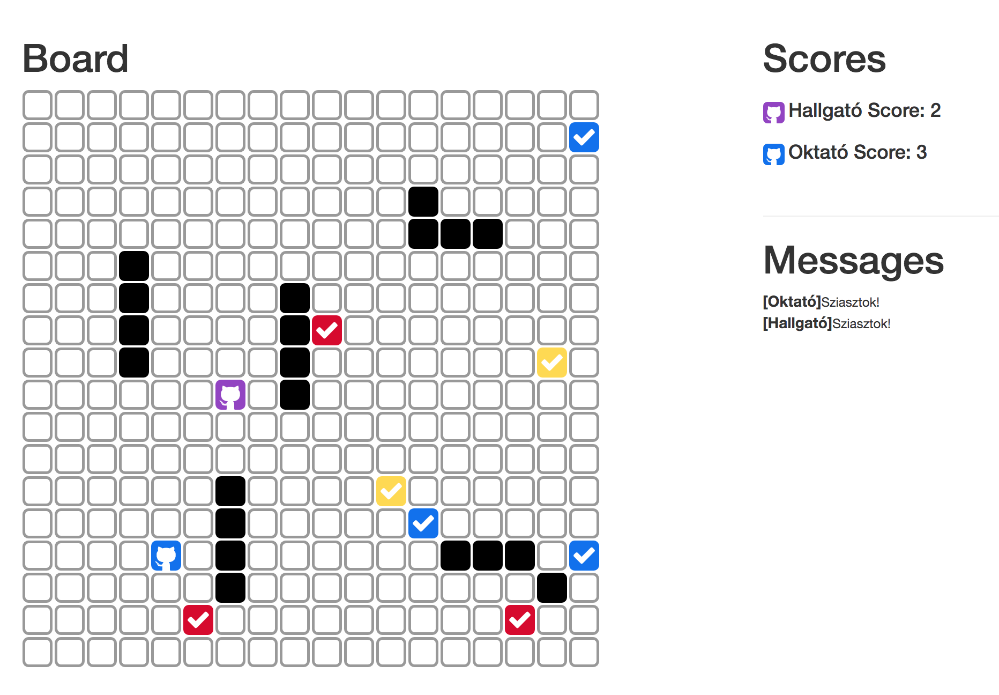

# Labor 7 - Hálózatkezelés

## Bevezetés

A labor célja a hálózati kommunikáció, a platformon leginkább használt, HTTP kommunikáció alapjainak bemutatása, valamint az ehhez kapcsolódó aszinkron hívások ismertetése. A labor során egy multiplayer labirintus játékhoz fogunk mobil klienst fejleszteni. A kliens segítségével irányíthatunk a labirintusban egy bábut, továbbá lehetőség lesz üzenetek küldésére is. A labor az alábbi témákat érinti:

*   Felületek használata ButterKnife segítségével
*   HTTP hálózati hívások
*   Aszinkron hívások szálakkal
*   Események kezelése EventBus-al

## A feladat

A következőkben egy olyan Android alkalmazást készítünk, mely tulajdonképpen egy kliensalkalmazás egy multiplayer labirintus játékhoz.

A játék tényleges felülete nem az Android alkalmazás része, azt egy előre elkészített webes alkalmazás jeleníti meg, amely elérhető az alábbi címen:

[http://android-labyrinth.node.autsoft.hu](http://android-labyrinth.node.autsoft.hu)

A játék szabályai egyszerűek, a játékosunkat a készülékről négy gomb segítségével (bal, jobb, fel, le) irányíthatjuk, továbbá lehetőség van még üzenetküldésre is. Az első lépésünk során kerül rá az új játékos a játéktérre egy véletlen pozícióra (színes Github icon). Ha egy játékos egy pontot érő mezőre lép (színes pipa), akkor pontot szerez, és egy újabb pontot érő mező kerül a pályára véletlenszerű helyre. A játékosok nem tudnak a fal (fekete négyzet) elemen átlépni, illetve másik játékos által foglalt mezőre sem léphetnek!



## A felhasználói felület elkészítése

Hozzunk létre egy új Android Studio Projektet **NetworkLabor** néven. A Company Domain mező tartalmát töröljük ki és hagyjuk is üresen. 

A packagename legyen **hu.bme.aut.amorg.examples.networklabor** 
A támogatott céleszközök a **Telefon és Tablet**, valamint a minimum SDK szint az **API15: Android 4.0.3** 

A kezdő projekthez adjuk hozzá egy **Empty Activity**-t, melynek neve legyen **MainActivity**. 

Első lépésként készítsük el az alkalmazás felhasználói felületét XML erőforrásból. A felületen helyezzünk el két _EditText_-et, egyet a felhasználónév bekéréséhez, egyet pedig üzenetküldéshez. Emellett legyen összesen 5 gomb, négy gomb az irányításhoz, egy pedig az üzenetküldéshez, valamint 3 TextView az üzenetek megjelenítéséhez. 


Az ehhez megfelelő XML állomány a következő: 

```xml  
<?xml version="1.0" encoding="utf-8"?>
<LinearLayout xmlns:android="http://schemas.android.com/apk/res/android"
    android:id="@+id/bgLayout"
    android:layout_width="match_parent"
    android:layout_height="match_parent"
    android:orientation="vertical"
    android:padding="@dimen/default_padding">

    <TextView
        android:layout_width="match_parent"
        android:layout_height="wrap_content"
        android:text="@string/title_username"
        style="@style/DefaultViewMarginStyle" />

    <EditText
        android:id="@+id/usernameET"
        android:layout_width="match_parent"
        android:layout_height="wrap_content"
        style="@style/DefaultViewMarginStyle" />

    <RelativeLayout
        android:layout_width="match_parent"
        android:layout_height="wrap_content"
        android:gravity="center"
        android:orientation="vertical">

        <Button
            android:id="@+id/upBTN"
            android:layout_width="wrap_content"
            android:layout_height="wrap_content"
            android:layout_alignParentTop="true"
            android:layout_centerHorizontal="true"
            style="@style/DefaultViewMarginStyle"
            android:text="@string/up" />

        <Button
            android:id="@+id/downBTN"
            android:layout_width="wrap_content"
            android:layout_height="wrap_content"
            android:layout_below="@id/upBTN"
            android:layout_centerHorizontal="true"
            style="@style/DefaultViewMarginStyle"
            android:text="@string/down" />

        <Button
            android:id="@+id/leftBTN"
            android:layout_width="wrap_content"
            android:layout_height="wrap_content"
            android:layout_below="@id/upBTN"
            style="@style/DefaultViewMarginStyle"
            android:layout_toLeftOf="@id/downBTN"
            android:text="@string/left" />

        <Button
            android:id="@+id/rightBTN"
            android:layout_width="wrap_content"
            android:layout_height="wrap_content"
            android:layout_below="@id/upBTN"
            style="@style/DefaultViewMarginStyle"
            android:layout_toRightOf="@id/downBTN"
            android:text="@string/right" />


    </RelativeLayout>

    <TextView
        android:layout_width="match_parent"
        android:layout_height="wrap_content"
        style="@style/DefaultViewMarginStyle"
        android:text="@string/title_message" />

    <EditText
        android:id="@+id/messageET"
        android:layout_width="match_parent"
        android:layout_height="wrap_content"
        style="@style/DefaultViewMarginStyle"  />

    <LinearLayout
        android:layout_width="match_parent"
        android:layout_height="wrap_content"
        android:gravity="center"
        android:orientation="horizontal">

        <Button
            android:id="@+id/sendBTN"
            android:layout_width="wrap_content"
            android:layout_height="wrap_content"
            style="@style/DefaultViewMarginStyle"
            android:text="@string/send" />
    </LinearLayout>

    <TextView
        android:id="@+id/responseTV"
        android:layout_width="match_parent"
        android:layout_height="wrap_content"
        style="@style/DefaultViewMarginStyle"/>

</LinearLayout>

``` 

A felület tartalmaz több szöveges konstanst is, ezért töltsük fel a _res/values_ könyvtárban lévő _strings.xml_ állományunkat a következő értékekkel: 


```xml
<?xml version="1.0" encoding="utf-8"?>
<resources>
    <string name="app_name">Labirintus</string>
    <string name="title_username">Felhasználónév</string>
    <string name="title_message">Üzenet</string>
    <string name="left">Bal</string>
    <string name="right">Jobb</string>
    <string name="up">Fel</string>
    <string name="down">Le</string>
    <string name="send">Küldés</string>
    <string name="empty_user">Üres felhasználónév!</string>
    <string name="empty_user_or_message"> Üres felhasználónév vagy jelszó!</string>
</resources>
``` 

A felület tartalmaz stílusokat is, ezért töltsük fel a _res/values_ könyvtárban lévő _styles.xml_ állományunkat a következő értékekkel: 

```xml
<?xml version="1.0" encoding="utf-8"?>
<resources>

    <style name="AppTheme" parent="Theme.AppCompat.Light.DarkActionBar">
        <item name="colorPrimary">@color/primary</item>
        <item name="colorPrimaryDark">@color/primary_dark</item>
        <item name="colorAccent">@color/accent</item>
    </style>

    <style name="DefaultViewMarginStyle">
        <item name="android:layout_margin">@dimen/default_padding</item>
    </style>

</resources>

``` 

Szabjuk testre az alkalmazás színeit _res/values_ könyvtárban lévő _color.xml_ állományban.

```xml
<?xml version="1.0" encoding="utf-8"?>
<resources>
  <color name="primary">#009688</color>
  <color name="primary_dark">#00796B</color>
  <color name="primary_light">#B2DFDB</color>
  <color name="accent">#00BCD4</color>
  <color name="primary_text">#212121</color>
  <color name="secondary_text">#757575</color>
  <color name="icons">#FFFFFF</color>
  <color name="divider">#BDBDBD</color>
</resources>


``` 

Szabjuk testre a _dimens.xml_ file tartalmát.

```xml
<?xml version="1.0" encoding="utf-8"?>
<resources>
    <dimen name="activity_horizontal_margin">16dp</dimen>
    <dimen name="activity_vertical_margin">16dp</dimen>
    <dimen name="default_padding">8dp</dimen>
</resources>
```

A tabletekre optimalizált dimens file-t törölhetjük is (figyeljük oda, hogy ne mind a kettőt töröljük, mert azt ajánlaná fel a Studió). Töröljük az **androidTest** és **test** könyvtárakat is, nem lesz most rá szükségünk. 

Mivel az alkalmazásunk interneten keresztül fog kommunikálni, vegyül fel a manifestbe az ehhez kapcsolódó permissiont.

```xml
 <uses-permission android:name="android.permission.INTERNET"/>
```


## A felületi elemek egyszerű feloldása
Az előző laborok során többször is használtuk a **findViewByID** hívást a nézetek feloldására. Ez a felületi elemekkel arányos mennyiségű kódolást kiván, mely egyébként nagyon repetativ. Azért hogy ezt ne _kézzel_ kelljen megcsinálnunk újra használjuk a [Butterknife](http://jakewharton.github.io/butterknife/) könyvtárat.

Ehhez a module build.gradle ben kell a dependencies részbe felvenni a könyvtárat. Egyszer fel kell venni mint _implementation_ függőség, hogy az osztályait elérjük. Másrészt fel kell venni mint _annotationProcessor_ függőség, hogy az annotáció feldolgozás lefuthasson. 

>Régebben erre az **android-apt** gradle plugin kellett, de az Android Gradle Plugin 2.2 óta beépítve elérhető, ha mégsem a legújabb gradle plugint használtnánk, azt a projekt _build.gradle_ -ben tudjuk frissíteni.

```java
implementation 'com.jakewharton:butterknife:8.8.1'
annotationProcessor 'com.jakewharton:butterknife-compiler:8.8.1'
```

A könyvtár fordítás időben generálja le a findViewByID hívásokat, és el is fedi előlünk, az összerendelést annotációkkal tudjuk megadni.


```java
public class MainActivity extends AppCompatActivity{

    @BindView(R.id.usernameET) EditText usernameET;
	 
    @Override
    public void onCreate(Bundle savedInstanceState) {
        super.onCreate(savedInstanceState);
        setContentView(R.layout.activity_main);
		ButterKnife.bind(this);
    }
}
```

Viszont jól látható, hogy így is van feladatunk, meg kell adnunk a felületi elemeket és létre kell hoznunk a hozzájuk tartozó tagváltozókat. Szerencsére ez a feladat is automatizálható, a Butterknife Zelezny Android Studio Pluginnal.

Ennek a telepítéséhez `File` - `Settings` - `Plugins` - `Browser Repositories` - `keresés: Android ButterKnife Zelezny` , majd `Install` és Android Studio újraindítás.

Ha a plugin már telepítve van, akkor  a setContentView(**R.layout.activity_main**); elemére állva, **Alt+Insert** _(CMD+N)_ majd **Generate Butterknife Injections**, majd válasszuk ki a generálni kívánt elemeket (gombok, usernév, üzenet).

Jelen esetben csak az EditText és TextView mezőket fogjuk használni ilyen formában. A 4 gomb kezelésére használjuk a ButterKnife beépített `@OnClick(R.id.button)` annotációját.

```java
@OnClick(R.id.downBTN)
public void onDownButtonClick() {
	//...
}
```
Az összekötést (a tényleges findViewByID és setOnClickListener hívásokat) a ButterKnife.bind(this) hívás csinálja meg, azután a hívás után használhatóak a nézeteink és a listenerek.

```java
public class MainActivity extends AppCompatActivity {

    @BindView(R.id.usernameET)
    EditText usernameET;
    @BindView(R.id.messageET)
    EditText messageET;
    @BindView(R.id.responseTV)
    TextView responseTV;

    @Override
    protected void onCreate(Bundle savedInstanceState) {
        super.onCreate(savedInstanceState);
        setContentView(R.layout.activity_main);
        ButterKnife.bind(this);
    }

    @OnClick(R.id.downBTN)
    public void onDownButtonClick() {
        Toast.makeText(this,"Down",Toast.LENGTH_SHORT).show();
    }

    @OnClick(R.id.upBTN)
    public void onUpButtonClick() {
        Toast.makeText(this,"Up",Toast.LENGTH_SHORT).show();
    }

    @OnClick(R.id.leftBTN)
    public void onLeftButtonClick() {
        Toast.makeText(this,"Left",Toast.LENGTH_SHORT).show();
    }

    @OnClick(R.id.rightBTN)
    public void onRightButtonClick() {
        Toast.makeText(this,"Right",Toast.LENGTH_SHORT).show();
    }
 
    @OnClick(R.id.sendBTN)
    public void onSendButtonClick() {
        Toast.makeText(this,"Send",Toast.LENGTH_SHORT).show();
    }
    
}
```

Próbáljuk ki az alkalmazást, nézzük meg a felületét.


## Az API bemutatása

A szerver egy NodeJS alapú oldal, amely HTTP GET kérésekben várja a lépéseket és az üzeneteket. Ezeket eltárolja egy adatbázisban, amelyet egy REST híváson keresztül tesz elérhetővé a megjelenítésért felelős Angular alkalmazás számára. Az Angular alkalmazás ezt a NodeJS oldalt pollozza relatív kis időközönként és kapott válaszok alapján frissíti a felhasználói felületét. A szerver alap címe az alábbi oldalon érhető el: 
``` http://android-labyrinth.node.autsoft.hu ``` 

Ezen belül kell majd a megfelelő REST végpontokat meghívni az előre definiált GET paraméterekkel. A szervertől hiba esetén mindig „ERROR”-ral kezdődő üzenetet kapunk.

### Játékos mozgatása

A játékos mozgatásához a `/api/step/{username}/{direction}`-t kell meghívni (`GET` hívás), amely két paramétert vár:

*   _username_: felhasználónév (ne felejtsük URL encode-olni!)
*   _direction_: lépés típusa (1: bal, 2: fel, 3: jobb, 4: le)

Például: 
``` 
/api/step/hallgato/3
```

### Üzenet feltöltése

Üzenet feltöltéséhez a `/api/message/{username}/{message}`-t kell hívni (`GET` hívás),amely szintén két paramétert vár:

*   _username_: felhasználónév (ne felejtsük URL encode-olni!)
*   _message_: üzenet (ne felejtsük URL encode-olni!)

Például: 

``` /api/message/hallgato/hello```


## Aszinkron hívások Android platformon

### Mellék szálak kezelése
Alapértelmezetten Androidon a hívások a fő szálon (UI Thread, Main thread) futnak. Ha itt hosszan tartó műveleteket végzünk akkor a fő szálat blokkoljuk.  Ez a felhasználó számára zavaró.

Android platformon a hálózati kommunikáció emiatt új szálon kell történjen, hogy a felhasználói felületet ne blokkoljuk.  Erre mind a Java mind az Android SDK ad lehetőségeket

*	Java Thread (Plain Old Java Thread, rugalmas, de testre kell szabni)
*	Android [AsyncTask](http://developer.android.com/reference/android/os/AsyncTask.html) (Szálakra épül, sok beépített feature, de nem elég rugalmas)
*	RxJava (sokkal bonyolultabb az előzőeknél, szálakra épül ez is)


### Visszatérés a fő szálra
A hálózatról érkező választ azonban általában a felhasználói felületen jelenítjük meg valamilyen módon, de a platform nem engedi, hogy más szálból a UI-t módosítsuk, csak a fő szálról. 

Arra, hogy egy mellék szálról hogyan térjünk vissza a fő szálra a platform több eszközt is biztosít:

#### Erősen csatolt megoldások
Amennyiben van már referenciánk az Activityre/Viewra.

*   Activity.runOnUiThread(Runnable)
*   View.post(Runnable)
*   View.postDelayed(Runnable, long)
*   Handler
*   Android [AsyncTask](http://developer.android.com/reference/android/os/AsyncTask.html) (Ez is egy feature-je)

Probléma lehet hogyha pl. elfordul az Activity ezért a referencia a régire mutat (memory leak), és az új nem kapja meg a hívást. Ha ez a veszély fenn áll célszerű kombinálni lazán csatolt megoldással.

#### Lazán csatolt megoldások
A fő szálú objektum feliratkozik, majd leiratkozik a válaszról, lazán csatolt módon. Hiába fordul el a nézet a hálózati hívás során, az új nézet fogja elkapni a régi által indított üzenet válaszát, és a régire nem marad referencia.

*   Broadcast receiver  (lazán csatolt, nem kell referencia, sorosítani kell a választ, lassabb)
*   Eseménybuszok  (lazán csatolt, nem kell referencia, de picit bonyolultabb, 3rd party megoldás).

A mostani laboron, a **Java Thread** és az **Eseménybusz** kombinációját fogjuk használni.

## Kommunikáció a szerver oldallal

Következő feladatunk a szerver oldali kommunikációt biztosító osztály megvalósítása, mely végrehajtja a HTTP GET hívásokat és a választ visszaadja String formátumban.

A **network** csomagban hozzunk létre a **LabyrinthAPI** osztályt.

```java
public class LabyrinthAPI {

    private static final String BASE_URL = "http://android-labyrinth.node.autsoft.hu";
    private static final String UTF_8 = "UTF-8";

  
    public String moveUser(String userName, int direction) {
		//TODO
		return "";
     }

    public String writeMessage(String userName, String message) {
		//TODO
       return "";
    }

}
```

Ez az osztály fogja végezni a különböző API hívásokat, és egységbe zárni a HTTP kérés és válasz feldolgozást.

### HTTP hívások Androidon
Az Android platform több megoldást is ad beépítve HTTP hívásokra. Egyrészt elérhető az Apache HTTP Client, valamint az Java HttpUrlConnection. Ezeket beépítve tartalmazza a platform. Az Apache HTTP Client mára elavult, az Android 6.0 feletti eszközök már csak kiegészítéssel támogatják, NE HASZNÁLJUK. A HttpUrlConnection elérhető mindenhol, viszont nagyon körülményes a használata, ezért a beépített megoldások helyett, egy széleskörben elterjedt, harmadik féltől ([Square](http://square.github.io)) származó, nyilt könyvtárat, az [OkHttp](http://square.github.io/okhttp/)-t fogjuk használni.

Ennek használatához fel kell vennünk a következő sort az alkalmazás modul szintű `build.gradle` fájljának dependencies részéhez.

```java
implementation 'com.squareup.okhttp3:okhttp:3.10.0'
```

Ezután a könyvtár nagyon egyszerűen használható. Készítsünk is egy általános HTTP GET hívást lebonyolító függvényt a LabyrinthAPI osztályba.

```java
private static String httpGet(String URL) throws IOException {
     OkHttpClient client = new OkHttpClient.Builder()
            .connectTimeout(10, TimeUnit.SECONDS)
            .readTimeout(10, TimeUnit.SECONDS)
            .build();
            
    Request request = new Request.Builder()
            .url(URL)
            .build();

    //The execute call blocks the thread
    Response response = client.newCall(request).execute();
    return response.body().string();
}
```

Ezt fogjuk használni az összes HTTP GET híváshoz. Használjuk is az újonnan elkészített függvényünket, és implementáljuk a moveUser és writeMessage hívásokat. 
> Megjegyzés: Jelen esetben a stringeket nyugodtan összefűzhetjük a + operátorral, a háttérben ezt a fordító kioptimalizálja, összetettebb összefüzésekre (pl. file sorainak összefűzése), használjuk a [StringBuilder](https://developer.android.com/reference/java/lang/StringBuilder.html) -t.

```java
private static final String TAG = "Network";
private static final String ENDPOINT_STEP = "/api/step/";
private static final String PARAM_USERNAME = "username";
private static final String SEPARATOR = "/";
private static final String ENDPOINT_MESSAGE = "/api/message/";
private static final String RESPONSE_ERROR = "ERROR";


public String moveUser(String userName, int direction) {
    try {
        String usernameURLEncoded = URLEncoder.encode(userName, UTF_8);

        String moveUserUrl = ENDPOINT_STEP + usernameURLEncoded + SEPARATOR + direction;

        Log.d(TAG,"Call to:"+moveUserUrl);
        String response = httpGet(BASE_URL + moveUserUrl);
        return response;

    } catch (Exception e) {
        e.printStackTrace();
        return RESPONSE_ERROR;
    }
}

public String writeMessage(String userName, String message) {
    try {
        String usernameURLEncoded = URLEncoder.encode(userName, UTF_8);
        String messageURLEncoded = URLEncoder.encode(message, UTF_8);

        String writeMessageUrl = ENDPOINT_MESSAGE + usernameURLEncoded + SEPARATOR + messageURLEncoded;

        Log.d(TAG,"Call to:"+writeMessageUrl);
        String response = httpGet(BASE_URL + writeMessageUrl);
        return response;

    } catch (Exception e) {
        e.printStackTrace();
        return RESPONSE_ERROR;
    }

}
```

Figyeljük meg, hogy az esetleges kivételeket try-catch blockban kezeltük, valamint a HTTP karaktereket megfelelően URL encodeoltuk az `URLEncoder.encode(...)`  függvényével, mely beépítve rendelkezésünkre áll.


Ezután vegyük fel az irányok értékeit konstansként a MainActivitybe

```java
public static final int MOVE_LEFT = 1;
public static final int MOVE_UP = 2;
public static final int MOVE_RIGHT = 3;
public static final int MOVE_DOWN = 4;
```

Majd private field-ként adjunk hozzá az előbb létrehozott LabyrinthAPI osztályt, és használjuk a megfelelő események bekövetkeztekor.


```java
public class MainActivity extends AppCompatActivity {

    @BindView(R.id.usernameET) EditText usernameET;
    @BindView(R.id.messageET) EditText messageET;
    @BindView(R.id.responseTV) TextView responseTV;

    public static final int MOVE_LEFT = 1;
    public static final int MOVE_UP = 2;
    public static final int MOVE_RIGHT = 3;
    public static final int MOVE_DOWN = 4;

    private LabyrinthAPI labyrinthAPI;

    @Override
    protected void onCreate(Bundle savedInstanceState) {
        super.onCreate(savedInstanceState);
        setContentView(R.layout.activity_main);
        ButterKnife.bind(this);

        labyrinthAPI = new LabyrinthAPI();
    }


    @OnClick(R.id.downBTN)
    public void onDownButtonClick() {
        String response=labyrinthAPI.moveUser(usernameET.getText().toString(),MOVE_DOWN);
        showResponse(response);
    }

    @OnClick(R.id.leftBTN)
    public void onLeftButtonClick() {
        String response=labyrinthAPI.moveUser(usernameET.getText().toString(),MOVE_LEFT);
        showResponse(response);
    }

    @OnClick(R.id.rightBTN)
    public void onRightButtonClick() {
        String response=labyrinthAPI.moveUser(usernameET.getText().toString(),MOVE_RIGHT);
        showResponse(response);
    }

    @OnClick(R.id.upBTN)
    public void onUpButtonClick() {
        String response=labyrinthAPI.moveUser(usernameET.getText().toString(),MOVE_UP);
        showResponse(response);
    }

    @OnClick(R.id.sendBTN)
    public void onSendButtonClick() {
        String message = messageET.getText().toString();
        String response=labyrinthAPI.writeMessage(usernameET.getText().toString(),message);
        showResponse(response);

    }

    private void showResponse(String response) {
        responseTV.setText(response);
    }

}  
```

Próbáljuk, ki az alkalmazást. Mit tapasztalunk?

Azt tapasztaljuk, hogy minden kérésre ERROR-t kapunk, és ha megnézzük a LogCat kimentet, látjuk is, hogy `android.os.NetworkOnMainThreadException` kivételt kapunk. Ezt a rendszer dobja, mert érzékeli, hogy a fő szálon szeretnénk hosszan tartó hálózati műveletet végezni. Az látszik, hogy a fő szálon, az onClick metódusban hívjuk meg a moveUser-t ami a httpGet metóduson keresztül a blokkoló execute metódust. Ahhoz, hogy ezt a problémát meg tudjuk oldani szálkezelésre lesz szükségünk.


### Szálkezelés elkészítése
A szálkezeléshez használjuk az egyszerű és könnyen testre szabható JavaThread-eket. Készítsünk el a MainActivityben 1-1 segéd függvényt a moveUser és writeMessage híváshoz. Elsőnek egy új szálat készítünk, melyben elindítjuk az API hívást és amint az válaszolt, visszaadjuk a választ a fő szálra (runOnUIThread). ahol pedíg már a főszálon megjelenítjük a választ.

```java
private void asyncMoveUser(final String username, final int direction) {
    new Thread(new Runnable() {
        @Override
        public void run() {
            final String response = labyrinthAPI.moveUser(username, direction);

            runOnUiThread(new Runnable() {
                @Override
                public void run() {
                    showResponse(response);
                }
            });

        }
    }).start();
}

private void asyncWriteMessage(final String username, final String message) {
    new Thread(new Runnable() {
        @Override
        public void run() {
            final String response = labyrinthAPI.writeMessage(username, message);

            runOnUiThread(new Runnable() {
                @Override
                public void run() {
                    showResponse(response);
                }
            });

        }
    }).start();
}
```
Hívjuk meg ezeket az onClick metódusokból, a direkt hívások helyett, és nézzük meg mit tapasztalunk.

```java
@OnClick(R.id.downBTN)
public void onDownButtonClick() {
  asyncMoveUser(usernameET.getText().toString(),MOVE_DOWN);
}

// ...

@OnClick(R.id.sendBTN)
public void onSendButtonClick() {
    asyncWriteMessage(usernameET.getText().toString(),messageET.getText().toString());
}
```

Próbáljuk ki az alkalmazást.


## Megfelelő válasz kezelés
Próbáljuk, ki mi történik, ha megnyomunk egy gombot, majd elfordítjuk a készüléket/emulátort.
Azt tapasztaljuk, hogy az alkalmazás hibába ütközik. 

Ennek az az oka, hogy a szálak tovább képesek élni, mint az Activity, és ha egy hálózati hívás keresztül ível egy Activity váltáson/újralétrehozáson, akkor a szál még az előző Activityre rendelkezik referenciával, így NullPointerException-t kapunk. 

Ezt úgy lehet kiküszöbölni, hogy az erős, referencia alapú csatolás helyett laza csatolást alkalmazunk. Ilyen esetben az Activity amikor előtérbe kerül (onResume) feliratkozik, majd ha háttérbe kerül leiratkozik (onPause) az eseményről. A hálózati hívás során pedig a választ nem direkt függvényhívásban állítjuk be, hanem csak egy eseményt váltunk ki.

Az Android platform beépítve támogatja az események kezelését Broadcast Receiverek formájában. Viszont egy alkalmazáson belül használva a broadcast receivereket, az üzenet sorosítása miatt overhead jelentkezik, valamint kényelmetlen is a használata. 

Ennek kiküszöbölése érdekében használjunk esemény buszokat, melyek gyorsabbak és egyszerűbben is használhatóak a Broadcast Receiverektől (ellenben csak egy alkalmazáson/processen belül működnek és referencia szükséges az eseménybuszra).

Számos 3rd party eseménybusz megoldás van, mi a Greenrobot EventBus megoldását fogjuk használni. Ehhez vegyük fel a könyvtárat a függőségek közé:

`implementation 'org.greenrobot:eventbus:3.1.1'`

Majd definiáljunk esemény osztályokat. Hozzunk létre 1-1 esemény osztályt, a **MoveUser** és a **WriteMessage** eseményeknek, az **events** csomagban, **MoveUserResponseEvent** és **WriteMessageResponseEvent** néven. Mivel az eseménybuszok az osztály alapján dolgoznak ezért az egyes eseményekhez külön osztályok szükségesek. Mindenkét osztály standard Java osztály, mely 1-1 String-ben tárolja a választ.

```java
public class MoveUserResponseEvent {
    private String response;

    public String getResponse() {
        return response;
    }

    public void setResponse(String response) {
        this.response = response;
    }
}

//...

public class WriteMessageResponseEvent {
    private String response;

    public String getResponse() {
        return response;
    }

    public void setResponse(String response) {
        this.response = response;
    }
}
```

Ezután az eseményeket a külön szálakban az `EventBus.getDefault().post(...)` segítségével küldjük ki. Minden eseményt a fenti osztályok 1-1 példánya reprezentál.

```java
private void asyncMoveUser(final String username, final int direction) {
    new Thread(new Runnable() {
        @Override
        public void run() {
            final String response = labyrinthAPI.moveUser(username, direction);

            MoveUserResponseEvent moveUserResponseEvent = new MoveUserResponseEvent();
            moveUserResponseEvent.setResponse(response);
            EventBus.getDefault().post(moveUserResponseEvent);

        }
    }).start();
}

private void asyncWriteMessage(final String username, final String message) {
    new Thread(new Runnable() {
        @Override
        public void run() {
            final String response = labyrinthAPI.writeMessage(username, message);

            WriteMessageResponseEvent writeMessageResponseEvent = new WriteMessageResponseEvent();
            writeMessageResponseEvent.setResponse(response);
            EventBus.getDefault().post(writeMessageResponseEvent);

        }
    }).start();
}
```

Ahhoz, hogy a kiváltott eseményeket el tudjuk kapni, a **MainActivity**ben definiáljuk az eseménybusz elkapó függvényeit.

```java
@Subscribe(threadMode = ThreadMode.MAIN)
public void onMoveUserResponse(MoveUserResponseEvent event) {
    responseTV.setText("Move User Response:" + event.getResponse());
}

@Subscribe(threadMode = ThreadMode.MAIN)
public void onWriteMessageResponse(WriteMessageResponseEvent  event) {
    responseTV.setText("Write Message Response:" + event.getResponse());
}
```
Itt fontos hogy a **@Subscribe** annotáció használva legyen, ez mondja meg hogy ez egy elkapó metódus, valamint a thread mode **MAIN** legyen, mert így az események a főszálon kerülnek továbbításra. Fontos, hogy az elküldött objektumokat az osztály típusa szerint tudja a rendszer a megfelelő elkapó metódusnak elküldeni. Egyébként egy eseményhez több elkapó metódus is lehet egyszerre beregisztrálva.

Ezután regisztráljuk be az elkapó metódusokat, pontosabban azt az osztályt amely ezeket tartalmazza (jelen esetben ez a MainActivity aktuális példánya (this)).

Azt szeretnénk, hogy akkor legyenek ezek az esemény elkapó metódusok aktívak, amikor az Activity előtérben van, így az onResume-ban iratkozunk fel, és az onPause-ban le.

```java
@Override
protected void onResume() {
    super.onResume();
    EventBus.getDefault().register(this);
}

@Override
protected void onPause() {
    EventBus.getDefault().unregister(this);
    super.onPause();
}
```

Próbáljuk ki az alkalmazást. Láthatjuk, hogy most már a hálózati hívások _túlélik_ az Activity elforgatást is.
  
Végül próbáljuk ki az alkalmazást működés közben: 


## Bonus feladat 1 - Válaszidő kijelzése

Egészítsük ki az alkalmazást úgy, hogy a felhasználói felületen megjelenítsük a szerverrel való kommunikáció során tapasztalt átlagos válaszidőt (üzenet küldése és válasz megérkezése közti idő).

Tipp: Az aktuális időt legegyszerűbben a következő hívással érhetjük el:

```java
long currentTime=System.currentTimeMillis();
```

## Bonus feladat 2 - Hálozat elérhető-e

Egészítsük ki az alkalmazást úgy, hogy a hálózati hívások előtt ellenőrizzük, hogy elérhető-e a hálózat, ha nem, jelenítsünk meg hibaüzenetet pl. Toast-ban. Segítség: 

``` java
ConnectivityManager connectivityManager = (ConnectivityManager) getSystemService(Context.CONNECTIVITY_SERVICE);
NetworkInfo activeNetworkInfo = connectivityManager.getActiveNetworkInfo();
boolean networkAvailable = activeNetworkInfo != null && activeNetworkInfo.isConnected();
``` 

A szükséges manifest engedély: 

```xml
<uses-permission android:name="android.permission.ACCESS_NETWORK_STATE"/>
```

## Bonus feladat 3 - WiFi állapot kijelzése

Egészítsük ki az alkalmazást úgy, hogy a _WiFi_ állapotát és a hálózat nevét megjelenítsük a felhasználói felületen.  Segítség: 

``` java
WifiManager wifiManager = (WifiManager) getApplicationContext().getSystemService(WIFI_SERVICE);
WifiInfo wifiInfo = wifiManager.getConnectionInfo();
Log.d("wifiInfo", wifiInfo.toString());
Log.d("SSID",wifiInfo.getSSID());
``` 

A szükséges manifest engedély: 
```xml
<uses-permission android:name="android.permission.ACCESS_WIFI_STATE"/>
```
