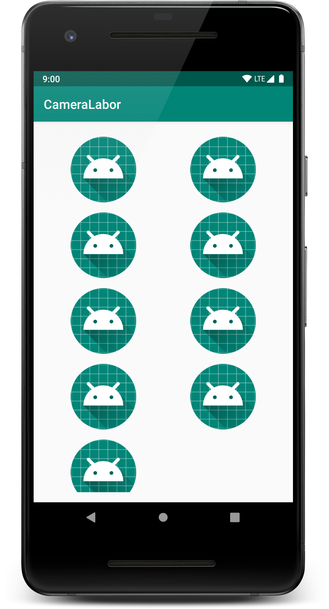
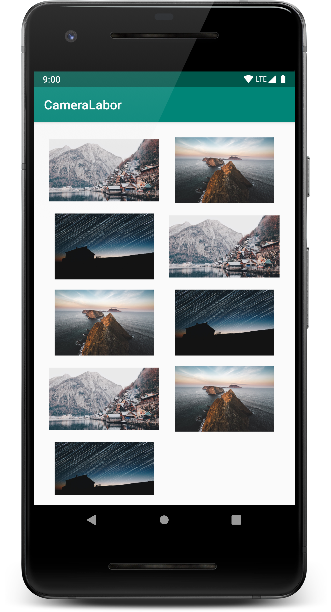
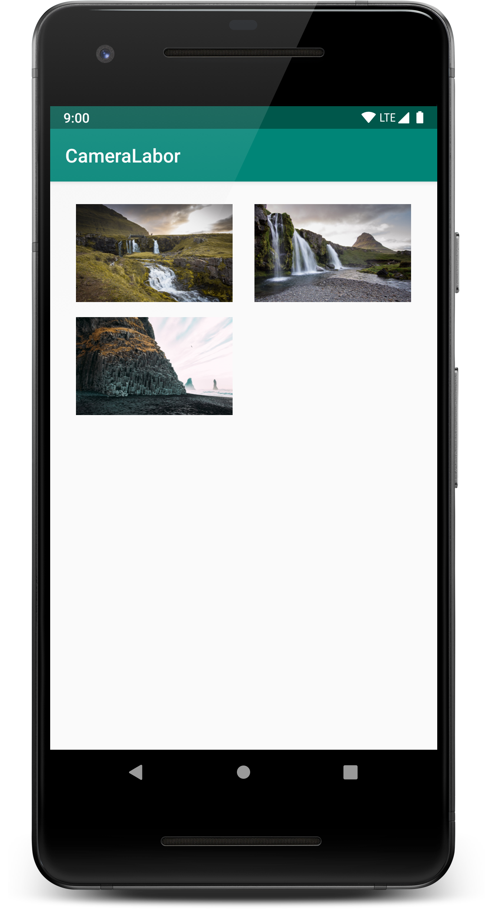
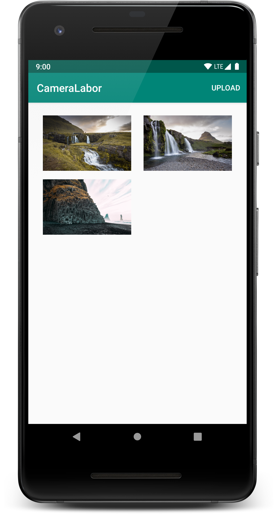
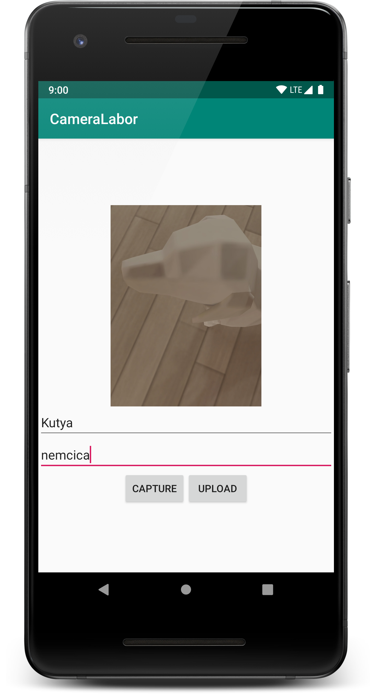
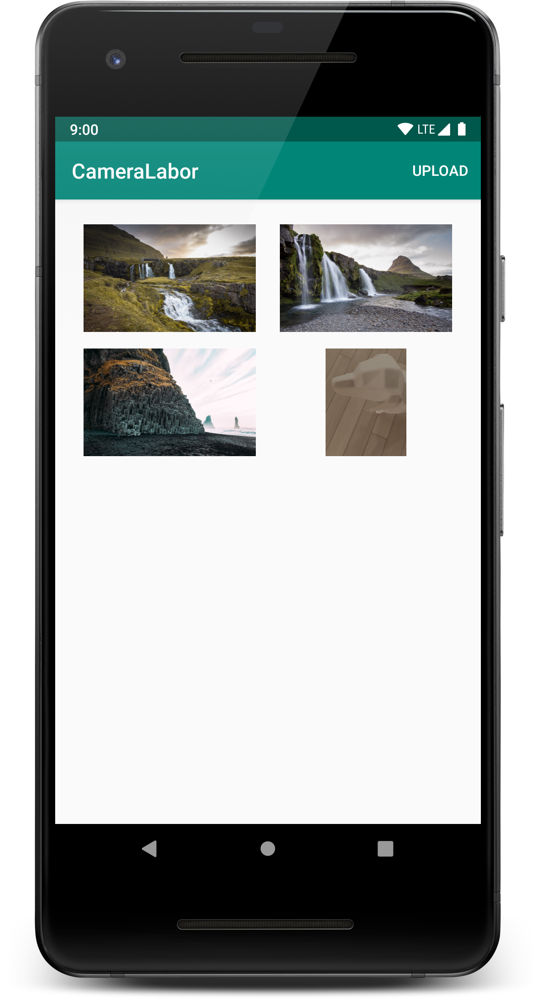

# Labor 8 - Galéria


## Bevezetés

A labor célja, hogy bemutassa az Android multimédia szolgáltatásait, külön kiemelve a kamerakezelés módszereit, valamint az előző labor során megismert hálózatkezelési megoldások egy magasabb szintjét, a HTTP API implementálását **Retrofit** segítségével. 

A labor során egy Galéria alkalmazást készítünk, melyben lehetőség lesz:

* Fényképek listázására
* Saját fotó készítésére 
* Fotó feltöltésére

A labor az alábbi témákat érinti:

* HTTP API-k használata Retrofit segítségével
* Fájl feltöltése szerverre
* Beépített kamera alkalmazás használata


## Galéria

A feladat megvalósításához szerver oldalon egy galéria alkalmazás áll rendelkezésre, mely az alábbi címen elérhető:

[https://aut-android-gallery.herokuapp.com/](https://aut-android-gallery.herokuapp.com/) 

### API leírás

A galéria egy HTTP API-n keresztül lehetőséget biztosít arra, hogy a képeket listázzuk, új képek töltsünk fel, illetve hogy képet értékeljünk. Az API a követekező címen érhető el:

```
https://aut-android-gallery.herokuapp.com/api
```

#### Képek lekérdezése

A `GET /images` végpont meghívásával lehetőségünk van a feltöltött fotókat listázni.
 
 A válasz egy JSON tömb, ami a képek adatait tartalmazza, pl. 
 
```json
[
  {
    "_id": "58a5b80aa8e86411008ca8e4",
    "name": "Név",
    "description": "Leírás",
    "timestamp": 1487255562304,
    "url": "images/image-1487255562041",
    "size": 121128,
    "mimetype": "image/jpeg",
    "encoding": "7bit"
  }
]
 ```
 
A képek az `url` mező tartalmát az API címe után fűzve érhetőek el.

#### Fotó feltöltése

A `POST /upload` hívással lehetőségünk van fotót feltölteni. A kérés tartalma a bináris kép fájl `image` kulccsal.

#### Szavazat feltöltése

A `POST /rate/{id}` hívással lehetőségünk van a feltöltött fotókat értékelni. Az `{id}` helyére a kép ID-ját kell fűznünk.

A kérés paraméterek:

*   `username`: tetszőleges felhasználónév
*   `vote`: egész szám 1 és 5 között
*   `professional`: boolean
*   `type`: tetszőleges string
*   `comment`: tetszőleges string


## Felhasználói felület

Hozzunk létre egy új Android Studio projektet. Válasszuk a *Phone and Tablet* szekcióban az *Empty Activity* sablont.

Az alkalmazás neve legyen `CameraLabor`, a package név legyen `hu.bme.aut.android.cameralabor`, és természetesen válasszuk a Kotlin nyelvet.

A minimum SDK szint az *API 19: Android 4.4*, az androidx függőségeket szeretnénk használni és az instant alkalmazásokat nem támogatjuk a labor során.

A `test` és az `androidTest` mappákra nem lesz szükségünk, azokat törölhetjük!

Vegyük fel a Manifest állományba a szükséges engedélyeket: 

```xml 
<uses-permission android:name="android.permission.INTERNET"/>
<uses-permission android:name="android.permission.CAMERA"/>
<uses-permission android:name="android.permission.WRITE_EXTERNAL_STORAGE"/>
```

> Ezen engedélyek közül a kamera kezelés és a külső háttértár elérése veszélyes engedély, amit Android 6.0 felett futásidőben kell elkérni. A félév során lesz ennek a menetéről is szó. Ezen a laboron azonban ezt még nem szeretnénk támogatni, ezért a modul szintű `build.gradle`-ben a `targetSdkVersion` értékét vegyük le `22`-re.

A modul szintű `build.gradle`-ben vegyük fel a `RecyclerView` függőséget:

```groovy
implementation "androidx.recyclerview:recyclerview:1.0.0"
```
 
A `MainActivity` nézet fogja kilistázni a feltöltött képeket. Ez a nézet egy egyszerű `RecyclerView`, mely egy `SwipeRefreshLayout`-ba van ágyazva. A `SwipeRefreshLayout` lehetőséget biztosít arra, hogy a listához egyszerűen implementáljunk *pull-to-refresh* működést. Az ehhez tartozó `activity_main.xml` tartalma a következő:

```xml
<?xml version="1.0" encoding="utf-8"?>
<FrameLayout xmlns:android="http://schemas.android.com/apk/res/android"
    android:id="@+id/activity_main"
    android:layout_width="match_parent"
    android:layout_height="match_parent"
    android:layout_marginBottom="@dimen/activity_vertical_margin"
    android:layout_marginEnd="@dimen/activity_horizontal_margin"
    android:layout_marginStart="@dimen/activity_horizontal_margin"
    android:layout_marginTop="@dimen/activity_vertical_margin">

    <androidx.swiperefreshlayout.widget.SwipeRefreshLayout
        android:id="@+id/srlImages"
        android:layout_width="match_parent"
        android:layout_height="match_parent">

        <androidx.recyclerview.widget.RecyclerView
            android:id="@+id/rvImages"
            android:layout_width="match_parent"
            android:layout_height="match_parent"
            android:scrollbars="vertical" />

    </androidx.swiperefreshlayout.widget.SwipeRefreshLayout>

</FrameLayout>
```

A hiányzó dimenzió értékeket vegyük fel <kbd>Alt</kbd>+<kbd>Enter</kbd> segítségével. Értékük legyen `16dp`.

A `MainActivity` kódja pedig a következő. Látható, hogy a `loadImages()` függvény végzi ez a fotók letöltését (egyelőre csak beégetett értékekkel), ez hívódik a nézetre navigálása után, illetve akkor is, ha lehúzzással frissítjük a tartalmat.

```kotlin
class MainActivity : AppCompatActivity() {

    private var adapter: ImagesAdapter? = null

    override fun onCreate(savedInstanceState: Bundle?) {
        super.onCreate(savedInstanceState)
        setContentView(R.layout.activity_main)

        rvImages.layoutManager = GridLayoutManager(this, 2)
        srlImages.setOnRefreshListener { loadImages() }
    }

    override fun onResume() {
        super.onResume()
        loadImages()
    }

    private fun loadImages() {
        val images: MutableList<String> = mutableListOf()
        images += "https://images.unsplash.com/photo-1486758206125-94d07f414b1c?ixlib=rb-0.3.5&s=2bda5e189cbdf19185f03f310a88ae5b&auto=format&fit=crop&w=1950&q=80"
        images += "https://images.unsplash.com/photo-1508881598441-324f3974994b?ixlib=rb-0.3.5&s=de7b102b9c6faa0b027644fcf35d37bc&auto=format&fit=crop&w=1050&q=80"
        images += "https://images.unsplash.com/photo-1486570318579-054c95b01160?ixlib=rb-0.3.5&s=8cb4fb1b4ac3ab4e5335a6f5961d5d86&auto=format&fit=crop&w=1190&q=80"
        images += "https://images.unsplash.com/photo-1486758206125-94d07f414b1c?ixlib=rb-0.3.5&s=2bda5e189cbdf19185f03f310a88ae5b&auto=format&fit=crop&w=1950&q=80"
        images += "https://images.unsplash.com/photo-1508881598441-324f3974994b?ixlib=rb-0.3.5&s=de7b102b9c6faa0b027644fcf35d37bc&auto=format&fit=crop&w=1050&q=80"
        images += "https://images.unsplash.com/photo-1486570318579-054c95b01160?ixlib=rb-0.3.5&s=8cb4fb1b4ac3ab4e5335a6f5961d5d86&auto=format&fit=crop&w=1190&q=80"
        images += "https://images.unsplash.com/photo-1486758206125-94d07f414b1c?ixlib=rb-0.3.5&s=2bda5e189cbdf19185f03f310a88ae5b&auto=format&fit=crop&w=1950&q=80"
        images += "https://images.unsplash.com/photo-1508881598441-324f3974994b?ixlib=rb-0.3.5&s=de7b102b9c6faa0b027644fcf35d37bc&auto=format&fit=crop&w=1050&q=80"
        images += "https://images.unsplash.com/photo-1486570318579-054c95b01160?ixlib=rb-0.3.5&s=8cb4fb1b4ac3ab4e5335a6f5961d5d86&auto=format&fit=crop&w=1190&q=80"
        adapter = ImagesAdapter(applicationContext, images)
        rvImages.adapter = adapter
        srlImages.isRefreshing = false
    }

}
```

> *A statikus képek forrása az [Unsplash](https://unsplash.com).*

A képek listájának feltöltését az `ImagesAdapter` végzi. Hozzuk is létre ezt az osztályt az `adapter` csomagban a következő tartalommal:

```kotlin
class ImagesAdapter(
        private val context: Context,
        private val images: MutableList<String>)
    : RecyclerView.Adapter<ImagesAdapter.ViewHolder>() {

    private val layoutInflater = LayoutInflater.from(context)

    init {
        this.images.reverse()
    }

    override fun onCreateViewHolder(parent: ViewGroup, viewType: Int): ImagesAdapter.ViewHolder {
        val view = layoutInflater.inflate(R.layout.li_image, parent, false)
        return ViewHolder(view)
    }

    override fun onBindViewHolder(holder: ViewHolder, position: Int) {
        //TODO: Set ImageView from URL
    }

    override fun getItemCount() = images.size

    class ViewHolder(view: View) : RecyclerView.ViewHolder(view) {
        val imageView: ImageView = view.ivImage
    }

}
```

Az egyes képekhez tartozó cella elem felületét pedig a `li_image.xml` layout fájlban definiáljuk.

```xml
<?xml version="1.0" encoding="utf-8"?>
<LinearLayout xmlns:android="http://schemas.android.com/apk/res/android"
    android:layout_width="match_parent"
    android:layout_height="wrap_content"
    android:orientation="vertical">

    <ImageView
        android:id="@+id/ivImage"
        android:layout_width="match_parent"
        android:layout_height="120dp"
        android:padding="8dp"
        android:src="@mipmap/ic_launcher" />
        
</LinearLayout>
```

Próbáljuk ki az alkalmazást!

<p align="center">

</p>


## Képek megjelenítése - Glide

Az alkalmazás jelenleg a képek helyén a layout fájlban beállított alapértelmezett ikont jeleníti meg. Ez azért van, mert bár a listát feltöltöttük, az `onBindViewHolder(...)` hívásban nem állítottuk be a képet. A megjelenítendő képekről csak a webes URL áll rendelkezésünkre. Ilyen esetben a fájlt le kell töltenünk a hálózaton keresztül, dekódolni a kapott bájtokat, és az így kapott `Bitmap`-et beállítani az `ImageView` forrásaként. Ezt a platform által nyújtott eszközökkel elég hosszadalmas implementálni, ezért erre egy elterjedt, nyílt forráskódú könyvtárat fogunk használni.

A [Glide](https://github.com/bumptech/glide) egy általános célú képkezelő könyvtár, gyakorlatilag a fent említett műveleteket végzi el helyettünk egyetlen kódsor használatával, továbbá támogatja a cache-elést, az aszinkron letöltést, valamint több forrásból is képes megjeleníteni (web, háttértár, content provider, resource, stb.). 

Használatához a modul szintű `build.gradle`-ben vegyük fel a következő függőséget a `dependencies` blokkban. 

```groovy
implementation 'com.github.bumptech.glide:glide:4.9.0'
```

Ezután az `ImagesAdapter` `onBindViewHolder` függvényében töltsük be az adott fotót az `ImageView`-ba:

```kotlin       
val imageUrl = images[position]
Glide.with(context).load(imageUrl).into(holder.imageView)
```

Próbáljuk ki az alkalmazást!

<p align="center">

</p>


## Retrofit

A [Retrofit](https://square.github.io/retrofit/) egy általános célú HTTP könyvtár Java környezetben. Széles körben használják, számos projektben bizonyított már (kvázi ipari standard). Azért használjuk, hogy ne kelljen alacsony színtű hálózati hívásokat implementálni (mint az előző laboron az OkHttp-vel).

Segítségével elég egy interface-ben annotációk segítségével leírni az API-t (ez pl. a [Swagger](https://swagger.io/) eszközzel generálható is), majd e mögé készít a Retrofit egy olyan osztályt, mely a szükséges hálózati hívásokat elvégzi. A Retrofit a háttérben az [OkHttp3](https://github.com/square/okhttp)-at használja, valamint az objektumok JSON formátumba történő sorosítását a [Gson](https://github.com/google/gson) libraryvel végzi. Ezért ezeket is be kell hivatkozni.

A Retrofit használatához vegyük fel a függőségek közé az alábbi kódot:

```groovy
implementation 'com.squareup.retrofit2:retrofit:2.5.0'
implementation 'com.squareup.okhttp3:okhttp:4.1.1'
implementation 'com.google.code.gson:gson:2.8.5'
implementation 'com.squareup.retrofit2:converter-gson:2.5.0'
```

A képek adatait tartalmazó `Image` osztályt hozzuk létre a `model` csomagban.

```kotlin
data class Image(
        @SerializedName("_id")
        val id: String,
        val name: String,
        val description: String,
        val timestamp: Long,
        val url: String,
        val size: Long,
        val mimetype: String,
        val encoding: String
)
```

A Gson automatikusan megoldja majd az egyes tagváltozók szerializálását, kivéve az `id` property esetében, mivel azt a szerver `_id`-ként adja vissza. Ezt a `@SerializedName` annotációval jelezhetjük.

Ezután hozzunk létre egy új csomagot `network` néven, benne egy új interface-t `GalleryAPI` néven. Ez lesz az API leírónk. Az elérhető `Call` osztályok közül válasszuk a Retrofit által nyújtottat, az `Image` osztályok közül pedig mindig a sajátunkat importáljuk. 

```kotlin
interface GalleryAPI {

    companion object {
        const val ENDPOINT_URL = "https://aut-android-gallery.herokuapp.com/api/"
        const val IMAGE_PREFIX_URL = "https://aut-android-gallery.herokuapp.com/"

        const val MULTIPART_FORM_DATA = "multipart/form-data"
        const val PHOTO_MULTIPART_KEY_IMG = "image"
    }

    @GET("images")
    fun getImages(): Call<List<Image>>

    @Multipart
    @POST("upload")
    fun uploadImage(@Part file: MultipartBody.Part,
                    @Part("name") name: RequestBody,
                    @Part("description") description: RequestBody): Call<ResponseBody>

}
```

Ezután hozzuk létre azt az osztályt a `network` csomagban, amely a fenti API-t használni fogja. Ennek az osztálynak az a feladata, hogy a fenti API hívásokat egységbezárja, és az előző laboron látott módon külön szálon végezze el a hálózati hívásokat. *Az eseménybusz megoldást most idő hiányában nem használjuk, de abszolút releváns ebben a helyzetben is.*

Az osztály neve legyen `GalleryInteractor`.

```kotlin
class GalleryInteractor {

    private val galleryApi: GalleryAPI

    init {
        val retrofit = Retrofit.Builder()
                .baseUrl(GalleryAPI.ENDPOINT_URL)
                .addConverterFactory(GsonConverterFactory.create())
                .build()

        this.galleryApi = retrofit.create(GalleryAPI::class.java)
    }
}
```

Látható, hogy a `Retrofit` objektumot felhasználva hozzuk létre a `GalleryAPI` osztály implementációját, melyet azután használhatunk is. Itt állítjuk be hogy az átalakításokhoz a `Gson`-t használja, így felelteti meg a `Retrofit` a Kotlin modell objektumokat a JSON formátumnak (illetve szükség esetén visszafelé is).

Azért, hogy a hálózati hívásokat külön szálra ütemezzük, majd a választ egy interface-en keresztül visszaütemezzük a főszálra *generikus függvényeket* fogunk használni. Az API-ban definiált `Call` objektumok lehetővé teszik, hogy a hálózati hívások ne a definiálás (ne a függvényhívás) idejében történjenek, hanem később tetszőlegesen (`.execute()` hívással) bármikor. Ez lehetőséget ad arra, hogy az összeállított kéréseket generikusan kezeljük (nem kell minden kérésre külön implementálni a szálkezelést). 

Készítsük is el a generikus hívásunkat, mely egy tetszőleges típusú `Call` objektumot vár, azt egy új szálon meghívja, majd a választ (`Handler` segítségével) visszaütemezi a főszálra, és ott meghívja az előbb létrehozott listener objektumot. A `Handler`-rel a `runOnUiThread`-hez hasonló működést tudunk elérni, anélkül hogy referenciánk lenne egy `Activity`-re. Mind a sikeres hívás `onSuccess`, mind a sikertelen hívás `onError` esetére definiáljunk egy visszatérési érték nélküli, egy paraméteres lambdát, ez siker esetén a válasz lesz, mely a `T` generikus típussal rendelkezik, hiba esetén pedig a kapott `Exception`.

Ennek a kódja a következő (ezt is a `GalleryInteractor`-ban definiáljuk):

```kotlin
private fun <T> runCallOnBackgroundThread(
        call: Call<T>,
        onSuccess: (T) -> Unit,
        onError: (Throwable) -> Unit
) {
    val handler = Handler()
    Thread {
        try {
            val response = call.execute().body()!!
            handler.post { onSuccess(response) }

        } catch (e: Exception) {
            e.printStackTrace()
            handler.post { onError(e) }
        }
    }.start()
}
```

Ezután a fenti segédfüggvényt felhasználva elkészíthetjük a `GalleryInteractor`-ban a hívásokat.

```kotlin
fun getImages(
    onSuccess: (List<Image>) -> Unit,
    onError: (Throwable) -> Unit
) {
    val getImagesRequest = galleryApi.getImages()
    runCallOnBackgroundThread(getImagesRequest, onSuccess, onError)
}

fun uploadImage(
    fileUri: Uri,
    name: String,
    description: String,
    onSuccess: (ResponseBody) -> Unit,
    onError: (Throwable) -> Unit
) {
    val file = File(fileUri.path)
    val requestFile = file.asRequestBody(MULTIPART_FORM_DATA.toMediaTypeOrNull())
    val body = MultipartBody.Part.createFormData(PHOTO_MULTIPART_KEY_IMG, file.name, requestFile)

    val nameParam = name.toRequestBody(MultipartBody.FORM)
    val descriptionParam = description.toRequestBody(MultipartBody.FORM)

    val uploadImageRequest = galleryApi.uploadImage(body, nameParam, descriptionParam)
    runCallOnBackgroundThread(uploadImageRequest, onSuccess, onError)
}
```
Ha a Studio nem tudja feloldani az `asRequestBody` és `toRequestBody` extension functionöket, akkor az alábbi importokkal lehet a jó irányba terelni:

```kotlin
import okhttp3.RequestBody.Companion.asRequestBody
import okhttp3.RequestBody.Companion.toRequestBody
```

Ezután a `MainActivity`-ben példányosítsuk a `GalleryInteractor`-unkat, majd hajtsuk végre a `getImages` hívást, melynek eredményét jelentsük meg a `ImagesAdapter` segítségével.

```kotlin
private fun loadImages() {
    val galleryInteractor = GalleryInteractor()
    galleryInteractor.getImages(onSuccess = this::showImages, onError = this::showError)
}

private fun showImages(images: List<Image>) {
    adapter = ImagesAdapter(applicationContext, images.toMutableList())
    rvImages.adapter = adapter
    srlImages.isRefreshing = false
}

private fun showError(e: Throwable) {
    e.printStackTrace()
    srlImages.isRefreshing = false
}
```

> A `getImages` által várt függvény paramétereket lambdák létrehozása helyett [metódus referenciákkal](https://kotlinlang.org/docs/reference/lambdas.html#instantiating-a-function-type) adtuk át, amihez természetesen a `showImages` és `showError` függvényeknek a megfelelő fejléccel kell rendelkezniük.

Mivel eddig `String` listát jelenítettünk meg az `ImagesAdapter`-rel, most át kell alakítani az adaptert, hogy egy `Image` listát kezeljen. Ezen kívül a képek eléréséhez az `IMAGE_PREFIX_URL` után kell fűznünk a kép `url` mezőjének tartalmát.

```kotlin
class ImagesAdapter(
        private val context: Context,
        private val images: MutableList<Image>)
    : RecyclerView.Adapter<ImagesAdapter.ViewHolder>() {

    private val layoutInflater: LayoutInflater = LayoutInflater.from(context)

    init {
        this.images.reverse()
    }

    override fun onCreateViewHolder(parent: ViewGroup, viewType: Int): ViewHolder {
        val view = layoutInflater.inflate(R.layout.li_image, parent, false)
        return ViewHolder(view)
    }

    override fun onBindViewHolder(holder: ViewHolder, position: Int) {
        val image = images[position]

        Glide.with(context)
                .load(GalleryAPI.IMAGE_PREFIX_URL + image.url)
                .into(holder.imageView)
    }

    override fun getItemCount() = images.size

    class ViewHolder(itemView: View) : RecyclerView.ViewHolder(itemView) {
        var imageView: ImageView = itemView.ivImage
    }

}
```

Próbáljuk ki az alkalmazást.

<p align="center">

</p>

## Fotó feltöltés

Hozzunk létre egy új *Empty Activity*-t `UploadActivity` néven. A hozzá tartozó `activity_upload.xml` felülete legyen a következő:

```xml
<?xml version="1.0" encoding="utf-8"?>
<LinearLayout xmlns:android="http://schemas.android.com/apk/res/android"
    android:layout_width="match_parent"
    android:layout_height="match_parent"
    android:gravity="center"
    android:orientation="vertical">

    <ImageView
        android:id="@+id/ivImage"
        android:layout_width="280dp"
        android:layout_height="280dp"
        android:scaleType="fitCenter"/>

    <EditText
        android:id="@+id/etName"
        android:layout_width="match_parent"
        android:layout_height="wrap_content"
        android:hint="Name"/>

    <EditText
        android:id="@+id/etDescription"
        android:layout_width="match_parent"
        android:layout_height="wrap_content"
        android:hint="Description"/>

    <LinearLayout
        android:layout_width="match_parent"
        android:layout_height="wrap_content"
        android:gravity="center"
        android:orientation="horizontal">

        <Button
            android:id="@+id/btnCapture"
            android:layout_width="wrap_content"
            android:layout_height="wrap_content"
            android:text="Capture"/>

        <Button
            android:id="@+id/btnUpload"
            android:layout_width="wrap_content"
            android:layout_height="wrap_content"
            android:text="Upload"/>

    </LinearLayout>

</LinearLayout>
```

Az `UploadActivity`-ben a *Capture* gomb megnyomásra elindítjuk a beépített kamera alkalmazást, majd a fotózott képet visszakapva megjelenítjük azt (szintén *Glide* segítségével).

A beépített Kamera alkalmazás indítása előtt definiálunk egy útvonalat az *External Storage*-ban (miért itt?), majd ezt adjuk át paraméterként, erre a helyre fogja a Kamera alkalmazás menteni az elkészített fotót. Az ezt elvégző `UploadActivity` kódja a következő:


```kotlin
class UploadActivity : AppCompatActivity() {

    companion object {
        private const val TMP_IMAGE_JPG = "/tmp_image.jpg"
        private val IMAGE_PATH = Environment.getExternalStorageDirectory().absolutePath + TMP_IMAGE_JPG
        private const val REQUEST_CAMERA_IMAGE = 101
    }

    override fun onCreate(savedInstanceState: Bundle?) {
        super.onCreate(savedInstanceState)
        setContentView(R.layout.activity_upload)

        btnCapture.setOnClickListener {
            val imageFile = File(IMAGE_PATH)
            val imageFileUri = Uri.fromFile(imageFile)
            val cameraIntent = Intent(android.provider.MediaStore.ACTION_IMAGE_CAPTURE)
            cameraIntent.putExtra(android.provider.MediaStore.EXTRA_OUTPUT, imageFileUri)
            startActivityForResult(cameraIntent, REQUEST_CAMERA_IMAGE)
        }
    }

    override fun onActivityResult(requestCode: Int, resultCode: Int, data: Intent?) {
        super.onActivityResult(requestCode, resultCode, data)
        if (requestCode == REQUEST_CAMERA_IMAGE) {
            if (resultCode == Activity.RESULT_OK) {
                try {
                    Glide.with(this)
                            .load(Uri.fromFile(File(IMAGE_PATH)))
                            .apply(RequestOptions().signature(ObjectKey(System.currentTimeMillis())))
                            .into(ivImage)

                } catch (t: Throwable) {
                    t.printStackTrace()
                    Toast.makeText(this, "ERROR: " + t.message, Toast.LENGTH_LONG).show()
                }
            }
        }
    }
}
```

Mivel a képeket mindig ugyanarra a helyre mentjük, így a *Glide* beépített cache mechanizmusát kikapcsoljuk, különben még az előző fotót jelenítené meg.

Ezután a `MainActivity`-ben felveszünk egy menü elemet, amivel az `UploadActivity`-re navigálhatunk. Ehhez hozzuk létre a `res/menu/menu_main.xml`-t a következő tartalommal:

```xml
<?xml version="1.0" encoding="utf-8"?>
<menu xmlns:android="http://schemas.android.com/apk/res/android"
    xmlns:app="http://schemas.android.com/apk/res-auto">
    <item
        android:id="@+id/upload"
        android:title="UPLOAD"
        app:showAsAction="always|withText" />
</menu>
```

Ezután a `MainActivity`-ben vegyük fel a hozzá tartozó menü létrehozó, és menü eseménykezelő függvényeket.

```kotlin
override fun onCreateOptionsMenu(menu: Menu): Boolean {
    menuInflater.inflate(R.menu.menu_main, menu)
    return true
}

override fun onOptionsItemSelected(item: MenuItem): Boolean {
    return when (item.itemId) {
        R.id.upload -> {
            val intent = Intent(this, UploadActivity::class.java)
            startActivity(intent)
            true
        }
        else -> super.onOptionsItemSelected(item)
    }
}
```

Próbáljuk ki az alkalmazást!

<p align="center">


</p>

### A feltöltés megvalósítása

A feltöltéshez szükséges API definíció és Interactor hívás is definiálva van, így a `getImages`-hez hasonlóan hívjuk meg ezt a hívást is a kép `Uri` paraméterével. Ezt az `UploadActivity` `onCreate(..)` metódusában tegyük meg.

```kotlin
override fun onCreate(savedInstanceState: Bundle?) {
    super.onCreate(savedInstanceState)
    setContentView(R.layout.activity_upload)

    btnCapture.setOnClickListener {
        val imageFile = File(IMAGE_PATH)
        val imageFileUri = Uri.fromFile(imageFile)
        val cameraIntent = Intent(android.provider.MediaStore.ACTION_IMAGE_CAPTURE)
        cameraIntent.putExtra(android.provider.MediaStore.EXTRA_OUTPUT, imageFileUri)
        startActivityForResult(cameraIntent, REQUEST_CAMERA_IMAGE)
    }

    btnUpload.setOnClickListener {
        val galleryInteractor = GalleryInteractor()

        val name = etName.text.toString()
        val description = etDescription.text.toString()

        galleryInteractor.uploadImage(
                fileUri = Uri.fromFile(File(IMAGE_PATH)),
                name = name,
                description = description,
                onSuccess = this::uploadSuccess,
                onError = this::uploadError
        )
    }
}

private fun uploadSuccess(responseBody: ResponseBody) {
    Toast.makeText(this, "Successfully uploaded!", Toast.LENGTH_SHORT).show()
    finish()
}

private fun uploadError(e: Throwable) {
    Toast.makeText(this, "Error during uploading photo!", Toast.LENGTH_SHORT).show()
    e.printStackTrace()
}
```

>Láthatjuk, hogy az [elnevezett paraméterek](https://kotlinlang.org/docs/reference/functions.html#named-arguments) mennyivel olvashatóbbá tudják tenni egy sok paraméterrel rendelkező függvény meghívását.

Figyeljük meg, hogy nekünk csak a fájl elérési útvonalát kellett megadnunk, a fájl beolvasását és feltöltését a *Retrofit* elvégzi helyettünk.

Próbáljuk ki az alkalmazást, és töltsünk fel egy fotót!

<p align="center">

</p>

## Megjegyzések:

A labor során a 22-es `targetSdkVersion` beállításával több, az újabb Android verziókban bevezetett változtatást/megszorítást megkerültünk. A Google azonban 2018 augusztusától nem enged 26-nál kisebb target SDK-val alkalmazásokat publikálni, 2018 novemberétől pedig meglévő alkalmazásokat sem lehet frissíteni úgy, hogy az új verzió ne célozná meg legalább a 26-os SDK-t. Ennek részleteiről itt olvashatunk bővebben: https://developer.android.com/distribute/best-practices/develop/target-sdk

A teljesség kedvéért a most kihagyott részek az alábbiak voltak:
- Android Nougat (24) óta nem hivatkozhatunk külső fájlokat URI szerint [FileProvider](https://developer.android.com/training/secure-file-sharing/setup-sharing) nélkül.
- Android Marshmallow (23) felett a veszélyes engedélyeket futásidőben kell elkérnünk, erre később fogunk példát látni. 

## Önálló feladatok

### Feladat 1: EventBus használata

Az előző labor mintájára módosítsd úgy a generikus szálkezelő megoldást, hogy `EventBus` használatával a hívások túléljék az `Activity` elforgatást.

### Feladat 2: Szavazat feltöltése

Az API-val lehetőség van szavazatokat is feltölteni. Egészítsd ki a fotók listáját egy részletek nézettel, ahol a felhasználó megadhatja az adatait, a fotó értékelését, és feltöltheti az értékelést az API-n keresztül. Az értékelés változását a [weboldalon](https://aut-android-gallery.herokuapp.com/) keresztül követheted.

Segítség: a hozzá tartozó hívás Retrofit hívás leírója a következő:

```kotlin
@POST("rate/{id}")
fun rate(@Path("id") id: String, @Body rating: Rating): Call<ResponseBody>
```

A `Rating` osztály pedig:

```kotlin
data class Rating(var image: String,
                  var username: String,
                  var vote: Int,
                  var professional: Boolean,
                  var type: String? = null,
                  var comment: String? = null)
```
