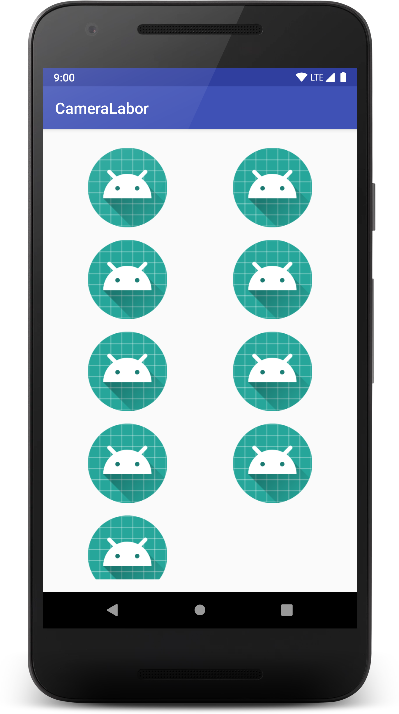
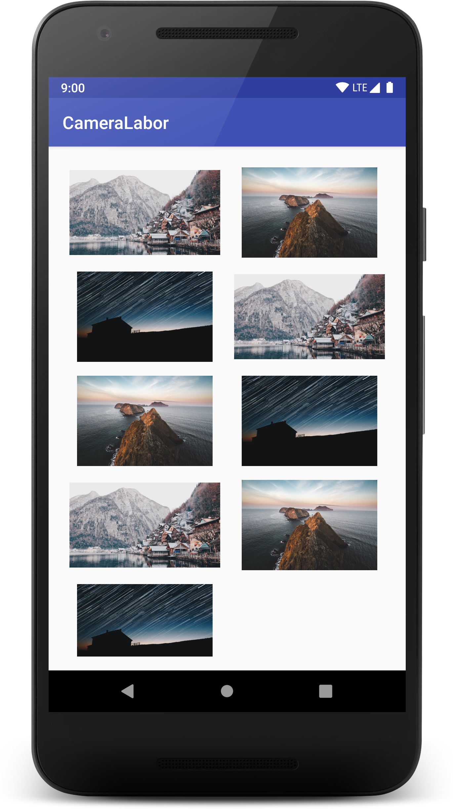
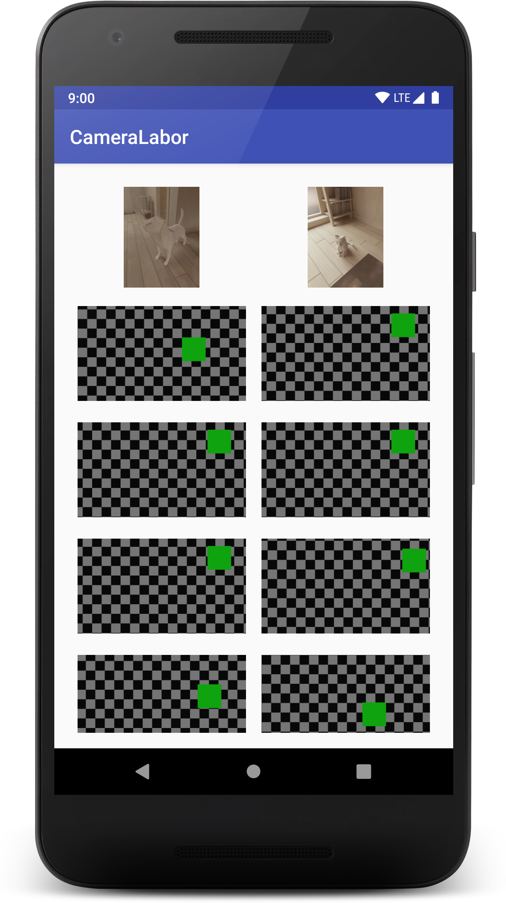
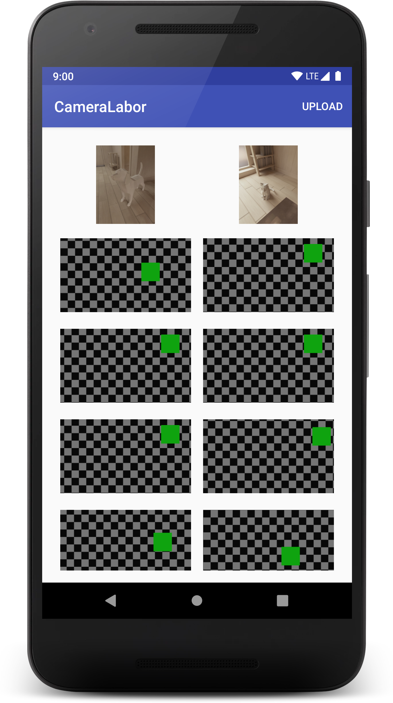
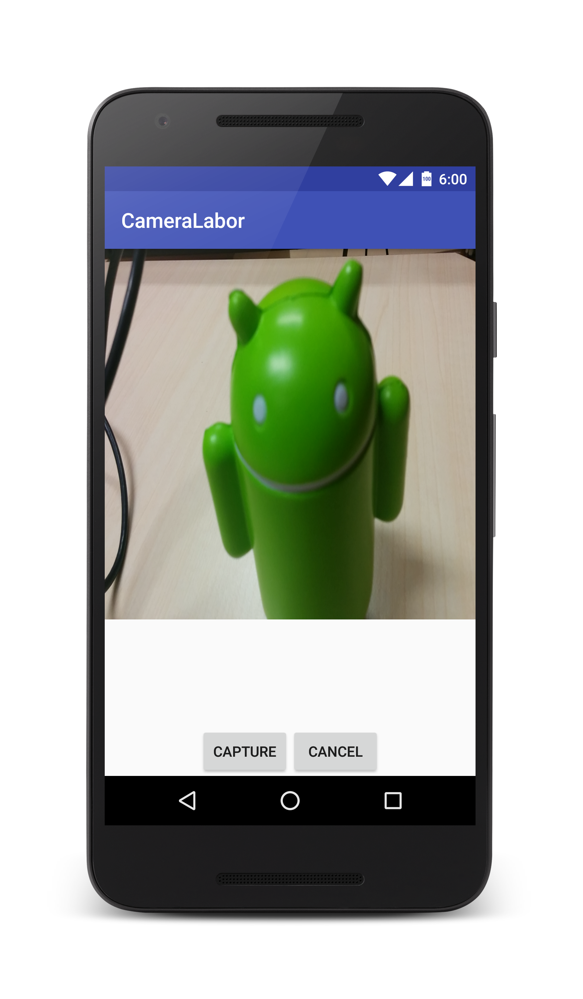
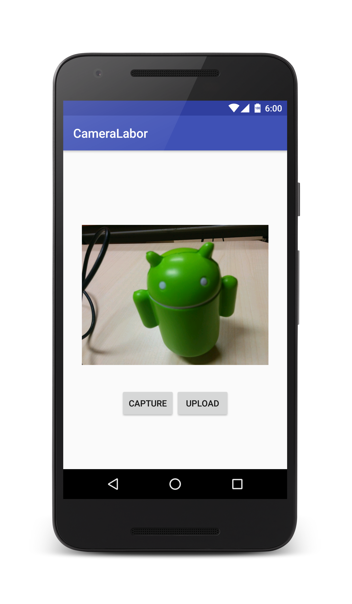

# Labor 8 - Galéria


## Bevezetés

A labor célja, hogy bemutassa az Android multimédia szolgáltatásait, külön kiemelve a kamerakezelés módszereit, valamint az előző labor során megismert hálózatkezelési megoldások egy magasabb szintjét, a HTTP API implementálását **Retrofit** segítségével. 

A labor során egy Galéria alkalmazást készítünk, melyben lehetőség lesz:

* Fényképek listázására
* Saját fotó készítésére (saját felület illetve beépített alkalmazással is) 
* Fotó feltöltésére


A labor az alábbi témákat érinti:

*   HTTP API-k használata Retrofit segítségével
*   File feltöltése szerverre
*   Beépített kamera alkalmazás használata
*   Saját kamera felület megjelenítése


## Galéria

A feladat megvalósításához szerver oldalon egy galéria alkalmazás áll rendelkezésre, mely az alábbi oldalon is elérhető:

[http://android-gallery.node.autsoft.hu/](http://android-gallery.node.autsoft.hu/) 

### API leírás

A galéria egy HTTP API-n keresztül lehetőséget biztosít arra, hogy a képeket listázzuk, új képek tölsünk fel, illetve hogy képet értékeljünk.

Az API a követekező címen érhető el:

`http://android-gallery.node.autsoft.hu/api`


#### Képek lekérdezése

Az alábbi `GET` hívással:  `/images` lehetőségünk van a feltöltött fotókat listázni.
 
 A válasz egy JSON tömb, ami a képek adatait tartalmazza, pl. 
 
 ```javascript
[
  {
    "_id": "58a5b80aa8e86411008ca8e4",
    "name": "Név",
    "description": "Leírás",
    "timestamp": 1487255562304,
    "url": "images/image-1487255562041",
    "size": 121128,
    "mimetype": "image/jpeg",
    "encoding": "7bit"
  }
]
 ```
 
 A képek URL je, az API címe után fűzve érhető el. (Ne feledkezzünk meg a `/`-ről.)

#### Fotó feltöltése
Az alábbi `POST` hívással:  `/upload` lehetőségünk van fotót feltölteni. A kérés tartalma a bináris kép file `image` kulccsal.


#### Szavazat feltöltése
Az alábbi `POST` hívással:  `/rate/{id}` lehetőségünk van a feltöltött fotókat értékelni. Az `{id}` helyére a kép ID-ját kell fűznünk.

A kérés paraméterek:

*   `username=tetszőleges felhasználónév`
*   `vote=egész szám 1 és 5 között`
*   `professional=boolean`
*   `type=tetszőleges string`
*   `comment=tetszőleges string`


## Felhasználói felület

Hozzunk létre egy új Android Studio Projektet **CameraLabor** néven. 

A Company Domain mező tartalmát töröljük ki és hagyjuk is üresen.
 
A packagename legyen **hu.bme.aut.amorg.examples.cameralabor** 

A támogatott céleszközök a **Telefon és Tablet**, valamint a minimum SDK szint a **API15: Android 4.0.3** 

A kezdő projekthez adjuk hozzá egy **Empty Activity**-t, melynek neve legyen **MainActivity**. 

Töröljük ki a **test** és **androidTest** mappákat, most nem lesz rájuk szükség.

Vegyük fel a Manifest állományba a szükséges engedélyeket: 

```xml 
<uses-permission android:name="android.permission.INTERNET"/>
<uses-permission android:name="android.permission.CAMERA"/>
<uses-permission android:name="android.permission.WRITE_EXTERNAL_STORAGE"/>
```

> Ezen engedélyek közül a kamera kezelés és a külső háttértár elérése veszélyes engedély, amit Android 6.0 felett megfelelően, futásidőben kell elkérni. A félév során lesz ennek a menetéről is szó. Mi ezt most a laboron nem szeretnénk támogatni, ezért a `build.gradle`-ben a `targetSdkVersion` értékét vegyük le `22`-re.

A **build.gradle**-ben vegyük fel a RecyclerView függőséget:

 `implementation 'com.android.support:recyclerview-v7:27.1.0'`
 
A **MainActivity** nézet fogja kilistázni a feltöltött képeket. Ez egy egyszerű RecyclerView, mely egy SwipeRefreshLayoutba van ágyazva, ez lehetőséget biztosít arra, hogy a listához egyszerűen implementáljunk pull-to-refresh működést. A hozzá tartozó **activity_main.xml** tartalma a következő:

```xml
<?xml version="1.0" encoding="utf-8"?>
<RelativeLayout xmlns:android="http://schemas.android.com/apk/res/android"
    android:id="@+id/activity_main"
    android:layout_width="match_parent"
    android:layout_height="match_parent"
    android:paddingBottom="@dimen/activity_vertical_margin"
    android:paddingLeft="@dimen/activity_horizontal_margin"
    android:paddingRight="@dimen/activity_horizontal_margin"
    android:paddingTop="@dimen/activity_vertical_margin">

    <android.support.v4.widget.SwipeRefreshLayout
        android:id="@+id/imagesSRL"
        android:layout_width="match_parent"
        android:layout_height="match_parent">

        <android.support.v7.widget.RecyclerView
            android:id="@+id/imagesRV"
            android:scrollbars="vertical"
            android:layout_width="match_parent"
            android:layout_height="match_parent"/>
    </android.support.v4.widget.SwipeRefreshLayout>
</RelativeLayout>
```

A hiányzó dimenzió értékeket vegyük fel alt+enter segítségével. Értékük legyen `16dp`.

A **MainActivity** kódja pedíg a következő. Látható hogy a `loadImages()` függvény végzi ez a fotók letöltését (egyenlőre csak beégetett értékekkel), ez hívódik a nézetre navigálása után, illetve ha lehúzzással frissítjük a tartalmat.

```java
public class MainActivity extends AppCompatActivity {
    private ImagesAdapter adapter;
    private RecyclerView imagesRV;
    private SwipeRefreshLayout imagesSRL;

    @Override
    protected void onCreate(Bundle savedInstanceState) {
        super.onCreate(savedInstanceState);
        setContentView(R.layout.activity_main);
        imagesRV = (RecyclerView) findViewById(R.id.imagesRV);
        imagesSRL = (SwipeRefreshLayout) findViewById(R.id.imagesSRL);

        GridLayoutManager mLayoutManager = new GridLayoutManager(this, 2);
        imagesRV.setLayoutManager(mLayoutManager);

        imagesSRL.setOnRefreshListener(new SwipeRefreshLayout.OnRefreshListener() {
            @Override
            public void onRefresh() {
                loadImages();
            }
        });
    }

    @Override
    protected void onResume() {
        super.onResume();
        loadImages();
    }

    private void loadImages() {
        List<String> images = new ArrayList<>();
        images.add("https://images.unsplash.com/photo-1486758206125-94d07f414b1c?ixlib=rb-0.3.5&s=2bda5e189cbdf19185f03f310a88ae5b&auto=format&fit=crop&w=1950&q=80");
        images.add("https://images.unsplash.com/photo-1508881598441-324f3974994b?ixlib=rb-0.3.5&s=de7b102b9c6faa0b027644fcf35d37bc&auto=format&fit=crop&w=1050&q=80");
        images.add("https://images.unsplash.com/photo-1486570318579-054c95b01160?ixlib=rb-0.3.5&s=8cb4fb1b4ac3ab4e5335a6f5961d5d86&auto=format&fit=crop&w=1190&q=80");
        images.add("https://images.unsplash.com/photo-1486758206125-94d07f414b1c?ixlib=rb-0.3.5&s=2bda5e189cbdf19185f03f310a88ae5b&auto=format&fit=crop&w=1950&q=80");
        images.add("https://images.unsplash.com/photo-1508881598441-324f3974994b?ixlib=rb-0.3.5&s=de7b102b9c6faa0b027644fcf35d37bc&auto=format&fit=crop&w=1050&q=80");
        images.add("https://images.unsplash.com/photo-1486570318579-054c95b01160?ixlib=rb-0.3.5&s=8cb4fb1b4ac3ab4e5335a6f5961d5d86&auto=format&fit=crop&w=1190&q=80");
        images.add("https://images.unsplash.com/photo-1486758206125-94d07f414b1c?ixlib=rb-0.3.5&s=2bda5e189cbdf19185f03f310a88ae5b&auto=format&fit=crop&w=1950&q=80");
        images.add("https://images.unsplash.com/photo-1508881598441-324f3974994b?ixlib=rb-0.3.5&s=de7b102b9c6faa0b027644fcf35d37bc&auto=format&fit=crop&w=1050&q=80");
        images.add("https://images.unsplash.com/photo-1486570318579-054c95b01160?ixlib=rb-0.3.5&s=8cb4fb1b4ac3ab4e5335a6f5961d5d86&auto=format&fit=crop&w=1190&q=80");

        adapter = new ImagesAdapter(getApplicationContext(), images);
        imagesRV.setAdapter(adapter);
        imagesSRL.setRefreshing(false);
    }
}
```

> A statikus képek forrása az [Unsplash](https://unsplash.com)

A képek listájának feltöltését a **ImagesAdapter** végzik. Hozzuk is létre ezt az osztályt az **adapter** csomagban a következő tartalommal.

```java
public class ImagesAdapter extends RecyclerView.Adapter<ImagesAdapter.ViewHolder> {
    private final LayoutInflater layoutInflater;
    private final Context context;
    private List<String> images;

    public ImagesAdapter(Context context, List<String> images) {
        this.images = images;
        Collections.reverse(this.images);
        this.layoutInflater = LayoutInflater.from(context);
        this.context=context;
    }

    @Override
    public ImagesAdapter.ViewHolder onCreateViewHolder(ViewGroup parent, int viewType) {
        View v = layoutInflater.inflate(R.layout.li_image, parent, false);
        return new ViewHolder(v);
    }

    @Override
    public void onBindViewHolder(ViewHolder holder, int position) {
        //TODO: Set ImageView from URL
    }

    @Override
    public int getItemCount() {
        return images.size();
    }

    public static class ViewHolder extends RecyclerView.ViewHolder {
        public ImageView imageView;

        public ViewHolder(View v) {
            super(v);
            imageView = (ImageView) v.findViewById(R.id.imageIV);
        }
    }
}
```

Az egyes képekhez tartozó cella elem felületét pedig az **li_image.xml** layout fileban definiáljuk.

```xml
<?xml version="1.0" encoding="utf-8"?>
<LinearLayout xmlns:android="http://schemas.android.com/apk/res/android"
    android:layout_width="match_parent"
    android:layout_height="wrap_content"
    android:orientation="vertical">

    <ImageView
        android:id="@+id/imageIV"
        android:layout_width="match_parent"
        android:layout_height="120dp"
        android:src="@mipmap/ic_launcher"
        android:padding="8dp" />
</LinearLayout>
```

Próbáljuk ki az alkalmazást!




## Képek megjelenítése - Glide
Az alkalmazás jelenleg a képek helyén az alapértelmezett icont jelenít meg. Ez azért van mert bár a listát feltöltöttük, az `onBindViewHolder(...)` hívásban nem jelentettük meg a képet. A megjelenítendő képekről csak a webes URL áll rendelkezésünkre. Ilyen esetben a file-t le kell töltenünk a hálózaton keresztül, dekódolni a kapott byte-okat, és az így kapott Bitmap-et beállítani az ImageView forrásaként. Ezt a platform által nyújtott eszközökkel elég kényelmetlen implementálni, ezért egy elterjed, általános célű könyvtárat fogunk használni.

A [Glide](https://github.com/bumptech/glide) egy általános célú képkezelő könyvtár, gyakorlatilag a fent említett műveleteket végzi el helyettünk egyetlen kódsor használatával, továbbá támogatja a cachelést, aszinkron letöltést, valamint több forrásból is képes megjeleníteni (web, háttértár, content provider, resource ...). 

Használatához a **build.gradle** be vegyük fel a következő függőséget a `dependencies` blokkban. 

```groovy
implementation 'com.github.bumptech.glide:glide:4.6.1'
```

Ezután a **ImagesAdapter**  **onBindViewHolder** függvényében töltsük be az adott fotót az **ImageView**-ba.

```java       
Glide.with(holder.imageView.getContext()).load(images.get(position)).into(holder.imageView);
```

Próbáljuk ki az alkalmazást!




## Retrofit

A [Retrofit](https://square.github.io/retrofit/) egy általános célú HTTP könyvtár Java környezetben. Széles körben használják, számos projektben bizonyított már (kvázi ipari standard). Azért használjuk, hogy ne kelljen alacsony színtű hálózati hívásokat implementálni (mint az előző laboron az OkHttp-vel).

Segítségével elég egy interfaceben annotációk segítségével leírni az API-t (ez pl. a [Swagger](https://swagger.io/) eszközzel generálható is), majd e mögé készít a Retrofit egy olyan osztályt, mely a szükséges hálózati hívásokat elvégzi. A Retrofit a háttérben az OkHttp3-at használja, valamint az objektumok JSON formátumba történő sorosítását a GSON eszközzel végzi. Ezért ezeket is be kell hivatkozni.

A Retrofit használatához vegyük fel a függőségek közé az alábbi kódot.

```groovy
implementation 'com.squareup.retrofit2:retrofit:2.3.0'
implementation 'com.squareup.okhttp3:okhttp:3.10.0'
implementation 'com.google.code.gson:gson:2.8.2'
implementation 'com.squareup.retrofit2:converter-gson:2.3.0'
```

Ezután hozzunk létre egy új csomagot **network** néven, benne egy új interface-t **GalleryAPI** néven. Ez lesz az API leírónk.

```java
public interface GalleryAPI {
    String ENDPOINT_URL="http://android-gallery.node.autsoft.hu/api/";
    String IMAGE_PREFIX_URL="http://android-gallery.node.autsoft.hu/";
        
    String MULTIPART_FORM_DATA = "multipart/form-data";
    String PHOTO_MULTIPART_KEY_IMG = "image";

    @GET("images")
    Call<List<Image>> getImages();

    @Multipart
    @POST("upload")
    Call<ResponseBody> uploadImage(@Part MultipartBody.Part file, @Part("name") RequestBody name, @Part("description") RequestBody description);
}
```

A képek adatait tartalmazó **Image** osztályt hozzuk létre a **model** csomagban.

```java
public class Image {
    @SerializedName("_id")
    public String id;
    public String name;
    public String description;
    public long timestamp;
    public String url;
    public long size;
    public String mimetype;
    public String encoding;
}
```

Figyeljünk rá hogy mindíg ezt az **Image** osztályt importáljuk.

Látható, hogy a GSON automatikus megoldja majd az egyes tagváltozók szerializálását, kivéve az id mezőt, mivel azt a szerver `_id`-ként adja vissza. Ezt a `@SerializedName` annotációval írhatjuk felül.

Ezután hozzuk létre azt az osztályt a **network** csomagban,amely a fenti API-t használni fogja,  mivel ennek az osztálynak az a feladata hogy fenti API hívásokat egységbe fogja, és az előző laboron látott módon külön szálon vegezze el a hálózati hívásokat. **Az eseménybusz megoldást most idő hiányában nem használjuk, de abszolút releváns ebben a helyzetben is.** 

Az osztály neve legyen **GalleryInteractor**.

```java
public class GalleryInteractor {
    private final GalleryAPI galleryApi;
    private final Context context;

    public GalleryInteractor(Context context) {
        this.context = context;

        Retrofit retrofit = new Retrofit.Builder()
                .baseUrl(GalleryAPI.ENDPOINT_URL)
                .addConverterFactory(GsonConverterFactory.create())
                .build();

        this.galleryApi = retrofit.create(GalleryAPI.class);
    }
}
```

Látható, hogy a **Retrofit** objektumot felhasználva hozzuk létre a **GalleryAPI** osztály implementációját, melyet azután használhatunk is. Itt álltjuk be hogy a konverziókhoz a **Gson**-t használja, így felteti meg a **Retrofit** a Java objektumokat a JSON formátumnak (illetve szükség esetén visszafelé is).

Azért, hogy a hálózati hívásokat külön szálra ütemezzük, majd a választ egy interfacen keresztül visszaütemezzük a főszálra **generikus függvényeket** fogunk használni. A hálózati hívások válaszát a következő generikus interface fogja biztosítani, ezt a **GalleryInteractorban** definiáljuk.

```java
public interface ResponseListener<T> {
    void onResponse(T t);
    void onError(Exception e);
}
```

Itt látható hogy egy `T` generikus paramétert várunk, és egy ilyen típusu választ adunk vissza az `onResponse`-ban, illetve egy `Exception`-t a hiba esetén.

Az API-ban definiált `Call` objektumok lehetővé teszik, hogy a hálózati hívások ne a definiálás (ne a függvényhívás) idejében történjenek, hanem később testszőlegesen (`.execute()` hívással) bármikor. Ez lehetőséget ad arra hogy az összeállított kéréseket generikusan kezeljük (nem kell minden kérésre külön implementálni a szálkezelést). 

Készítsük is el a generikus statikus hívásunkat, mely egy tetszőleges típusu `Call` objektumot vár, azt egy külső szálon meghívja, majd a választ (`Handler` segítségével) visszaütemezi a főszálra, és ott meghívja az előbb létrehozott listener objektumot. A `Handler`-rel a `runOnUiThread`-hez hasonló működést tudunk elérni, anélkül hogy referenciánk lenne egy `Activity`-re. Ennek a kódja a következő (ezt is a **GalleryInteractor**-ban definiáljunk):

```java
private static <T> void runCallOnBackgroundThread(final Call<T> call, final ResponseListener<T> listener) {
    final Handler handler = new Handler();
    new Thread(new Runnable() {
        @Override
        public void run() {
            try {
                final T response = call.execute().body();
                handler.post(new Runnable() {
                    @Override
                    public void run() {
                        listener.onResponse(response);
                    }
                });

            } catch (final Exception e) {
                e.printStackTrace();
                handler.post(new Runnable() {
                    @Override
                    public void run() {
                        listener.onError(e);
                    }
                });
            }
        }
    }).start();
}
```
Ezután a fenti segédfüggvényt felhasználva elkészíthetjük a az Interactorban a hívásokat.

```java
public void getImages(ResponseListener<List<Image>> responseListener) {
    Call<List<Image>> getImagesRequest = galleryApi.getImages();
    runCallOnBackgroundThread(getImagesRequest, responseListener);
}

public void uploadImage(Uri fileUri,String name, String description, ResponseListener<ResponseBody> responseListener) {
    File file = new File(fileUri.getPath());
    RequestBody requestFile = RequestBody.create(MediaType.parse(MULTIPART_FORM_DATA), file);
    MultipartBody.Part body = MultipartBody.Part.createFormData(PHOTO_MULTIPART_KEY_IMG, file.getName(), requestFile);

    RequestBody nameParam =RequestBody.create(okhttp3.MultipartBody.FORM, name);
    RequestBody descriptionParam =RequestBody.create(okhttp3.MultipartBody.FORM, description);

    Call<ResponseBody> uploadImageRequest = galleryApi.uploadImage(body,nameParam,descriptionParam);
    runCallOnBackgroundThread(uploadImageRequest, responseListener);
}
```

Figyeljük meg, hogy az adott hívás nem egyből a válasz típusával tér vissza, hanem azt a már említett `Call` objektumba csomagolja, így nagyobb rugalmasságot adva a fejlesztőknek.

Ezután a **MainActivity**-ben példányosítsuk a **GalleryInteractor**-unkat, majd hívjuk meg a **getImages** hívást, melynek eredményét jelentsük meg a **ImagesAdapter** segítségével.

```java
private void loadImages() {
    GalleryInteractor galleryInteractor = new GalleryInteractor(this);
    galleryInteractor.getImages(new GalleryInteractor.ResponseListener<List<Image>>() {
        @Override
        public void onResponse(List<Image> images) {
            adapter = new ImagesAdapter(getApplicationContext(), images);
            imagesRV.setAdapter(adapter);
            imagesSRL.setRefreshing(false);
        }

        @Override
        public void onError(Exception e) {
            e.printStackTrace();
            imagesSRL.setRefreshing(false);
        }
    });
}
```

Mivel eddig String listát jelenítettünk meg az **ImagesAdapter** -el, így most át kell alakítani az adaptert, hogy egy **Image** listát kezeljen. Valamint az `IMAGE_PREFIX_URL` után kell fűznünk a kép **url** mezőjének tartalmát.

```java
public class ImagesAdapter extends RecyclerView.Adapter<ImagesAdapter.ViewHolder> {
    private final LayoutInflater layoutInflater;
    private final Context context;
    private List<Image> images;

    public ImagesAdapter(Context context, List<Image> images) {
        this.images = images;
        Collections.reverse(this.images);
        this.layoutInflater = LayoutInflater.from(context);
        this.context=context;
    }

    @Override
    public ImagesAdapter.ViewHolder onCreateViewHolder(ViewGroup parent, int viewType) {
        View v = layoutInflater.inflate(R.layout.li_image, parent, false);
        return new ViewHolder(v);
    }

    @Override
    public void onBindViewHolder(ViewHolder holder, int position) {
        String url= GalleryAPI.IMAGE_PREFIX_URL+images.get(position).url;
        Glide.with(holder.imageView.getContext()).load(url).into(holder.imageView);
    }

    @Override
    public int getItemCount() {
        return images.size();
    }

    public static class ViewHolder extends RecyclerView.ViewHolder {
        public ImageView imageView;

        public ViewHolder(View v) {
            super(v);
            imageView = (ImageView) v.findViewById(R.id.imageIV);
        }
    }
}
```

Próbáljuk ki az alkalmazást.



## Fotó feltöltés
Hozzunk létre egy új **Empty Activity** -t **UploadActivity** néven. A hozzá tartozó *activity_upload.xml* felülete legyen a következő:

```xml
<?xml version="1.0" encoding="utf-8"?>
<LinearLayout xmlns:android="http://schemas.android.com/apk/res/android"
    android:layout_width="match_parent"
    android:layout_height="match_parent"
    android:gravity="center"
    android:orientation="vertical" >

    <ImageView
        android:id="@+id/imageIV"
        android:layout_width="280dp"
        android:layout_height="280dp"
        android:scaleType="fitCenter"/>

    <EditText
        android:id="@+id/nameET"
        android:layout_width="match_parent"
        android:layout_height="wrap_content"
        android:hint="Name"/>

    <EditText
        android:id="@+id/descriptionET"
        android:layout_width="match_parent"
        android:layout_height="wrap_content"
        android:hint="Description"/>
    
    
    <LinearLayout
        android:layout_width="match_parent"
        android:layout_height="wrap_content"
        android:gravity="center"
        android:orientation="horizontal" >

        <Button
            android:id="@+id/captureBTN"
            android:layout_width="wrap_content"
            android:layout_height="wrap_content"
            android:text="Capture" />

        <Button
            android:id="@+id/uploadBTN"
            android:layout_width="wrap_content"
            android:layout_height="wrap_content"
            android:text="Upload" />

    </LinearLayout>

</LinearLayout>
```

Töltsük le az üres képet jelző [placeholder](./images/placeholder.png) képet, és másoljuk a **drawables** mappába.

Az **UploadActivity**-ben a Capture gomb megnyomásra elindítjuk a beépített kamera alkalmazást, majd a fotózott képet visszakapva megjelenítjük azt (szintén **Glide** segítségével).

A beépített Kamera alkalmazás indítása előtt definiálunk egy útvonalat az External Storage-ban (miért itt?), majd ezt adjuk át paraméterként, erre a helyre fogja a Kamera alkalmazás menteni az elkészített fotót. Az activity kódja a következő:


```java
public class UploadActivity extends AppCompatActivity {
    private ImageView imageIV;
    private Button captureBTN;
    private Button uploadBTN;
    private EditText nameET;
    private EditText descriptionET;

    public static final String TMP_IMAGE_JPG = "/tmp_image.jpg";
    public static final String IMAGE_PATH = Environment.getExternalStorageDirectory().getAbsolutePath() + TMP_IMAGE_JPG;
    private final int REQUEST_CAMERA_IMAGE = 101;

    @Override
    protected void onCreate(Bundle savedInstanceState) {
        super.onCreate(savedInstanceState);
        setContentView(R.layout.activity_upload);
        imageIV = (ImageView)findViewById(R.id.imageIV);
        captureBTN = (Button)findViewById(R.id.captureBTN);
        uploadBTN = (Button)findViewById(R.id.uploadBTN);
        nameET = (EditText)findViewById(R.id.nameET);
        descriptionET = (EditText)findViewById(R.id.descriptionET);   
        

        captureBTN.setOnClickListener(new View.OnClickListener() {
            @Override
            public void onClick(View view) {
                File imageFile = new File(IMAGE_PATH);
                Uri imageFileUri = Uri.fromFile(imageFile);
                Intent cameraIntent = new Intent(android.provider.MediaStore.ACTION_IMAGE_CAPTURE);
                cameraIntent.putExtra(android.provider.MediaStore.EXTRA_OUTPUT,imageFileUri);
                startActivityForResult(cameraIntent,REQUEST_CAMERA_IMAGE);
            }
        });
    }

    @Override
    protected void onActivityResult(int requestCode, int resultCode, Intent data) {
        if (requestCode == REQUEST_CAMERA_IMAGE) {
            if (resultCode == RESULT_OK) {
                try {
                    Glide.with(this).load(Uri.fromFile(new File(IMAGE_PATH))).apply(new RequestOptions().signature(new ObjectKey(System.currentTimeMillis()))).into(imageIV);

                } catch (Throwable t) {
                    t.printStackTrace();
                    Toast.makeText(this,"ERROR: "+t.getMessage(),Toast.LENGTH_LONG).show();
                }
            }
        }
    }
}
```

Mivel a képeket mindíg ugyanarra a helyre mentjük, így a **Glide** beépített cache mechanizmusát kikapcsoljuk, különben még az előző fotót jelenítené meg számos esetben.

Ezután a **MainActivity**-ben felveszünk egy menü elemet, amivel az **UploadActivity**-re navigálhatunk. Ehhez hozzuk létre a **res/menu/menu_main.xml**-t a következő tartalommal:

```xml
<?xml version="1.0" encoding="utf-8"?>
<menu xmlns:android="http://schemas.android.com/apk/res/android"
    xmlns:app="http://schemas.android.com/apk/res-auto">
    <item
        android:id="@+id/upload"
        android:title="UPLOAD"
        app:showAsAction="always|withText" />
</menu>
```

Ezután a **MainActivity**-ben vegyük fel a hozzá tartozó menü létrehozó, és menü eseménykezelő függvényeket.

```java
@Override
public boolean onCreateOptionsMenu(Menu menu) {
    MenuInflater inflater = getMenuInflater();
    inflater.inflate(R.menu.menu_main, menu);
    return true;
}

@Override
public boolean onOptionsItemSelected(MenuItem item) {
    switch (item.getItemId()) {
        case R.id.upload:
            Intent intent = new Intent(this, UploadActivity.class);
            startActivity(intent);
            return true;
        default:
            return super.onOptionsItemSelected(item);
   }
}
```

Próbáljuk ki az alkalmazást!




A feltöltés megvalósítása

A feltöltéshez szükséges API definíció és Interactor hívás is definiálva van, így a **getPhotos**-hoz hasonlóan hívjuk meg ezt a hívást is a kép **Uri** paraméterével. Ezt az **UploadActivity** **onCreate(..)** metódusában tegyük meg.


```java
uploadBTN.setOnClickListener(new View.OnClickListener() {
    @Override
    public void onClick(View view) {
        GalleryInteractor galleryInteractor = new GalleryInteractor(UploadActivity.this);

        String name=nameET.getText().toString();
        String description=descriptionET.getText().toString();

        galleryInteractor.uploadImage(Uri.fromFile(new File(IMAGE_PATH)),name,description, new GalleryInteractor.ResponseListener<ResponseBody>() {
            @Override
            public void onResponse(ResponseBody responseBody) {
                Toast.makeText(UploadActivity.this, "Successfully uploaded!", Toast.LENGTH_SHORT).show();
            }

            @Override
            public void onError(Exception e) {
                Toast.makeText(UploadActivity.this, "Error during uploading photo!", Toast.LENGTH_SHORT).show();
                e.printStackTrace();
            }
        });

    }
});
```

Figyeljük meg, hogy nekünk csak a file elérési útvonalát kellett megadnunk, a file beolvasását és feltöltését a **Retrofit** elvégzi helyettünk.

Próbáljuk ki az alkalmazást, és töltsünk fel egy fotót!


## Saját kamera nézet készítése

Az előbbiekben a beépített kamera alkalmazást használtuk fel, most egy ilyen kamera funkcionalítást ellátó Activity-t fogunk létrehozni.

Hozzuk létre a saját kamera nézetünket, készítsünk egy új csomagot **view** néven, ebben hozzuk létre a **CameraView** osztályt. Ez egy custom nézet lesz, mely a **SurfaceView**-ból származik, ebben fogjuk a kamera által éppen látott képet megjeleníteni.

```java
public class CameraView extends SurfaceView implements SurfaceHolder.Callback {
    public static final String TAG = CameraView.class.getSimpleName();
    private SurfaceHolder mHolder;
    private Camera mCamera;

    public CameraView(Context context, AttributeSet attrs, int defStyle) {
        super(context, attrs, defStyle);
        init();
    }

    public CameraView(Context context, AttributeSet attrs) {
        super(context, attrs);
        init();
    }

    public CameraView(Context context) {
        super(context);
        init();
    }

    private void init() {
        mHolder = getHolder();
        mHolder.addCallback(this);
    }

    public void setCamera(Camera camera) {
        mCamera = camera;
        try {
            mCamera.setPreviewDisplay(mHolder);
            mCamera.startPreview();
        } catch (Exception e) {
            e.printStackTrace();
            Log.d(TAG, "Failed to start camera preview!");
        }
    }

    @Override
    public void surfaceCreated(SurfaceHolder holder) {
        // Not used
    }

    @Override
    public void surfaceDestroyed(SurfaceHolder holder) {
        // Not used
    }

    @Override
    public void surfaceChanged(SurfaceHolder holder, int format, int w, int h) {
        if (mHolder.getSurface() == null || mCamera == null) {
            return;
        }

        try {
            mCamera.stopPreview();
        } catch (Exception e) {
            e.printStackTrace();
            Log.d(TAG, "Tried to stop a non-existing camera preview!");
        }

        try {
            mCamera.setPreviewDisplay(mHolder);
            mCamera.startPreview();
        } catch (Exception e) {
            e.printStackTrace();
            Log.d(TAG, "Failed to restart camera preview!");
        }
    }
}
```

Ez a nézet tartalmaz egy **SurfaceHolder**-t amin keresztül a képernyőre tud rajzolni, és egy **Camera** objektumot (`android.hardware` csomag), amin keresztül a preview képet eléri.

Ezt a nézetet fogjuk használni a saját fotó készítő activitynkben. Hozzunk létre egy új **Empty Activity**-t **CameraActivity** néven a fő csomagban. A hozzá tartozó **activity_camera.xml** felület legyen:

```xml
<?xml version="1.0" encoding="utf-8"?>
<RelativeLayout xmlns:android="http://schemas.android.com/apk/res/android"
    android:layout_width="match_parent"
    android:layout_height="match_parent"
    android:gravity="center"
    android:orientation="vertical" >

    <hu.bme.aut.amorg.examples.cameralabor.view.CameraView
        android:id="@+id/camereView"
        android:layout_width="match_parent"
        android:layout_height="match_parent" />

    <LinearLayout
        android:layout_width="match_parent"
        android:layout_height="wrap_content"
        android:gravity="center"
        android:layout_alignParentBottom="true"
        android:orientation="horizontal" >

        <Button
            android:id="@+id/captureBTN"
            android:layout_width="wrap_content"
            android:layout_height="wrap_content"
            android:text="Capture" />

        <Button
            android:id="@+id/cancelBTN"
            android:layout_width="wrap_content"
            android:layout_height="wrap_content"
            android:text="Cancel" />

    </LinearLayout>

</RelativeLayout>

```

A CameraActivity az előbb létrehozott CameraView-t fogja beállítani, illetve gombnyomásra egy fotót készít. Ez a fotó `byte[]` ként érhető el, melyet az activity a háttértárra ment. A háttértárra mentés útvonlát intent paraméterként kapja (a beépített fényképező is így működik). A CameraActivity kódja a következő:

```java
public class CameraActivity extends AppCompatActivity {
    public static final String EXTRA_OUTPUT = "EXTRA_OUTPUT";
    private Button captureBTN;
    private CameraView cameraView;
    private Camera camera;
    private Button cancelBTN;
    private Uri fileUri;

    @Override
    protected void onCreate(Bundle savedInstanceState) {
        super.onCreate(savedInstanceState);
        setContentView(R.layout.activity_camera);

        fileUri = getIntent().getParcelableExtra(EXTRA_OUTPUT);

        cameraView = (CameraView) findViewById(R.id.camereView);
        captureBTN = (Button) findViewById(R.id.captureBTN);
        captureBTN.setOnClickListener(new View.OnClickListener() {
            @Override
            public void onClick(View view) {
                camera.takePicture(null, null, new Camera.PictureCallback() {
                    @Override
                    public void onPictureTaken(byte[] bytes, Camera camera) {
                        saveToFile(bytes);
                        Intent resultIntent = new Intent();
                        setResult(MainActivity.RESULT_OK, resultIntent);
                        finish();
                    }
                });
            }
        });


        cancelBTN = (Button) findViewById(R.id.cancelBTN);
        cancelBTN.setOnClickListener(new View.OnClickListener() {
            @Override
            public void onClick(View view) {
                Intent resultIntent = new Intent();
                setResult(MainActivity.RESULT_CANCELED, resultIntent);
                finish();
            }
        });

        camera = Camera.open();

        adjustPreviewSize();
        cameraView.setCamera(camera);
    }

    private void saveToFile(byte[] data) {
        try {
            File tmpImage = new File(fileUri.getPath());
            if (tmpImage.exists())
                tmpImage.delete();
            tmpImage.createNewFile();
            FileOutputStream buf = new FileOutputStream(tmpImage);
            buf.write(data);
            buf.flush();
            buf.close();
        } catch (Exception e) {
            e.printStackTrace();
        }
    }

    private void adjustPreviewSize() {
        List<Camera.Size> supportedPreviewSizes = camera.getParameters()
                .getSupportedPreviewSizes();

        Camera.Size selectedPreviewSize = Collections.max(
                supportedPreviewSizes, new Comparator<Camera.Size>() {
                    @Override
                    public int compare(Camera.Size lhs, Camera.Size rhs) {
                        return (lhs.width * lhs.height) < (rhs.width * rhs.height) ? -1
                                : 1;
                    }
                });

        RelativeLayout.LayoutParams lp = new RelativeLayout.LayoutParams(
                selectedPreviewSize.width, selectedPreviewSize.height);
        cameraView.setLayoutParams(lp);
        cameraView.invalidate();

        camera.getParameters().setPreviewSize(selectedPreviewSize.width, selectedPreviewSize.height);
        
        if (this.getResources().getConfiguration().orientation != Configuration.ORIENTATION_LANDSCAPE) {
            camera.setDisplayOrientation(270);
        } else {
            camera.setDisplayOrientation(0);
        }
    }

    @Override
    protected void onPause() {
        if (camera != null) {
            camera.stopPreview();
            camera.release();
        }

        super.onPause();
    }
}
```

A `saveToFile(...)` függvény végzi a byte tömb fileba mentését, az `adjustPreviewSize()` pedig a legnagyobb támogatott preview méretet keresi meg.

Ezután módosítsuk az **UploadActivity** **captureBTN** listenerjét, hogy az általunk elkészített activity-t használja.

```java
captureBTN.setOnClickListener(new View.OnClickListener() {
    @Override
    public void onClick(View view) {
        File imageFile = new File(IMAGE_PATH);
        Uri imageFileUri = Uri.fromFile(imageFile);

        Intent cameraIntent=new Intent(UploadActivity.this,CameraActivity.class);
        cameraIntent.putExtra(CameraActivity.EXTRA_OUTPUT,imageFileUri);
        startActivityForResult(cameraIntent, REQUEST_CAMERA_IMAGE);
    }
});
```

Próbáljuk ki az alkalmazást!





## Önálló feladatok

### Feladat 1: EventBus használata
Az előző labor mintájára módosítsd úgy a generikus szálkezelő megoldást, hogy EventBus használatával a hívások túléljék az Activity elforgatást.


### Feladat 2: Szavazat feltöltése
Az API-val lehetőség van szavazatokat is feltölteni. Egészítsd ki a fotók listáját egy részletek nézettel, ahol a felhasználó megadhatja az adatait, és a fotó értékelését. Majd töltse fel az értékelést az API-n keresztül. Az értékelés változását a [weboldalon](http://android-gallery.node.autsoft.hu/) 
keresztül követheted.

Segítség: A hozzá tartozó hívás Retrofit leírója a következő:

```java
@POST("rate/{id}")
Call<ResponseBody> rate(@Path("id") String id, @Body Rating rating);
```

A rating osztály pedíg:

```java
public class Rating {
    public String image;
    public String username;
    public int vote;
    public boolean professional;
    public String type;
    public String comment;
}
```
