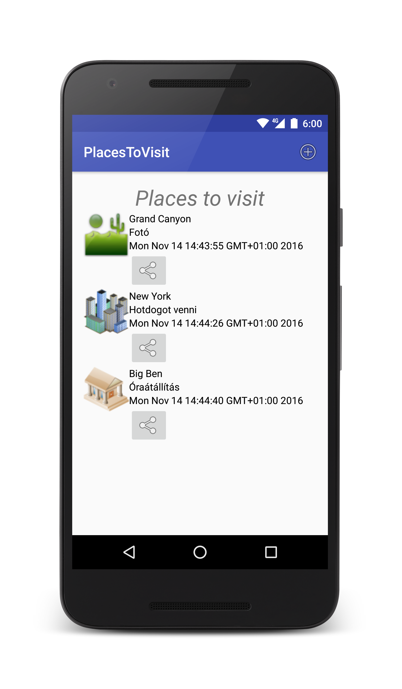
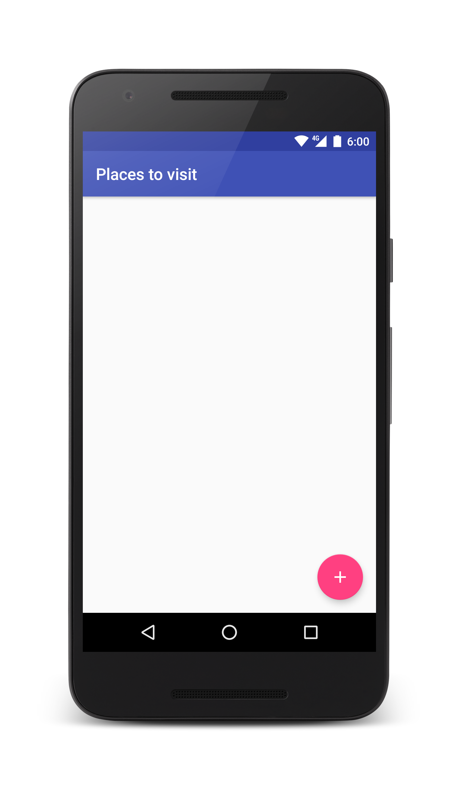
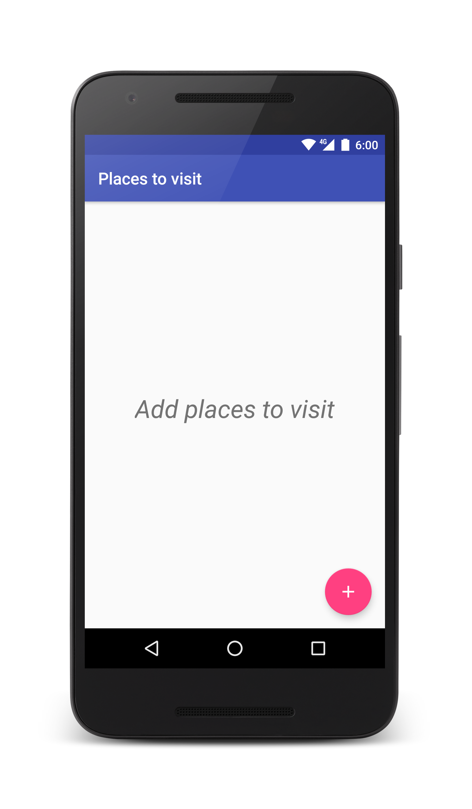
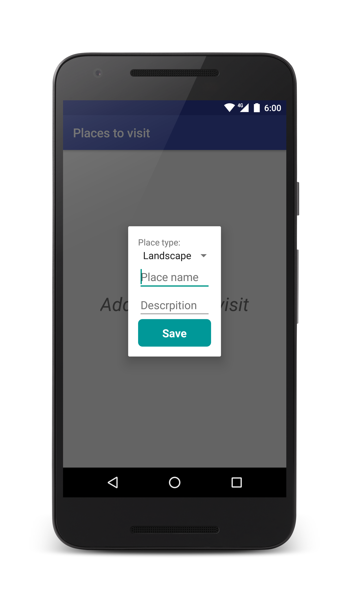
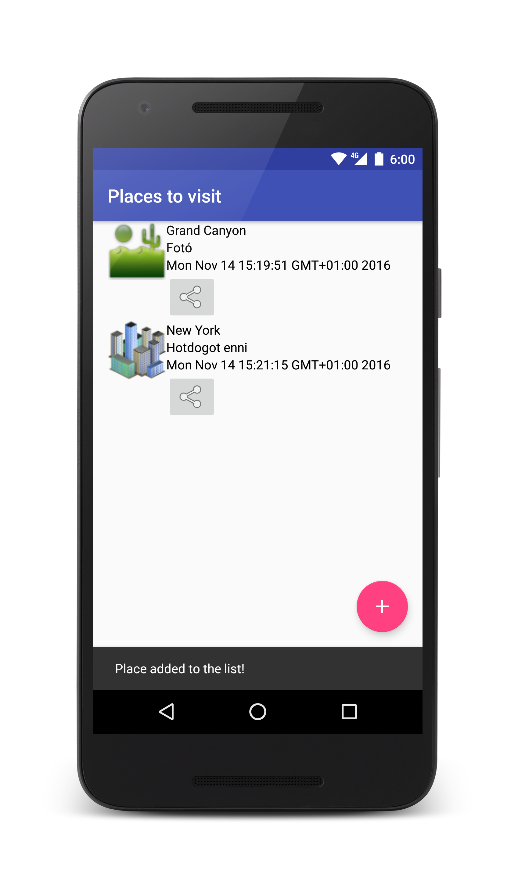

# Labor 9 - UX alapok


## Bevezetés

Ma már igen sok alkalmazás található a Play áruházban, köszönhető ez többek között a terjesztés egyszerűségének és az alacsony belépési korlátnak. Azonban ezeknek az alkalmazásoknak igen magas hányada végzi alacsony értékeléssel és magas elégedetlenséggel. A legtöbb projekt fejlesztője késznek érzi az alkalmazást, azonban csak magára gondol és nem a felhasználóra. Ezen a laboron bemutatunk néhány egyszerű fogalmat és technikát, ami segít abban, hogy minőségibb alkalmazások szülessenek. Ehhez egy alapvetően prototípus kaliberű alkalmazást fogunk material szemlélettel javítani.

Tartsuk szem előtt, hogy ez csak néhány egyszerű ötlet, és ahogy a lollipopos megjelenésű elemektől még nem lesz material egy alkalmazás megjelenése, úgy mi sem leszünk mindenható dizájnerek a labor után. Ez a témakör koránt sem olyan egyértelmű, mint a mérnöki tanulmányok jó része, az itt alkalmazott lépések nem feltétlenül univerzálisak.


## Material és UX alapok

Először is, akinek szándékában áll végigolvasni a teljes útmutatót később, az itt megteheti:
[https://material.google.com/#](https://material.google.com/#)


* A material dizájnban lényeges minden elem megjelenése. Például a Floating Action Button vetett árnyéka nem véletlen. Funkciója kiemelkedik, ezért megjelenítéskor is azt próbáljuk hangsúlyozni, hogy feljebb van. Az elemeknek van Z tengely szerinti **magasságuk**, a rendszer ebből számolja az általuk vetett árnyékot.

* Az **animációknak jelentésük** kell legyen. Csak úgy nem animálunk dolgokat, mert az jól néz ki. Ha egy listaelemre vagy kártyára tapint a felhasználó, akkor azt az elemet átanimálhatjuk az új képernyővé, úgy, hogy a kártya (vagy listaelem) olyan elemei, amik a következő képernyőn is szerepelnek elfoglalják új helyüket a második képernyőn. Az Android platformon már régóta elérhetőek egyszerű áttűnések, lapozások a képernyőátmenetek közt. Erre azért van szükség, mert a felhasználót (meg)zavarja a hirtelen váltás. A való életben sem villanással kerül az égre a madár, hanem lezajlik egy átmenet (a felszállás), ami átvezet a két állapot között. Emlékezzünk vissza: találkoztunk már olyan alkalmazással, ahol a képernyőváltás során oldalirányban úsztak ki-be a képernyők? Előre és visszafelé navigálásnál melyik irányba haladtak a képernyők?

* Bár laboron a beépített komponensek során nem futunk ebbe a problémába, de jegyezzük meg: **minden felhasználói interakcióra legyen visszajelzés!** Gondoljunk bele mit teszünk, ha egy gombot megnyomva nem történik semmi (fel se villan a gomb nyomott állapota), mit feltételezünk? Jusson eszünkbe egyéni nézetek használatakor! A material szemlélet ezt bővíti azzal, hogy a kiváltott változás egy egyre nagyobb sugarú kör íve mentén történik, aminek középpontja az a hely, ahol a felhasználó kiváltotta a változást:
[material animáció](http://material-design.storage.googleapis.com/publish/material_v_3/material_ext_publish/0B3T7oTWa3HiFdWhpd296VUhLTFk/animation_responsiveinteraction_radialreaction.webm?_=1)

* **Minimális gépelés**. Nehéz nagyobb fájdalmat okozni a felhsználónak annál, hogy mobilon kelljen gépelnie, nem véletlenül létezik annyi különböző gesztúra. Ha egyszerű bevitelről van szó (számok, intervallumok, dátumok) egyszerűsítsük csúszkával, vizuális naptári választóval.

* A materialos színekhez jó segítség az alábbi oldal: [http://www.materialpalette.com/](http://www.materialpalette.com/). Innen le is tudjuk tölteni xml formában a kapott színeket. Annyit érdemes tudni, hogy az “accent” színt csak a leghangsúlyosabb elemek kaphatják meg. Tipikusan ilyen a Floating Action Button, ami a képernyő legfontosabb funkcióját kell jelentse, ha van ilyen. Ugyanúgy másodlagos színt kapnak a Switch és a Slider nézetek is.

* Ikonokat tervezni külön szakma, de mivel a legtöbb fejlesztő nem foglalkozik ilyesmivel másodállásban, ezért a Google nem csak néhány ikont készített el előre, hanem rengeteget. Innen letölthetőka hivatalos ikonok: [http://www.google.com/design/spec/resources/sticker-sheets-icons.html#sticker-sheets-icons-system-icons](http://www.google.com/design/spec/resources/sticker-sheets-icons.html#sticker-sheets-icons-system-icons). 

* A fejlesztői közösség az előbbit tovább gondolta, és létrehoztak egy oldalt ezen ikonok egyszerű kezelésére, illetve számos továbbival ki is egészítettek. [https://materialdesignicons.com/](https://materialdesignicons.com/) Valószínűleg megtaláljuk a nekünk kellőt. Alapszabály, hogy ne használjunk olyan ikont (bármennyire is jó lenne), ami már másik ismert funkciót jelöl. Hasonlóan kinéző komponenstől a felhasználó azt várja, hogy hasonlóan fog működni. A Floating Action Button funkciójának alapvetően egy pozitív cselekedetnek kell lennie (jó példa az új elem létrehozása, rossz példa a szín módosítása vagy a kuka törlése), így válasszunk ennek megfelelő ikont. A laborhoz mellékeljük a szükséges ikonokat, de az otthoni használathoz a javasolt mód az alábbi:

 * Az Android 5.0 változatot töltsük le.
 * Válasszuk ki a nekünk kellő variánst. Szerepel fehérben, feketében, szürkében és mindhárom színhez 4 féle méretben (nekünk az `ic_add_white_24dp.png` kell)
 * Menjünk egy könyvtárral feljebb másoljuk az összes minősített mappát a célhelyre.

* Tartsunk megfelelő távolságokat az elemek között, különösen ügyelve az interaktív elemekre. Lesz olyan, akinek nálunk nagyobb az ujjbegye, gondoljunk rá is! A tartalom ne kezdődjön a képernyő 0. pixelénél! Az ajánlásokban elég részletesen taglalják a számokat: az új guideline szerint minden elem egy 8dp-s rácsban helyezkedik el. Ez alól kivételek a szövegek (amiknek alapvonala igazodik 4dp-hez) és a toolbar ikonjai (szintén 4 dp). Tehát alapvetően mindennek a mérete vagy a távolsága n x 8dp. A kijelző szélétől tartandó margó például 16dp, az érinthető területek minimum mérete 48 x 48dp, a köztük tartandó távolság pedig minimum 8dp, de inkább több.
* A képi elemek legyen inkább személyesek. Ne használjunk pár élettelen mosolyú modell arcát mutató sotck fotókat, a képnek legyen köze a tartalomhoz. A személyes (felhasználó készítette) képek még jobbak. A képek töltsék ki a teret, amennyire csak lehet! Ez azt jelenti, hogy szélességben a teljes kijelzőt fedje, magasságban pedig lehetőleg valamilyen jellegzetes arány vonalát kövesse. Van néhány ajánlás, ezekre az arányokra – mármint arra hogy bizonyos képarányú elemek magassága hol helyezkedik el.

* Ne használjuk a kártyanézeteket (tipikusan Google asszisztens) olyan elemekre, amik megjelenése azonos! Ezesetben egy listáról beszélünk, aminek használatát megnehezíti, hogy a kártyák közt van kihagyott terület és árnyékot is vetnek.


## Hasznos fejlesztői eszközök

Amikor a felhasználói felületet igazítjuk, nem mindig egyértelmű, hogy miért azt látjuk renderelve, amit. A Beállítások/Fejlesztői eszközök menüpontban találjuk az alábbiakat:

* **Show layout bounds**: Megmutatja mettől-meddig tartanak a nézetek, kiderülhet melyik eltartás (margin, padding) melyik nézethez tartozik.
* **Windows animation scale**, **Transition animation scale** és **Animator duration scale**: Segítségükkel lelassíthatóak, részletesebben megtekinthetőek az egyébként gyors animációk.
* **Debug GPU overdraw**: Megmutatja melyek azok a területek, amelyeknek tartalma többször is meg lett adva. Minél többször van szín rendelve egy pixelhez, annál sötétebb szín jelzi.
* **Profile GPU rendering**: Megmutatja mennyi ideig tartott lerenderelni az adott képkockákat. A képernyőn megjelenő vízszintes vonal jelzi a 16ms határát.  Ha egy oszlop e fölé ér, azt jelenti, hogy az a képkocka nem készült el időben a 60 fps-hez, ezért megakadt a felület.

Próbálják ki ezeket a funkciókat!


## Javítandó alkalmazás

Most, hogy néhány hasznos dolgot megismertünk, ideje letöltenünk a prototípust:

[PlacesToVisit.zip](./assets/PlacesToVisit.zip)

Tömörítsük ki a mappát, indítsuk el az Android Studio-t, majd az Open segítségével nyissuk meg az alkalmazást.



Ennek az alkalmazásnak az a feladata, hogy meglátogatandó helyeket gyűjtsünk benne. A prototípus arra koncentrál, hogy minimális funkcionalitást valósítson meg gyorsan. Az adatok perzisztens tárolásához a *Sugar ORM* ([http://satyan.github.io/sugar/](http://satyan.github.io/sugar/)) könyvtárat használja . Laborvezetővel tekintsék át a kódot és a működést! Főbb elemei:

* A Sugar ORM számára a Manifest-ben elhelyezett meta-data tag-ek segítségével adhatjuk meg az adatbázist tartalmazó fájl nevét és verzióját, hogy logolja-e a query-ket, illetve hogy milyen domain-t használunk.


```xml 
    <meta-data android:name="DATABASE" android:value="sugar_places.db" />
    <meta-data android:name="VERSION" android:value="2" />
    <meta-data android:name="QUERY_LOG" android:value="true" />
    <meta-data android:name="DOMAIN_PACKAGE_NAME" android:value="hu.bme.aut.amorg.examples.placestovisit.data" />
```

* Az applicationnek a SugarApp-ból kell származnia, ezzel biztosítjuk a Sugar ORM megfelelő inicializálását, illetve lezárását. Esetünkben nincs szükség külön application objektumra, használhatjuk a SugarAppot.

```xml
<application 
    android:name="com.orm.SugarApp" 
    android:allowBackup="true" 
    android:icon="@mipmap/ic_launcher"
    android:label="@string/app_name" 
    android:supportsRtl="true" 
    android:theme="@style/AppTheme">
```

* A modell osztálynál (Place) ősosztályként a SugarRecordot használtuk, ez biztosítja, hogy az osztály példányait adatbázisba lehessen menteni. Ehhez implementáljuk a Serializable interfészt is.


```java
public class Place extends SugarRecord implements Serializable {...}
```


### Menü

Új elemet az options menü megnyomásával lehet létrehozni, amely menüben más elem nincs is. Ez a menü tipikusan nem ilyen feladatokra szolgál. Az ilyen feladatokat Floating Action Buttonnel szokás megoldani. Ezért először is töröljük a menüt a nyitóképernyőről, majd helyezzünk fel egy Floating Action Buttont. Ehhez töröljük az Activity OnCreateOptionsMenu és OnOptionsItemSelected metódusait, illetve a res/menu mappát, majd hozzunk létre egy Floating Action Buttont!

A PlacesListActivityben az OnCreatebe:

```java
FloatingActionButton fab =
        (FloatingActionButton) findViewById(R.id.addButton);
    fab.setOnClickListener(new View.OnClickListener() {
        @Override
        public void onClick(View v) {
            showNewPlaceDialog();
        }
});
```


Az `activity_places_list.xml`ben az include után:

```xml
<android.support.design.widget.FloatingActionButton
    android:id="@+id/addButton"
    android:layout_width="wrap_content"
    android:layout_height="wrap_content"
    android:layout_gravity="bottom|end"
    android:layout_margin="@dimen/fab_margin"
    android:layout_alignParentBottom="true"
    android:layout_alignParentRight="true"/>
```


### FAB ikon

A Floating Action Button ikonja fontos szerepet játszik. A felhasználónak  első ránézésre tudnia kell belőle, hogy mire szolgál a gomb. Így tehát olyan ikont kell választanunk, amiből rögtön látszik, hogy a gomb elem hozzáadására szolgál. Töltsük le az alábbi *zip*et:

[Drawable.zip](./assets/drawable.zip)

Tömörítsük ki és tegyük a projektünkbe, majd állítsuk be a FAB ikonját az `activity_places_list.xml`-ben:

```xml
app:srcCompat="@drawable/ic_add_white_24dp"
```


### A lista fejléce

Jelenleg a Toolbaron megjelenik az Activity neve, ami "PlacesToVisit", alatta egy TextView-ban pedig a szöveg, hogy "Places to visit". Ezek közül az egyik felesleges, és szebb, ha a normál helyesírás szerinti "Places to visit"-et hagyjuk meg. Azonban egy üres Toolbarnak nincs sok értelme, úgyhogy inkább rakjuk fel ezt a szöveget oda.

Ehhez először is az `activity_places_list.xml`-ben a Toolbar tagen belül vegyük fel az app:title attribútumot, és vegyük fel a string erőforrást.

```xml
app:title="@string/places_to_visit"
```

Majd töröljük a `content_places_list.xml`-ből a TextViewt, a RecyclerView-t pedig igazítsuk a szülője tetejéhez.

```xml
android:layout_alignParentTop="true"
```

Ahhoz, hogy a Toolbar vetett árnyéka érvényesüljön, és úgy tűnjön, hogy a lista görgetésnél tényleg alá csúszik be, töröljük ki a RelativeLayout felső paddingjét.

Próbáljuk ki az alkalmazást!




### Üres lista

Kevesen készülnek arra a lehetőségre, hogy mi fogadja a felhasználót akkor, ha üres a listanézet. Célszerű ilyenkor az üres lista helyett valamilyen szöveget megjeleníteni. Írjuk tehát át a `content_places_list.xml`-t.

```xml
<RelativeLayout xmlns:android="http://schemas.android.com/apk/res/android"
    xmlns:app="http://schemas.android.com/apk/res-auto"
    xmlns:tools="http://schemas.android.com/tools"
    android:id="@+id/content_places_list"
    android:layout_width="match_parent"
    android:layout_height="match_parent"
    android:paddingBottom="@dimen/activity_vertical_margin"
    android:paddingLeft="@dimen/activity_horizontal_margin"
    android:paddingRight="@dimen/activity_horizontal_margin"
    app:layout_behavior="@string/appbar_scrolling_view_behavior"
    tools:context=".PlacesListActivity"
    tools:showIn="@layout/activity_places_list">

    <FrameLayout
        android:layout_width="match_parent"
        android:layout_height="match_parent"
        android:layout_alignParentTop="true"
        android:layout_centerHorizontal="true">

        <android.support.v7.widget.RecyclerView
            android:id="@+id/placesListRV"
            android:layout_width="match_parent"
            android:layout_height="wrap_content"
            android:layout_alignParentTop="true" />

        <TextView
            xmlns:android="http://schemas.android.com/apk/res/android"
            android:id="@+id/emptyTV"
            style="@style/TextViewTitleStyle"
            android:layout_width="wrap_content"
            android:layout_height="wrap_content"
            android:layout_gravity="center"
            android:text="@string/add_places_to_visit" />

    </FrameLayout>

</RelativeLayout>
```

```xml
<string name="add_places_to_visit">Add_places to visit</string>
```

Figyeljük meg a FrameLayoutot! Egyszerre csak egyik gyermeke látható. Most már csak meg kell oldanunk, hogy üres RecyclerView esetén csak a TextView jelenjen meg:

Először is hozzunk létre egy új View-t, ami képes ezt kezelni. Legyen a neve EmptyRecyclerView, és származzon a RecyclerView-ból. Implementáljuk a három kötelező konstruktorát is:

```java
public class EmptyRecyclerView extends RecyclerView {

    public EmptyRecyclerView(Context context) {
        super(context);
    }

    public EmptyRecyclerView(Context context, @Nullable AttributeSet attrs) {
        super(context, attrs);
    }

    public EmptyRecyclerView(Context context, @Nullable AttributeSet attrs, int defStyle) {
        super(context, attrs, defStyle);
    }

}
```
Vegyünk fel bele egy emptyView-t, amiben azt a View-t fogjuk tárolni, amit üres lista esetén meg szeretnénk jeleníteni:

```java
private View emptyView;
```

Ezek után vegyünk fel egy observert, aminek a feladata, hogy a listában történt változásokat lekezelje. 

```java
final private AdapterDataObserver observer = new AdapterDataObserver() {
    @Override
    public void onChanged() {
        checkIfEmpty();
    }

    @Override
    public void onItemRangeInserted(int positionStart, int itemCount) {
        checkIfEmpty();
    }

    @Override
    public void onItemRangeRemoved(int positionStart, int itemCount) {
        checkIfEmpty();
    }
};
```

Bármilyen változás történik az adathalmazban, le kell ellenőriznünk, hogy a melyik felületet kell megjelenítenünk vagyis, hogy üres-e a lista. Erre szolgál a checkIfEmpty() függvény. Implementáljuk ezt is:

```java
void checkIfEmpty() {
        if (emptyView != null && getAdapter() != null) {
            final boolean emptyViewVisible = 
                                    getAdapter().getItemCount() == 0;
            emptyView.setVisibility(emptyViewVisible ? VISIBLE : GONE);
            setVisibility(emptyViewVisible ? GONE : VISIBLE);
        }
    }
```

Látható, hogy a checkIfEmpty függvény az adapterben található elemek számának függvényében állítja az EmptyRecyclerView, és az EmptyView láthatóságát.

Hozzunk létre egy setter fügvényt az emptyView-hoz, amivel kívülről megadhatjuk majd a megfelelő View-t. Hívjunk ebben is egy checkIfEmpty-t:

```java
public void setEmptyView(View emptyView) {
    this.emptyView = emptyView;
    checkIfEmpty();
}
```

Az EmptyRecyclerView-nk megfelelő működéséhez felül kell még írnunk a setAdapter függvényt. Ebben tudjuk beregisztrálni az imént létrehozott observerünket, ami kezeli az adathalmazban történt változásokat:

```java
@Override
public void setAdapter(Adapter adapter) {
    final Adapter oldAdapter = getAdapter();
    if (oldAdapter != null) {
        oldAdapter.unregisterAdapterDataObserver(observer);
    }
    super.setAdapter(adapter);
    if (adapter != null) {
        adapter.registerAdapterDataObserver(observer);
    }

    checkIfEmpty();
}
```

Ezzel el is készült az EmptyRecyclerView-nk. Most cseréljük le az eddig használt RecyclerView-t:

`content_places_list.xml`:

```java
<hu.bme.aut.amorg.examples.placestovisit.view.EmptyRecyclerView
            android:id="@+id/placesListERV"
            android:layout_width="match_parent"
            android:layout_height="wrap_content"
            android:layout_alignParentTop="true" />
```

PlacesListActivity.java:

```java
private EmptyRecyclerView emptyRecyclerView;
```

```java
emptyRecyclerView = (EmptyRecyclerView) findViewById(R.id.placesListERV);
emptyRecyclerView.setLayoutManager(new LinearLayoutManager((this)));
adapter = new PlacesToVisitAdapter(this, placesToVisit);
emptyRecyclerView.setAdapter(adapter);
registerForContextMenu(emptyRecyclerView);
```

Végül szerezzünk referenciát a `content_places_list.xml`-ben létrehozott TextView-ra, és állítsuk be az EmptyRecyclerView emptyView-jának:

```java
View emptyTV= findViewById(R.id.emptyTV);
emptyRecyclerView.setEmptyView(emptyTV);
```

Próbáljuk ki az alkalmazást! Láthatjuk, hogy üres lista helyett valóban az "Add places to visit" felirat jelenik meg.


 
Segíthetünk a felhasználónak még annyiban, hogy megengedjük, hogy erre a feliratra rákattintva is vehessen fel új helyet. Ehhez írjuk meg az OnClickListenert:

```java
emptyTV.setOnClickListener(new View.OnClickListener() {
    @Override
    public void onClick(View v) {
        showNewPlaceDialog();
    }
});

```


### Dialógus és animációja

Az Android Lollipop verziójától lehetőségünk van képernyőátmenetek során elemeket megosztva animálni. Ebben az esetben azt fogjuk elérni, hogy amikor a felhasználó megérinti a FAB-ot, akkor az új helyszínt létrehozó képernyő abból animálódjon ki. A visszafelé portolás ebben az esetben nem tökéletes, 21-es API szint alatt ezt nem fogjuk látni. A megosztott animációhoz át kell írjuk a stílusainkat, azonban az új xml elemek csak API 21-től működnek.

Hozzunk létre egy új erőforrás mappát! A neve legyen **values-v21**! Ebbe másoljuk bele a meglevő `styles.xml` állományt a minősítetlen mappából. A v21-es styles-xml-ben az alaptémát módosítsuk az alábbiaknak megfelelően:

```xml
<!-- Base application theme. -->
<style name="AppTheme"
    parent="Theme.AppCompat.Light.DarkActionBar">

    <item name="colorPrimary">@color/colorPrimary</item>
    <item name="colorPrimaryDark">@color/colorPrimaryDark</item>
    <item name="colorAccent">@color/colorAccent</item>
        
    <!-- Customize your theme here. -->
    <item name="android:buttonStyle">@style/ButtonStyleRounded</item>

    <!-- enable window content transitions -->
    <item name="android:windowContentTransitions">true</item>

    <!-- enable overlapping of exiting and entering activities-->
    <item name="android:windowAllowEnterTransitionOverlap">true</item>
    <item name="android:windowAllowReturnTransitionOverlap">true</item>

</style>

```

Most meg kell adjuk az xml erőforrásokban, hogy miből-mit kell animálni. Ehhez úgy párosítjuk össze őket, hogy új attribútumot veszünk fel mind a Floating Action Button-hez, mind az `activity_create_place_to_visit.xml` gyökér eleméhez (Ez ugye a LinearLayout).

```xml
android:transitionName="create"
```

Ezután a PlaceListActivity showNewPlaceDialog metódusát egészítsük ki az alábbiak szerint (a Floating Action Buttont ki kell szervezni) :

```java
private void showNewPlaceDialog() {
    ActivityOptionsCompat options = 
		ActivityOptionsCompat.makeSceneTransitionAnimation(
            PlacesListActivity.this,
            fab,
            "create");
    Intent i = new Intent();
    i.setClass(this, CreatePlaceToVisitActivity.class);
    startActivityForResult(i, REQUEST_NEW_PLACE_CODE, options.toBundle());
}
```

Itt megdjuk, hogy melyik View-ból indul az animáció (fab), és azt is, hogy milyen transitionName-mel kell dolgoznia a rendszernek ("create"). Az animációról szóló információt egy Bundle-be pakolva adjuk át.

Próbáljuk ki az alkalmazást!




### Új hely felvétele

Nem a legjobb, hiszen az alkalmazás második képernyője eredetileg dialógus stílusú. Hát töröljük a Manifestből és a stílusfájlokból a kapcsolódó stílusbejegyzést!

Az Activity azonban még így sem tökéletes, hiszen ha nagyon hosszú leírást adunk neki, akkor a Save gomb kicsúszik a képernyőről és használhatatlan lesz. Rögzítsük tehát a gombot a képernyő aljára, a fölötte lévő tartalmat pedig tegyük görgethetővé!

Az `activity_create_place_to_visit.xml` gyökérelemét változtassuk RelativeLayout-ra, a benne lévő gombot pedig kössük az aljához.

```xml
android:layout_alignParentBottom="true"
```

A többi elemet pedig ágyazzuk be egy vertikális LinearLayoutba, majd egy ScrollView-ba, amit kössünk felülre, és helyezzünk a gomb fölé:

```xml
<ScrollView
        android:layout_width="match_parent"
        android:layout_alignParentTop="true"
        android:layout_height="match_parent"
        android:layout_above="@+id/btnSave">
        <LinearLayout
            android:layout_width="match_parent"
            android:layout_height="match_parent"
            android:orientation="vertical">
```

### Snackbar

A Toast üzeneteknél már van egy sokkal szebb megoldás, ami a Material Design-t követi, a SnackBar. Cseréljük le a Toast figyelmeztetést SnackBar-ra!

Ehhez írjunk egy külön showText() függvényt, ami a paraméterül kapott szöveget jeleníti meg, majd használjuk ezt: 

```java
private void showText(String text) {
    Snackbar.make(coordinatorLayout,text,Snackbar.LENGTH_LONG).show();
}
```

Hívás:

```java
showText(getResources().getString(R.string.cancelled));
```

A Snackbar.make(...) függvény első paramétere egy View. Adjuk meg ide az Activitynk CoordinatorLayout-ját. Ehhez a PlacesListActivityben fel kell venni változóként, majd az onCreate-ben referenciát szerezni rá.


```java
private CoordinatorLayout coordinatorLayout;
```

```java
coordinatorLayout = (CoordinatorLayout) 
        findViewById(R.id.main_coordinator_layout);
```

Próbáljuk ki a Snakcbart!




## Önálló feladat

### Feladat 1 - Továbbfejlesztés

A fenti alapok segítségével alakítsa tovább az alkalmazást!

* Csökkentse a listában megjelenített információkat
* Készítsen új képernyőt, ahol részletesen jeleníti meg az adott helyet
* Készítse fel a felületet arra, hogy később a felhasználónak lehetősége lesz képet rögzíteni a helyről

### Feladat 2 - Swipe to delete

Valósítsa meg a swipe gesztussal való törlést (és esetleg módosítást). Példa megvalósítás: [https://medium.com/@ipaulpro/drag-and-swipe-with-recyclerview-b9456d2b1aaf](https://medium.com/@ipaulpro/drag-and-swipe-with-recyclerview-b9456d2b1aaf)
